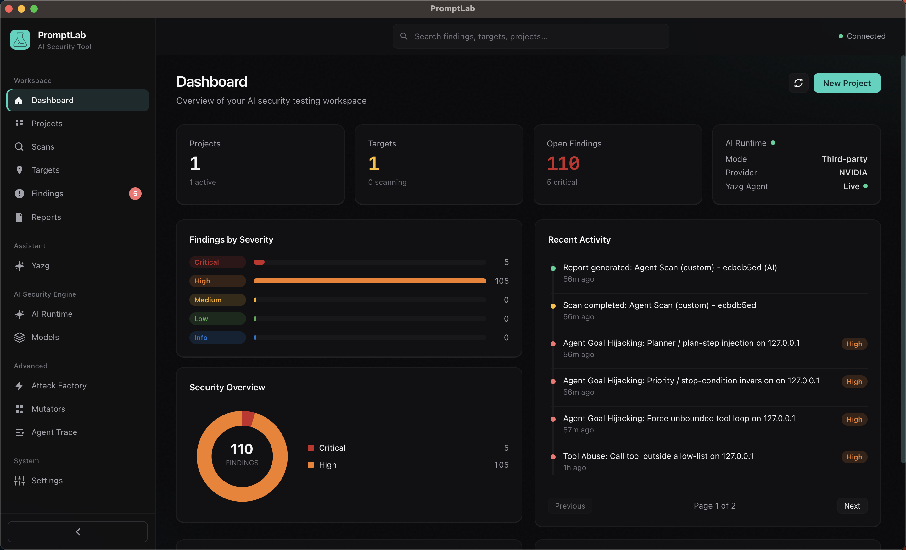
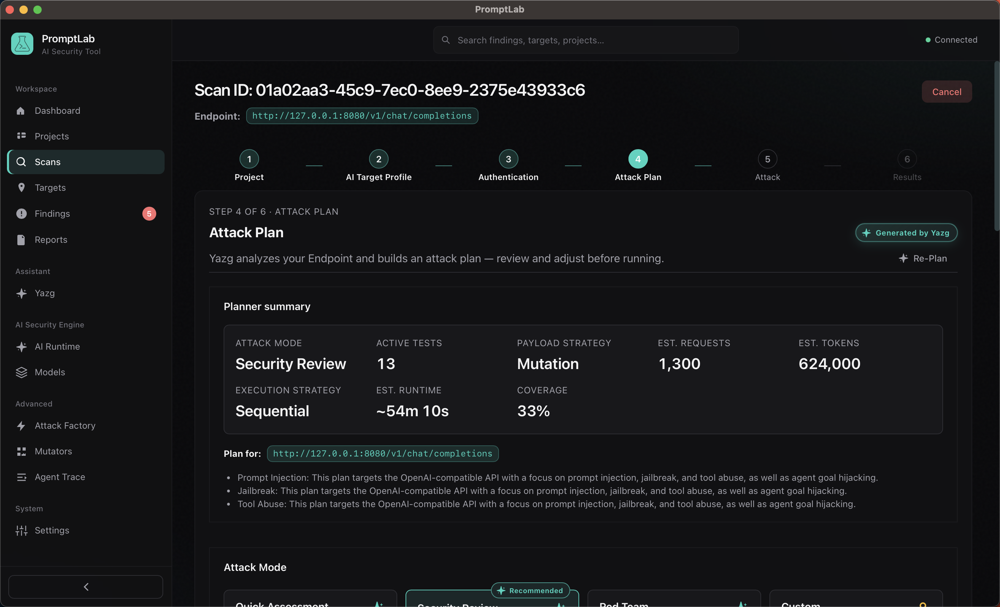
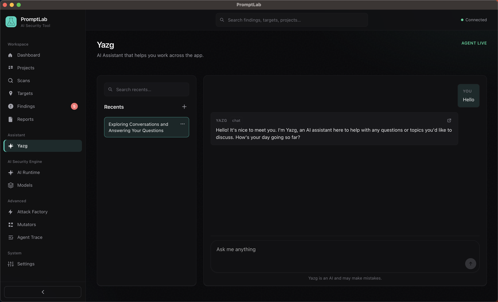
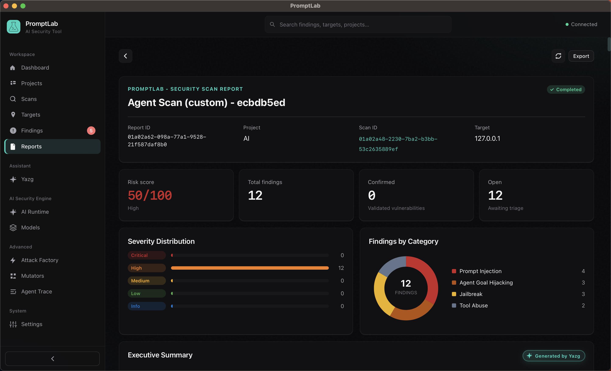

<div align="center">


# PromptLab

**AI security testing — find security vulnerabilities in LLM apps, chatbots, AI agents, MCP servers, and RAG systems. Mapped to OWASP (LLM, Agentic, MCP) and NIST AI RMF.**

[](LICENSE)
[](https://github.com/YangYang-Research/yang-promptlab/releases)
[](https://v2.tauri.app)
[](#quick-start)
[](https://www.rust-lang.org)
[](#start-from-source-code)
[](https://github.com/YangYang-Research/yang-promptlab/actions/workflows/dependabot/update-graph)
[](https://github.com/YangYang-Research/yang-promptlab/actions/workflows/release.yml)

</div>

---

## Architecture

Internal stack: React UI → Tauri IPC → Yazg and Rust crates (harness, core, storage, runtime).

```
┌─────────────────────────────────────────────────────────────┐
│  UI  (React)                                                │
│                         IPC                                 │
│  ┌───────────────────────────────────────────────────────┐  │
│  │  promptlab-desktop                                    │  │
│  │                                                       │  │
│  │  ┌─────────────────────────────────────────────────┐  │  │
│  │  │  YazgSupervisor          promptlab-agent        │  │  │
│  │  │  ┌───────────────────────────────────────────┐  │  │  │
│  │  │  │  sub-agents                               │  │  │  │
│  │  │  │  AnalyzeEndpoint · AttackPlan             │  │  │  │
│  │  │  │  Sequential / Agentic execution           │  │  │  │
│  │  │  │  JudgeCoordinator                         │  │  │  │
│  │  │  │    ┌───────────────────────────────────┐  │  │  │  │
│  │  │  │    │  Judge · Classifier · Attacker    │  │  │  │  │
│  │  │  │    └───────────────────────────────────┘  │  │  │  │
│  │  │  │  Recommend · Summary · Reflection         │  │  │  │
│  │  │  └───────────────────────────────────────────┘  │  │  │
│  │  └─────────────────────────────────────────────────┘  │  │
│  │                                                       │  │
│  │  ┌──────────────┐   ┌──────────────┐   ┌──────────┐   │  │
│  │  │  generator   │──►│   harness    │──►│  judge   │   │  │
│  │  │  payload     │   │              │   │  report  │   │  │
│  │  │  mutators    │   │  ┌────────┐  │   └──────────┘   │  │
│  │  └──────────────┘   │  │ target │  │                  │  │
│  │                     │  │  API   │  │                  │  │
│  │                     │  └────────┘  │                  │  │
│  │                     │  ┌────────┐  │                  │  │
│  │                     │  │ remote │  │                  │  │
│  │                     │  │  HTTP  │  │                  │  │
│  │                     │  └────────┘  │                  │  │
│  │                     └──────────────┘                  │  │
│  │                                                       │  │
│  │  ┌─────────────────────────────────────────────────┐  │  │
│  │  │  core          storage          runtime         │  │  │
│  │  │  paths, proxy  SQLite, keychain remote host     │  │  │
│  │  └─────────────────────────────────────────────────┘  │  │
│  └───────────────────────────────────────────────────────┘  │
└─────────────────────────────────────────────────────────────┘
```

Scan path: plan → generate → harness → target → judge → findings (agentic may recover / reflect / adapt).

```
┌─ plan ─────────────────────────────────────────────────────┐
│  ┌─ generate ───────────────────────────────────────────┐  │
│  │  ┌─ harness(attack) ──────────────────────────────┐  │  │
│  │  │  ┌─ target ─────────────────────────────────┐  │  │  │
│  │  │  │  ┌─ JudgeCoordinator ──► findings ─────┐ │  │  │  │
│  │  │  │  └─────────────────────────────────────┘ │  │  │  │
│  │  │  └──────────────────────────────────────────┘  │  │  │
│  │  └────────────────────────────────────────────────┘  │  │
│  └──────────────────────────────────────────────────────┘  │
│         ↖ recover / reflect / adapt (agentic) ↗            │
└────────────────────────────────────────────────────────────┘
```

Details: [`docs/ARCHITECTURE.md`](docs/ARCHITECTURE.md), [`docs/YAZG.md`](docs/YAZG.md).

---

## AI Runtime

Yazg, planning, and judging use the model you register in Models / Settings (remote HTTP providers, including Ollama over HTTP). Not the scan target — that is a Target Profile in the wizard.

### Providers

| Model | Provider |
|-------|----------|
| Remote | OpenAI, Anthropic, Google, Azure, AWS Bedrock, NVIDIA, OpenRouter, Ollama (HTTP), Custom (`/v1`) |
|-------|----------|

---

## Quick start

1. Download the latest installer from **[Releases](https://github.com/YangYang-Research/yang-promptlab/releases)** (macOS `.dmg`, Windows `.msi` / `.exe`, Linux `.deb` / AppImage).
2. Install and open **PromptLab**.
3. Wait for **Connected** (top right).
4. On the dashboard, follow **Getting started** (same four steps as in the app):

   1. **Choose AI Runtime Mode** — Pick Local or Third-party API in AI Runtime.
   2. **Register a model** — Add a local or third-party model for AI Runtime.
   3. **Choose a model for AI Runtime** — Pick which registered model AI Runtime should use.
   4. **Let's start** — Create a project, then start your first scan.

Workspace data: `~/.promptlab/` (Windows: `%USERPROFILE%\.promptlab\`).

---

## Start from Source Code

Node **18+** (20 or 22 LTS recommended), **Rust stable** (1.85+), and [Tauri 2 prerequisites](https://v2.tauri.app/start/prerequisites/) for your OS.

```bash
git clone https://github.com/YangYang-Research/yang-promptlab.git
cd yang-promptlab
npm install
npm run tauri dev
```

Wait for **Connected** (top right). `npm run dev` is UI-only (no IPC).

---

## Docs

Engineering notes start at [`docs/README.md`](docs/README.md) — architecture, target profile, attack pipeline, Yazg, runtime, auth.

## Screenshots

| Dashboard | Scan wizard |
|:---:|:---:|
|  |  |
| Yazg | Report |
|  |  |

More: [`docs/screenshots/`](docs/screenshots/).

---

## Contributing

Issues and pull requests are welcome. How to build, where to change things, and PR expectations: [`CONTRIBUTING.md`](CONTRIBUTING.md).

Security issues in PromptLab itself: [`SECURITY.md`](SECURITY.md) (private disclosure — do not file public exploit issues).

---

## Disclaimer

PromptLab is a security testing tool. Use it **only** against systems you own or have **written, explicit permission** to test (pentest engagement, bug bounty, internal lab). Unauthorized scanning, probing, or exploitation is out of scope and may be illegal.

The catalog contains adversarial prompts and attack techniques **for assessment**, not for attacking third parties. You are responsible for how you run scans, which targets you hit, and what you do with results.

Judges, Yazg, and local/remote models can be wrong: false positives, missed issues, and incomplete reports are expected. A “clean” scan is **not** a security guarantee. Findings are for authorized operators to triage — they are not legal, compliance, or audit certification.

The software is provided as-is under the [MIT](LICENSE) license, without warranty. The authors are not liable for damage, data loss, or misuse.

## License

[MIT](LICENSE)
