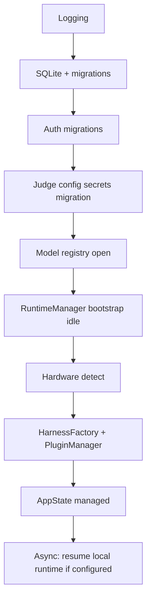

# AISec — Master Engineering Reference

**Document type:** Definitive engineering specification (evidence-only)  
**Audience:** Architects continuing AISec development without reading source code  
**Method:** Full-repository cross-reference; every claim cites `path:line`  
**Rule:** Features are **NOT IMPLEMENTED** unless proven in code  
**Generated:** 2026-06-13  

---

# PART 1 — SYSTEM OVERVIEW

## 1.1 Overall Architecture

AISec is a **Tauri 2 desktop application**: React + TypeScript + Vite frontend (`src/`), Rust backend shell (`src-tauri/`), and a Rust workspace of library crates (`crates/`).

```
┌─────────────────────────────────────────────────────────────────┐
│  React UI (HashRouter)  ←IPC invoke→  Tauri Commands (lib.rs)   │
│         │                                      │                 │
│    AppStore (Context)                    AppState (managed)      │
│         │                                      │                 │
│    sessionStorage/localStorage          Repositories → SQLite    │
│                                              │                   │
│                                    RuntimeManager → llama-server │
│                                    (HTTP localhost)              │
│                                              │                   │
│                                    Playwright (auth/discovery)   │
└─────────────────────────────────────────────────────────────────┘
```

**Evidence:** `src-tauri/src/lib.rs:1-6`, `src/app/router/AppRouter.tsx:76-78`, `src-tauri/src/state.rs:16-32`

### Crate workspace (18 packages)

| Crate | Role | Evidence |
|-------|------|----------|
| `aisec-core` | Errors, logging | `Cargo.toml` workspace |
| `aisec-storage` | SQLite + repositories | `crates/aisec-storage/src/lib.rs` |
| `aisec-discovery` | URL/browser discovery | `crates/aisec-discovery/` |
| `aisec-fingerprint` | Stack fingerprint rules | `crates/aisec-fingerprint/` |
| `aisec-attack` | Attack categories + transport | `crates/aisec-attack/src/attacks/mod.rs:27-38` |
| `aisec-harness` | HTTP/OpenAI harness execution | `crates/aisec-harness/src/factory/harness_factory.rs:19-27` |
| `aisec-judge` | LLM/rule/regex evaluators | `crates/aisec-judge/` |
| `aisec-planner` | Attack plan generation | `crates/aisec-planner/` |
| `aisec-generator` | Payload generation | `crates/aisec-generator/` |
| `aisec-agent` | Agentic scan loop | `crates/aisec-agent/src/engine.rs` |
| `aisec-report` | HTML/PDF/JSON/SARIF reports | `src-tauri/src/commands/domain.rs:237-241` |
| `aisec-models` | Model vault, downloads, hardware | `crates/aisec-models/` |
| `aisec-runtime` | llama-server supervisor | `crates/aisec-runtime/src/manager.rs:40-51` |
| `aisec-auth` | Playwright sessions, secrets | `crates/aisec-auth/` |
| `aisec-plugin-host` | Plugin manager + sandbox | `crates/aisec-plugin-host/src/lib.rs:1-24` |
| `aisec-payload` | Static payload packs | workspace |
| `aisec-fingerprint` | Fingerprint engine | workspace |
| `aisec-desktop` | Tauri app (`src-tauri/`) | `src-tauri/src/lib.rs` |

## 1.2 Current Maturity

| Layer | Maturity | Evidence |
|-------|----------|----------|
| Project/Target CRUD | Production-ready | `commands/projects.rs:31-114`, `commands/domain.rs` |
| Discovery + fingerprint | Implemented | `commands/discovery.rs:8-26`, `fingerprint_service.rs` |
| Classic scan orchestration | Implemented | `commands/scan.rs:106-318` |
| Agent scan | Partial — planner/generator hardcoded | `agent_service.rs:96-114` |
| Judge (scan path) | Implemented | `commands/attack.rs:151-199` |
| Reports (backend) | Implemented | `commands/domain.rs:200-304` |
| Reports page (frontend) | **Missing source file** | `AppRouter.tsx:34-35` imports missing `ReportsPage` |
| AI Runtime UI | Implemented | `features/runtime/AIRuntimePage.tsx` |
| Dual AI configuration | Split — not unified | `judge_config.json` vs `ai_inference_settings.json` |
| Plugin platform | Scaffold + subprocess hooks | `plugin-host/manifest.rs:9-10` |
| Security Packs | **Not implemented** as product concept | No `SecurityPack` type in codebase |
| Named pipe / Unix socket runtime IPC | **Not implemented** | grep: zero matches for `named pipe`, `UnixStream`, `NamedPipe` |

**Estimated product completion:** ~75–78% (core workflows exist; gaps in UI parity, agent LLM wiring, pack marketplace).

## 1.3 Architecture Philosophy (from code + docs)

`docs/ARCHITECTURE.md:13-21` states design principles (offline-first, local sovereignty, extensibility, auditability). **Implemented in code:**

- Offline-first SQLite: `src-tauri/src/db.rs`, `aisec-storage`
- Local llama.cpp: `aisec-runtime`
- Plugin extensibility: `aisec-plugin-host`
- No cloud telemetry wired: `AppStore.tsx:95` default `telemetry: false`; no telemetry IPC

## 1.4 Application Startup Flow

### Frontend startup

| Step | File:Line | Action |
|------|-----------|--------|
| 1 | `src/main.tsx:17-20` | `createRoot` → `AppProviders` → `App` |
| 2 | `src/app/providers/AppProviders.tsx:12-22` | `ErrorBoundary` → `ToastProvider` → `AppStoreProvider` → `RuntimeModelLoadingPoller` |
| 3 | `src/App.tsx:14-40` | `healthCheck()` + `getAppInfo()` → `SET_BACKEND` |
| 4 | `src/App.tsx:42-44` | Boot screen until health resolves |
| 5 | `src/App.tsx:45` | Render `AppRouter` (lazy pages) |
| 6 | `src/app/store/AppStore.tsx:331-342` | `refresh()` + listen `app-data-changed` |

### Backend startup (`build_app` setup hook)

| Order | File:Line | Action |
|-------|-----------|--------|
| 1 | `lib.rs:67` | `logging::init_app_logging` |
| 2 | `lib.rs:70-78` | Resolve `app_data_dir`, `db::open_database` (migrations) |
| 3 | `lib.rs:80-84` | Resolve Playwright auth engine config |
| 4 | `lib.rs:86-109` | Auth legacy migrations + `judge_config` secrets migration |
| 5 | `lib.rs:111-114` | `model_registry::open_model_manager_with_registry` |
| 6 | `lib.rs:116-121` | `embedded_runtime::bootstrap_runtime_manager` (load only) |
| 7 | `lib.rs:123-125` | `detect_hardware_on_startup` |
| 8 | `lib.rs:127-133` | Wire `llama_binary` into model manager |
| 9 | `lib.rs:140-145` | `HarnessFactory::new`, `bootstrap_plugin_manager` |
| 10 | `lib.rs:147-158` | `app.manage(AppState::new(...))` |
| 11 | `lib.rs:160-164` | Spawn `resume_local_runtime_on_startup` (async) |
| 12 | `lib.rs:169-260` | Register 90 Tauri invoke handlers |

### Runtime startup (post-AppState)

| Condition | File:Line | Action |
|-----------|-----------|--------|
| Always | `embedded_runtime.rs:28-47` | `RuntimeManager::bootstrap()` — load manifest, **no auto-start** |
| Local route + selected model | `embedded_runtime.rs:65-145` | `start_runtime()` + `load_model_with_loading_cache` |
| After load | `embedded_runtime.rs:122,135` | `runtime_watch::spawn_runtime_watch` |

## 1.5 Initialization Order (dependency)



## 1.6 Shutdown Lifecycle

| Step | File:Line |
|------|-----------|
| `RunEvent::Exit` | `lib.rs:45` |
| `runtime_manager.stop_runtime().await` | `lib.rs:48-49` |
| `database.close().await` | `lib.rs:51` |

## 1.7 Global Services & Singletons

| Service | Scope | Evidence |
|---------|-------|----------|
| `AppState` | Per Tauri process, `app.manage` | `lib.rs:147-158`, `state.rs:16-32` |
| `RuntimeManager` | Inside `AppState`, `Arc<AsyncMutex<>>` | `state.rs:27,100-102` |
| `LocalModelManager` | `Arc<AsyncMutex<>>` in AppState | `state.rs:24,92-94` |
| `PluginManager` | `Arc<AsyncMutex<>>` | `state.rs:23,131-133` |
| `ScanJobManager` | Inside AppState (in-memory jobs) | `state.rs:20,68-70` |
| `HarnessFactory` | Clone per AppState | `state.rs:22,127-128` |
| `AuthRecordingState` | Separate `app.manage(AsyncMutex<...>)` | `lib.rs:261` |
| `runtime_config_cache` | AppState field | `state.rs:28,104-108` |
| `runtime_model_loading_id` | AppState field | `state.rs:29-30,110-112` |

## 1.8 Global State (frontend)

Single React Context: `AppStore` (`src/app/store/AppStore.tsx:157,214-366`). **No Zustand, Redux, or signals.**

## 1.9 Feature Flags

| Flag | Status | Evidence |
|------|--------|----------|
| Env `VITE_LOG_LEVEL` | Implemented | `src/shared/logging/logger.ts:11-15` |
| Attack category UI gating | Hardcoded `enabled: false` | `AttacksPage.tsx:18-23` |
| Feature flag framework | **Not implemented** | No feature-flag module in `src/` |

## 1.10 Environment Variables

### Backend (production)

| Variable | Purpose | Evidence |
|----------|---------|----------|
| `AISEC_DB_PATH` | SQLite path override | `src-tauri/src/db.rs:14,22-24` |
| `AISEC_MODEL_REGISTRY_URL` | Remote catalog URL | `src-tauri/src/model_registry.rs:11,30-32` |
| `AISEC_PLUGINS_SAMPLES` | Sample plugins dir | `src-tauri/src/plugin_service.rs:15-18` |
| `AISEC_PLUGINS_DIR` | Plugin dir default | `crates/aisec-plugin-host/src/lib.rs:28-30` |
| `AISEC_MODEL_VAULT` | Model vault path | `crates/aisec-models/src/lib.rs:38-40` |
| `AISEC_LLAMA_BASE_URL` | llama-server URL | `crates/aisec-runtime/src/config.rs:45-48` |
| `AISEC_LLAMA_RELEASE` | GitHub release tag | `crates/aisec-runtime/src/installer.rs:95-98` |
| `AISEC_LLAMA_PORT` / `HOST` / `STARTUP_TIMEOUT_MS` / `N_GPU_LAYERS` | llama launch | `crates/aisec-runtime/src/runtime/llama_cpp_runtime.rs:327-357` |
| `HOME` / `LOCALAPPDATA` / `XDG_DATA_HOME` | Platform paths | `crates/aisec-auth/src/paths.rs` |
| Dynamic `api_key_env` | Third-party API keys | `crates/aisec-judge/src/config.rs:126,206-208` |

### Frontend

| Variable | Purpose | Evidence |
|----------|---------|----------|
| `VITE_LOG_LEVEL` | Log verbosity | `src/shared/logging/logger.ts:11` |
| `import.meta.env.DEV` | Dev log fallback | `src/shared/logging/logger.ts:15` |

## 1.11 Configuration Hierarchy

| Config file | Path resolver | Used by |
|-------------|---------------|---------|
| SQLite DB | `{app_data_dir}/aisec.db` | `db::resolve_db_path` |
| `judge_config.json` | `{data_dir}/judge_config.json` | `judge_config.rs:12-14` |
| `ai_inference_settings.json` | `{data_dir}/ai_inference_settings.json` | `ai_inference_settings.rs:92-94` |
| Runtime manifest | `{data_dir}/runtime/manifest.json` | `aisec-runtime/manifest.rs` |
| Hardware profile | `{data_dir}/runtime/hardware.json` | `aisec-runtime/hardware.rs:41-43` |
| Model registry | `{data_dir}/models/registry.json` | `aisec-models` |
| Plugin state | `{data_dir}/plugins_state.json` | `plugin-host/persistence.rs` |
| Reports files | `{data_dir}/reports/` | `state.rs:80-82` |

## 1.12 Current Technical Debt

| ID | Severity | Issue | Evidence |
|----|----------|-------|----------|
| TD-1 | Critical | `ReportsPage` + `reportDownloads.ts` missing — route broken | `AppRouter.tsx:34-35`; glob `src/features/reports/` = 0 files |
| TD-2 | Critical | Dual AI config (judge vs inference settings) | `judge_config.rs`, `ai_inference_settings.rs` |
| TD-3 | High | Agent scan: planner always Deterministic + `None` LLM | `agent_service.rs:96-114` |
| TD-4 | High | `models_test_embeddings` IPC — no UI | `lib.rs:231`; no frontend caller |
| TD-5 | Medium | `getRuntimeStatus` IPC — limited UI use | `runtime.ts:144-145` |
| TD-6 | Medium | Settings "View Logs" button — no handler | `SettingsPage.tsx:293` |
| TD-7 | Medium | Findings `?scanId=` URL param not wired | `FindingsPage` uses `useSearchParams` but filter incomplete |
| TD-8 | Low | `ProjectStatus` includes `archived` — no archive action | `types/index.ts:5`; no archive IPC |

## 1.13 Architecture Score

| Area | Score /100 | Rationale |
|------|------------|-----------|
| UI completeness | 72 | 17 routes; Reports page missing |
| Backend IPC | 88 | 90 commands registered |
| Runtime | 70 | HTTP-only; no unified inference gateway |
| Scan engine | 75 | Classic path solid; agent path partial |
| AI integration | 55 | Dual config; agent LLM unwired |
| Plugins | 50 | Manager exists; limited hook surface |
| Data layer | 85 | Migrations + 13 repository traits |
| **Overall** | **74** | Weighted average |

---

# PART 2 — APPLICATION MAP

**Router:** `HashRouter` — `AppRouter.tsx:78`  
**Layout parent:** `MainLayout` — `AppRouter.tsx:80`  
**Navigation:** `src/app/router/nav.ts:9-32` (13 sidebar items)  
**Hotkeys:** None global — only Escape in `Modal.tsx:23-27`, `ActionsDropdown.tsx:82-87`  
**Context menus:** **Not implemented** — zero `onContextMenu` in `src/`  
**Permissions / RBAC:** **Not implemented** — single-user desktop  
**Feature flags:** See Part 1.9  

---

## 2.1 Dashboard (`/`)

| Field | Value |
|-------|-------|
| **Purpose** | Workspace overview: stats, activity, runtime card | `DashboardPage.tsx` |
| **Route** | `/` | `AppRouter.tsx:82-87` |
| **Entry** | Sidebar, default index | `nav.ts:10` |
| **Exit** | Links to `/discovery`, `/projects`, `/runtime` | `DashboardPage.tsx:62-67,130,160` |
| **Toolbar** | PageHeader: "New Project" | `DashboardPage.tsx:62-67` |
| **Buttons** | New Project → navigate with `openNewProject` state | `DashboardPage.tsx:62-67` |
| **IPC** | `getRuntimeConfiguration` | `DashboardPage.tsx:44` |
| **Store** | `useAppStore`: stats, findings, activity, projects, `backendConnected` | `DashboardPage.tsx:27-28` |
| **Child components** | `AiRuntimeDashboardCard`, `StatCard`, `Card` | imports |
| **Render conditions** | Always after bootstrap | `App.tsx:42-45` |
| **Limitations** | Stats derived client-side from store | `computeDashboardStats` |

---

## 2.2 Projects (`/projects`)

| Field | Value |
|-------|-------|
| **Purpose** | List/create/delete projects | `ProjectsPage.tsx` |
| **Route** | `/projects` | `AppRouter.tsx:90-96` |
| **Buttons** | Refresh, New Project, Delete (row) | `ProjectsPage.tsx:126-144` |
| **Dialogs** | `NewProjectModal` | `ProjectsPage.tsx:226` |
| **IPC** | `project_list`, `project_create`, `project_delete` via `actions` | `AppStore.tsx:260-272` |
| **Store** | `projects`, `ui`, `loading`, `error`, `actions` | `ProjectsPage.tsx:33` |
| **Hooks** | `useViewPreference`, `usePageSizePreference`, `usePaginatedList` | `ProjectsPage.tsx:38-62` |
| **localStorage** | `aisec:view:projects`, `aisec:page-size:projects` | `useViewPreference.ts:10` |
| **Limitations** | No archive, duplicate, import, export | no IPC/commands |

---

## 2.3 Project Details (`/projects/:projectId`)

| Field | Value |
|-------|-------|
| **Purpose** | Project detail: targets, scans, findings summary | `ProjectDetailsPage.tsx` |
| **Route** | `/projects/:projectId` | `AppRouter.tsx:98-103` |
| **Buttons** | New Scan (Link), Edit/Delete dropdown | `ProjectDetailsPage.tsx:169-177` |
| **Dialogs** | `EditProjectModal` | `ProjectDetailsPage.tsx:266-270` |
| **IPC** | `project_update`, `project_delete` | `AppStore.tsx:272-283` |
| **Store** | `projects`, `targets`, `scans`, `findings`, `reports` | `ProjectDetailsPage.tsx:31` |

---

## 2.4 Targets (`/targets`)

| Field | Value |
|-------|-------|
| **Purpose** | List targets; add target | `TargetsPage.tsx` |
| **Route** | `/targets` | `AppRouter.tsx:138-143` |
| **Buttons** | Refresh, Add Target | `TargetsPage.tsx:133-136` |
| **Dialogs** | `AddTargetModal` | `TargetsPage.tsx:208-212` |
| **IPC** | `target_create`, `target_list` | `AppStore.tsx:285-296` |
| **Query params** | `?projectId=` pre-filters | `TargetsPage.tsx:63` |

---

## 2.5 Target Details (`/targets/:targetId`)

| Field | Value |
|-------|-------|
| **Purpose** | Target metadata; link to scans | `TargetDetailsPage.tsx` |
| **Route** | `/targets/:targetId` | `AppRouter.tsx:130-135` |
| **Buttons** | New Scan, View Project, scan row buttons | `TargetDetailsPage.tsx:83-160` |
| **IPC** | None direct — reads store | `TargetDetailsPage.tsx:30` |
| **Limitations** | No edit target UI | no edit modal |

---

## 2.6 Scans (`/scans`)

| Field | Value |
|-------|-------|
| **Purpose** | Scan history + live monitor | `ScansPage.tsx` |
| **Route** | `/scans` | `AppRouter.tsx:106-111` |
| **Buttons** | Refresh, New Scan, Pause/Resume/Stop | `ScansPage.tsx:162-232` |
| **IPC** | `scan_pause`, `scan_resume`, `scan_stop`, `scan_status` | `ScansPage.tsx:93-99` |
| **Hooks** | `useScanStatuses` (polling) | `ScansPage.tsx:77` |
| **Child** | `ScanMonitorCard`, `ScanHistoryCard` | imports |

---

## 2.7 Scan Wizard (`/scans/new`)

| Field | Value |
|-------|-------|
| **Purpose** | 6-step scan creation flow | `ScanWizardPage.tsx`, `wizardSteps.ts:16-53` |
| **Route** | `/scans/new?projectId=` | `AppRouter.tsx:114-119` |
| **Steps** | 1 Project → 2 Target → 3 Discovery → 4 Attack Plan → 5 Submit → 6 Results | `wizardSteps.ts:16-53` |
| **Buttons** | Cancel, Back, Next, Start Scan, Retry, View Result, Done | `ScanWizardPage.tsx:246-466` |
| **IPC** | `getProject`, `target_create`, `discovery_run` (step 3), `planner_generate`, `generator_generate` (step 4), `scan_start` (step 5), `report_*` (step 6) | steps + `ScanWizardPage.tsx:261-271` |
| **Persistence** | `sessionStorage` key `aisec:scan-wizard` v2 | `wizardState.ts:15-16,134-175` |
| **Store** | `dispatch`, `actions`, `projects`, `targets` | `ScanWizardPage.tsx:47` |
| **Child steps** | `ProjectStep`, `TargetStep`, `DiscoveryStep`, `AttackPlanStep`, `SubmitStep`, `ResultsStep` | `ScanWizardPage.tsx:11-16` |
| **Auth** | `PlaywrightRecordPanel` in TargetStep | `TargetStep.tsx` |

---

## 2.8 Scan Details (`/scans/:scanId`)

| Field | Value |
|-------|-------|
| **Purpose** | Scan playbook, findings, report export | `ScanDetailsPage.tsx` |
| **Route** | `/scans/:scanId` | `AppRouter.tsx:122-127` |
| **IPC** | `scan_get`, `getTarget`, `report_generate`, `report_export` | `ScanDetailsPage.tsx` |
| **Broken import** | `@/features/reports/reportDownloads` — **file missing** | `ScanDetailsPage.tsx:16-20` |

---

## 2.9 Discovery (`/discovery`)

| Field | Value |
|-------|-------|
| **Purpose** | Run discovery per target; endpoint tree/table | `DiscoveryPage.tsx` |
| **IPC** | `discovery_run` via `actions.runDiscovery` | `DiscoveryPage.tsx:175` |
| **Store** | `targets`, `scans`, `endpoints`, `projects` | `DiscoveryPage.tsx:133` |

---

## 2.10 Discovery Details (`/discovery/:scanId`)

| Field | Value |
|-------|-------|
| **Purpose** | Endpoints for a discovery scan | `DiscoveryDetailsPage.tsx` |
| **IPC** | `scan_get`, `actions.refresh` | `DiscoveryDetailsPage.tsx:48,174` |

---

## 2.11 Attacks (`/attacks`)

| Field | Value |
|-------|-------|
| **Purpose** | Manual single-category attack launch | `AttacksPage.tsx` |
| **IPC** | `attack_run_prompt_injection` | `AttacksPage.tsx:101` |
| **Gating** | Only `prompt_injection` enabled | `AttacksPage.tsx:18-23` |
| **Backend** | 9 attack categories exist | `attacks/mod.rs:27-38` |

---

## 2.12 Findings (`/findings`)

| Field | Value |
|-------|-------|
| **Purpose** | Global findings table with filters | `FindingsPage.tsx` |
| **IPC** | `actions.refresh` → `finding_list_all` | `FindingsPage.tsx:190` |
| **Dispatch** | `SET_SELECTED_PROJECT`, `SET_SEARCH`, `SET_SEVERITY_FILTER` | `FindingsPage.tsx:52,177,245` |
| **Limitations** | `UPDATE_FINDING_STATUS` in reducer but no UI action | `AppStore.tsx:140-146` |

---

## 2.13 Reports (`/reports`) — BROKEN

| Field | Value |
|-------|-------|
| **Route registered** | `AppRouter.tsx:177-183` |
| **Source file** | **MISSING** — `src/features/reports/ReportsPage.tsx` does not exist |
| **Impact** | Lazy import fails at runtime when navigating to `/reports` |

---

## 2.14 Judge Provider (`/judge`)

| Field | Value |
|-------|-------|
| **Purpose** | Configure judge LLM provider for scans | `JudgeProviderPage.tsx` |
| **IPC** | `judge_config_get/save`, `judge_test_connectivity`, `judge_test_model`, `models_list` | `JudgeProviderPage.tsx:43-89` |
| **Store** | **None** — local state + `healthCheck` | `JudgeProviderPage.tsx:20-34` |
| **Persistence** | `judge_config.json` | `judge_config.rs:12-14` |

---

## 2.15 AI Runtime (`/runtime`)

| Field | Value |
|-------|-------|
| **Purpose** | Local llama-server lifecycle + third-party route | `AIRuntimePage.tsx` |
| **IPC** | 17 runtime commands | `runtime.ts:130-199` |
| **Hooks** | `useAiInferenceRoute`, `useRuntimeModelLoading` | `AIRuntimePage.tsx:286-297` |
| **Events** | `RUNTIME_INSTALL_PROGRESS_EVENT` | `AIRuntimePage.tsx:355-366` |
| **Store** | **None** — local state | |

---

## 2.16 Models (`/models`)

| Field | Value |
|-------|-------|
| **Purpose** | Model registry, downloads, import, third-party | `ModelsPage.tsx` |
| **IPC** | 20+ `models_*` commands | `models.ts:117-241` |
| **Tabs** | Deep-link via `location.state.tab` | `ModelsPage.tsx:74` |
| **Child** | `ModelRegistrySection`, `DownloadManagerCard`, `AddModelModal` | imports |

---

## 2.17 Plugins (`/plugins`)

| Field | Value |
|-------|-------|
| **Purpose** | List/enable/disable plugins | `PluginsPage.tsx` |
| **IPC** | `plugins_list`, `plugins_refresh`, `plugins_enable/disable`, `plugins_info` | `PluginsPage.tsx:36-72` |

---

## 2.18 Settings (`/settings`)

| Field | Value |
|-------|-------|
| **Purpose** | App settings, security migration, registry diagnostics | `SettingsPage.tsx` |
| **Tabs** | General, Security, Troubleshooting | `SettingsPage.tsx:164-173` |
| **IPC** | `security_audit`, `security_migrate_secrets`, `models_registry_diagnostics` | `SettingsPage.tsx:37-123` |
| **Dispatch** | `UPDATE_SETTING` (client-only settings) | `SettingsPage.tsx:152` |
| **Limitations** | Settings paths not persisted to backend | `settings` object is in-memory only |

---

# PART 3 — COMPLETE USER ACTION MAP

Status key: ✅ Implemented | ⚠️ Partial | ❌ Missing

## 3.1 Projects

| Action | UI | Hook/Store | IPC | Backend | Persistence | Status |
|--------|-----|------------|-----|---------|-------------|--------|
| Create | `NewProjectModal` L35-57 | `actions.createProject` `AppStore.tsx:260-270` | `project_create` | `project_create_op` `projects.rs:31-48` | `projects` table | ✅ |
| Rename (Edit) | `EditProjectModal` | `actions.updateProject` `AppStore.tsx:273-283` | `project_update` | `project_update_op` `projects.rs:77-100` | `projects` | ✅ |
| Delete | Row button / dropdown | `actions.deleteProject` `AppStore.tsx:272` | `project_delete` | `project_delete_op` `projects.rs:104-113` | CASCADE deletes | ✅ |
| List/Refresh | `RefreshButton` | `actions.refresh` | `project_list` | `project_list_op` | read | ✅ |
| Open | Row click → navigate | — | — | — | — | ✅ |
| Archive | — | — | — | — | — | ❌ (`ProjectStatus` type only `types/index.ts:5`) |
| Duplicate | — | — | — | — | — | ❌ |
| Export | — | — | — | — | — | ❌ |
| Import | — | — | — | — | — | ❌ |
| New Scan (post-create) | `NewProjectModal` L49-50 | `navigate` | — | — | — | ✅ |

## 3.2 Targets

| Action | UI | IPC | Backend | Persistence | Status |
|--------|-----|-----|---------|-------------|--------|
| Add | `AddTargetModal` | `target_create` | `domain::target_create_op` | `targets` | ✅ |
| List | TargetsPage | `target_list` | per project | `targets` | ✅ |
| Open details | navigate | `target_get` (on demand) | | | ✅ |
| Edit | — | — | — | — | ❌ |
| Delete | — | — | — | — | ❌ |

## 3.3 Scans

| Action | UI | IPC | Backend | Status |
|--------|-----|-----|---------|--------|
| New (wizard) | ScansPage, wizard | navigate | — | ✅ |
| Start | Wizard step 5 | `scan_start` | `scan_start_op` `scan.rs:510-706` | ✅ |
| Pause | ScanMonitorCard | `scan_pause` | `scan_pause_op` | ✅ |
| Resume | ScanMonitorCard | `scan_resume` | `scan_resume_op` | ✅ |
| Stop | ScanMonitorCard | `scan_stop` | `scan_stop_op` | ✅ |
| Status poll | `useScanStatuses` | `scan_status` | `scan_status_op` | ✅ |
| View details | navigate | `scan_get` | | ✅ |
| Resume interrupted scan | — | — | — | ❌ (no resume-from-checkpoint) |

## 3.4 Discovery

| Action | UI | IPC | Backend | Persistence | Status |
|--------|-----|-----|---------|-------------|--------|
| Run | DiscoveryPage, Wizard step 3 | `discovery_run` | `discovery_run_op` `discovery.rs` | `scans`, `endpoints` | ✅ |
| Manual endpoint | — | `endpoint_create` | `endpoint_create_op` | `endpoints` | ✅ (backend only; limited UI) |
| Update endpoint | — | `endpoint_update` | `endpoint_update_op` | `endpoints` | ✅ (backend) |

## 3.5 Attacks

| Action | UI | IPC | Status |
|--------|-----|-----|--------|
| Prompt injection (manual) | AttacksPage | `attack_run_prompt_injection` | ✅ |
| Other 8 categories (UI) | disabled select | — | ❌ UI |
| Other 8 categories (engine) | scan wizard / scan job | `scan_start` categories | ⚠️ backend only |

## 3.6 Runtime

| Action | UI | IPC | Status |
|--------|-----|-----|--------|
| Install | AIRuntimePage | `runtime_install` | ✅ |
| Repair | AIRuntimePage | `runtime_repair` | ✅ |
| Start/Stop/Restart/Delete | AIRuntimePage | `runtime_start/stop/restart/delete` | ✅ |
| Load/Unload model | AIRuntimePage | `runtime_load_model/unload_model` | ✅ |
| Health check | AIRuntimePage | `runtime_health` | ✅ |
| Benchmark | AIRuntimePage | `runtime_benchmark` | ✅ |
| View logs | AIRuntimePage | `runtime_logs` | ✅ |
| Refresh hardware | AIRuntimePage | `hardware_refresh` | ✅ |
| Switch Local/Third-party | Mode toggle | `runtime_set_inference_route` | ✅ |
| Get configuration | Dashboard card | `runtime_configuration` | ✅ |

## 3.7 Models

| Action | UI | IPC | Status |
|--------|-----|-----|--------|
| Browse catalog | AddModelModal | `models_browse` | ✅ |
| Download start/pause/resume/cancel | DownloadManagerCard | `models_download_*` | ✅ |
| Import GGUF/ZIP | AddModelModal | `models_import_gguf/zip` | ✅ |
| Remove | ModelRegistrySection | `models_remove` | ✅ |
| Verify | — | `models_verify` | ⚠️ backend only |
| Test inference | Registry actions | `models_test_inference` | ✅ |
| Test connection (3rd party) | Registry | `models_test_connection` | ✅ |
| Test embeddings | — | `models_test_embeddings` | ❌ no UI |
| Save third-party | ThirdPartyModelsPanel | `models_save_third_party` | ✅ |

## 3.8 Reports

| Action | UI | IPC | Status |
|--------|-----|-----|--------|
| Generate | ScanDetails, ResultsStep | `report_generate` | ⚠️ UI broken import |
| Export to Downloads | ScanDetails | `report_export` | ⚠️ |
| List all | AppStore refresh | `report_list_all` | ✅ data loads |
| Reports page browse | `/reports` | — | ❌ page missing |

## 3.9 Settings

| Action | UI | IPC | Status |
|--------|-----|-----|--------|
| Security audit | Security tab | `security_audit` | ✅ |
| Migrate secrets | Security tab | `security_migrate_secrets` | ✅ |
| Registry diagnostics | Troubleshooting | `models_registry_diagnostics` | ✅ |
| Toggle theme/offline/etc | General tab | `UPDATE_SETTING` (client only) | ⚠️ not persisted |
| View Logs | Button | — | ❌ no handler `SettingsPage.tsx:293` |

## 3.10 Authentication (Browser Recording)

| Action | UI | IPC | Status |
|--------|-----|-----|--------|
| Start recording | PlaywrightRecordPanel | `auth_record_session_start` | ✅ |
| Finish | Panel | `auth_record_session_finish` | ✅ |
| Cancel | Panel | `auth_record_session_cancel` | ✅ |
| Validate session | — | `auth_session_validate` | ✅ backend |
| Session status | — | `auth_session_status` | ✅ backend |

## 3.11 Plugins

| Action | UI | IPC | Status |
|--------|-----|-----|--------|
| List | PluginsPage | `plugins_list` | ✅ |
| Refresh | PluginsPage | `plugins_refresh` | ✅ |
| Enable/Disable | Row buttons | `plugins_enable/disable` | ✅ |

## 3.12 Judge

| Action | UI | IPC | Status |
|--------|-----|-----|--------|
| Load config | JudgeProviderPage | `judge_config_get` | ✅ |
| Save config | JudgeProviderPage | `judge_config_save` | ✅ |
| Test connectivity | JudgeProviderPage | `judge_test_connectivity` | ✅ |
| Test model | JudgeProviderPage | `judge_test_model` | ✅ |

---

# PART 4 — END-TO-END CALL GRAPHS

## 4.1 Create Project

```
[Button "New Project"] ProjectsPage.tsx:142-144
  → [Modal open] NewProjectModal.tsx:60
  → [Submit] NewProjectModal.tsx:35-57
    → actions.createProject(name, desc) AppStore.tsx:260-270
      → createProjectCmd(name, description) projects.ts:14-15
        → invokeCommand("project_create") invoke.ts:16-34
          → project_create() projects.rs:116-122
            → project_create_op() projects.rs:31-48
              → state.repositories().projects().create() projects.rs:41-46
                → SqliteProjectRepository::create repositories/sqlite/project.rs:23+
                  → INSERT projects 001_initial_schema.sql:5-11
              ← ProjectDto
            ← ProjectDto
          ← JSON response
        ← ProjectDto
      → refresh() AppStore.tsx:218-239
        → loadAll() → project_list + parallel loads
      → mapProjects([dto]) AppStore.tsx:264
    → navigate(/scans/new?projectId=) NewProjectModal.tsx:50
  → [Toast] notify success NewProjectModal.tsx:46
```

## 4.2 New Scan (Wizard Submit)

```
[Button "Start Scan"] ScanWizardPage.tsx:434 / submitScanJob L255-282
  → startScan({...}) client.ts:310-321
    → invokeCommand("scan_start")
      → scan_start() scan.rs:843+
        → scan_start_op() scan.rs:510-706
          → Validate endpoints, categories scan.rs:523-561
          → repos.scans().create() scan.rs:571-589
          → repos.scans().update(started_at) scan.rs:591-600
          → jobs.register() scan.rs:614-619
          → emit_app_data_changed("scan_created") scan.rs:638
          → tauri::async_runtime::spawn:
              IF agentic: run_agent_scan_job() scan.rs:641-666
              ELSE: run_scan_job() scan.rs:669-693
          ← ScanStartDto { scan_id }
      ← scan_id
    ← result
  → actions.refresh() ScanWizardPage.tsx:272
  → updateSession({ submittedScanId }) ScanWizardPage.tsx:273
  → saveWizardSession() wizardState.ts:163-170
```

### Classic `run_scan_job` inner loop (scan.rs:106+)

```
run_scan_job
  → build_attack_runtime_parts / fallback_attack_runtime session_auth.rs
  → For each endpoint_id:
      → repos.endpoints().get()
      → generate_payloads_for_scan_job() commands/generator.rs
      → For each category:
          → run_category_on_endpoint() commands/attack.rs:78-199
            → attack_executor.execute_category() aisec-attack
            → build_configured_judge_engine() judge_config.rs:219-235
            → judge.judge_normalized() per attempt attack.rs:191-199
            → evaluate_with_judge_plugins() plugin-host
            → repos.findings().create() on vulnerable
            → repos.attack_results().create()
          → persist_playbook_progress() scan.rs:65-95
          → wait_if_paused() scan.rs:97-104
  → Final scan status update + emit_app_data_changed("scan_completed")
```

## 4.3 Discovery

```
[Run discovery] DiscoveryPage.tsx:175 / Wizard DiscoveryStep
  → actions.runDiscovery(targetId) AppStore.tsx:307-308
    → runDiscovery(targetId) client.ts:287-291
      → invokeCommand("discovery_run")
        → discovery_run() discovery.rs:467+
          → discovery_run_op()
            → repos.targets().get()
            → seed_url_from_descriptor() discovery.rs:31-40
            → DiscoveryEngine::run() aisec-discovery
            → collect_discovery_endpoints() plugin-host (plugin hooks)
            → For each endpoint:
                → fingerprint_endpoint_url() fingerprint_service
                → repos.endpoints().create() discovery.rs
            → repos.scans().create/update()
            → emit_app_data_changed()
          ← DiscoveryRunDto
      ←
    → refresh()
```

## 4.4 Fingerprint

```
[during discovery_run] discovery.rs:128-135
  → fingerprint_endpoint_url(client, url, method, kind)
    → fingerprint_service.rs
      → HTTP probe + aisec-fingerprint rules
      → StackFingerprintReport
  → fingerprint_json(&report) stored in endpoints.fingerprint_json
    migration 005_endpoint_fingerprint.sql:2

[planner_generate requires fingerprint] planner.rs:102-111
  → deserialize endpoint.fingerprint_json → StackFingerprintReport
  → Err if missing: "re-run discovery first"
```

## 4.5 Attack (manual prompt injection)

```
[Launch Attack] AttacksPage.tsx:152-158
  → actions.runPromptInjection(endpointId) AppStore.tsx:309-310
    → runPromptInjection(endpointId) client.ts:307-308
      → attack_run_prompt_injection() attack.rs:466+
        → Creates ephemeral scan + run_category_on_endpoint()
        → Same judge + persist path as scan job
```

## 4.6 Judge (per attack attempt)

```
run_category_on_endpoint() attack.rs:151-157
  → build_configured_judge_engine(data_dir, model_manager, model_provider, supervisor)
      judge_config.rs:219-235
    → load_judge_config() judge_config.rs:115-125
    → prepare_judge_runtime_context() judge_config.rs:173-217
    → LlmBackend from judge provider OR LocalLlmBackend
  → judge.judge_normalized(payload_id, category, mutated, normalized) attack.rs:191-199
  → evaluate_with_judge_plugins() plugin-host (optional plugin signals)
  → If vulnerable: repos.findings().create()
```

## 4.7 Generate Report

```
[Generate HTML/PDF/SARIF] ScanDetailsPage / ResultsStep
  → generateReport(projectId, scanId, format, kind) client.ts:267-273
    → report_generate() domain.rs:338+
      → report_generate_op() domain.rs:200-264
        → repos.findings().list_by_scan()
        → ReportDataBuilder::build() aisec-report
        → ReportingEngine::generate() domain.rs:237-241
        → Write file to state.reports_dir()
        → repos.reports().create() domain.rs:246-261
      ← ReportDto
    → refresh() (if via actions.generateReport AppStore.tsx:299-300)
```

## 4.8 Install Model (catalog download)

```
[Download] ModelsPage.tsx:337
  → startModelDownload(request) models.ts:163-164
    → models_download_start() commands/models.rs
      → LocalModelManager download pipeline aisec-models/download/
      → Writes to vault + updates registry.json
      → Progress via models_download_status
```

## 4.9 Import Model (GGUF)

```
[Import] ModelsPage.tsx:365-367
  → pickAnyModelImportFile() dialog.ts:29-43 (Tauri dialog plugin)
  → importModelGguf({ path }) models.ts:137-138
    → models_import_gguf() commands/models.rs
      → Validate file, copy to vault, registry entry
```

## 4.10 Runtime Install

```
[Install] AIRuntimePage.tsx:852
  → installRuntime() runtime.ts:148-149
    → runtime_install() commands/runtime.rs:135+
      → runtime_manager.install() aisec-runtime/installer.rs
        → Download llama.cpp release archive GitHub
        → extract_zip / extract_tar_gz installer.rs:226-229
        → Validate binary, write manifest
      → Emit RUNTIME_INSTALL_PROGRESS_EVENT
      → prime_runtime_configuration_cache()
```

## 4.11 Runtime Start

```
[Start] AIRuntimePage.tsx:867
  → startRuntime() runtime.ts:156-157
    → runtime_start() runtime.rs:163+
      → runtime_manager.start_runtime() manager.rs:227-249
        → RuntimeLauncher spawns llama-server subprocess
        → HTTP health poll localhost
      → sync lifecycle + cache update
```

## 4.12 Runtime Stop

```
[Stop] AIRuntimePage.tsx:875
  → stopRuntime() runtime.ts:160-161
    → runtime_stop() runtime.rs:178+
      → runtime_manager.stop_runtime() manager.rs:319-323
        → supervisor kills child process
```

## 4.13 Runtime Health

```
[Health Check] AIRuntimePage.tsx:961
  → getRuntimeHealth() runtime.ts:182-183
    → runtime_health() runtime.rs:310+
      → runtime_manager.run_health_check() manager.rs:376-384
        → HTTP GET to llama-server /health or /v1/models
      ← RuntimeHealthReport DTO
```

## 4.14 Authentication (Browser Recording)

```
[Start Record] PlaywrightRecordPanel → TargetStep
  → startAuthRecordSession(...) auth.ts:27-34
    → auth_record_session_start() auth.rs:108+
      → AuthRecordingState.ensure_engine() auth.rs:30-42
      → AuthEngine::start_record() aisec-auth
        → Playwright browser launch playwright_runtime.rs
      ← AuthRecordStartDto { recording: true }

[Finish]
  → auth_record_session_finish() auth.rs:172+
    → Persist auth_sessions + encrypted credentials
    → SessionStore → SQLite auth tables 002_auth_schema.sql
```

## 4.15 Export Report

```
[Export] ScanDetailsPage
  → exportReport(reportId) client.ts:284-285
    → report_export() domain.rs:423+
      → report_export_op() domain.rs:282-304
        → fs::copy to ~/Downloads (or data_dir/downloads)
      ← dest path string
```

---

# PART 5 — STATE MANAGEMENT

## 5.1 React State (local component)

Every page uses `useState` for forms, modals, tabs. Examples:
- `ScanWizardPage.tsx:50-58` — session, errors, loading flags
- `ModelsPage.tsx` — extensive local state (no AppStore)
- `AIRuntimePage.tsx` — runtime snapshot local state

## 5.2 Context

| Context | File | Provides |
|---------|------|----------|
| `AppStoreContext` | `AppStore.tsx:157` | Workspace data + actions |
| `ToastProvider` | `shared/notifications` | Toast API |
| `ErrorBoundary` | `app/providers/ErrorBoundary` | Error UI |

## 5.3 AppStore (useReducer)

| State slice | Initial | Actions | Evidence |
|-------------|---------|---------|----------|
| `projects`, `targets`, `scans`, `endpoints`, `findings`, `reports`, `models` | `[]` | `SET_DATA` | `AppStore.tsx:78-87,121-122` |
| `discoveryJobs`, `attackRuns`, `activity` | derived | `SET_DATA` | `AppStore.tsx:208-210` |
| `settings` | defaults | `UPDATE_SETTING` | `AppStore.tsx:89-96,147-151` |
| `ui` | filters | `SET_SEARCH`, `SET_SELECTED_PROJECT`, etc. | `AppStore.tsx:97-102` |
| `backendConnected`, `backendVersion` | false, "" | `SET_BACKEND` | `AppStore.tsx:103-104,111-116` |
| `loading`, `error` | true, null | `SET_LOADING`, `SET_ERROR` | `AppStore.tsx:105-106` |

**Not in AppStore:** Judge config, runtime status, download progress (page-local).

## 5.4 Session Storage

| Key | Purpose | Evidence |
|-----|---------|----------|
| `aisec:scan-wizard` v2 | Wizard draft | `wizardState.ts:15-16,140,166,174` |

## 5.5 Local Storage

| Key pattern | Purpose | Evidence |
|-------------|---------|----------|
| `aisec:view:{page}` | Table/list view mode | `useViewPreference.ts:10,20` |
| `aisec:page-size:{page}` | Pagination size | `usePageSizePreference.ts:11,21` |

## 5.6 SQLite

All durable domain entities — see Part 14.

## 5.7 Runtime State

| State | Location | Lifetime |
|-------|----------|----------|
| `RuntimeManager.lifecycle` | in-process | `manager.rs:42` |
| `RuntimeSupervisor` child PID | in-process | `aisec-runtime/supervisor.rs` |
| `runtime_config_cache` | AppState | `state.rs:28` |
| `runtime_model_loading_id` | AppState | `state.rs:29-30` |
| `hardware.json` | disk | `hardware.rs:41-43` |
| `manifest.json` | disk | runtime manifest |

## 5.8 Wizard State

`ScanWizardSession` in sessionStorage — fields: `currentStep`, `selectedProjectId`, `targetForm`, `discovery`, `attackPlan`, `submittedScanId` — `wizardState.ts:96-109`

## 5.9 Scan Job State (in-memory)

`ScanJobManager` — cancel/pause/progress per scan_id — `jobs/mod.rs`; lost on app restart (partial recovery from `playbook_json.progress` — `scan.rs:59-63`)

## 5.10 Synchronization

| Mechanism | Evidence |
|-----------|----------|
| `app-data-changed` Tauri event → `refresh()` | `AppStore.tsx:331-342` |
| `useScanStatuses` polling | `useScanStatuses.ts` |
| `RuntimeModelLoadingPoller` | `RuntimeModelLoadingPoller.tsx:5-8` |
| `runtime_watch` background task | `runtime_watch.rs:16-40` |

---

# PART 6 — AI ARCHITECTURE

## 6.1 Components

| Capability | Crate/Module | UI entry | Scan usage | Evidence |
|------------|--------------|----------|------------|----------|
| **Judge** | `aisec-judge` | `/judge` | Every attack attempt | `attack.rs:151-199` |
| **Planner** | `aisec-planner` | Wizard step 4 | Agent: **Deterministic only** | `agent_service.rs:96-99` |
| **Payload Generator** | `aisec-generator` | Wizard step 4 | Classic scan job | `scan.rs` generator helpers |
| **Fingerprint** | `aisec-fingerprint` | Discovery (implicit) | Planner input | `planner.rs:102-111` |
| **Report Generator** | `aisec-report` | Scan details | **No AI** — template | `domain.rs:237-241` |
| **Conversation** | — | — | — | ❌ Not implemented |
| **Prompt Templates** | `aisec-payload`, generator static packs | — | StaticPack mode | `aisec-generator` |
| **Embedding** | `aisec-models` Ollama only | — | `models_test_embeddings` IPC | `inference_engine.rs:99-104` |

## 6.2 Judge

- Config: `judge_config.json` — `judge_config.rs:12-14`
- Providers: OpenAI, Anthropic, Bedrock, Local LLM, Ollama — `aisec-judge/providers/`
- Evaluators: RuleBased, Llm, Regex — `aisec-judge/evaluators/`
- Build for scan: `build_configured_judge_engine()` — `judge_config.rs:219-235`
- Plugin augmentation: `evaluate_with_judge_plugins()` — `plugin-host/integrations.rs`

## 6.3 Planner

- Modes: `Deterministic`, `LocalLlm` — `planner.rs:52-56`
- IPC: `planner_generate` — `planner.rs:184+`
- Local LLM path: `JudgePlannerLlm` implements `PlannerLlm` — `planner_service.rs:9-27`
- **Agent scan ignores LocalLlm:** `agent_service.rs:97` hardcodes `PlannerMode::Deterministic, None`

## 6.4 Payload Generator

- Modes: `StaticPack`, `TemplateMutation`, `LocalLlm` — `generator.rs:59-64`
- IPC: `generator_generate` — `generator.rs:253+`
- Local LLM: `JudgeGeneratorLlm` — `generator_service.rs:9-27`
- **Agent retry passes `None` LLM:** `agent_service.rs:112`

## 6.5 Structured Output / JSON Mode

- Judge parses LLM JSON responses in `LlmEvaluator` — `aisec-judge/evaluators/llm.rs`
- Generator/planner use text completion via `LlmBackend::complete`
- Explicit `"response_format": { "type": "json_object" }` — **not found** in runtime clients

## 6.6 Streaming

**Disabled everywhere:**

- `"stream": false` — `llama_cpp_runtime.rs:229`, `ollama.rs:78,190,242`, `llama_cpp.rs:167`

## 6.7 Tool / Function Calling

- Detection in fingerprint rules only — `fingerprint/profile.rs:230-231`
- Attack category `tool_abuse` — `attacks/tool_abuse.rs`
- LLM tool-calling API — **not implemented** in inference clients

## 6.8 Retry

- Agent loop: `max_attempts_per_category` — `agent_config_from_scan` `agent_service.rs:205-208`
- `aisec-agent` engine retry in `run_category_episode` — `engine.rs:14-125`
- IPC-level retry for downloads: `models_download_retry_verify`

## 6.9 Telemetry / Metrics

- Frontend setting `telemetry: false` default — `AppStore.tsx:95`
- No metrics export IPC — **not implemented**
- Tracing via `tracing` crate in Rust — `logging.rs`

## 6.10 Prompt Cache / Memory / Conversation History

**Not implemented** — no conversation store, no prompt cache layer in codebase.

## 6.11 Provider & Model Selection

| Context | Selection mechanism | File |
|---------|---------------------|------|
| Judge (scans) | `judge_config.json` | `judge_config.rs` |
| AI Runtime UI | `ai_inference_settings.json` | `ai_inference_settings.rs` |
| Planner/Generator IPC | Uses judge config for LocalLlm | `planner.rs:120+`, `generator.rs:120+` |
| Third-party route | `runtime_set_inference_route` + model registry | `runtime.rs`, `ai_inference_settings.rs` |

## 6.12 Current Limitations

1. Dual configuration files not synchronized
2. Agent path does not use configured LLM for planner/generator
3. No streaming, tool-calling, or conversation memory
4. Reports are deterministic templates only
5. Embeddings only on Ollama path — `inference_engine.rs:99-104`

## 6.13 Future Extension Points (existing traits)

- `LlmBackend` — `aisec-judge/providers/mod.rs:7-14`
- `PlannerLlm` — `aisec-planner/local_llm.rs:15-17`
- `GeneratorLlm` — `aisec-generator/local_llm.rs:14-16`
- `Evaluator` — `aisec-judge/evaluators/mod.rs:8-11`

---

# PART 7 — AI RUNTIME

## 7.1 Runtime Manager

Central orchestrator: `crates/aisec-runtime/src/manager.rs:40-51`

| Method | Lines | Purpose |
|--------|-------|---------|
| `bootstrap` | 121-160 | Load manifest, idle state |
| `install` / `repair` | 163-225 | Download + extract llama.cpp |
| `start_runtime` | 227-249 | Spawn llama-server |
| `stop_runtime` | 319-323 | Kill process |
| `load_model_at_path` | 277-294 | Load GGUF |
| `run_health_check` | 376-384 | HTTP probe |
| `run_benchmark` | 386-401 | Inference benchmark |
| `refresh_hardware` | 367-374 | Detect + persist hardware |

## 7.2 Hardware Detection

| Signal | Detection | Evidence |
|--------|-----------|----------|
| CPU cores | `thread::available_parallelism` | `detect.rs:38-41` |
| RAM | sysctl / `/proc/meminfo` | `detect.rs:44-80` |
| NVIDIA CUDA | `nvidia-smi` | `detect.rs:98-132` |
| macOS Metal | `system_profiler` + aarch64 fallback | `detect.rs:135-150`, `hardware.rs:63-67` |
| Vulkan | GpuBackend enum | `hardware.rs:68-71` |
| AVX2 | `is_x86_feature_detected!("avx2")` | `hardware.rs:111-114` |
| ROCm | — | **Not implemented** (grep: zero matches) |

Persisted: `{data_dir}/runtime/hardware.json` — `hardware.rs:41-43`

## 7.3 Communication Layer

| Transport | Status | Evidence |
|-----------|--------|----------|
| HTTP to localhost llama-server | ✅ Implemented | `llama_cpp_runtime.rs`, `config.rs:45-48` |
| Named pipe | ❌ | grep: no matches |
| Unix socket | ❌ | grep: no matches |
| Third-party HTTPS API | ✅ | Judge/providers, third-party models |

## 7.4 Platform Support

| OS | Install archive selection | Evidence |
|----|---------------------------|----------|
| Windows | `.zip` | `installer.rs:246+` |
| Linux | `.tar.gz` | `installer.rs:226-229` |
| macOS | Metal backend in manifest | `manifest.rs:24-25`, `hardware.rs:63-67` |

## 7.5 llama.cpp Integration

- Binary: `llama-server` from GitHub releases — `installer.rs:95-108`
- Bundled fallback: `bundled_llama_server_binary` — `paths.rs`
- GPU layers env: `AISEC_LLAMA_N_GPU_LAYERS` — `llama_cpp_runtime.rs:348-357`

## 7.6 Lifecycle States

`RuntimeLifecycleState` — `aisec-runtime/state.rs` — includes `NotInstalled`, `Installed`, `Running`, `Failed`, `Downloading`, `Installing`

## 7.7 Logs & Diagnostics

- In-memory ring buffer 500 entries — `manager.rs:63`
- IPC `runtime_logs` — `lib.rs:247`
- Watch dog: `runtime_watch.rs:16-40`

## 7.8 Missing Implementation

- Unified `AiInferenceGateway` service
- Named pipe / Unix socket IPC to runtime
- ROCm detection
- Auto-reconnect WebSocket streaming
- Multi-runtime backends concurrently

---

# PART 8 — MODEL PLATFORM

## 8.1 Registry

- File: `{data_dir}/models/registry.json`
- Manager: `LocalModelManager` — `aisec-models`
- IPC: `models_list`, `models_registry_info`, `models_registry_diagnostics`

## 8.2 Install Paths

| Method | IPC | Evidence |
|--------|-----|----------|
| Catalog download | `models_download_start` | `commands/models.rs` |
| GGUF import | `models_import_gguf` | `models.rs:137` |
| ZIP import | `models_import_zip` | `models.rs:141` |
| Remote catalog browse | `models_browse` | `models.rs:129` |
| Third-party save | `models_save_third_party` | `models.rs:157` |

## 8.3 Download Lifecycle

| Action | IPC |
|--------|-----|
| Start | `models_download_start` |
| Status | `models_download_status` |
| Pause | `models_download_pause` |
| Resume | `models_download_resume` |
| Cancel | `models_download_cancel` |
| Retry verify | `models_download_retry_verify` |
| Cancel verify | `models_download_cancel_verify` |

Implementation: `crates/aisec-models/src/download/manager.rs` — streaming HTTP with chunk timeout `manager.rs:216-223`

## 8.4 Verification

- SHA256: `verifyModel` → `models_verify` — registry fields `checksum_sha256` `001_initial_schema.sql:136`
- Post-download verify step in download manager

## 8.5 Activation (Runtime Load)

- Local: `runtime_load_model` → `load_model_at_path` — `manager.rs:277-294`
- Third-party: `runtime_set_inference_route` + model selection — `ai_inference_settings.rs`
- Auto-resume on startup: `embedded_runtime.rs:65-145`

## 8.6 Storage

- Vault: `{data_dir}/models/` — `state.rs:84-86`
- Override: `AISEC_MODEL_VAULT` env — `aisec-models/src/lib.rs:38-40`
- SQLite `models` table exists but registry is JSON-primary — `001_initial_schema.sql:131-141`

## 8.7 Third-Party Providers

- Stored in registry with `provider: remote`
- Credentials via keychain — `third_party_credentials.rs:19`
- Test: `models_test_third_party`, `models_test_connection`

## 8.8 Missing Implementation

- Model export IPC
- UI for `models_verify` / `models_test_embeddings`
- Unified model activation across judge + runtime configs
- Marketplace / signed model packages

---

# PART 9 — EXTENSION POINTS

## 9.1 Rust Traits (22 `pub trait` in crates/)

| Trait | Crate | Extend by |
|-------|-------|-----------|
| `Attack` | aisec-attack | New attack category impl |
| `Harness` | aisec-harness | New transport (`register()` on factory) |
| `TargetTransport` | aisec-attack | Custom HTTP transport |
| `LlmBackend` | aisec-judge | New LLM provider |
| `Evaluator` | aisec-judge | Custom verdict logic |
| `PlannerLlm` | aisec-planner | Custom planner backend |
| `GeneratorLlm` | aisec-generator | Custom generator backend |
| `AgentHost` | aisec-agent | Tauri `ScanAgentHost` is the impl |
| `SurfaceDiscovery` | aisec-discovery | Custom discovery source |
| `ReportFormatter` | aisec-report | New export format |
| `InferenceRuntime` | aisec-models | New local runtime |
| `ModelProvider` | aisec-runtime | `EmbeddedModelProvider` |
| `PlaywrightDriver` | aisec-auth | Browser automation backend |
| `ProjectRepository`…`PluginRepository` | aisec-storage | Alternate DB backend |
| `ResultSink` | aisec-attack | Custom result collection |

## 9.2 Factories & Registries

| Component | API | Evidence |
|-----------|-----|----------|
| `HarnessFactory` | `register()`, `resolve()`, `execute()` | `harness_factory.rs:41-91` |
| `builtin_attacks()` | 9 attacks | `attacks/mod.rs:27-38` |
| `PluginManager` | load/enable/disable | `plugin-host/manager.rs` |
| Plugin hooks | `collect_discovery_endpoints`, `evaluate_with_judge_plugins`, `mutate_attack_payload` | `plugin-host/integrations.rs` |

## 9.3 Plugin Manifest

- File: `aisec-plugin.toml` — `manifest.rs:9`
- `HOST_API_VERSION = "1"` — `manifest.rs:10`
- Runtime type default: `subprocess` — `manifest.rs:51-52`
- Hook types in `PluginHooks` — `plugin-host/types.rs`

## 9.4 IPC as Extension Surface

90 Tauri commands — `lib.rs:169-260` — external scripts could invoke via Tauri IPC if embedded CLI added (**CLI not implemented** — `docs/ARCHITECTURE.md:35` mentions CLI; no CLI crate in workspace).

## 9.5 Events

- `app-data-changed` — backend → frontend refresh
- `RUNTIME_INSTALL_PROGRESS_EVENT` — runtime install progress

## 9.6 Dependency Injection

- `AppState` constructor injection — `state.rs:35-62`
- No DI framework — manual wiring in `lib.rs:147-158`

---

# PART 10 — RESPONSIBILITY AUDIT

## 10.1 `src-tauri` (Integration Layer)

| | |
|-|-|
| **Responsibilities** | IPC, AppState, service wiring, migrations |
| **Reasons to change** | New commands, startup order, cross-cutting concerns |
| **Consumers** | React UI via IPC |
| **Violations** | `commands/runtime.rs` ↔ `commands/models.rs` circular concerns (model load + registry) |
| **Split candidate** | Extract `AiConfigService` from split judge/inference settings |

## 10.2 `aisec-runtime`

| | |
|-|-|
| **Responsibilities** | llama-server process supervision only |
| **Not responsible for** | Judge inference routing, third-party APIs |
| **Coupling** | Used by models, judge local backend, runtime commands |
| **Risk** | Name implies full AI runtime; actual scope is process manager |

## 10.3 `aisec-judge` vs `judge_config.rs` vs `ai_inference_settings.rs`

| | |
|-|-|
| **Duplicate** | Two JSON configs for LLM endpoints |
| **Merge candidate** | Single `AiSettings` persisted once |
| **Split** | Keep evaluator logic in crate, config in one module |

## 10.4 `aisec-agent` + `agent_service.rs`

| | |
|-|-|
| **Responsibilities** | Agent loop orchestration |
| **Violation** | `ScanAgentHost::plan/generate_payloads` bypass configured LLM |
| **Dead abstraction** | `AgentHost::evaluate_attack` pass-through `agent_service.rs:172-179` |

## 10.5 `aisec-plugin-host`

| | |
|-|-|
| **Responsibilities** | Subprocess plugins, permission guard, hook dispatch |
| **Low cohesion** | Discovery + judge + payload hooks in one integrations module |
| **Unused surface** | Report formatter plugins — not invoked from `report_generate_op` |

## 10.6 `AppStore`

| | |
|-|-|
| **Responsibilities** | Workspace cache, refresh, mutations |
| **Violation** | Models/Runtime/Judge pages bypass store — inconsistent data flow |
| **Risk** | Stale data when runtime changes outside AppStore |

## 10.7 Legacy / Dead Code Signals

- `ProjectStatus: "archived"` — type without action `types/index.ts:5`
- `getRuntimeStatus` — minimal UI consumption
- SQLite `models` + `plugins` tables — parallel JSON registries may diverge

---

# PART 11 — SECURITY PACK READINESS

**Security Pack** as a named product module: **NOT IMPLEMENTED** (no types, loaders, or marketplace).

| Pack type | Current equivalent | Readiness |
|-----------|-------------------|-----------|
| Prompt Packs | `aisec-payload` static + `GeneratorMode::StaticPack` | ⚠️ Built-in only |
| Payload Packs | `aisec-generator` static packs | ⚠️ No external pack loader |
| Attack Packs | `builtin_attacks()` hardcoded | ⚠️ 9 categories in binary |
| Judge Packs | `Evaluator` trait + plugins | ⚠️ Plugin judge hooks only |
| Detection Packs | `aisec-fingerprint` rules | ⚠️ Compiled rules |
| Wordlists | Inside attack implementations | ❌ No wordlist pack format |
| Templates | Generator templates | ⚠️ In-crate |
| Model Requirements | Manifest metadata partial | ⚠️ |
| Versioning | Plugin semver in manifest | ⚠️ Plugins only |
| Signing | **Not implemented** | ❌ |
| Marketplace | **Not implemented** | ❌ |
| Offline Packs | **Not implemented** | ❌ |
| Dynamic Loading | Plugins subprocess only | ⚠️ |
| Pack IPC | **Not implemented** | ❌ |

**Missing infrastructure:** pack manifest format, signature verification, pack registry, UI marketplace, hot-reload attack packs.

---

# PART 12 — PLUGIN PLATFORM READINESS

| Capability | Status | Evidence |
|------------|--------|----------|
| Plugin SDK | Partial — `HOST_API_VERSION` "1" | `manifest.rs:10` |
| Subprocess plugins | ✅ | `runtime.type: subprocess` `manifest.rs:51-52` |
| Sandbox | ✅ `SandboxRunner` | `plugin-host/sandbox.rs` |
| Permissions | ✅ `PermissionGuard` | `plugin-host/permissions.rs` |
| Discovery hook | ✅ | `collect_discovery_endpoints` |
| Judge hook | ✅ | `evaluate_with_judge_plugins` |
| Payload mutation hook | ✅ | `mutate_attack_payload` |
| Agent SDK | ❌ | No agent plugin API |
| MCP integration | ❌ | No MCP server/client in app |
| External Tools | ❌ | |
| CLI | ❌ | Not in workspace |
| REST / gRPC server | ❌ | Desktop IPC only |
| Custom Harness via plugin | ❌ | Harnesses registered in Rust only |
| Custom Runtime via plugin | ❌ | |
| Custom Judge via plugin | ⚠️ | Judge plugin signals only |
| Custom Planner via plugin | ❌ | |

---

# PART 13 — PERFORMANCE

## 13.1 Startup

- Sequential blocking in `setup`: DB, migrations, registry, runtime bootstrap — `lib.rs:65-158`
- Hardware detect blocks setup — `lib.rs:123-125`
- Local runtime resume spawned async — `lib.rs:160-164`

## 13.2 Runtime

- Single llama-server process — `RuntimeSupervisor`
- `"stream": false` — full response wait per inference

## 13.3 Memory

- Model loaded entirely into llama-server — GGUF mmap depends on llama.cpp build
- AppStore loads **all** projects/targets/scans/findings on refresh — `AppStore.tsx:163-179` — O(n) workspace

## 13.4 Downloads

- Chunked HTTP with timeout — `download/manager.rs:216-223,393-396`
- Single active download manager in `LocalModelManager`

## 13.5 Rendering

- Lazy route loading — `AppRouter.tsx:6-65`
- `RefreshButton` min 3s spin — `RefreshButton.tsx` (UX, not perf)

## 13.6 SQLite

- Connection pool via sqlx — `aisec-storage/pool.rs`
- FTS5 on findings — `001_initial_schema.sql:62-84`
- **Missing indexes:** none critical identified; `findings.status` indexed `001_initial_schema.sql:60`

## 13.7 Concurrency

- Scan jobs: `tauri::async_runtime::spawn` per scan — `scan.rs:641-693`
- `Arc<AtomicBool>` cancel/pause — `scan.rs:609-610`
- `AsyncMutex` on runtime, models, plugins

## 13.8 Bottlenecks (observed from architecture)

1. Full workspace reload on every mutation — `AppStore.tsx:242-247`
2. Sequential attack attempts per endpoint — `run_scan_job`
3. Synchronous judge LLM per attempt — no batching
4. No scan parallelism across endpoints in classic job (verify in `run_scan_job` loop)

## 13.9 Caching

- `runtime_config_cache` — `state.rs:28`
- Hardware profile persisted — `hardware.json`
- No HTTP response cache, no prompt cache

---

# PART 14 — DATABASE

## 14.1 Tables (14 + FTS)

| Table | Migration | Purpose |
|-------|-----------|---------|
| `projects` | 001:5-11 | Projects |
| `targets` | 001:13-21 | Targets |
| `scans` | 001:25-36 | Scans |
| `findings` | 001:42-55 | Findings |
| `findings_fts` | 001:62-67 | FTS5 search |
| `payloads` | 001:86-95 | Payload library |
| `attack_results` | 001:99-110 | Raw attack attempts |
| `reports` | 001:115-126 | Report metadata |
| `models` | 001:131-141 | Model metadata (legacy/alternate) |
| `plugins` | 001:145-155 | Plugin metadata (legacy/alternate) |
| `auth_profiles` | 002:5-13 | Auth profiles |
| `auth_sessions` | 002:18-28 | Browser sessions |
| `auth_recordings` | 002:33-40 | Recording state |
| `endpoints` | 003:2-14 | Discovered endpoints |

**Column additions:** `auth_sessions.validation_status` etc. — `004`; `endpoints.fingerprint_json` — `005`; credential refs — `006`

## 14.2 Migrations

| # | File |
|---|------|
| 001 | `001_initial_schema.sql` |
| 002 | `002_auth_schema.sql` |
| 003 | `003_endpoints.sql` |
| 004 | `004_auth_session_validation.sql` |
| 005 | `005_endpoint_fingerprint.sql` |
| 006 | `006_auth_secure_credentials.sql` |

Runner: `aisec-storage/src/pool.rs:11,40-43`

## 14.3 Relationships

```
projects 1─* targets
projects 1─* scans
targets  1─* scans (optional FK)
scans    1─* endpoints
scans    1─* findings
scans    1─* attack_results
projects 1─* findings
projects 1─* reports
scans    0─1 reports
```

## 14.4 Repositories

13 traits → SQLite impls — see Part 1 agent report `repositories/traits.rs:7-101`

## 14.5 Read/Write Paths

| Operation | Path |
|-----------|------|
| UI refresh | `AppStore.loadAll()` → parallel list IPCs |
| Scan write | `run_category_on_endpoint` → `findings.create`, `attack_results.create` |
| Discovery write | `discovery_run_op` → `endpoints.create`, `scans.create` |
| Report write | `report_generate_op` → file + `reports.create` |

## 14.6 Transactions

- Per-operation sqlx queries; no explicit multi-table transaction wrapper in command layer (verify per repository method)

## 14.7 Missing Indexes

- No index on `endpoints.target_id` — `003_endpoints.sql` has `scan_id` only
- `findings.category` — not indexed

---

# PART 15 — MASTER FEATURE MATRIX

| Feature | Sub-feature | UI | Backend | Runtime | DB | IPC | Status | % | Source Files |
|---------|-------------|-----|---------|---------|-----|-----|--------|---|--------------|
| Projects | CRUD | ✅ | ✅ | — | ✅ | `project_*` | ✅ | 80 | `ProjectsPage`, `projects.rs` |
| Projects | Archive | ❌ | ❌ | — | — | — | ❌ | 0 | — |
| Targets | Create | ✅ | ✅ | — | ✅ | `target_*` | ✅ | 70 | `TargetsPage`, `domain.rs` |
| Discovery | Crawl | ✅ | ✅ | — | ✅ | `discovery_run` | ✅ | 85 | `discovery.rs`, `aisec-discovery` |
| Fingerprint | On discovery | — | ✅ | — | ✅ | — | ✅ | 90 | `fingerprint_service.rs` |
| Scan | Classic job | ✅ | ✅ | ⚠️ | ✅ | `scan_start` | ✅ | 85 | `scan.rs` |
| Scan | Agent job | ✅ | ⚠️ | ⚠️ | ✅ | `scan_start` | ⚠️ | 55 | `agent_service.rs` |
| Scan | Pause/Resume/Stop | ✅ | ✅ | — | ⚠️ | `scan_*` | ✅ | 80 | `scan.rs` |
| Attack | Prompt injection UI | ✅ | ✅ | — | ✅ | `attack_run_*` | ✅ | 90 | `AttacksPage`, `attack.rs` |
| Attack | 8 other categories UI | ❌ | ✅ | — | ✅ | via scan | ⚠️ | 40 | `attacks/mod.rs` |
| Judge | Config + test | ✅ | ✅ | ⚠️ | file | `judge_*` | ✅ | 80 | `JudgeProviderPage`, `judge.rs` |
| Planner | Wizard preview | ✅ | ✅ | ⚠️ | — | `planner_generate` | ✅ | 75 | `planner.rs` |
| Generator | Wizard preview | ✅ | ✅ | ⚠️ | — | `generator_generate` | ✅ | 75 | `generator.rs` |
| Reports | Generate | ⚠️ | ✅ | — | ✅ | `report_*` | ⚠️ | 65 | `domain.rs` |
| Reports | Page | ❌ | — | — | — | — | ❌ | 0 | missing `ReportsPage` |
| Runtime | Full lifecycle | ✅ | ✅ | ✅ | file | `runtime_*` | ✅ | 85 | `AIRuntimePage`, `manager.rs` |
| Models | Registry | ✅ | ✅ | — | file | `models_*` | ✅ | 90 | `ModelsPage`, `models.rs` |
| Models | Embeddings test | ❌ | ✅ | ⚠️ | — | `models_test_embeddings` | ⚠️ | 30 | `models.rs` |
| Auth | Browser record | ✅ | ✅ | Playwright | ✅ | `auth_*` | ✅ | 80 | `auth.rs`, `PlaywrightRecordPanel` |
| Plugins | Enable/disable | ✅ | ✅ | subprocess | file | `plugins_*` | ✅ | 60 | `PluginsPage` |
| Settings | Security migrate | ✅ | ✅ | — | — | `security_*` | ✅ | 75 | `SettingsPage` |
| AI Inference | Unified gateway | ❌ | ❌ | — | — | — | ❌ | 0 | — |
| Streaming | LLM responses | ❌ | ❌ | ❌ | — | — | ❌ | 0 | `stream: false` |
| Security Packs | Marketplace | ❌ | ❌ | — | — | — | ❌ | 0 | — |

---

# PART 16 — MASTER GAP ANALYSIS

*Compared against intended architecture in `docs/ARCHITECTURE.md` and in-code module intentions only.*

## Critical

| Gap | Current | Expected (docs/intent) | Impact | Priority | Dependencies |
|-----|---------|------------------------|--------|----------|--------------|
| G-C1 Reports UI missing | Route imports nonexistent `ReportsPage` | Reports workbench `ARCHITECTURE.md:79` | `/reports` crashes; export helpers broken | P0 | Create `ReportsPage`, `reportDownloads.ts` |
| G-C2 Dual AI config | `judge_config.json` + `ai_inference_settings.json` | Single inference configuration | Misconfigured scans vs runtime UI | P0 | Config unification design |
| G-C3 Agent LLM unwired | Deterministic planner, `None` generator LLM | Agent uses configured local/cloud LLM `docs/agentic_scanner.md` | Agent mode ineffective for LLM paths | P0 | `agent_service.rs` wiring |

## High

| Gap | Current | Expected | Impact | Priority |
|-----|---------|----------|--------|----------|
| G-H1 No inference gateway | `RuntimeManager` = process supervisor | Unified AI service layer `docs/runtime_architecture_v2.md` | Duplicated LLM client code | P1 |
| G-H2 8 attack categories UI disabled | Only prompt_injection in Attacks page | Full playbook selection `ARCHITECTURE.md:76` | Users cannot manually run other categories | P1 |
| G-H3 Plugin report hooks unused | `report_generate_op` ignores plugins | Plugin report formatters | Extensibility gap | P2 |
| G-H4 Settings not persisted | `UPDATE_SETTING` client-only | Durable preferences | Settings lost on restart | P2 |
| G-H5 No scan resume | Jobs in-memory only | Resume interrupted scans | Lost progress on crash | P2 |

## Medium

| Gap | Current | Expected | Impact | Priority |
|-----|---------|----------|--------|----------|
| G-M1 No CLI | Desktop only | Embedded CLI `ARCHITECTURE.md:35` | No automation | P3 |
| G-M2 No streaming | `stream: false` | Streaming judge/generator | Latency UX | P3 |
| G-M3 Models/Runtime outside AppStore | Local page state | Centralized store | Stale UI | P3 |
| G-M4 Target edit/delete missing | Create only | Full target lifecycle | Workflow friction | P3 |
| G-M5 ROCm / advanced GPU | CUDA/Metal/Vulkan only | Full GPU matrix | AMD GPU users | P3 |

## Low

| Gap | Current | Expected | Impact | Priority |
|-----|---------|----------|--------|----------|
| G-L1 Project archive type unused | Type only | Archive workflow | Minor | P4 |
| G-L2 View Logs button dead | No handler | Open log viewer | Minor | P4 |
| G-L3 Context menus | None | Power-user UX | Minor | P4 |
| G-L4 Global hotkeys | None | Keyboard shortcuts | Minor | P4 |

---

# APPENDIX A — All Tauri Commands (90)

Registered in `src-tauri/src/lib.rs:169-260`:

`health`, `app_info`, `db_health`, `project_create`, `project_list`, `project_get`, `project_update`, `project_delete`, `target_create`, `target_list`, `target_get`, `scan_create`, `scan_list`, `scan_get`, `finding_list`, `finding_list_all`, `report_generate`, `report_list`, `report_list_all`, `report_read`, `report_export`, `discovery_run`, `endpoint_list`, `endpoint_create`, `endpoint_update`, `attack_run_prompt_injection`, `scan_start`, `scan_status`, `scan_pause`, `scan_resume`, `scan_stop`, `auth_record_session_start`, `auth_record_session_finish`, `auth_record_session_cancel`, `auth_session_validate`, `auth_session_status`, `judge_config_get`, `judge_config_save`, `judge_test_connectivity`, `judge_test_model`, `models_list`, `models_registry_info`, `models_registry_diagnostics`, `models_browse`, `models_install`, `models_import_gguf`, `models_save_third_party`, `models_third_party_edit_form`, `models_test_third_party`, `models_test_connection`, `models_import_zip`, `models_download_start`, `models_download_status`, `models_download_pause`, `models_download_resume`, `models_download_cancel`, `models_download_retry_verify`, `models_download_cancel_verify`, `models_remove`, `models_verify`, `models_test_inference`, `models_test_embeddings`, `models_vault_path`, `models_vault_stats`, `planner_generate`, `generator_generate`, `runtime_status`, `runtime_install`, `runtime_repair`, `runtime_start`, `runtime_stop`, `runtime_delete`, `runtime_load_model`, `runtime_unload_model`, `runtime_restart`, `runtime_health`, `runtime_benchmark`, `runtime_logs`, `runtime_hardware`, `hardware_refresh`, `runtime_configuration`, `runtime_inference_settings`, `runtime_set_inference_route`, `security_audit`, `security_migrate_secrets`, `plugins_list`, `plugins_refresh`, `plugins_enable`, `plugins_disable`, `plugins_info`

---

# APPENDIX B — All Routes (17)

| Route | Page | File |
|-------|------|------|
| `/` | Dashboard | `DashboardPage.tsx` |
| `/projects` | Projects | `ProjectsPage.tsx` |
| `/projects/:projectId` | Project Details | `ProjectDetailsPage.tsx` |
| `/targets` | Targets | `TargetsPage.tsx` |
| `/targets/:targetId` | Target Details | `TargetDetailsPage.tsx` |
| `/scans` | Scans | `ScansPage.tsx` |
| `/scans/new` | Scan Wizard | `ScanWizardPage.tsx` |
| `/scans/:scanId` | Scan Details | `ScanDetailsPage.tsx` |
| `/discovery` | Discovery | `DiscoveryPage.tsx` |
| `/discovery/:scanId` | Discovery Details | `DiscoveryDetailsPage.tsx` |
| `/attacks` | Attacks | `AttacksPage.tsx` |
| `/findings` | Findings | `FindingsPage.tsx` |
| `/reports` | Reports | **MISSING** |
| `/judge` | Judge Provider | `JudgeProviderPage.tsx` |
| `/runtime` | AI Runtime | `AIRuntimePage.tsx` |
| `/models` | Models | `ModelsPage.tsx` |
| `/plugins` | Plugins | `PluginsPage.tsx` |
| `/settings` | Settings | `SettingsPage.tsx` |

---

# APPENDIX C — Attack Categories (Engine)

`crates/aisec-attack/src/attacks/mod.rs:27-38`:

1. `prompt_injection`
2. `system_prompt_extraction`
3. `jailbreak`
4. `rag_leakage`
5. `memory_poisoning`
6. `cross_user_leakage`
7. `agent_goal_hijacking`
8. `tool_abuse`
9. `mcp_abuse`

---

# APPENDIX D — Document Index

| Related doc | Path |
|-------------|------|
| Product architecture (prior audit) | `docs/AISEC_PRODUCT_ARCHITECTURE_AUDIT.md` |
| AI Runtime deep audit | `docs/AI_RUNTIME_ARCHITECTURE_AUDIT.md` |
| Intended architecture (draft) | `docs/ARCHITECTURE.md` |
| Database reference | `docs/DATABASE.md` |
| Plugin architecture | `docs/plugin_architecture.md` |

---

*End of Master Engineering Reference. All claims verified from repository source at generation time. No application code was modified.*
