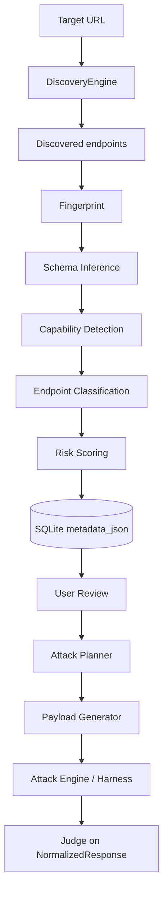
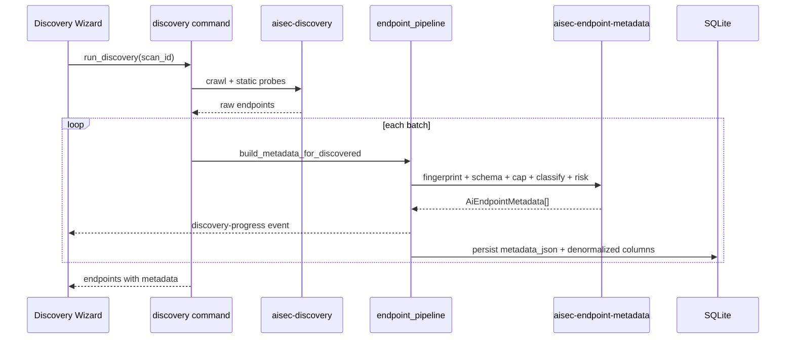

# AI-Aware Discovery Architecture

AISec is an **AI Security Scanner**. Discovery produces **`AiEndpointMetadata`** as the single source of truth for all downstream phases.

## Pipeline

## Responsibility boundaries

| Module | Responsibility |
|--------|----------------|
| Discovery | Find URLs / endpoints |
| Fingerprint | Identify AI framework & provider |
| Schema Inference | Normalize request/response structure |
| Capability Detection | Chat, streaming, tools, agent, etc. |
| Classification | Endpoint type (AI Chat, MCP, …) |
| Risk Scoring | Initial attack surface score 0–100 |
| Planner | Attack categories & priority (metadata only) |
| Payload Generator | Mutate inferred fields only |
| Harness | Deliver HTTP requests |
| Judge | Evaluate normalized responses only |

## SQLite (`endpoints`)

Migration `007_ai_endpoint_metadata.sql`:

- `metadata_json` — full `AiEndpointMetadata` blob
- Denormalized filters: `endpoint_type`, `ai_framework`, `risk_score`, `metadata_confidence`, `discovery_source`, `auth_required`

## Rust crates

| Crate | Role |
|-------|------|
| `aisec-discovery` | Crawl + static probes |
| `aisec-endpoint-metadata` | Schema/Capability/Classify/Risk pipeline |
| `aisec-fingerprint` | Stack fingerprint (embedded in metadata) |
| `aisec-planner` | Reads `metadata` + embedded `stack_fingerprint` |
| `aisec-attack` | Uses `body_template_from_metadata()` |

## IPC events

`discovery-progress` — phase, processed, total, elapsed_ms during metadata pipeline.

## Removed

- `fingerprint_service.rs` — logic moved into `aisec-endpoint-metadata` pipeline
- `endpoints.fingerprint_json` column (renamed to `metadata_json`)
- Fake discovery phase animation (replaced by real backend phases)

## Discovery sequence

## Technical debt

- Cancellation token for long discovery runs (not yet wired)
- Resume partial metadata on failure
- OpenAPI-driven schema inference from spec body
- `aisec-generator` crate: attack path uses `body_template_from_metadata`; generator internals not yet field-path aware
