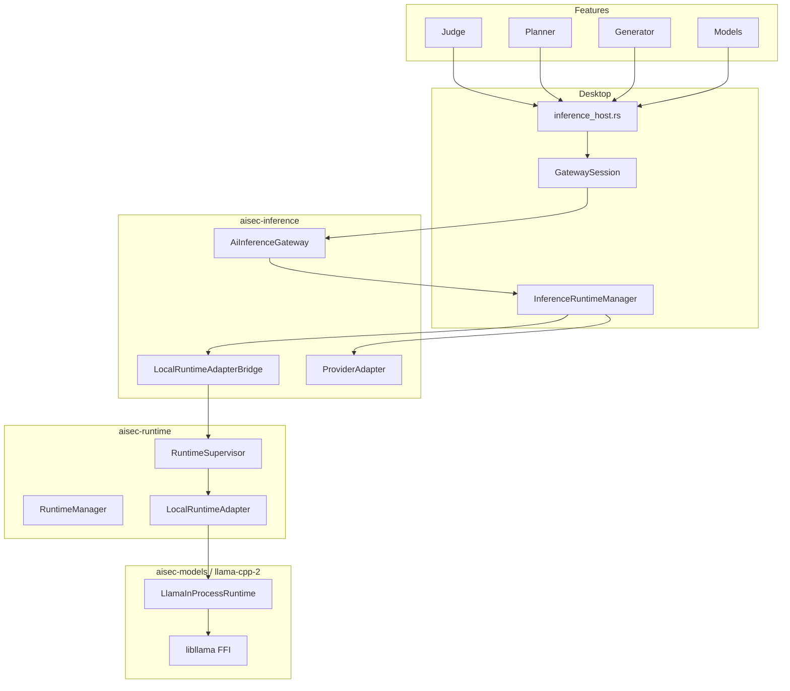

# AISec AI Inference Architecture

All LLM inference flows through **`aisec-inference`**. Local GGUF inference uses **embedded libllama** (in-process FFI) — no `llama-server`, no localhost HTTP.

## Layer diagram



## Local runtime path

```
AI Feature → AiInferenceGateway → InferenceRuntimeManager
  → RuntimeSupervisor → LocalRuntimeAdapter → LlamaInProcessRuntime → libllama → GGUF
```

No subprocess. No REST. No port binding.

## Configuration

| Store | Path |
|-------|------|
| AI route | `{data_dir}/ai_runtime_config.json` |
| Model vault | `{data_dir}/models/` |
| Hardware profile | `{data_dir}/runtime/hardware.json` |
| Runtime manifest | `{data_dir}/runtime/manifest.json` |

## Backend selection

`GfxBackend`: Auto | CUDA | Metal | Vulkan | CPU

Auto-detected from `RuntimeHardwareProfile` at startup. User override stored in runtime manifest.

## Startup

1. `InferenceRuntimeManager::load()` — AI route config
2. `RuntimeManager::bootstrap()` — hardware profile, init libllama (no model load)
3. `resume_local_runtime_on_startup()` — lazy-load selected GGUF if local mode

## Thread safety

`LlamaInProcessRuntime` confines all FFI to a dedicated worker thread. `LocalRuntimeAdapter` serializes access via `tokio::sync::Mutex`.
