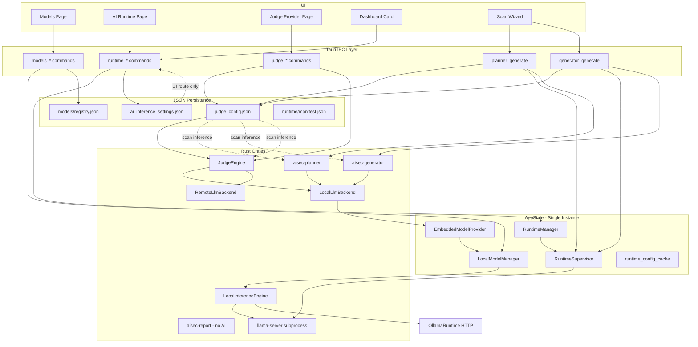
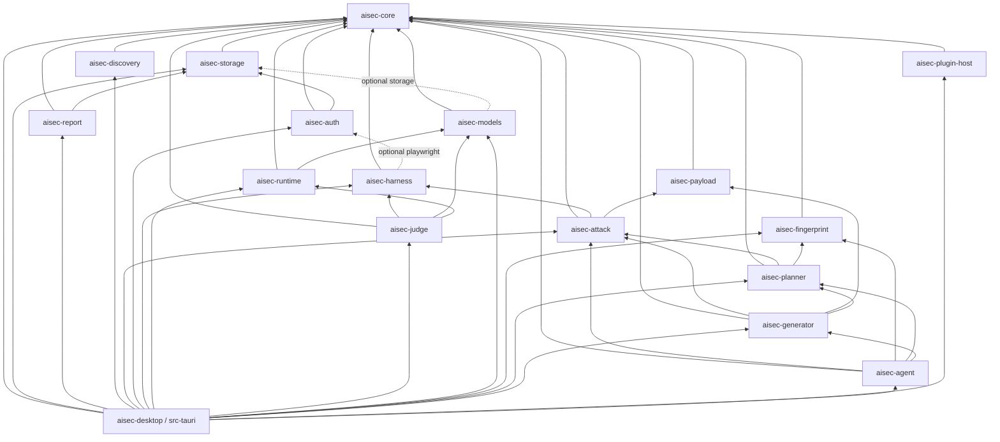

# AI Runtime Architecture Audit

**Project:** AISec  
**Audit type:** Read-only, source-code evidence only  
**Date:** 2026-06-13  
**Auditor role:** Lead Software Architect (evidence-based)

> **Rule applied:** Every capability is marked **NOT IMPLEMENTED** unless proven in source.  
> No speculative statements. Findings cite file paths and line numbers.

---

## Executive Summary

AISec has a **single embedded `RuntimeManager` per desktop process** (owned by Tauri `AppState`), a **production-grade AI Runtime UI**, and a **production-grade Models vault**. However, I found **no unified global AI inference gateway**. Judge, Attack Planner, and Payload Generator each wire into runtime through **separate, duplicated paths** and predominantly through **`judge_config.json`**, not through `RuntimeConfigurationDto` / `ai_inference_settings.json`.

| Dimension | Score |
|-----------|------:|
| Global Runtime | 58/100 |
| Runtime Lifecycle | 78/100 |
| Configuration Management | 42/100 |
| Inference Pipeline | 38/100 |
| Model Management | 82/100 |
| UI Integration | 86/100 |
| Maintainability | 48/100 |
| **Overall Architecture** | **55/100** |
| **Readiness for Global AI Runtime refactor** | **NO** (blockers in §18) |

---

## SECTION 1 — GLOBAL AI RUNTIME

### Finding 1.1 — Single `RuntimeManager` instance per app process

**Status:** ✅ IMPLEMENTED

**Evidence:**
- `src-tauri/src/state.rs:27` — `runtime_manager: Arc<AsyncMutex<RuntimeManager>>` on `AppState`
- `src-tauri/src/lib.rs:116-121` — one `RuntimeManager` created at startup via `embedded_runtime::bootstrap_runtime_manager`
- `src-tauri/src/lib.rs:147-158` — registered once via `app.manage(AppState::new(...))`
- I could not find a Rust `static RuntimeManager`, `OnceCell`, or second production `RuntimeManager` construction outside tests

**Explanation:** The application owns exactly one `RuntimeManager` shared across IPC commands and background tasks via `Arc<AsyncMutex<>>`.

---

### Finding 1.2 — `RuntimeManager` is shared application-wide

**Status:** ✅ IMPLEMENTED

**Evidence:**
- `src-tauri/src/state.rs:100-102` — accessor `runtime_manager()`
- Consumers include:
  - `src-tauri/src/commands/runtime.rs` (lifecycle IPC)
  - `src-tauri/src/embedded_runtime.rs:110` (auto-resume)
  - `src-tauri/src/runtime_watch.rs:36,44` (health watch)
  - `src-tauri/src/commands/scan.rs:127,630` (scan jobs)
  - `src-tauri/src/commands/generator.rs:163,207`
  - `src-tauri/src/commands/judge.rs:200,227`
  - `src-tauri/src/commands/planner.rs:125`
  - `src-tauri/src/commands/attack.rs:394`
  - `src-tauri/src/commands/models.rs:1086`

---

### Finding 1.3 — Multiple independent runtimes can exist conceptually

**Status:** ⚠️ PARTIALLY IMPLEMENTED

**Evidence:**
- **Local embedded runtime:** one `RuntimeSupervisor` inside the single `RuntimeManager` (`crates/aisec-runtime/src/manager.rs:46`)
- **Remote/third-party inference:** `aisec-judge` `RemoteLlmBackend` (`crates/aisec-judge/src/providers/remote.rs`) — separate HTTP stack, not managed by `RuntimeManager`
- **Ollama client runtime:** `aisec-models::OllamaRuntime` (`crates/aisec-models/src/runtime/ollama.rs`) — can be selected via judge local provider `Ollama` (`crates/aisec-judge/src/config.rs:10-13`)
- **In-process llama:** `LlamaInProcessRuntime` exists in `aisec-models` (feature-gated) — not the primary desktop path

**Explanation:** There is one **process supervisor** for llama-server, but multiple **inference backends** can be active depending on judge config and route. This is not a single global inference runtime in the architectural sense.

---

### Finding 1.4 — Runtime lifecycle centralized for local llama-server

**Status:** ✅ IMPLEMENTED (local mode only)

**Evidence:**
- Lifecycle enum: `crates/aisec-runtime/src/state.rs:8-20`
- Central orchestration: `crates/aisec-runtime/src/manager.rs:121-336` (`bootstrap`, `repair`, `start_runtime`, `stop_runtime`, `restart_runtime`, `delete_runtime`, `load_model_at_path`, `unload_loaded_model`)
- IPC surface: `src-tauri/src/commands/runtime.rs:136-327`
- Graceful shutdown: `src-tauri/src/lib.rs:44-54`
- Health watch: `src-tauri/src/runtime_watch.rs:14-18` (single watch loop guard)

---

### Finding 1.5 — Runtime initialization sequence

**Status:** ✅ IMPLEMENTED

**Evidence:**
1. `src-tauri/src/lib.rs:116-121` — `bootstrap_runtime_manager` (load manifest/hardware, **does not start server**)
2. `src-tauri/src/embedded_runtime.rs:28-47` — `RuntimeManager::new` + `bootstrap()`
3. `src-tauri/src/lib.rs:123-125` — `detect_hardware_on_startup`
4. `src-tauri/src/lib.rs:160-164` — async spawn `resume_local_runtime_on_startup`
5. `src-tauri/src/embedded_runtime.rs:65-145` — conditional auto-start + model reload when `ai_inference_settings.json` route is `Local`

---

### Finding 1.6 — Global `RuntimeConfiguration` object (Rust)

**Status:** ❌ NOT IMPLEMENTED (as a Rust singleton config object)

**Evidence:**
- I could not find a Rust type named `RuntimeConfiguration`
- Closest aggregate: `RuntimeConfigurationDto` at `src-tauri/src/commands/runtime.rs:85-97` (IPC/UI DTO)
- Low-level install config: `aisec_runtime::RuntimeConfig` at `crates/aisec-runtime/src/config.rs:8-17`
- In-memory cache: `src-tauri/src/state.rs:28` — `runtime_config_cache: Arc<AsyncMutex<Option<RuntimeConfigurationDto>>>`

---

### Section 1 Score: **58/100**

**Rationale:** Strong single supervisor for local llama-server; not a unified global AI runtime spanning judge/planner/generator/third-party paths.

---

## SECTION 2 — AI CONFIGURATION

### Finding 2.1 — `JudgeConfiguration` type

**Status:** ❌ NOT IMPLEMENTED

**Evidence:** Grep across repository found no symbol `JudgeConfiguration`.

---

### Finding 2.2 — `JudgeConfig` and persisted judge settings

**Status:** ✅ IMPLEMENTED

**Evidence:**
- Engine config: `crates/aisec-judge/src/types.rs:298-307` — `JudgeConfig`
- Persisted provider config: `crates/aisec-judge/src/config.rs:138-152` — `JudgeProviderConfig`
- IPC DTO: `src-tauri/src/commands/judge.rs:18-49` — `JudgeConfigDto`
- Frontend mirror: `src/shared/ipc/judge.ts:15-40`
- Persistence path: `src-tauri/src/judge_config.rs:12-13` — `{data_dir}/judge_config.json`

---

### Finding 2.3 — AI inference route settings (separate from judge)

**Status:** ✅ IMPLEMENTED

**Evidence:**
- `src-tauri/src/ai_inference_settings.rs:40-48` — `AiInferenceSettings` (`route`, `selected_model_id`, connectivity fields)
- Persistence: `src-tauri/src/ai_inference_settings.rs:92-93` — `{data_dir}/ai_inference_settings.json`
- IPC DTO: `src-tauri/src/ai_inference_settings.rs:75-90` — `AiInferenceSettingsDto`

---

### Finding 2.4 — Configuration ownership by feature

| Feature | Config source | Shared? |
|---------|---------------|---------|
| **Judge** | `judge_config.json` → `JudgeProviderConfig` | Own persisted file |
| **Attack Planner (local LLM)** | `judge_config.json` via `load_judge_config` | **Shares judge config** |
| **Payload Generator (local LLM)** | `judge_config.json` via `load_judge_config` | **Shares judge config** |
| **Report Generator** | None (no AI) | N/A |
| **AI Runtime page route/model** | `ai_inference_settings.json` | **Separate from judge** |
| **Third-party model credentials** | `models/registry.json` + `models/.credentials/*.enc` | Separate vault |
| **Embedded runtime install** | `runtime/manifest.json`, `runtime/hardware.json` | Separate |

**Evidence:**
- Planner: `src-tauri/src/commands/planner.rs:122-131` — `load_judge_config` + `prepare_judge_runtime_context`
- Generator: `src-tauri/src/commands/generator.rs:167-176` — same pattern
- Judge engine build: `src-tauri/src/judge_config.rs:219-234` — `build_configured_judge_engine`
- Report: `src-tauri/src/commands/domain.rs:191-241` — SQLite findings only, no judge config load
- Models third-party: `src-tauri/src/commands/models.rs:315-335` — ephemeral `JudgeProviderConfig` for connectivity test only

**Conclusion:** Judge, Planner, and Generator **share** `judge_config.json`. AI Runtime UI uses a **second** settings file. I found **no single configuration object** for all AI features.

---

### Finding 2.5 — SQLite stores AI configuration

**Status:** ❌ NOT IMPLEMENTED

**Evidence:** I could not find judge/runtime/model provider settings persisted in SQLite migrations or repositories. SQLite is used for scans, findings, projects, etc. (`src-tauri/src/db.rs`).

---

### Configuration objects inventory

| Object | Location | Persistence |
|--------|----------|-------------|
| `JudgeProviderConfig` | `crates/aisec-judge/src/config.rs` | `judge_config.json` |
| `JudgeConfig` | `crates/aisec-judge/src/types.rs` | In-memory (derived) |
| `AiInferenceSettings` | `src-tauri/src/ai_inference_settings.rs` | `ai_inference_settings.json` |
| `RuntimeConfig` | `crates/aisec-runtime/src/config.rs` | Derived from data dir + manifest |
| `RuntimeConfigurationDto` | `src-tauri/src/commands/runtime.rs` | Ephemeral / cache only |
| `ModelEntry` / registry | `crates/aisec-models` | `models/registry.json` |
| `RuntimeManifest` | `crates/aisec-runtime/src/manifest.rs` | `runtime/manifest.json` |
| `AgentConfig` | `crates/aisec-agent` | In-memory per scan job |

---

### Section 2 Score: **42/100**

---

## SECTION 3 — RUNTIME MANAGER API

### Finding 3.1 — `RuntimeManager` public API (complete list from source)

**Status:** ✅ IMPLEMENTED (as process supervisor + status; **not** as inference gateway)

**Evidence:** `crates/aisec-runtime/src/manager.rs`

| Method | Line | Purpose |
|--------|------|---------|
| `new` | 54 | Construct manager |
| `requires_attention` | 71 | UI attention flag |
| `last_error` | 89 | Last error string |
| `lifecycle_state` | 93 | Lifecycle enum |
| `supervisor` / `supervisor_mut` | 97-102 | Access `RuntimeSupervisor` |
| `manifest` | 105 | Install manifest |
| `hardware` | 109 | Hardware profile |
| `last_health` | 113 | Last health report |
| `last_benchmark` | 117 | Last benchmark |
| `bootstrap` | 121 | Load config from disk (no start) |
| `repair` | 163 | Install/reinstall pipeline |
| `recommended_runtime_label` | 208 | Hardware-based label |
| `is_runtime_active` | 214 | Process active check |
| `install` | 223 | Alias repair |
| `start_runtime` | 227 | Start llama-server process |
| `sync_lifecycle_from_supervisor` | 251 | Reconcile state |
| `on_model_load_started` / `on_model_load_finished` | 265-269 | Load lifecycle hooks |
| `load_model_at_path` | 277 | Load GGUF into server |
| `is_model_loaded_at` | 296 | Path match check |
| `unload_loaded_model` | 307 | Stop server, clear model |
| `stop_runtime` | 319 | Stop process |
| `restart_runtime` | 325 | Supervisor restart |
| `delete_runtime` | 336 | Remove install |
| `refresh_hardware` | 367 | Detect + persist hardware |
| `run_health_check` | 376 | HTTP health probe |
| `run_benchmark` | 386 | Benchmark |
| `logs` | 403 | Ring buffer logs |
| `status_snapshot` | 407 | Sync status DTO |
| `status_snapshot_async` | 427 | Async status DTO |

---

### Finding 3.2 — Inference methods on `RuntimeManager`

**Status:** ❌ NOT IMPLEMENTED

**Evidence:** I could not find `chat()`, `infer()`, `completion()`, or `embedding()` on `RuntimeManager`. Inference is delegated to `RuntimeSupervisor` → `LlamaCppRuntime` HTTP client and to `LocalInferenceEngine` via `EmbeddedModelProvider`.

---

### Finding 3.3 — `RuntimeManager` role classification

**Status:** ⚠️ PARTIALLY IMPLEMENTED

**Evidence:**
- Process launcher + health monitor: `start_runtime`, `stop_runtime`, `run_health_check` (`manager.rs:227,319,376`)
- Model load orchestration: `load_model_at_path` (`manager.rs:277`)
- **Not** a business-level inference gateway — no unified `infer()` API

**Conclusion:** `RuntimeManager` is primarily a **local llama-server lifecycle supervisor**, not a full inference gateway for all AI features.

---

### Section 3 Score: **52/100**

---

## SECTION 4 — AI CALL GRAPH

### Finding 4.1 — `AiService` layer

**Status:** ❌ NOT IMPLEMENTED

**Evidence:** Grep found no `AiService`, `InferenceService`, `LLMService`, `ModelService`, or `ChatService` types in `.rs` or `.ts` source.

---

### Finding 4.2 — Judge call graph (actual)

```
Scan / Attack execution
  → src-tauri/src/commands/attack.rs:151-157
    → build_configured_judge_engine (src-tauri/src/judge_config.rs:219-234)
      → load_judge_config (judge_config.json)
      → prepare_judge_runtime_context (judge_config.rs:173-217)
        → RuntimeSupervisor.ensure_running / ensure_model_loaded
      → aisec_judge::build_judge_engine (crates/aisec-judge/src/factory.rs:21-27)
        → ModelRolePool + JudgeEngine (crates/aisec-judge/src/engine.rs:167-185)
          → LlmEvaluator (crates/aisec-judge/src/evaluators/llm.rs)
            → InferenceRuntime trait
              → Local: ModelProviderRuntime → EmbeddedModelProvider → LocalInferenceEngine
              → Remote: RemoteLlmBackend → HTTP (OpenAI-compatible etc.)
```

**Evidence:** `aisec-judge` crate has **zero** imports of `RuntimeManager` (verified by subagent grep). Bridge is at Tauri shell only.

---

### Finding 4.3 — Attack Planner call graph (wizard IPC path)

```
AIRuntimePage / Scan Wizard (AttackPlanStep)
  → planner_generate IPC (src-tauri/src/commands/planner.rs:84-153)
    → load_judge_config + prepare_judge_runtime_context
    → build_planner_llm_backend (planner.rs:155-182)
      → LocalLlmBackend (crates/aisec-judge/src/providers/local.rs)
        → ModelProviderRuntime (crates/aisec-runtime/src/inference_adapter.rs)
    → aisec_planner::generate_attack_plan (crates/aisec-planner/src/engine.rs:7-23)
      → deterministic OR local_llm (crates/aisec-planner/src/local_llm.rs)
```

**Agent scan path (different):**
```
src-tauri/src/agent_service.rs:96-99
  → generate_attack_plan(..., PlannerMode::Deterministic, None)
```
Local LLM planner is **not** used in agent mode.

---

### Finding 4.4 — Payload Generator call graph

```
generator_generate / scan_start
  → src-tauri/src/commands/generator.rs:159-259
    → load_judge_config + prepare_judge_runtime_context
    → build_generator_llm_backend (generator.rs:224-251)
    → JudgeGeneratorLlm (src-tauri/src/generator_service.rs:9-27)
    → aisec_generator::generate_from_plan (crates/aisec-generator/src/engine.rs)
```

**Agent path bug:**
```
src-tauri/src/agent_service.rs:112
  → generate_from_plan(&category_plan, mode, None)  // None LLM backend
```
If `mode == LocalLlm`, generator errors at `crates/aisec-generator/src/engine.rs:25-28`.

---

### Finding 4.5 — Prompt Generator

**Status:** ❌ NOT IMPLEMENTED (as named module)

**Evidence:** I could not find `PromptGenerator` type, crate, or IPC command. Prompts are inline in:
- `crates/aisec-planner/src/local_llm.rs:58-94`
- `crates/aisec-generator/src/local_llm.rs:97-131`
- `crates/aisec-judge/src/prompts.rs:1-60` (evaluation prompts, not generation service)

---

### Finding 4.6 — Report Generator call graph

```
report_generate IPC
  → src-tauri/src/commands/domain.rs:191-241
    → SQLite findings
    → aisec_report::ReportingEngine (crates/aisec-report/src/engine.rs:27-41)
      → HTML/JSON/SARIF/PDF formatters (rule-based)
```

**Status:** ❌ NOT IMPLEMENTED (no AI in report path)

---

### Section 4 Score: **38/100**

---

## SECTION 5 — JUDGE ENGINE

| Question | Status | Evidence |
|----------|--------|----------|
| Does Judge own configuration? | ✅ | `judge_config.json`, `JudgeProviderConfig` |
| Does Judge select model? | ✅ | `vault_model_id` in local settings (`judge_config.rs`) |
| Does Judge select provider? | ✅ | `LocalProvider` / `RemoteProvider` (`config.rs:10-31`) |
| Does Judge directly invoke runtime? | ❌ | `JudgeEngine` uses `InferenceRuntime` trait only (`engine.rs:167-185`) |
| Does Judge call `RuntimeManager`? | ❌ | No import in `aisec-judge`; Tauri shell calls supervisor |
| Duplicated runtime logic in Judge? | ⚠️ | `build_local_backend` in `factory.rs:99-130` duplicates Tauri planner/generator wiring |

---

### Section 5 Score: **55/100**

---

## SECTION 6 — ATTACK PLANNER

| Item | Status | Evidence |
|------|--------|----------|
| Crate implementation | ✅ | `crates/aisec-planner/` — deterministic + local LLM |
| IPC command | ✅ | `src-tauri/src/commands/planner.rs` |
| UI integration | ✅ | `src/features/scans/steps/AttackPlanStep.tsx:137-153` |
| Uses `RuntimeManager` | ⚠️ | Via `runtime_mgr.supervisor_mut()` only (`planner.rs:125-131`) |
| Reads `ai_inference_settings` | ❌ | Uses `judge_config.json` instead |
| Remote/cloud planner | ❌ | Only `PlannerMode::Deterministic` and `LocalLlm` (`types.rs:8-11`) |
| Scan re-plans automatically | ❌ | Scan uses UI playbook; planner is wizard preview (`AttackPlanStep.tsx:123-135`) |
| Agent mode local LLM | ❌ | Hardcoded deterministic (`agent_service.rs:96-99,207`) |

---

### Section 6 Score: **50/100**

---

## SECTION 7 — PAYLOAD GENERATOR

| Item | Status | Evidence |
|------|--------|----------|
| Crate | ✅ | `crates/aisec-generator/` |
| Static / mutation modes | ✅ | `static_pack.rs`, `template_mutation.rs` |
| Local LLM mode | ✅ | `local_llm.rs` + IPC `generator.rs` |
| Runtime path | ⚠️ | Same judge vault bridge as planner |
| Config ownership | ⚠️ | `judge_config.json`, not AI Runtime settings |
| Agent local LLM | ❌ | `None` backend passed (`agent_service.rs:112`) |
| Remote LLM generator | ❌ | Not found |

**Note:** `aisec-payload` is a static mutation library, not the IPC payload generator.

---

### Section 7 Score: **52/100**

---

## SECTION 8 — REPORT GENERATOR

**Status:** ✅ IMPLEMENTED (deterministic, non-AI)

**Evidence:**
- `crates/aisec-report/src/engine.rs:27-41` — template rendering only
- `crates/aisec-report/src/recommendations.rs:6-78` — rule-based recommendations
- `src-tauri/src/commands/domain.rs:226-240` — no LLM calls
- Grep over `aisec-report/**` found no `InferenceRuntime`, `ollama`, or `openai` usage

**AI-powered report generation:** ❌ NOT IMPLEMENTED

---

### Section 8 Score: **N/A (non-AI feature complete)**

---

## SECTION 9 — AI SERVICE LAYER

| Type searched | Found? |
|---------------|--------|
| `AiService` | ❌ |
| `InferenceService` | ❌ |
| `LLMService` | ❌ |
| `ModelService` | ❌ |
| `ChatService` | ❌ |

**Actual abstractions found:**

| Abstraction | File |
|-------------|------|
| `InferenceRuntime` trait | `crates/aisec-models/src/runtime/mod.rs:24` |
| `LocalInferenceEngine` | `crates/aisec-models/src/runtime/inference_engine.rs` |
| `EmbeddedModelProvider` | `crates/aisec-runtime/src/embedded.rs` |
| `ModelProviderRuntime` | `crates/aisec-runtime/src/inference_adapter.rs` |
| `LlmBackend` trait | `crates/aisec-judge/src/providers/mod.rs` |
| `JudgeGeneratorLlm` / `JudgePlannerLlm` | `src-tauri/src/generator_service.rs`, `planner_service.rs` |

**Status:** ❌ NOT IMPLEMENTED — no business-level AI service layer

---

### Section 9 Score: **20/100**

---

## SECTION 10 — MODELS

| Capability | Status | Evidence |
|------------|--------|----------|
| Models page | ✅ | `src/features/models/ModelsPage.tsx` |
| Model installation (catalog download) | ✅ | `startModelDownload`, `DownloadManagerCard` |
| GGUF/ZIP import | ✅ | `ModelsPage.tsx:300-379` |
| Third-party registration | ✅ | `ThirdPartyModelsPanel.tsx`, `models_save_third_party` |
| Default model auto-pick on reconcile | ❌ | `reconcile_settings` clears invalid selection (`ai_inference_settings.rs:306-308`) — no auto-pick |
| Active model (AI Runtime) | ✅ | `ai_inference_settings.json` `selected_model_id` |
| Active model (Judge/Planner/Generator) | ⚠️ | `judge_config.json` `local.vault_model_id` — **separate** |
| Relationship to `RuntimeManager` | ✅ | Local load via `runtime_load_model` (`commands/runtime.rs:205-277`) |
| Relationship to Judge | ⚠️ | Vault model id in judge config; third-party via registry metadata |
| Models page scope | ✅ | Registry + install + test; not sole source of truth for all AI config |

---

### Section 10 Score: **82/100**

---

## SECTION 11 — AI RUNTIME PAGE

| Feature | Status | Evidence |
|---------|--------|----------|
| Runtime mode picker | ✅ | `AIRuntimePage.tsx:113-156,640-645` |
| Third-party mode | ✅ | `AIRuntimePage.tsx:649-747` |
| Local runtime mode | ✅ | `AIRuntimePage.tsx:749-987` |
| Hardware detection | ✅ | `refreshRuntimeHardware`, `AIRuntimePage.tsx:784-814` |
| Runtime installation | ✅ | `installRuntime`, progress event `runtime-install-progress` |
| Runtime status | ✅ | Status cards + `configuration.statusLabel` |
| Health | ✅ | Local: `configuration.connectivity`; third-party: connectivity test |
| Logs | ✅ | `getRuntimeLogs`, `AIRuntimePage.tsx:904-922` |
| Start / Stop / Restart | ✅ | IPC wired in `AIRuntimePage.tsx:817-923` |
| Current model | ✅ | Third-party: model list + Use; Local: load/unload |
| Mode toggle in header | ✅ | `ModeToggle` + `RefreshButton` (`AIRuntimePage.tsx:611-627`) |

**Gaps:**
- ROCm display hardcoded "No" (`AIRuntimePage.tsx:792`) — display only
- Judge Provider page still separate (`JudgeProviderPage.tsx`) — dual configuration UX

---

### Section 11 Score: **86/100**

---

## SECTION 12 — STARTUP FLOW

### Actual sequence (from source)

```
Tauri app start (src-tauri/src/lib.rs:62-164)
  ↓
Init logging (lib.rs:67)
  ↓
Open SQLite + migrations (lib.rs:77-78)
  ↓
Auth / legacy migrations (lib.rs:86-109)
  ↓
migrate_judge_config_secrets (lib.rs:103-107)
  ↓
open_model_manager_with_registry (lib.rs:111-114)
  ↓
bootstrap_runtime_manager (lib.rs:116-121)
  │   → RuntimeManager::new + bootstrap() [load manifest, NO start]
  ↓
detect_hardware_on_startup (lib.rs:123-125)
  ↓
Wire llama binary into model manager (lib.rs:127-133)
  ↓
Create EmbeddedModelProvider (lib.rs:135-138)
  ↓
HarnessFactory + PluginManager (lib.rs:140-145)
  ↓
AppState::new + app.manage (lib.rs:147-158)
  ↓
spawn resume_local_runtime_on_startup (lib.rs:160-164)
      → if ai_inference_settings route == Local + selected_model_id
         → start_runtime + load_model_with_loading_cache
         → spawn_runtime_watch
  ↓
Frontend boot → health IPC → Connected
```

**Shutdown:** `RunEvent::Exit` → `stop_runtime` → close DB (`lib.rs:44-54`)

---

### Section 12 Score: **78/100**

---

## SECTION 13 — DASHBOARD

| Item | Status | Evidence |
|------|--------|----------|
| AI Runtime card exists | ✅ | `src/features/dashboard/AiRuntimeDashboardCard.tsx` |
| Loads configuration | ✅ | `DashboardPage.tsx:32-54` — `getRuntimeConfiguration()` |
| Mode displayed | ✅ | `AiRuntimeDashboardCard.tsx:16-20,42-48` |
| Status displayed | ✅ | `AiRuntimeDashboardCard.tsx:47-48` |
| Runtime name (local) | ✅ | `AiRuntimeDashboardCard.tsx:52-56` |
| Model (local) | ✅ | `AiRuntimeDashboardCard.tsx:58-62` |
| Provider (third-party) | ✅ | `AiRuntimeDashboardCard.tsx:66-72` |
| Health on dashboard | ❌ | Not shown on card (only on AI Runtime page) |
| Navigation to /runtime | ✅ | `AiRuntimeDashboardCard.tsx:26` |
| Live refresh | ⚠️ | Loads on mount / `backendConnected` change only — no poll |

**Reflects `RuntimeManager`?** ⚠️ Indirectly via `RuntimeConfigurationDto` aggregate, not direct manager access.

---

### Section 13 Score: **72/100**

---

## SECTION 14 — DUPLICATED AI LOGIC

| Duplication | Locations | Evidence |
|-------------|-----------|----------|
| Vault LLM backend wiring | `aisec-judge/src/factory.rs:99-130`, `commands/planner.rs:155-182`, `commands/generator.rs:224-251` | Near-identical `ModelProviderRuntime` + `LocalLlmBackend` setup |
| LLM adapter traits | `PlannerLlm`, `GeneratorLlm`, `JudgePlannerLlm`, `JudgeGeneratorLlm` | Separate thin wrappers with different token limits |
| Dual settings systems | `judge_config.json` vs `ai_inference_settings.json` | Planner/generator ignore AI Runtime route file |
| Ollama vs llama.cpp routing | `judge_config.rs`, `inference_engine.rs`, `ollama.rs`, `llama_cpp_runtime.rs` | Multiple layers |
| OpenAI-compatible HTTP | `aisec-judge/providers/remote.rs`, `aisec-harness/providers/openai.rs` | Judge remote vs attack transport — not shared |
| JSON extraction from LLM output | `aisec-planner/local_llm.rs:142-154`, `aisec-generator/local_llm.rs:133-152`, `aisec-judge/evaluators/llm.rs:16-24` | Partial duplication |
| Legacy Ollama naming | `AppState::ollama_base_url()` (`state.rs:114-121`), `DEFAULT_JUDGE_CONFIG.localProvider: "ollama"` (`judge.ts:225-226`) | Misleading names post-migration |

---

### Section 14 Score: **35/100** (high duplication = low score)

---

## SECTION 15 — TECHNICAL DEBT

| Item | Status | Evidence |
|------|--------|----------|
| `curated_catalog()` deprecated | ⚠️ | `crates/aisec-models/src/catalog.rs:15-17` — returns empty, no callers |
| `bundled_ollama_binary()` deprecated | ⚠️ | `crates/aisec-runtime/src/paths.rs:20-27` |
| `OllamaRuntime` legacy client | ⚠️ | `crates/aisec-models/src/runtime/ollama.rs` — still in tree |
| `LocalProvider::Ollama` in judge schema | ⚠️ | `crates/aisec-judge/src/config.rs:10-13` |
| Unused IPC: `getRuntimeStatus` | ⚠️ | `src/shared/ipc/runtime.ts:144` — no feature usage |
| Unused IPC: `getRuntimeInferenceSettings` | ⚠️ | `runtime.ts:134` |
| Unused IPC: `installModel`, `verifyModel`, `testModelEmbeddings` | ⚠️ | `src/shared/ipc/models.ts` |
| Stale docs | ⚠️ | `docs/PROJECT_CURRENT_STATE.md`, `docs/MOCK_INVENTORY.md`, `docs/RUNTIME.md` reference Ollama-era or shell-only Models |
| Agent generator LocalLlm broken | ❌ | `agent_service.rs:112` passes `None` |
| Judge Provider UI vs AI Runtime split | ⚠️ | Two configuration surfaces for operators |

---

### Section 15 Score: **45/100**

---

## SECTION 16 — ARCHITECTURE COMPLIANCE SCORES

| Area | Score | Summary |
|------|------:|---------|
| Global Runtime | 58/100 | One supervisor; not one inference gateway |
| Runtime Lifecycle | 78/100 | Strong local llama-server lifecycle |
| Configuration Management | 42/100 | Split judge vs AI Runtime settings |
| Inference Pipeline | 38/100 | No AiService; fragmented call graphs |
| Model Management | 82/100 | Strong vault + UI |
| UI Integration | 86/100 | AI Runtime + Models production-ready |
| Maintainability | 48/100 | Triplicated backend wiring, legacy Ollama |
| **Overall** | **55/100** | |

---

## SECTION 17 — GAP REPORT

### Critical

| Gap | Why | Impact | Files | Effort |
|-----|-----|--------|-------|--------|
| Dual AI config (`judge_config` vs `ai_inference_settings`) | Planner/generator/judge ignore AI Runtime route selection | User sets model in AI Runtime; scan features may use different model | `judge_config.rs`, `ai_inference_settings.rs`, `planner.rs`, `generator.rs` | L (2-3 weeks) |
| No unified inference gateway | Each feature wires vault/judge independently | Cannot enforce global model, quotas, logging | `factory.rs`, `planner.rs`, `generator.rs`, `inference_adapter.rs` | L (3-4 weeks) |
| Agent mode LocalLlm generator broken | `None` LLM passed | Agent scans fail or silently fall back | `agent_service.rs:112` | S (1-2 days) |

### High

| Gap | Why | Impact | Files | Effort |
|-----|-----|--------|-------|--------|
| Triplicated `build_*_llm_backend` | Copy-paste in 3 places | Drift, bugs on provider changes | `factory.rs`, `planner.rs`, `generator.rs` | M (3-5 days) |
| Judge Provider page separate from AI Runtime | Two operator surfaces | Confusion, misconfiguration | `JudgeProviderPage.tsx`, `AIRuntimePage.tsx` | M (1 week) |
| Remote inference not in planner/generator | Only judge has `RemoteLlm` | Third-party route unused for planning/generation | `aisec-planner`, `aisec-generator` | L (2 weeks) |

### Medium

| Gap | Why | Impact | Files | Effort |
|-----|-----|--------|-------|--------|
| Dashboard card no health / no live refresh | Static mount load | Stale status on dashboard | `DashboardPage.tsx`, `AiRuntimeDashboardCard.tsx` | S (1-2 days) |
| Unused IPC exports | Dead API surface | Maintenance noise | `runtime.ts`, `models.ts` | S (1 day) |
| Legacy Ollama types/defaults | Post-llama.cpp migration incomplete | Wrong defaults in judge UI | `judge.ts`, `ollama.rs`, `judge_config.rs` | M (3-5 days) |
| Attack planner not wired into scan execution | Wizard preview only | Plan UI does not drive scan | `AttackPlanStep.tsx`, `scan.rs` | M (1 week) |

### Low

| Gap | Why | Impact | Files | Effort |
|-----|-----|--------|-------|--------|
| Stale documentation | Docs contradict source | Onboarding friction | `docs/*.md` | S (2-3 days) |
| ROCm hardcoded in UI | Display placeholder | Minor inaccuracy | `AIRuntimePage.tsx:792` | XS |
| `curated_catalog()` dead code | Deprecated empty fn | Noise | `catalog.rs:15-17` | XS |

---

## SECTION 18 — IMPLEMENTATION READINESS

### Is the project ready to implement Global AI Runtime Architecture?

## **NO**

### Blockers (must resolve first)

1. **Two authoritative config files** — `judge_config.json` and `ai_inference_settings.json` are not unified; inference consumers do not read AI Runtime settings.
2. **No `AiService` / inference gateway** — `RuntimeManager` lacks `infer()`/`chat()`; features bypass it for actual LLM calls.
3. **Triplicated Tauri wiring** — judge, planner, generator each build `LocalLlmBackend` independently.
4. **Agent scan path incomplete** — local LLM generator not wired (`agent_service.rs:112`).
5. **Remote route only partial** — third-party/cloud works for judge remote mode and Models connectivity tests, not for planner/generator.

---

## SECTION 19 — MIGRATION PLAN (DO NOT IMPLEMENT — PLAN ONLY)

### Phase 1 — Unify configuration read path (low risk)

**Goal:** Single source of truth for active model + route.

| Item | Detail |
|------|--------|
| Files affected | `ai_inference_settings.rs`, `judge_config.rs`, `planner.rs`, `generator.rs`, `judge_config.rs` (`prepare_judge_runtime_context`) |
| Approach | Derive judge local `vault_model_id` from `ai_inference_settings.selected_model_id` when route is local; deprecate independent vault pick in judge UI |
| Risk | Medium — existing users with mismatched configs |
| Dependencies | None |
| Rollback | Feature flag `AISec_USE_LEGACY_JUDGE_CONFIG=1` reading old file only |

### Phase 2 — Extract shared vault LLM backend builder

**Goal:** One function `build_vault_llm_backend(config, supervisor) -> Arc<dyn LlmBackend>`.

| Item | Detail |
|------|--------|
| Files affected | New `src-tauri/src/llm_backend.rs`; refactor `factory.rs` (judge), `planner.rs`, `generator.rs` |
| Risk | Low-Medium — behavior should be identical |
| Dependencies | Phase 1 optional but recommended |
| Rollback | Keep old functions as thin wrappers |

### Phase 3 — Introduce `AiInferenceGateway` (Tauri module)

**Goal:** Business-level API: `complete()`, `chat()`, `health()`, `active_config()` routing to local supervisor or remote provider based on `AiInferenceSettings`.

| Item | Detail |
|------|--------|
| Files affected | New crate or `src-tauri/src/ai_gateway.rs`; migrate judge/planner/generator IPC ops |
| Risk | High — touches scan hot path |
| Dependencies | Phase 1 + 2 |
| Rollback | Gateway delegates to legacy paths behind trait |

### Phase 4 — UI consolidation + agent wiring

**Goal:** Merge Judge Provider into AI Runtime; fix agent LocalLlm; add remote planner/generator.

| Item | Detail |
|------|--------|
| Files affected | `JudgeProviderPage.tsx`, `AIRuntimePage.tsx`, `agent_service.rs`, `aisec-planner`, `aisec-generator` |
| Risk | Medium — UX change |
| Dependencies | Phase 3 |
| Rollback | Keep hidden route to legacy judge page |

---

## SECTION 20 — ARCHITECTURE DIAGRAMS

### ACTUAL (from current implementation)



**Key actual characteristics:**
- `RuntimeManager` supervises **local llama-server only**
- Judge/Planner/Generator read **`judge_config.json`**, not `ai_inference_settings.json`
- No `AiService` layer
- Report path has **no AI**

---

### TARGET (intended Global AI Runtime — for comparison only)

> **Note:** This diagram represents the **intended** architecture inferred from audit goals, **not** current code.

```mermaid
flowchart TB
  subgraph UI2[Unified UI]
    Models2[Models]
    AIRuntime2[AI Runtime - single config surface]
    Dashboard2[Dashboard]
    Scan2[Scan / Agent]
  end

  subgraph Gateway[AiInferenceGateway - NOT IMPLEMENTED]
    CFG[Unified RuntimeConfiguration]
    ROUTE[Route: local | third_party]
    INFER[infer / chat / embed]
    HEALTH[health / status]
  end

  subgraph SingleRuntime[Single Global Runtime]
    RM2[RuntimeManager]
    Providers[Provider adapters]
  end

  subgraph Features[All AI Features]
    Judge2[Judge]
    Planner2[Planner]
    Generator2[Generator]
    Report2[Report AI - optional]
  end

  UI2 --> Gateway
  Gateway --> CFG
  Gateway --> ROUTE
  Gateway --> INFER
  Features --> Gateway
  Gateway --> RM2
  RM2 --> Providers
```

---

### Differences (Actual vs Target)

| Aspect | Actual | Target |
|--------|--------|--------|
| Config files | 2+ (`judge_config`, `ai_inference_settings`, registry) | 1 unified config |
| Inference entry | Per-feature wiring in Tauri commands | `AiInferenceGateway` |
| `RuntimeManager` role | Process supervisor | Supervisor + gateway orchestrator |
| Planner/Generator remote | ❌ | ✅ |
| Judge UI | Separate Judge Provider page | Merged into AI Runtime |
| Agent LocalLlm | Broken (`None` backend) | Wired through gateway |
| Report AI | ❌ | Optional in target |
| Dashboard health | Not on card | Live health from gateway |

---

## SECTION 21 — DEPENDENCY GRAPH

> Evidence sources: `Cargo.toml` workspace manifests, `use` imports in `src-tauri/src/**`, crate module trees, frontend IPC imports.

### 21.1 Logical Architecture (runtime behavior & ownership)

This diagram shows **who calls whom at runtime** and **who owns shared state**, not Rust compile edges alone.

```mermaid
flowchart TB
  subgraph Frontend[React Frontend]
    Dashboard[Dashboard]
    AIRuntimeUI[AI Runtime Page]
    ModelsUI[Models Page]
    JudgeUI[Judge Provider Page]
    DiscoveryUI[Discovery Page]
    ScanUI[Scan Wizard / Agent]
  end

  subgraph IPC[Tauri IPC Layer]
    RuntimeIPC[runtime_* commands]
    ModelsIPC[models_* commands]
    JudgeIPC[judge_* commands]
    PlannerIPC[planner_generate]
    GeneratorIPC[generator_generate]
    DiscoveryIPC[discovery_run]
    ScanIPC[scan_* commands]
    ReportIPC[report_generate]
  end

  subgraph AppState[AppState — single process hub]
    RM[RuntimeManager]
    RS[RuntimeSupervisor]
    MM[LocalModelManager]
    EMP[EmbeddedModelProvider]
    HF[HarnessFactory]
    PM[PluginManager]
    DB[(SQLite)]
    RCC[runtime_config_cache]
  end

  subgraph Persist[JSON / vault files]
    AIS[ai_inference_settings.json]
    JC[judge_config.json]
    REG[models/registry.json]
    RTM[runtime/manifest.json]
  end

  subgraph DomainCrates[Domain crates — no AppState]
    DiscoveryC[aisec-discovery]
    FingerprintC[aisec-fingerprint]
    HarnessC[aisec-harness]
    AttackC[aisec-attack]
    PlannerC[aisec-planner]
    GeneratorC[aisec-generator]
    JudgeC[aisec-judge]
    ReportC[aisec-report]
    ModelsC[aisec-models]
    RuntimeC[aisec-runtime]
  end

  Dashboard -->|getRuntimeConfiguration| RuntimeIPC
  AIRuntimeUI --> RuntimeIPC
  ModelsUI --> ModelsIPC
  ModelsUI --> RuntimeIPC
  JudgeUI --> JudgeIPC
  DiscoveryUI --> DiscoveryIPC
  ScanUI --> PlannerIPC
  ScanUI --> GeneratorIPC
  ScanUI --> ScanIPC

  RuntimeIPC --> AppState
  ModelsIPC --> AppState
  JudgeIPC --> AppState
  PlannerIPC --> AppState
  GeneratorIPC --> AppState
  DiscoveryIPC --> AppState
  ScanIPC --> AppState
  ReportIPC --> AppState

  RuntimeIPC --> AIS
  RuntimeIPC --> RTM
  ModelsIPC --> REG
  JudgeIPC --> JC
  PlannerIPC --> JC
  GeneratorIPC --> JC

  RM --> RS
  RS -->|llama-server subprocess| LlamaSrv[llama-server]

  DiscoveryIPC --> DiscoveryC
  DiscoveryIPC -->|fingerprint_service| FingerprintC
  DiscoveryIPC --> DB

  ScanIPC --> AttackC
  ScanIPC --> GeneratorC
  ScanIPC -->|agent_service| PlannerC
  AttackC --> HarnessC
  AttackC --> JudgeC

  PlannerIPC --> PlannerC
  PlannerIPC --> FingerprintC
  PlannerIPC --> RS
  GeneratorIPC --> GeneratorC
  GeneratorIPC --> RS
  JudgeIPC --> JudgeC
  JudgeIPC --> RS

  JudgeC --> HarnessC
  JudgeC -->|NormalizedResponse type| HarnessC
  JudgeC --> EMP
  PlannerC -->|via Tauri LLM adapter| JudgeC
  GeneratorC --> PlannerC
  GeneratorC -->|via Tauri LLM adapter| JudgeC

  ReportIPC --> ReportC
  ReportC --> DB

  ModelsC --> MM
  RuntimeC --> RM
  RuntimeC --> ModelsC
  EMP --> MM
```



#### Logical ownership matrix

| Concern | Primary owner | Secondary / duplicate owner |
|---------|---------------|----------------------------|
| Local llama-server process | `RuntimeManager` → `RuntimeSupervisor` | `judge_config.rs` calls supervisor directly |
| Active model (UI route) | `ai_inference_settings.json` | Not read by planner/generator/judge scan path |
| Active model (scan LLM) | `judge_config.json` `vault_model_id` | May differ from AI Runtime selection |
| Model registry files | `LocalModelManager` / `registry.json` | Third-party creds in `.credentials/*.enc` |
| Attack transport | `HarnessFactory` + `HarnessTransport` | Built per-endpoint in `harness_runtime.rs` |
| Endpoint fingerprints | SQLite `endpoints.fingerprint_json` | Produced by `fingerprint_service.rs` during discovery |
| Scan orchestration | `commands/scan.rs` + `agent_service.rs` | Pulls attack, generator, judge, harness |
| Runtime status for UI | `RuntimeConfigurationDto` (assembled) | Cached in `AppState.runtime_config_cache` |

---

### 21.2 Code Dependency Graph (compile-time / crate level)



**Evidence (manifest dependencies):**
- `src-tauri/Cargo.toml:22-36` — desktop depends on all feature crates
- `crates/aisec-runtime/Cargo.toml:11-12` — `aisec-core`, `aisec-models`
- `crates/aisec-judge/Cargo.toml:20-23` — `aisec-harness`, `aisec-models`, `aisec-runtime`
- `crates/aisec-generator/Cargo.toml:11-14` — `aisec-planner`, `aisec-attack`, `aisec-payload`
- `crates/aisec-planner/Cargo.toml:11-13` — `aisec-attack`, `aisec-fingerprint`
- `crates/aisec-attack/Cargo.toml:15-17` — `aisec-harness`, `aisec-payload`
- `crates/aisec-discovery/Cargo.toml:11` — `aisec-core` only (isolated)
- `crates/aisec-report/Cargo.toml:11,22` — `aisec-core`, `aisec-storage` (no AI crates)

#### Tauri shell internal module edges (selected)

| From | To | Evidence |
|------|-----|----------|
| `commands/runtime.rs` | `commands/models.rs` | `runtime.rs:19` — `test_third_party_model_connection` |
| `commands/models.rs` | `commands/runtime.rs` | `models.rs:26` — `load_model_with_loading_cache` |
| `commands/scan.rs` | `commands/attack.rs`, `commands/generator.rs` | `scan.rs:21-27` |
| `commands/attack.rs` | `judge_config.rs` | `attack.rs:151-157` — `build_configured_judge_engine` |
| `commands/planner.rs` | `judge_config.rs` | `planner.rs:122-131` |
| `commands/generator.rs` | `judge_config.rs` | `generator.rs:167-176` |
| `embedded_runtime.rs` | `commands/runtime.rs`, `ai_inference_settings.rs` | `embedded_runtime.rs:11-15` |
| `agent_service.rs` | `commands/attack.rs` | `agent_service.rs:123-137` — `run_category_on_endpoint` |
| `commands/discovery.rs` | `fingerprint_service.rs` | `discovery.rs:23-25` |
| `harness_runtime.rs` | `AppState` | `harness_runtime.rs:22-35` |

**Frontend → IPC (no direct crate deps):**
- `DashboardPage.tsx:7,44` → `getRuntimeConfiguration`
- `AIRuntimePage.tsx` → `src/shared/ipc/runtime.ts`
- `ModelsPage.tsx` → `src/shared/ipc/models.ts`
- `AttackPlanStep.tsx` → planner + generator IPC

---

### 21.3 Circular dependencies

#### Rust workspace crates

**Status:** ✅ **No compile-time crate cycles found**

**Evidence:**
- `aisec-planner` does **not** import `aisec-generator` (grep — no matches in `crates/aisec-planner`)
- `aisec-harness` does **not** import `aisec-judge` or `aisec-runtime`
- `aisec-runtime` does **not** import `aisec-judge`

Longest AI-related chain:  
`aisec-desktop` → `aisec-agent` → `aisec-generator` → `aisec-planner` → `aisec-fingerprint` → `aisec-core`

#### Tauri command modules (same crate — mutual imports)

**Status:** ⚠️ **Circular module dependency**

**Evidence:**
- `src-tauri/src/commands/runtime.rs:19` imports `crate::commands::models::test_third_party_model_connection`
- `src-tauri/src/commands/models.rs:26` imports `crate::commands::runtime::load_model_with_loading_cache`

Rust allows this within one crate, but it indicates **tight coupling** between Models and Runtime command modules.

#### Logical / runtime cycles

**Status:** ⚠️ **Configuration feedback loop (not a code cycle)**

**Evidence:**
1. AI Runtime UI writes `ai_inference_settings.json` via `runtime_set_inference_route` (`commands/runtime.rs:765-857`)
2. Scan/judge/planner/generator read `judge_config.json` via `load_judge_config` (`judge_config.rs:115-125`)
3. Models test/load may touch both registry and runtime (`models.rs:26`, `load_model_with_loading_cache`)

I found **no infinite call loop**, but **two config files can diverge** without cross-reference in code.

---

### 21.4 Duplicated ownership

| Duplication | Status | Evidence |
|-------------|--------|----------|
| **AI model selection** | ⚠️ DUPLICATED | `ai_inference_settings.selected_model_id` (`ai_inference_settings.rs:42`) vs `judge_config.local.vault_model_id` |
| **Runtime supervisor access** | ⚠️ DUPLICATED | Inside `RuntimeManager` (`state.rs:27`) but also passed as `&mut RuntimeSupervisor` (`judge_config.rs:189-210`, `planner.rs:125-131`, `generator.rs:169-176`) |
| **LLM backend construction** | ⚠️ TRIPLICATED | `aisec-judge/src/factory.rs:99-130`, `commands/planner.rs:155-182`, `commands/generator.rs:224-251` |
| **Harness factory** | ⚠️ DUPLICATED | `AppState.harness_factory` (`state.rs:22`) and per-attack rebuild (`harness_runtime.rs:78-100`) |
| **Runtime configuration assembly** | ⚠️ DUPLICATED | `assemble_runtime_configuration` (`runtime.rs:465`), `runtime_config_cache` (`state.rs:28`), `assemble_runtime_configuration_busy_fallback` (`runtime.rs:588`) |
| **OpenAI-compatible HTTP** | ⚠️ DUPLICATED | Judge: `aisec-judge/providers/remote.rs`; Attack transport: `aisec-harness/providers/openai.rs` |
| **Fingerprint ownership** | ✅ SINGLE | Written in `discovery_run` (`discovery.rs:23-25`); read by planner from SQLite (`planner.rs:103-108`) |

---

### 21.5 Modules that should be merged

| Merge candidate | Rationale | Evidence |
|-----------------|-----------|----------|
| **`judge_config.rs` + `ai_inference_settings.rs` + runtime config assembly** | Two persisted AI configs + DTO cache | `judge_config.rs:12-13`, `ai_inference_settings.rs:92-93`, `runtime.rs:465-555` |
| **`planner_service.rs` + `generator_service.rs` + `build_*_llm_backend`** | Same adapter pattern | `planner_service.rs:9-27`, `generator_service.rs:9-27`, `planner.rs:155-182`, `generator.rs:224-251` |
| **`commands/judge.rs` into unified AI config IPC** | Judge Provider overlaps AI Runtime | `lib.rs:206-209`, `JudgeProviderPage.tsx` |
| **`fingerprint_service.rs` into discovery path** | Thin wrapper, single consumer | `fingerprint_service.rs:1-12`, `discovery.rs:23-25` |

---

### 21.6 Modules that should be separated

| Separation candidate | Rationale | Evidence |
|---------------------|-----------|----------|
| **`aisec-judge` ↔ `aisec-harness`** | Judge depends on harness only for `NormalizedResponse` | `aisec-judge/Cargo.toml:21`, `engine.rs:61` |
| **Tauri `commands/*` vs inference gateway** | Shell directly wires judge/planner/generator/runtime | `attack.rs:151-157`, `planner.rs:122-145`, `generator.rs:167-190` |
| **`RuntimeManager` lifecycle vs inference routing** | Supervisor vs `EmbeddedModelProvider` routing | `manager.rs:227-336` vs `judge_config.rs:173-217`, `embedded.rs:59-69` |
| **Dashboard vs AI Runtime page** | Dashboard should stay read-only aggregate | `DashboardPage.tsx:37-50` |

---

### 21.7 Per-module dependency summary

| Module | Depends on (direct) | Depended on by | AI Runtime link |
|--------|---------------------|----------------|-----------------|
| **AI Runtime (UI)** | `runtime_*` IPC | Dashboard (read-only) | Primary surface |
| **RuntimeManager** | `aisec-models`, llama-server | AppState, lifecycle IPC | Local supervisor |
| **Harness** | `aisec-core`, optional `aisec-auth` | `aisec-attack`, judge (types), desktop | Target transport only |
| **Judge Engine** | harness, models, runtime crates | Attack scan, judge IPC | Via `judge_config`, not AI Runtime settings |
| **Discovery** | `aisec-core` | `discovery_run` | None |
| **Fingerprint** | `aisec-core` | discovery, planner | None |
| **Attack Planner** | fingerprint, attack | generator, agent, planner IPC | Local LLM via Tauri → judge config |
| **Payload Generator** | planner, payload | scan, generator IPC, agent | Same as planner |
| **Reports** | storage | `report_generate` | None — no AI |
| **Models** | models crate, judge (connectivity) | Models IPC, runtime load | Registry; overlaps runtime |
| **Dashboard** | `getRuntimeConfiguration` | — | Read-only mirror |
| **Tauri IPC** | All crates + AppState | React features | Hub |
| **AppState** | DB, managers, factories | Every command | Single ownership root |

---

### Section 21 Findings Summary

| Finding | Status |
|---------|--------|
| Crate-level circular dependencies | ✅ None found |
| Tauri `runtime` ↔ `models` command cycle | ⚠️ Present |
| Duplicated AI config ownership | ⚠️ `judge_config` vs `ai_inference_settings` |
| Duplicated LLM backend wiring | ⚠️ 3 copies in Tauri + judge factory |
| Discovery / Fingerprint / Report isolated from AI Runtime | ✅ Confirmed |
| Scan pipeline couples Harness + Judge + Generator | ✅ By design (`scan.rs`, `attack.rs`) |
| Merge target: config + LLM adapter layers | ⚠️ High-value refactor |
| Split target: judge-harness types, IPC orchestration | ⚠️ Medium-term |

---

## FINAL SUMMARY

### 1. Overall Architecture Score: **55/100**

### 2. Readiness Score for Global AI Runtime: **32/100** (NO-GO)

### 3. Top 20 Remaining Gaps

1. No unified `AiService` / inference gateway
2. `judge_config.json` vs `ai_inference_settings.json` split
3. Planner reads judge config, not AI Runtime settings
4. Generator reads judge config, not AI Runtime settings
5. Triplicated `build_*_llm_backend` in Tauri commands
6. `RuntimeManager` has no `infer()`/`chat()` API
7. Third-party route not used by planner/generator
8. Agent `LocalLlm` generator passes `None` backend
9. Agent planner hardcoded to `Deterministic`
10. Judge Provider page duplicates AI Runtime configuration UX
11. Attack planner output not wired into scan execution pipeline
12. Remote judge path separate from harness OpenAI provider
13. Legacy `OllamaRuntime` and `LocalProvider::Ollama` still in tree
14. `DEFAULT_JUDGE_CONFIG.localProvider: "ollama"` stale in frontend
15. Dashboard runtime card lacks health and live polling
16. Unused IPC: `getRuntimeStatus`, `getRuntimeInferenceSettings`, `installModel`
17. Stale docs (`PROJECT_CURRENT_STATE.md`, `MOCK_INVENTORY.md`, `RUNTIME.md`)
18. No `PromptGenerator` module (prompts inline only)
19. Report generation has no AI path
20. `RuntimeConfiguration` Rust type does not exist — only ephemeral DTO + cache

### 4. Recommended Implementation Order (before Global AI Runtime refactor)

| Order | Task | Rationale |
|------:|------|-----------|
| 1 | Fix agent `generate_payloads` LocalLlm wiring (`agent_service.rs:112`) | Unblocks agent scans with LLM mode |
| 2 | Document and enforce config precedence (which file wins) | Prevents silent misconfiguration during migration |
| 3 | Extract shared `build_vault_llm_backend()` | Reduces drift before gateway work |
| 4 | Unify `selected_model_id` → judge `vault_model_id` for local route | Single active model for local inference |
| 5 | Add `AiInferenceGateway` module (read-only facade first) | Introduce seam without breaking callers |
| 6 | Migrate `planner_generate` to gateway | Smallest IPC surface |
| 7 | Migrate `generator_generate` to gateway | Same pattern as planner |
| 8 | Migrate `build_configured_judge_engine` to gateway | Highest risk — do after planner/generator prove gateway |
| 9 | Deprecate Judge Provider page fields that duplicate AI Runtime | UX consolidation |
| 10 | Add third-party path to planner/generator via gateway | Completes dual-route architecture |
| 11 | Remove dead IPC exports and deprecated Ollama paths | Debt reduction after migration stable |
| 12 | Update architecture docs to match llama.cpp reality | Onboarding |

---

*End of audit. No source code was modified during this analysis. This document is the audit deliverable.*
