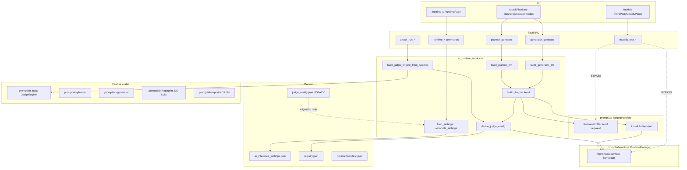

# PromptLab AI Runtime SSOT — Strict Architecture Audit

**Audit date:** 2026-06-13  
**Scope:** Source-code evidence only. No code modified.  
**Method:** Every claim cites `path:line` or is marked **NOT IMPLEMENTED**.

---

## SECTION 1 — Global AI Runtime

### 1. Where is the AI Runtime configuration stored?

| Layer | Location | Evidence |
|--------|-----------|----------|
| **Persisted global route** | `{data_dir}/ai_inference_settings.json` | `src-tauri/src/ai_inference_settings.rs:92-94` (`settings_path`) |
| **Struct** | `AiInferenceSettings` | `src-tauri/src/ai_inference_settings.rs:40-48` |
| **In-memory assembly** | `RuntimeConfigurationDto` built in `commands/runtime.rs` | `src-tauri/src/commands/runtime.rs:465-565` (`assemble_runtime_configuration`) |
| **Model catalog (not route)** | `{vault}/registry.json` | `crates/promptlab-models/src/registry.rs:32-34` |
| **Embedded llama.cpp install** | `{data_dir}/runtime/manifest.json` | `crates/promptlab-runtime/src/manifest.rs:67` |
| **Legacy (migration only)** | `{data_dir}/judge_config.json` | `src-tauri/src/judge_config.rs:15-16` |

### 2. Is there exactly ONE runtime configuration?

**NO (PARTIAL).**

- **One active inference route file:** `AiInferenceSettings` in `ai_inference_settings.json` (`ai_inference_settings.rs:40-48`, `92-94`).
- **Additional configuration surfaces still exist:**
  - Per-model entries in `registry.json` with provider/credentials metadata (`registry.rs:32-34`, `ModelEntry` via `promptlab-models`).
  - Llama.cpp lifecycle manifest (`manifest.rs:67`).
  - Legacy `judge_config.json` still readable for migration/audit (`judge_config.rs:15-16`, `125-128`).

### 3. Does it support Third-party API and Local API?

**YES.**

- `AiInferenceRoute::ThirdParty` / `Local` — `ai_inference_settings.rs:16-19`
- Route parsing: `ai_inference_settings.rs:29-35`
- Third-party path builds `RemoteLlmBackend` — `ai_runtime_service.rs:264-273`
- Local path uses `RuntimeSupervisor` + `LocalLlmBackend` — `ai_runtime_service.rs:275-303`

### 4. What fields exist?

| Field | Present? | Evidence |
|--------|----------|----------|
| **Mode** | YES (`route`) | `ai_inference_settings.rs:41` |
| **Provider** | Indirect (via selected model in registry) | `ai_runtime_service.rs:96-114` (`remote_settings_from_entry`) |
| **Model** | YES (`selected_model_id` + registry) | `ai_inference_settings.rs:42` |
| **Runtime** | Separate (`RuntimeManager` / manifest), not in `AiInferenceSettings` | `manager.rs:40-51`, `manifest.rs:67` |
| **Status** | YES (`status_label` in DTO) | `runtime.rs:478-551`, `RuntimeConfigurationDto` `runtime.rs:553-565` |
| **Health** | Partial (`connectivity`, `last_health_check`; not a dedicated `health` field on settings) | `ai_inference_settings.rs:45-47`; local health via `last_health` — `runtime.rs:532-548` |

`AiInferenceSettings` fields: `route`, `selected_model_id`, `initialized`, `third_party_connectivity`, `third_party_last_health_check` — `ai_inference_settings.rs:40-48`.

### 5. Can multiple runtime configurations exist?

**YES** — multiple persisted config artifacts:

1. `ai_inference_settings.json` — global route (`ai_inference_settings.rs:92-94`)
2. `registry.json` — N model entries (`registry.rs:32-34`)
3. `runtime/manifest.json` — embedded runtime (`manifest.rs:67`)
4. `judge_config.json` — legacy (`judge_config.rs:15-16`)

### 6. Can multiple active providers exist?

**NO** for inference route selection.

- Single `selected_model_id` on settings — `ai_inference_settings.rs:42`
- `runtime_set_inference_route` validates one model per route — `runtime.rs:808-818`

Registry may hold many models/providers; only one is selected for AI features.

### 7. Can different features select different providers?

**NO** for provider/model — all LLM paths read the same `ai_inference_settings` via `derive_judge_config` — `ai_runtime_service.rs:142-174`, `252-254`.

**YES** for algorithm bypass — planner/generator can skip LLM:

- Planner: `deterministic` vs `local_llm` — `planner.rs:45-49`, `115-134`
- Generator: `static_pack` / `template_mutation` vs `local_llm` — `generator.rs:54-59`, `162-181`

When `local_llm` is chosen, they use the **same** global runtime — `planner.rs:118-123`, `generator.rs:165-170`.

---

## SECTION 2 — Single Source of Truth (Per Feature)

### Judge Engine

| Question | Answer | Evidence |
|----------|--------|----------|
| How does it obtain inference? | `build_judge_engine_from_runtime` → `derive_judge_config` → `build_judge_engine` | `attack.rs:151-157`; `ai_runtime_service.rs:227-248` |
| Reads AI Runtime? | YES | `ai_runtime_service.rs:230-231` (`load_settings`, `reconcile_settings`) |
| Instantiates providers? | Indirect via `ai_runtime_service` (not in `attack.rs`) | `ai_runtime_service.rs:269-302` |
| Instantiates runtime? | YES (`prepare_local_runtime`) | `ai_runtime_service.rs:176-209`, `238-244` |
| Calls AI Service? | Calls `ai_runtime_service` module (no `AiService` struct) | `attack.rs:34`, `151-157` |

Fallback when not configured: deterministic engine — `ai_runtime_service.rs:233-234`.

### Attack Planner

| Question | Answer | Evidence |
|----------|--------|----------|
| LLM path | `build_planner_llm` when `PlannerMode::LocalLlm` | `planner.rs:115-128` |
| Reads AI Runtime? | YES (via `build_planner_llm` → `build_llm_backend`) | `ai_runtime_service.rs:334-336`, `252-254` |
| Instantiates providers? | NO in `planner.rs` | `planner.rs:12`, `118-123` |
| Deterministic path | No runtime | `planner.rs:130-133` |
| Agent scan path | Same via `agent_service.rs` | `agent_service.rs:98-127` |

### Payload Generator

| Question | Answer | Evidence |
|----------|--------|----------|
| LLM path | `build_generator_llm` when `GeneratorMode::LocalLlm` | `generator.rs:162-175` |
| Reads AI Runtime? | YES | `ai_runtime_service.rs:340-344`, `252-254` |
| Non-LLM modes | `static_pack`, `template_mutation` — no runtime | `generator.rs:54-59`, `177-180` |
| Agent path | `agent_service.rs:143-171` | Same pattern |

### Fingerprint Engine

| Question | Answer | Evidence |
|----------|--------|----------|
| Uses LLM inference? | **NO** | `fingerprint_service.rs:11-12` (`FingerprintEngine::fingerprint_stack`) |
| HTTP usage | Target probing only (`reqwest`) | `fingerprint_service.rs:15-35` |

**NOT IMPLEMENTED** as an AI-capability consumer of AI Runtime.

### Report Generator

| Question | Answer | Evidence |
|----------|--------|----------|
| Uses LLM? | **NO** | `domain.rs:237-240` (`ReportingEngine::generate` only) |
| AI Runtime reference | None in `report_generate_op` | `domain.rs:191-241` |

**NOT IMPLEMENTED** as LLM-backed feature.

### AI Summary

**NOT IMPLEMENTED** — no `ai_summary` / `AiSummary` symbols in `*.rs`, `*.ts`, `*.tsx`.

### Security Packs

**NOT IMPLEMENTED** — no `SecurityPack` / `security_pack` symbols in workspace.

---

## SECTION 3 — Dependency Direction

Expected: `Feature → AI Service → Runtime Manager → Provider Adapter → Provider`

**Actual:** `Feature (commands) → ai_runtime_service → {RemoteLlmBackend | LocalLlmBackend + RuntimeSupervisor} → HTTP/llama`

### Provider / HTTP occurrences in AI feature paths

| Location | Import / usage | Classification |
|----------|----------------|----------------|
| `ai_runtime_service.rs:17-19,269-302` | `RemoteLlmBackend`, `LocalLlmBackend`, `RuntimeSupervisor` | **VALID** (SSOT module) |
| `crates/promptlab-judge/src/providers/remote.rs:15,28` | `reqwest`, OpenAI/Anthropic/Gemini URLs | **VALID** (provider layer) |
| `crates/promptlab-judge/src/providers/local.rs:37-46` | `InferenceRuntime` | **VALID** |
| `commands/models.rs:288-291` | `test_connectivity` + ephemeral `JudgeProviderConfig` | **ARCHITECTURE VIOLATION** (bypasses SSOT) |
| `commands/models.rs:1086-1112` | Direct `RuntimeManager.supervisor().llama_runtime().infer` | **ARCHITECTURE VIOLATION** (bypasses `ai_runtime_service`) |
| `fingerprint_service.rs:16-35` | `reqwest` for target HTTP probe | **VALID** (non-AI inference) |
| `commands/discovery.rs:124` | `reqwest` for fingerprint probe | **VALID** (discovery infra) |
| `crates/promptlab-planner/src/deterministic.rs:150,158` | Provider name strings in rules | **VALID** (heuristics, not SDK) |
| `third_party_credentials.rs:295` | `load_judge_config` | **ARCHITECTURE VIOLATION** (legacy config read) |

No OpenAI/Anthropic/Gemini SDK imports in `promptlab-planner` or `promptlab-generator` crates.

---

## SECTION 4 — Provider Isolation

### Where are providers implemented?

| Provider | Location | Evidence |
|----------|----------|----------|
| OpenAI / Anthropic / Gemini / Bedrock / Azure / OpenRouter | `crates/promptlab-judge/src/providers/remote.rs` | `remote.rs:38-55`, `76-88` |
| Bedrock SigV4 | `crates/promptlab-judge/src/providers/bedrock_sigv4.rs` | `bedrock_sigv4.rs:209` |
| Local llama.cpp / Ollama | `crates/promptlab-judge/src/providers/local.rs` + `promptlab-models` runtime | `local.rs:37-46`; `ai_runtime_service.rs:293-296` |
| llama.cpp server HTTP | `crates/promptlab-runtime/src/runtime/llama_cpp_runtime.rs` | `llama_cpp_runtime.rs:71` |
| Ollama HTTP | `crates/promptlab-models/src/runtime/ollama.rs` | `ollama.rs:34,42` |

### Are they located ONLY inside Runtime layer?

**NO.**

- Remote/local LLM adapters live in **`promptlab-judge`** (`providers/`), not `promptlab-runtime`.
- `promptlab-runtime` owns embedded llama.cpp lifecycle/install (`manager.rs:1-2`, `121-140`).
- `ai_runtime_service` instantiates judge providers directly — `ai_runtime_service.rs:269-302`.

---

## SECTION 5 — Runtime Manager

`RuntimeManager` in `crates/promptlab-runtime/src/manager.rs`:

| Capability | Implemented? | Evidence |
|------------|--------------|----------|
| Load runtime config | YES | `manager.rs:121-140` (`bootstrap`, `RuntimeManifest::load`) |
| Switch providers | NO (inference route switching is in `runtime_set_inference_route`, not `RuntimeManager`) | `runtime.rs:765-818` |
| Create provider instance | NO (supervisor/launcher only) | `manager.rs:62`, `97-103` |
| Manage lifecycle | YES | `install` `223`; `start_runtime` `227`; `stop_runtime` `319` |
| Health check | YES | `run_health_check` `376-382` |
| Runtime detection | YES | `bootstrap` + hardware — `manager.rs:127` |
| Load model | YES | `load_model_at_path` `277` |

`RuntimeManager` manages **embedded llama.cpp**, not third-party cloud routing.

---

## SECTION 6 — AI Service

There is **no** `AiService` struct. The SSOT module is `src-tauri/src/ai_runtime_service.rs` (functions only) — `ai_runtime_service.rs:1-5`.

### Methods on `ai_runtime_service`

| Method | Exists? | Callers (production) |
|--------|---------|----------------------|
| `chat()` | **NOT IMPLEMENTED** | — |
| `complete()` | YES — `ai_runtime_service.rs:307-318` | **None** (no `ai_runtime_service::complete` callers) |
| `generate_json()` | **NOT IMPLEMENTED** | — |
| `embed()` | **NOT IMPLEMENTED** on service | `models_test_embeddings` IPC exists separately — `lib.rs:235` |
| `stream()` | **NOT IMPLEMENTED** | — |
| `health_check()` | YES — `ai_runtime_service.rs:321-330` | **None** (no external callers) |
| `build_judge_engine_from_runtime` | YES — `227-248` | `attack.rs:151-157` |
| `build_planner_llm` | YES — `334-336` | `planner.rs:118`; `agent_service.rs:115` |
| `build_generator_llm` | YES — `340-344` | `generator.rs:165`; `agent_service.rs:159` |
| `test_runtime_connectivity` | YES — `348-368` | `runtime.rs:866` |
| `test_runtime_model` | YES — `372-392` | `runtime.rs:881` |

Underlying `LlmBackend` trait: `complete`, `health_check` — `providers/mod.rs:7-13`.

---

## SECTION 7 — Feature Isolation

| Feature | Knows provider? | Knows runtime? | Knows model? | Knows endpoint? | Knows API key? |
|---------|-----------------|----------------|--------------|-----------------|----------------|
| **Judge** (`attack.rs`) | NO | NO (passes handles only) | NO | NO | NO |
| **Planner** (`promptlab-planner`) | NO | NO | NO | NO | NO |
| **Generator** (`promptlab-generator`) | NO | NO | NO | NO | NO |
| **Fingerprint** | NO (detects target providers in rules) | NO | NO | NO | NO |
| **Report** | NO | NO | NO | NO | NO |

Planner LLM bridge only calls `LlmBackend::complete` — `planner_service.rs:20-25`.

**Exception (desktop commands, not feature crates):** `commands/models.rs` builds `JudgeProviderConfig` with `api_key` for connectivity tests — `models.rs:315-335`.

---

## SECTION 8 — UI Audit

### One AI Runtime page?

**YES** — nav: `src/app/router/nav.ts:18` (`/runtime`); page: `src/features/runtime/AIRuntimePage.tsx:1-32`.

### Separate Judge / Planner / Generator configuration pages?

| UI | Exists? | Evidence |
|----|---------|----------|
| Judge Configuration page | **NO** (removed from nav) | `nav.ts:18-19` (only `runtime`, `models`) |
| Planner provider config | **NO** — algorithm buttons only | `AttackPlanStep.tsx:210-225` |
| Generator provider config | **NO** — mode buttons only | `AttackPlanStep.tsx:260-283` |
| Model Selection (global) | YES — AI Runtime page + Models registry | `AIRuntimePage.tsx:113-120`; `ModelsPage.tsx:486` |
| Provider Selection outside Runtime | YES — **Models** third-party panel | `ThirdPartyModelsPanel.tsx:86-87`, `139-155` |
| Settings AI Runtime card | YES | `SettingsPage.tsx:197-206` |
| Legacy judge config in Settings | Audit label only (secrets migration) | `SettingsPage.tsx:67-68`, `93-94` |

Models page configures per-model provider credentials; AI Runtime selects which registered model is active — `AIRuntimePage.tsx:118`.

---

## SECTION 9 — Dashboard Audit

`DashboardPage.tsx` uses only `AiRuntimeDashboardCard` — `DashboardPage.tsx:89`; no separate Judge/Local Models cards.

### `AiRuntimeDashboardCard` fields

| Field | Shown? | Evidence |
|-------|--------|----------|
| Mode | YES | `AiRuntimeDashboardCard.tsx:43-44` |
| Runtime | YES (local only) | `52-56` |
| Model | YES (local only) | `58-62` |
| Status | YES | `47-48` |
| Health | **NO** dedicated label; `connectivity` / `lastHealthCheck` exist on DTO but not rendered on card | DTO: `runtime.ts:123-124`; card stops at Status/Provider |

### Legacy dashboard elements

| Element | Present? |
|---------|----------|
| Local Models card | **NO** |
| Judge Config card | **NO** |
| Legacy runtime card | **NO** |

---

## SECTION 10 — Database Audit

### Tables matching audit keywords (`001_initial_schema.sql`)

| Table / artifact | Relevance | Status |
|------------------|-----------|--------|
| `models` (SQLite) | `id`, `name`, `metadata_json` — no provider column | **LEGACY / UNUSED** in desktop app — `001_initial_schema.sql:131-141`; no `src-tauri` usage of `ModelRepository` |
| `playbook_json` on `scans` | May store planner/generator **algorithm** mode in UI state | **ACTIVE** (scan data) — `001_initial_schema.sql:31` |
| `reports.metadata_json` | Report metadata, not AI config | **ACTIVE** (non-AI) |
| No `judge` / `planner` / `generator` / `runtime` config tables | — | N/A |

### File-based (primary for AI)

| File | Purpose | Status |
|------|---------|--------|
| `ai_inference_settings.json` | Global AI route | **ACTIVE** |
| `{vault}/registry.json` | Model catalog + per-model provider metadata | **ACTIVE** |
| `runtime/manifest.json` | llama.cpp install | **ACTIVE** |
| `judge_config.json` | Legacy judge settings | **LEGACY** (`judge_config.rs:1-3`, `15-16`) |

---

## SECTION 11 — IPC Audit

### AI Runtime IPC (`lib.rs:240-258`)

`runtime_status`, `runtime_install`, `runtime_repair`, `runtime_start`, `runtime_stop`, `runtime_delete`, `runtime_load_model`, `runtime_unload_model`, `runtime_restart`, `runtime_health`, `runtime_benchmark`, `runtime_logs`, `runtime_hardware`, `hardware_refresh`, `runtime_configuration`, `runtime_inference_settings`, `runtime_set_inference_route`, `runtime_test_connectivity`, `runtime_test_inference`

### Judge IPC

**NONE** — no `judge_*` in `lib.rs:177-266`.

### Planner IPC

- `planner_generate` — `lib.rs:238`
- Request includes `mode` (algorithm, not provider) — `planner.rs:18-21`, `planner.ts:5-8`

### Generator IPC

- `generator_generate` — `lib.rs:239`
- Request includes `mode` — `generator.rs:18-23`, `generator.ts:5-10`

### Does feature IPC expose provider selection?

| IPC | Provider selection? |
|-----|---------------------|
| Planner | **NO** — `mode: deterministic \| local_llm` only |
| Generator | **NO** — `mode: static_pack \| template_mutation \| local_llm` |
| Models | **YES** — `models_save_third_party`, `models_test_third_party` — `lib.rs:220-223` |
| Runtime | **YES** — `runtime_set_inference_route` with `selectedModelId` — `runtime.ts:111-114`, `runtime.rs:765-818` |

---

## SECTION 12 — Configuration Audit (Key Occurrences)

| File | Lines | Purpose | Status |
|------|-------|---------|--------|
| `ai_inference_settings.rs` | 40-48, 92-94 | Global AI route persistence | **ACTIVE** |
| `ai_runtime_service.rs` | 142-174 | Ephemeral `JudgeProviderConfig` from runtime | **ACTIVE** |
| `judge_config.rs` | 15-16, 125-128 | Legacy file I/O | **LEGACY** |
| `registry.rs` | 32-34 | Model vault registry | **ACTIVE** |
| `manifest.rs` | 67 | llama.cpp manifest | **ACTIVE** |
| `commands/models.rs` | 315-335 | Ephemeral judge config for model test | **DUPLICATED** |
| `third_party_credentials.rs` | 295 | Reads legacy judge config | **LEGACY** |
| `runtime.rs` | 765-818 | Route switching | **ACTIVE** |
| `SettingsPage.tsx` | 197-206 | Points to single runtime | **ACTIVE** |
| `AttackPlanStep.tsx` | 210-225, 260-283 | Algorithm mode UI | **ACTIVE** (not provider) |

---

## SECTION 13 — Import Audit

| Package | Primary locations | Classification |
|---------|-------------------|----------------|
| `reqwest` | `promptlab-judge/providers/remote.rs:15`; `promptlab-runtime/llama_cpp_runtime.rs:71`; `fingerprint_service.rs:16`; `promptlab-discovery`, `promptlab-models` download | **Runtime / Infrastructure** |
| OpenAI/Anthropic/Gemini | String URLs in `remote.rs:39-42` — no official SDK | **Runtime Layer** (`promptlab-judge`) |
| Ollama | `promptlab-models/runtime/ollama.rs`; `ai_runtime_service.rs:58` | **Runtime Layer** |
| llama.cpp | `promptlab-runtime` supervisor | **Runtime Layer** |

**Architecture violations:** `commands/models.rs:288-291` (judge connectivity bypass); `commands/models.rs:1086-1112` (direct infer bypass).

No `ureq`, `hyper`, or `awc` in AI inference paths.

---

## SECTION 14 — Forbidden Check (AI Features)

| Forbidden action | Found? | Evidence |
|------------------|--------|----------|
| Instantiate provider in Judge/Planner/Generator crates | NO | Uses `PlannerLlm` / `GeneratorLlm` / `build_*_from_runtime` |
| Instantiate runtime in feature crates | NO | Handles passed from `AppState` |
| Read API key in feature crates | NO | Credentials in `ai_runtime_service.rs:80-93` |
| Read runtime config in feature crates | NO | Centralized in `ai_runtime_service` |
| Read selected provider/model in feature crates | NO | — |
| HTTP inference in feature crates | NO | — |

**Violations outside feature crates:**

- `models.rs:288-291` — ephemeral provider config + `test_connectivity`
- `models.rs:1086-1112` — direct llama inference
- `third_party_credentials.rs:295` — `load_judge_config`

---

## SECTION 15 — Actual Architecture Diagram

---

## SECTION 16 — Compliance Matrix

| Requirement | Result | Notes |
|-------------|--------|-------|
| Exactly one AI Runtime | **PARTIAL** | One route file; plus registry, manifest, legacy judge file |
| Single Source of Truth | **PARTIAL** | Judge/planner/generator LLM paths use SSOT; models test paths bypass |
| Unified AI Service | **PARTIAL** | Module exists; no `chat`/`stream`/`embed`; `complete`/`health_check` unused |
| Provider isolation | **PARTIAL** | Providers in `promptlab-judge`, not solely `promptlab-runtime` |
| Runtime abstraction | **PARTIAL** | Third-party bypasses `RuntimeManager` |
| Feature isolation | **PASS** | Feature crates don't touch providers |
| No duplicated configuration | **FAIL** | `models.rs` ephemeral `JudgeProviderConfig`; registry + settings |
| No provider leakage | **PARTIAL** | Models IPC + credentials legacy read |
| No feature override | **PARTIAL** | No per-feature provider; algorithm modes bypass LLM |
| No provider SDK in feature modules | **PASS** | Violations in `commands/models.rs` only |

---

## SECTION 17 — Gap Analysis

### Critical

1. **Models connectivity/inference bypass SSOT** — `models.rs:288-291`, `1086-1112` call judge/runtime directly instead of `ai_runtime_service`.

### High

2. **Multiple configuration stores** — `ai_inference_settings.json` + `registry.json` + `runtime/manifest.json` + legacy `judge_config.json` (`judge_config.rs:15-16`).
3. **`complete()` / `health_check()` on SSOT are dead code** — no callers (`ai_runtime_service.rs:307-330`).
4. **Legacy `load_judge_config` still used** — `third_party_credentials.rs:295`.

### Medium

5. **Provider implementations split across `promptlab-judge` and `promptlab-runtime`** — not a single runtime layer (`remote.rs` vs `manager.rs`).
6. **Models page is a second provider configuration surface** — `ThirdPartyModelsPanel.tsx:86-155` independent of `/runtime`.
7. **Dashboard card omits Health** — DTO has `connectivity`/`lastHealthCheck` (`runtime.ts:123-124`) but card does not render them (`AiRuntimeDashboardCard.tsx:47-72`).

### Low

8. **SQLite `models` table unused by desktop** — `001_initial_schema.sql:131-141`.
9. **AI Summary / Security Packs** — **NOT IMPLEMENTED**.
10. **Report generator** — no AI integration (`domain.rs:237-240`).

---

## SECTION 18 — Architecture Score

| Area | Score /10 | Rationale |
|------|-----------|-----------|
| AI Runtime | **6** | Single route file; legacy + multi-file config remain |
| AI Service | **5** | SSOT module works for 3 features; incomplete API, dead methods |
| Provider Layer | **7** | Centralized in `promptlab-judge`; bypass in models commands |
| Feature Isolation | **8** | Crates clean; desktop commands less so |
| UI | **7** | One runtime page; Models duplicates provider UX |
| IPC | **7** | No judge IPC; models IPC exposes provider setup |
| Database | **8** | AI config file-based; SQLite models table legacy |
| **Overall** | **6.5** | SSOT migration largely done; bypasses and duplication remain |

---

## SECTION 19 — Refactoring Suggestions (Evidence-Backed Only)

1. **Route `models_test_third_party` / `models_test_connection` through `test_runtime_connectivity` or a models-specific wrapper that builds config only from `AiInferenceSettings` + registry entry** — eliminates duplicate path at `models.rs:288-291` vs `ai_runtime_service.rs:348-368`.

2. **Route `models_test_inference` through `test_runtime_model` or `build_llm_backend().complete()`** — removes direct `RuntimeManager` infer at `models.rs:1086-1112`.

3. **Remove `load_judge_config` from `third_party_credentials.rs:295`** after confirming migration; use registry metadata only (aligns with `judge_config.rs:1-3` intent).

4. **Wire dashboard card to `connectivity` / `lastHealthCheck`** from `RuntimeConfigurationDto` (`runtime.ts:123-124`, `runtime.rs:532-548`) — UI gap at `AiRuntimeDashboardCard.tsx:47-72`.

5. **Delete or connect `ai_runtime_service::complete` and `health_check`** (`307-330`) — either expose via IPC or remove unused surface.

6. **Document or drop SQLite `models` table** — unused in `src-tauri`; active registry is `registry.json:32-34`.

---

## Executive Summary

PromptLab has a **real SSOT module** (`ai_runtime_service.rs`) backed by **`ai_inference_settings.json`**, and **Judge, Planner, and Generator LLM paths read it**. Legacy judge IPC/UI are removed (`lib.rs:177-266`, `nav.ts:18-19`).

Compliance is **PARTIAL**, not full:

- Models test commands **bypass SSOT**
- Legacy `judge_config.json` **still exists** for migration/audit
- Provider code lives in **`promptlab-judge`**, not exclusively in runtime layer
- **Fingerprint / Report / AI Summary / Security Packs** do not use AI Runtime (non-LLM or **NOT IMPLEMENTED**)

**Overall architecture score: 6.5 / 10**
