# PromptLab Architecture

**Version:** 1.0  
**Status:** Draft  
**Last Updated:** 2026-06-10

---

## Executive Summary

PromptLab is an offline-first, cross-platform desktop application for AI security testing. It provides a unified workbench for assessing LLM applications, chatbots, AI agents, agentic workflows, MCP servers, and RAG systems. The product combines local inference (llama.cpp), browser automation (Playwright), structured test orchestration (Rust), and a modern UI (React + Tauri) with durable local storage (SQLite).

Design principles:

| Principle | Description |
|-----------|-------------|
| Offline-first | Core workflows run without network; cloud is optional for model sync and updates |
| Local data sovereignty | Findings, payloads, and target data stay on disk under user control |
| Extensibility | Plugin system for custom scanners, payloads, and report formats |
| Defense in depth | Sandboxed execution, capability-based IPC, signed updates |
| Auditability | Immutable run logs, reproducible test configurations, exportable evidence |

Supported platforms: **Windows**, **macOS**, **Linux**.

---

## 1. Product Architecture

### 1.1 Product Layers

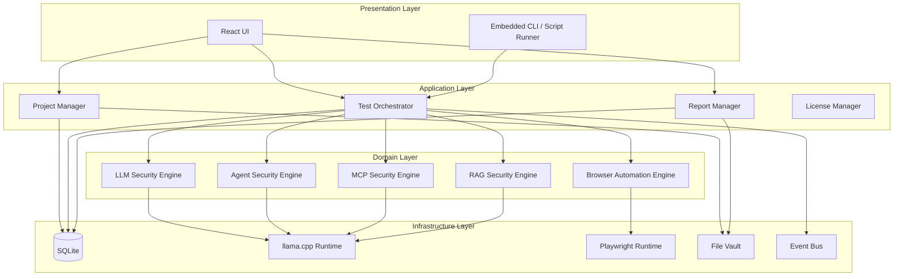

### 1.2 Core User Journeys

| Journey | Description |
|---------|-------------|
| **Target onboarding** | Import OpenAPI spec, MCP manifest, RAG corpus metadata, or browser URL; classify attack surface |
| **Test design** | Select playbook (prompt injection, jailbreak, tool abuse, data exfiltration, RAG poisoning); configure scope and safety bounds |
| **Execution** | Run locally with llama.cpp for adversarial generation; Playwright for UI chatbots; direct HTTP/MCP for API targets |
| **Analysis** | Correlate findings, severity scoring, evidence capture, diff against baseline |
| **Reporting** | Export PDF/HTML/JSON/SARIF; redact sensitive data; attach reproducible configs |

### 1.3 Deployment Topology

PromptLab ships as a **single installable bundle** per platform:

```
┌─────────────────────────────────────────────────────────┐
│                    PromptLab Desktop App                     │
│  ┌─────────────┐  ┌─────────────┐  ┌─────────────────┐  │
│  │ Tauri Shell │  │ React UI    │  │ Rust Core       │  │
│  │ (WebView)   │◄─┤ (Frontend)  │◄─┤ (Backend)       │  │
│  └─────────────┘  └─────────────┘  └────────┬────────┘  │
│                                              │           │
│  ┌──────────────┐  ┌──────────────┐  ┌──────▼───────┐  │
│  │ llama.cpp    │  │ Playwright   │  │ SQLite DB    │  │
│  │ (bundled)    │  │ (bundled)    │  │ + File Vault │  │
│  └──────────────┘  └──────────────┘  └──────────────┘  │
└─────────────────────────────────────────────────────────┘
         │ optional                    │ optional
         ▼                             ▼
   Model Registry CDN            Update Server (signed)
```

No server component is required for daily operation. Optional cloud services support model downloads, license validation, and delta updates.

### 1.4 Commercial Boundaries

| Tier | Capabilities |
|------|--------------|
| **Community** | Single project, built-in playbooks, local models, basic reports |
| **Professional** | Unlimited projects, custom playbooks, plugin SDK, SARIF export, team vault |
| **Enterprise** | SSO license proxy, air-gapped update bundles, audit log forwarding, custom signing |

License enforcement runs in the Rust core; UI reflects entitlements via IPC.

---

## 2. Component Architecture

### 2.1 Component Map

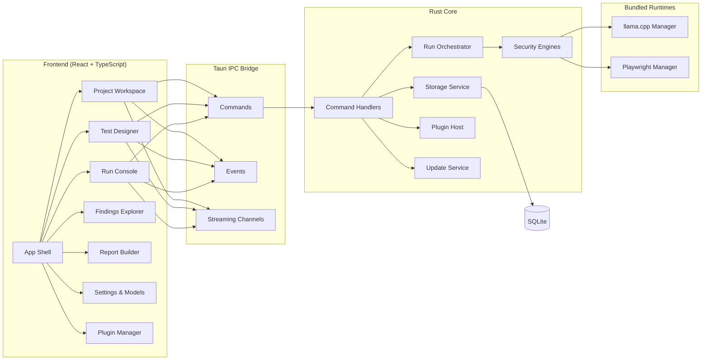

### 2.2 Component Responsibilities

#### Frontend Components

| Component | Responsibility |
|-----------|----------------|
| **App Shell** | Navigation, layout, theme, global state (Zustand), error boundaries |
| **Project Workspace** | Target inventory, tags, scope definitions, environment profiles |
| **Test Designer** | Visual + YAML playbook editor, payload libraries, guardrail config |
| **Run Console** | Live logs, streaming LLM output, abort/pause, resource meters |
| **Findings Explorer** | Triage, deduplication, CVSS-like AI risk scoring, evidence viewer |
| **Report Builder** | Template selection, redaction rules, export pipeline trigger |
| **Settings & Models** | llama.cpp model management, GPU prefs, proxy, update channel |
| **Plugin Manager** | Install/enable/disable plugins, capability review |

#### Backend Services

| Service | Responsibility |
|---------|----------------|
| **Command Handlers** | Tauri command surface; input validation; authz checks |
| **Run Orchestrator** | DAG scheduling, concurrency limits, cancellation, checkpoint/resume |
| **Security Engines** | Domain-specific test execution (see §4) |
| **Storage Service** | Migrations, repositories, file vault, encryption at rest |
| **Plugin Host** | WASM/native plugin loading, sandbox, API surface |
| **Update Service** | Signature verification, staged rollout, rollback |

#### Runtime Managers

| Manager | Responsibility |
|---------|----------------|
| **llama.cpp Manager** | Model load/unload, context windows, batch inference, GPU backend selection |
| **Playwright Manager** | Browser pool, profile isolation, HAR capture, screenshot/video artifacts |

### 2.3 Engine Specialization

Each security engine implements a common trait contract:

```
SecurityEngine
├── discover()      → attack surface enumeration
├── plan()          → generate test matrix from playbook
├── execute()       → run probes with budget limits
├── evaluate()      → classify responses, detect violations
└── collect()       → structured findings + evidence
```

Engines:

| Engine | Target Types | Primary Techniques |
|--------|--------------|-------------------|
| **LLM Engine** | REST/gRPC LLM APIs | Prompt injection, jailbreaks, system prompt leak, PII exfiltration |
| **Chatbot Engine** | Web UI chatbots | Playwright interaction, DOM injection, session fixation, multi-turn attacks |
| **Agent Engine** | Tool-using agents | Tool invocation abuse, privilege escalation, goal hijacking, loop traps |
| **Workflow Engine** | Multi-step agentic flows | State corruption, handoff attacks, planner manipulation |
| **MCP Engine** | MCP servers | Tool schema abuse, resource poisoning, auth bypass, cross-server pivot |
| **RAG Engine** | Vector stores + retrievers | Corpus poisoning, context injection, retrieval bypass, citation forgery |

---

## 3. Data Flow Diagrams

### 3.1 Test Run Lifecycle

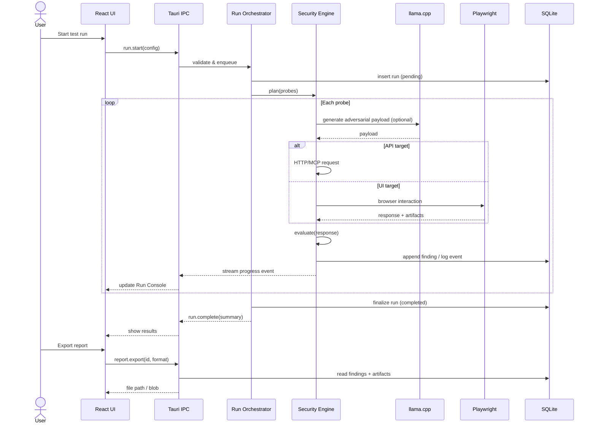

### 3.2 Offline Model Management

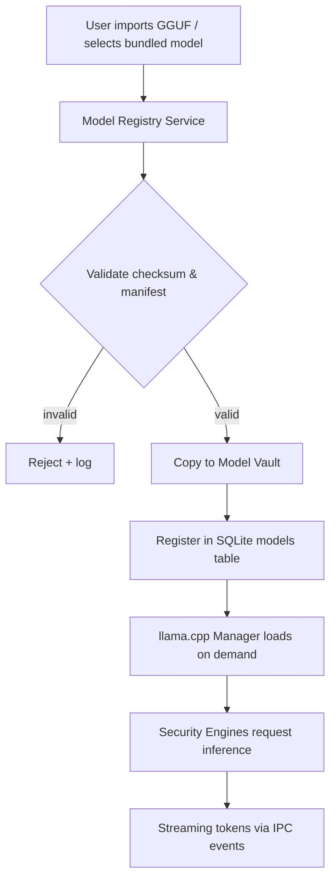

Models never leave the local vault unless the user explicitly exports them.

### 3.3 Plugin Execution Flow

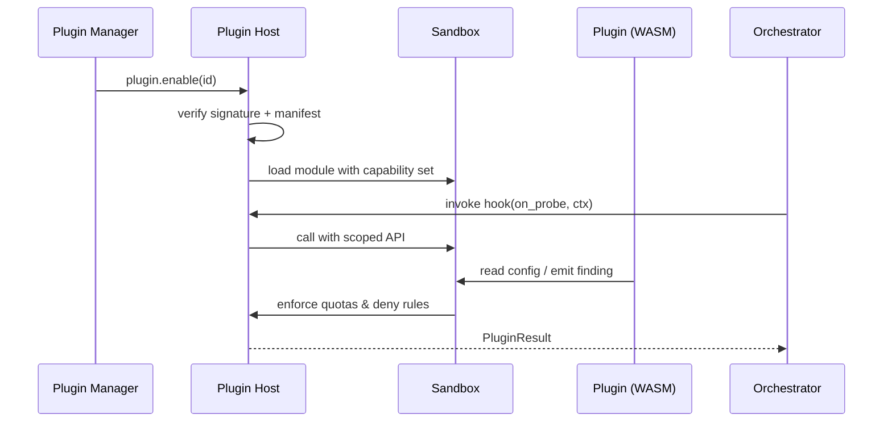

### 3.4 Report Export Flow

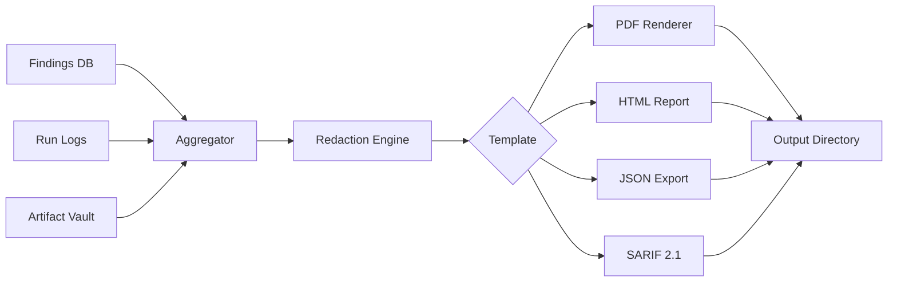

---

## 4. Module Breakdown

### 4.1 Frontend Modules

| Module | Path (conceptual) | Purpose |
|--------|-------------------|---------|
| `app` | Shell, routing, providers | Application bootstrap |
| `features/projects` | CRUD, scope, targets | Project management |
| `features/designer` | Playbook editor, Monaco/YAML | Test authoring |
| `features/runs` | Console, streaming hooks | Execution monitoring |
| `features/findings` | Tables, filters, diff view | Vulnerability triage |
| `features/reports` | Templates, preview, export | Deliverables |
| `features/models` | Model catalog, GPU settings | Local AI config |
| `features/plugins` | Marketplace UI, permissions | Extension management |
| `shared/ui` | Design system components | Consistent UX |
| `shared/ipc` | Typed Tauri bindings | Command/event wrappers |
| `shared/state` | Zustand stores | Client state |

### 4.2 Backend Modules (Rust)

| Module | Crate | Purpose |
|--------|-------|---------|
| `commands` | `promptlab-app` | Tauri command definitions |
| `orchestrator` | `promptlab-orchestrator` | Run scheduling, DAG, checkpoints |
| `engines/llm` | `promptlab-engine-llm` | API-level LLM testing |
| `engines/chatbot` | `promptlab-engine-chatbot` | Playwright-driven UI testing |
| `engines/agent` | `promptlab-engine-agent` | Single-agent tool abuse |
| `engines/workflow` | `promptlab-engine-workflow` | Multi-agent orchestration tests |
| `engines/mcp` | `promptlab-engine-mcp` | MCP protocol security |
| `engines/rag` | `promptlab-engine-rag` | Retrieval pipeline testing |
| `inference` | `promptlab-inference` | llama.cpp FFI wrapper |
| `browser` | `promptlab-browser` | Playwright subprocess manager |
| `storage` | `promptlab-storage` | SQLite + migrations + repos |
| `vault` | `promptlab-vault` | Encrypted artifact storage |
| `plugins` | `promptlab-plugin-host` | Plugin lifecycle + sandbox |
| `update` | `promptlab-update` | Signed update pipeline |
| `license` | `promptlab-license` | Entitlement verification |
| `telemetry` | `promptlab-telemetry` | Local-only metrics (opt-in export) |

### 4.3 Shared Contracts

| Contract | Format | Consumers |
|----------|--------|-----------|
| Playbook schema | YAML + JSON Schema | Designer, Orchestrator, Plugins |
| Finding schema | JSON (internal) + SARIF (export) | Engines, Reports, Plugins |
| Target descriptor | JSON | All engines |
| Plugin manifest | TOML | Plugin Host, UI |
| Model manifest | JSON | Inference, Settings |

---

## 5. Folder Structure

```
promptlab/
├── apps/
│   └── desktop/                    # Tauri application root
│       ├── src-tauri/              # Rust backend entry + Tauri config
│       │   ├── src/
│       │   │   ├── main.rs
│       │   │   ├── commands/       # IPC command handlers
│       │   │   ├── setup/          # Bootstrap, tray, menus
│       │   │   └── state.rs        # AppState
│       │   ├── capabilities/       # Tauri v2 capability files
│       │   ├── icons/
│       │   └── tauri.conf.json
│       └── ui/                     # React frontend
│           ├── src/
│           │   ├── app/
│           │   ├── features/
│           │   ├── shared/
│           │   └── main.tsx
│           ├── index.html
│           └── package.json
│
├── crates/                         # Rust workspace members
│   ├── promptlab-core/                 # Shared types, errors, traits
│   ├── promptlab-orchestrator/
│   ├── promptlab-inference/
│   ├── promptlab-browser/
│   ├── promptlab-storage/
│   ├── promptlab-vault/
│   ├── promptlab-plugin-host/
│   ├── promptlab-update/
│   ├── promptlab-license/
│   ├── promptlab-telemetry/
│   └── engines/
│       ├── promptlab-engine-llm/
│       ├── promptlab-engine-chatbot/
│       ├── promptlab-engine-agent/
│       ├── promptlab-engine-workflow/
│       ├── promptlab-engine-mcp/
│       └── promptlab-engine-rag/
│
├── packages/                       # Shared non-Rust assets
│   ├── playbook-schema/            # JSON Schema + examples
│   ├── finding-schema/
│   ├── plugin-sdk/                 # TypeScript + Rust plugin API types
│   └── ui-tokens/                  # Design tokens
│
├── plugins/                        # First-party plugins (reference)
│   ├── owasp-llm-top10/
│   └── garak-adapter/
│
├── playbooks/                      # Built-in test playbooks
│   ├── llm/
│   ├── agent/
│   ├── mcp/
│   └── rag/
│
├── resources/                      # Bundled runtime assets
│   ├── llama/                      # llama.cpp binaries per target triple
│   ├── playwright/                 # Browser bundles
│   └── models/                     # Optional starter model manifests (not weights)
│
├── docs/
│   ├── ARCHITECTURE.md
│   ├── IPC.md
│   ├── PLUGIN_SDK.md
│   └── THREAT_MODEL.md
│
├── scripts/
│   ├── bundle-runtimes.sh
│   ├── sign-update.sh
│   └── release/
│
├── Cargo.toml                      # Workspace root
├── package.json                    # pnpm/turbo monorepo root
├── turbo.json
└── README.md
```

### 5.1 User Data Directory (Runtime)

Platform-specific application data (not in repo):

| OS | Default Path |
|----|--------------|
| macOS | `~/Library/Application Support/com.promptlab.desktop/` |
| Windows | `%APPDATA%\PromptLab\` |
| Linux | `~/.local/share/promptlab/` |

Contents:

```
<app-data>/
├── promptlab.db                 # SQLite primary database
├── vault/                   # Encrypted artifacts (screenshots, HARs, responses)
├── models/                  # GGUF model files
├── plugins/                 # Installed third-party plugins
├── logs/                    # Structured application logs
├── cache/                   # Playwright profiles, temp inference buffers
└── updates/                 # Staged update packages
```

---

## 6. Rust Crate Structure

### 6.1 Workspace Layout

```toml
# Cargo.toml (workspace root)
[workspace]
members = [
    "apps/desktop/src-tauri",
    "crates/promptlab-core",
    "crates/promptlab-orchestrator",
    "crates/promptlab-inference",
    "crates/promptlab-browser",
    "crates/promptlab-storage",
    "crates/promptlab-vault",
    "crates/promptlab-plugin-host",
    "crates/promptlab-update",
    "crates/promptlab-license",
    "crates/promptlab-telemetry",
    "crates/engines/*",
]
resolver = "2"
```

### 6.2 Crate Dependency Graph

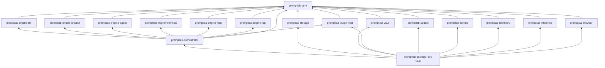

### 6.3 Crate Specifications

#### `promptlab-core`

Foundation crate. No Tauri dependency.

- Error types (`PromptLabError`)
- Domain models: `Project`, `Target`, `Playbook`, `Run`, `Finding`, `Evidence`
- Traits: `SecurityEngine`, `Probe`, `Evaluator`, `PluginHook`
- Config primitives, IDs (UUID v7), timestamps

#### `promptlab-orchestrator`

- Run DAG builder from playbook
- Worker pool with configurable concurrency
- Probe budget enforcement (max requests, tokens, duration)
- Checkpoint/resume via SQLite run state
- Event emission to Tauri

#### `promptlab-inference`

- Subprocess or FFI bridge to llama.cpp
- Model lifecycle: load, infer, unload
- Streaming token channel
- Backend abstraction: CPU, CUDA, Metal, Vulkan

#### `promptlab-browser`

- Playwright driver as managed subprocess
- Isolated browser contexts per run
- Artifact capture: screenshot, video, HAR, DOM snapshot
- Network interception for API discovery

#### `promptlab-storage`

- `sqlx` + SQLite with embedded migrations (`refinery` or `sqlx migrate`)
- Repository pattern per aggregate
- Full-text search on findings (FTS5)

#### `promptlab-vault`

- AES-256-GCM encrypted blob store for sensitive artifacts
- Key derived from OS keychain (Windows DPAPI, macOS Keychain, Linux libsecret)
- Content-addressed storage (SHA-256)

#### `promptlab-plugin-host`

- WASM runtime (Wasmtime) for sandboxed plugins; optional native plugins for enterprise (signed)
- Capability tokens: `probe:mutate`, `finding:emit`, `http:request` (scoped)
- Resource limits: memory, CPU time, network allowlist

#### `promptlab-update`

- Tauri updater integration
- Ed25519 signature verification
- Delta patch application
- Rollback on failed migration

#### `promptlab-license`

- Offline license file validation (JWT or custom signed blob)
- Optional online refresh with grace period
- Feature flag derivation

#### Engine Crates

Each engine crate depends on `promptlab-core` and relevant infrastructure:

| Crate | Key Dependencies |
|-------|------------------|
| `promptlab-engine-llm` | `reqwest`, `promptlab-inference` |
| `promptlab-engine-chatbot` | `promptlab-browser`, `promptlab-inference` |
| `promptlab-engine-agent` | `promptlab-inference`, tool simulators |
| `promptlab-engine-workflow` | orchestration graph, `promptlab-engine-agent` |
| `promptlab-engine-mcp` | MCP JSON-RPC client, schema validator |
| `promptlab-engine-rag` | embedding hooks, corpus fixtures, `promptlab-inference` |

---

## 7. IPC Architecture

### 7.1 Tauri IPC Model

PromptLab uses **Tauri v2** with explicit capability files. All frontend→backend communication flows through typed commands; backend→frontend uses events and streaming channels.

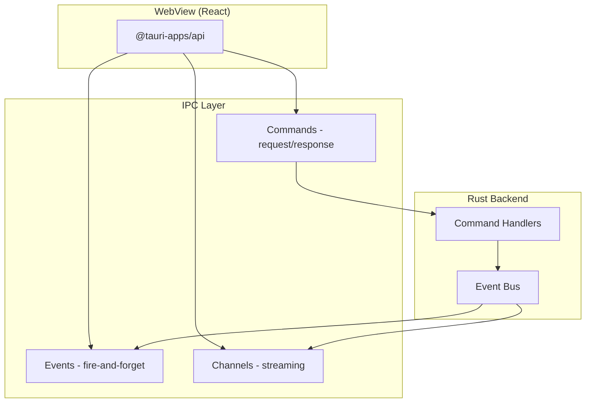

### 7.2 Command Categories

| Namespace | Examples | Auth |
|-----------|----------|------|
| `project.*` | `list`, `create`, `import_target` | User |
| `playbook.*` | `validate`, `save`, `list_builtin` | User |
| `run.*` | `start`, `pause`, `cancel`, `status` | User |
| `finding.*` | `list`, `update_status`, `export` | User |
| `model.*` | `list`, `import`, `delete`, `benchmark` | User |
| `plugin.*` | `list`, `install`, `enable`, `disable` | User + capability review |
| `report.*` | `generate`, `preview` | User |
| `settings.*` | `get`, `set` | User |
| `update.*` | `check`, `install` | Admin gate on enterprise |
| `license.*` | `status`, `activate` | User |

### 7.3 Streaming Patterns

Long-running operations use **Tauri channels** or incremental events:

| Stream | Event | Payload |
|--------|-------|---------|
| Run progress | `run:progress` | `{ run_id, probe_id, phase, percent }` |
| LLM tokens | `inference:token` | `{ run_id, delta }` |
| Browser log | `browser:log` | `{ level, message }` |
| Finding discovered | `finding:new` | `{ finding }` |

Frontend subscribes once per active run; unsubscribes on completion or navigation.

### 7.4 Type Safety

- Rust structs derive `serde` + `specta` (or `ts-rs`) for TypeScript binding generation
- Generated types live in `packages/plugin-sdk` and `ui/shared/ipc/generated`
- CI fails on schema drift

### 7.5 Capability Security (Tauri v2)

Separate capability files per window:

| Capability File | Permissions |
|-----------------|-------------|
| `main-window.json` | Standard commands, read app data |
| `designer-window.json` | File read for playbook import |
| `updater.json` | Update install only (elevated prompt) |

Dangerous operations (raw shell, arbitrary file write outside app data) are **not exposed** to the WebView.

### 7.6 IPC Sequence: Start Run

```
React                  Tauri IPC              Orchestrator
  │  invoke(run.start)      │                       │
  │────────────────────────►│  validate + persist   │
  │                         │──────────────────────►│
  │                         │                       │ spawn workers
  │  listen(run:progress)   │◄── emit events ───────│
  │◄────────────────────────│                       │
  │  listen(finding:new)    │◄── emit events ───────│
  │◄────────────────────────│                       │
  │  invoke(run.status)     │                       │
  │────────────────────────►│──────────────────────►│
  │◄────────────────────────│  RunSummary           │
```

---

## 8. Security Architecture

### 8.1 Threat Model Summary

| Threat | Mitigation |
|--------|------------|
| Malicious target compromises tester | Sandboxed browser contexts; network egress allowlists; probe budget limits |
| Adversarial model output escapes sandbox | Output sanitization before UI render; no `dangerouslySetInnerHTML` |
| Plugin executes arbitrary code | WASM sandbox default; signed native plugins enterprise-only; capability tokens |
| SQLite / vault tampering | OS keychain-backed encryption; optional HMAC on critical rows |
| Update supply chain attack | Ed25519 signatures; reproducible builds; staged rollout |
| Credential leakage in reports | Redaction engine; vault references instead of inline secrets |
| IPC privilege escalation | Tauri capabilities; command-level authz; no shell from WebView |

### 8.2 Trust Boundaries

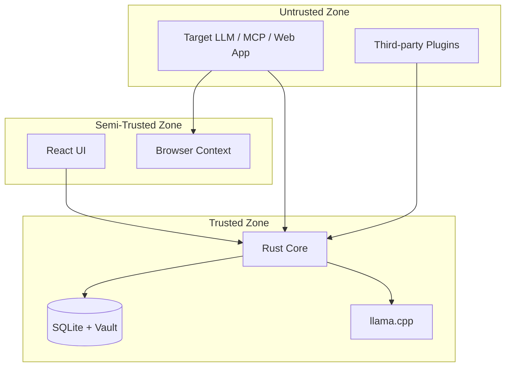

### 8.3 Secrets Management

| Secret Type | Storage |
|-------------|---------|
| API keys for targets | OS keychain via `keyring` crate; reference by ID in SQLite |
| Vault encryption key | OS keychain; never in config files |
| License key | Encrypted file + optional keychain |
| Update signing keys | Vendor-only; public key embedded in binary |

### 8.4 Sandboxing

| Component | Isolation |
|-----------|-----------|
| Playwright | Separate OS process; ephemeral profile; `--no-sandbox` disabled in production builds |
| llama.cpp | Subprocess with memory limits; no network |
| WASM plugins | Wasmtime with WASI; no filesystem except plugin dir |
| Native plugins | Separate `.so`/`.dll` with symbol restrictions; enterprise + signature required |

### 8.5 Network Policy

Default: **deny all outbound** except:

- User-configured target endpoints (per project allowlist)
- Optional update server (explicit opt-in)
- Optional license refresh URL

Enterprise mode supports full air-gap: updates via signed USB bundle import.

### 8.6 Audit Logging

Immutable append-only log table:

```
audit_events(id, timestamp, actor, action, resource, metadata_json, prev_hash, hash)
```

Hash chain detects tampering. Exportable for compliance.

### 8.7 Secure Development Lifecycle

- `cargo audit`, `npm audit` in CI
- SAST on Rust (`clippy` + custom lints for `unsafe`)
- Dependency pinning with `cargo-deny`
- Penetration test scope includes IPC surface and plugin host

---

## 9. Update Architecture

### 9.1 Update Channels

| Channel | Audience | Frequency |
|---------|----------|-----------|
| `stable` | Production users | Monthly / critical patches |
| `beta` | Early adopters | Bi-weekly |
| `enterprise-lts` | Long-term support | Quarterly, backported security fixes |

### 9.2 Update Pipeline

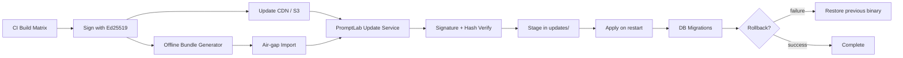

### 9.3 Platform Packaging

| Platform | Format | Notes |
|----------|--------|-------|
| Windows | MSI + NSIS fallback | Code signing (Authenticode) |
| macOS | DMG + notarized app bundle | Hardened runtime, entitlements |
| Linux | AppImage, .deb, .rpm | Reproducible AppImage preferred |

### 9.4 Runtime Components Updated Separately

| Component | Strategy |
|-----------|----------|
| Application binary | Full or delta update via Tauri updater |
| llama.cpp runtime | Bundled sidecar versioned independently |
| Playwright browsers | Download on first use; periodic cache refresh |
| Built-in playbooks | SQLite seed migration or resource pack update |
| ML models | Never auto-updated; user-initiated only |

### 9.5 Database Migrations

- Forward-only migrations in `promptlab-storage/migrations/`
- Backup `promptlab.db` to `promptlab.db.pre-update` before apply
- Migration failure triggers automatic binary rollback

### 9.6 Version Compatibility

Semantic versioning: `MAJOR.MINOR.PATCH`

- **MAJOR**: Breaking playbook schema, IPC breaking changes
- **MINOR**: New engines, features, backward-compatible schema additions
- **PATCH**: Bug fixes, security patches

---

## 10. Plugin Architecture

### 10.1 Plugin Types

| Type | Runtime | Use Case |
|------|---------|----------|
| **Probe Plugin** | WASM | Custom payloads, mutators, evaluators |
| **Engine Adapter** | WASM or Native | Integrate external tools (Garak, Promptfoo) |
| **Report Plugin** | WASM | Custom export formats, JIRA/GitHub integration |
| **Target Connector** | WASM | Proprietary API authentication flows |

Default distribution: **WASM only**. Native plugins require enterprise license and vendor co-signing.

### 10.2 Plugin Manifest

```toml
# promptlab-plugin.toml (conceptual)
[plugin]
id = "com.example.owasp-llm"
name = "OWASP LLM Top 10 Pack"
version = "1.2.0"
api_version = "1"
author = "Example Security"
description = "Pre-built probes mapped to OWASP LLM Top 10"

[runtime]
type = "wasm"
entry = "plugin.wasm"
min_promptlab = "1.0.0"

[capabilities]
probe_mutate = true
finding_emit = true
http_request = false
filesystem_read = ["$PLUGIN_DIR/**"]
filesystem_write = false

[hooks]
on_probe_generate = "hook_generate"
on_response_evaluate = "hook_evaluate"
on_report_render = "hook_report"

[permissions.rationale]
probe_mutate = "Required to inject OWASP-aligned probe variants"
```

### 10.3 Plugin API Surface

Plugins interact through a stable host API (WIT interface):

| Host Function | Description |
|---------------|-------------|
| `get_config()` | Plugin-scoped configuration from SQLite |
| `log(level, message)` | Structured logging |
| `emit_finding(finding)` | Submit a finding (validated against schema) |
| `mutate_probe(probe)` | Transform probe before execution |
| `http_request(req)` | Optional; requires capability; allowlist enforced |
| `read_resource(path)` | Scoped filesystem read |

Plugins **cannot** directly access SQLite, keychain, or spawn processes.

### 10.4 Plugin Lifecycle

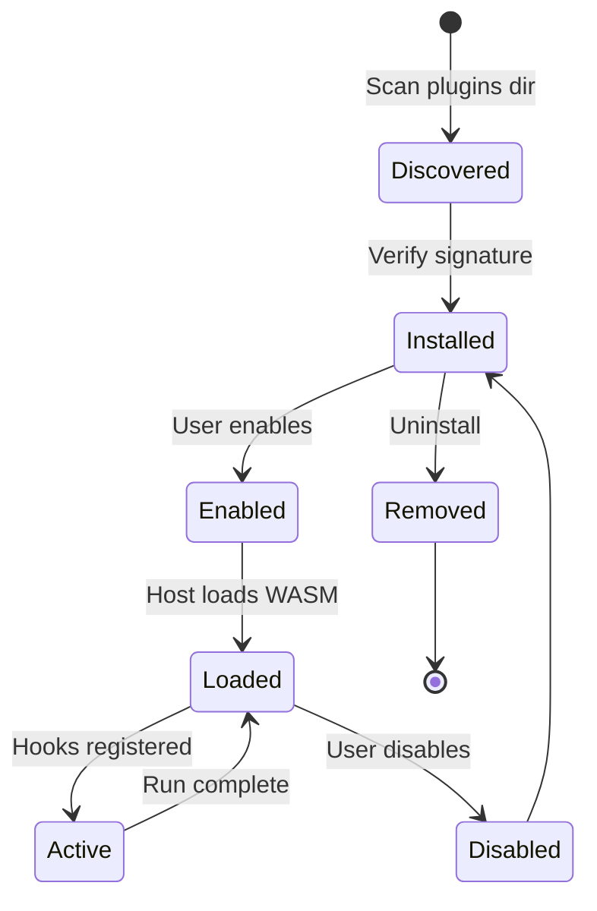

### 10.5 Distribution

| Source | Verification |
|--------|--------------|
| Built-in | Shipped with binary |
| PromptLab Marketplace | Publisher signature + PromptLab review signature |
| Side-load | User accepts risk dialog; dev mode only |
| Enterprise registry | Customer CA + optional allowlist |

### 10.6 Plugin SDK

Deliverables in `packages/plugin-sdk/`:

- WIT interface definitions
- Rust helper crate (`promptlab-plugin-sdk`)
- TypeScript types for manifest validation
- CLI: `promptlab-plugin init`, `promptlab-plugin build`, `promptlab-plugin sign`
- Reference plugin: `plugins/owasp-llm-top10`

### 10.7 Hook Points

| Hook | When Invoked |
|------|--------------|
| `on_run_start` | Before orchestrator begins |
| `on_probe_generate` | After built-in generator; can mutate or replace |
| `on_request_send` | Before HTTP/MCP request leaves host |
| `on_response_received` | Before evaluator runs |
| `on_finding_scored` | After severity assignment; can adjust |
| `on_report_render` | During export; can add sections |
| `on_run_complete` | After finalization |

---

## Appendix A: Technology Mapping

| Requirement | Technology | Role |
|-------------|------------|------|
| Desktop shell | Tauri 2.x | Native window, IPC, updater, system integration |
| UI | React 19 + TypeScript | SPA in WebView |
| Backend | Rust 2021 | Performance, safety, single binary |
| Persistence | SQLite + SQLx | Structured data, FTS, migrations |
| Browser automation | Playwright | Chatbot / web LLM UI testing |
| Local inference | llama.cpp | Offline adversarial generation, evaluation assist |
| Plugin sandbox | Wasmtime | Third-party extensibility |
| Monorepo | pnpm + Cargo workspace | Unified build |

---

## Appendix B: Non-Functional Requirements

| NFR | Target |
|-----|--------|
| Cold start | < 3s on mid-range hardware |
| Run concurrency | Configurable 1–16 parallel probes |
| Max project size | 100k findings with indexed search |
| Offline duration | Unlimited; license grace 30 days |
| Binary size | < 150 MB excluding models/browsers |
| Accessibility | WCAG 2.1 AA for core workflows |

---

## Appendix C: Related Documents

| Document | Status |
|----------|--------|
| `docs/IPC.md` | Planned — command/event catalog |
| `docs/PLUGIN_SDK.md` | Planned — plugin developer guide |
| `docs/THREAT_MODEL.md` | Planned — STRIDE analysis |
| `docs/DATABASE.md` | Planned — schema ERD |
| `docs/PLAYBOOKS.md` | Planned — playbook authoring guide |

---

## Revision History

| Version | Date | Author | Changes |
|---------|------|--------|---------|
| 1.0 | 2026-06-10 | Architecture | Initial architecture document |
