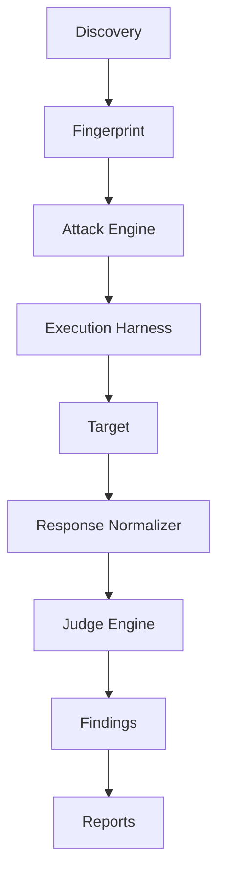

# AISec Platform Architecture — Execution Harness Layer

## Target pipeline



## New crates

| Crate | Role |
|-------|------|
| `aisec-harness` | Unified attack delivery (`HttpHarness`, `OpenAiHarness`, `PlaywrightHarness`) |
| `aisec-browser` | Persistent browser auth sessions (`AuthSessions/` vault) |
| `aisec-runtime` | Embedded runtime supervisor + offline model registry |

## Harness trait

All targets are reached through:

```rust
pub trait Harness {
    async fn execute(&self, request: AttackRequest) -> Result<NormalizedResponse>;
}
```

The Judge Engine consumes **only** `NormalizedResponse` via `JudgeEngine::judge_normalized()`.

## Harness selection

`HarnessFactory::resolve()` reads `TargetDescriptor` (from target JSON) and selects:

| Surface | Harness |
|---------|---------|
| REST / MCP HTTP | `HttpHarness` |
| OpenAI-compatible API | `OpenAiHarness` |
| Browser session / chat UI | `PlaywrightHarness` |

## Auth sessions

Browser sessions are stored under platform data roots:

- Windows: `%LOCALAPPDATA%/AISec/AuthSessions`
- macOS: `~/Library/Application Support/AISec/AuthSessions`
- Linux: `~/.local/share/aisec/AuthSessions`

APIs: `record_session`, `finish_record_session`, `validate_session`, `load_session`, `delete_session`.

## Local runtime

`aisec-runtime` bundles:

- `RuntimeSupervisor` — starts/monitors embedded Ollama binary when present under `runtime/`
- `EmbeddedModelProvider` — wraps `LocalModelManager` from `aisec-models`
- `BuiltinModelRegistry` — loads `resources/models.json` offline-first; optional remote merge

## Integration points

- **Attack path**: `src-tauri/src/harness_runtime.rs` → `HarnessTargetTransport` implements `TargetTransport`
- **Discovery**: unchanged HTTP/browser auth injection via `session_auth.rs`
- **Judge**: `aisec-judge` depends on `aisec-harness::NormalizedResponse`
- **Scan wizard**: Playwright recording IPC unchanged; sessions reusable via descriptor `auth.session_id`

## Extension without rewriting attacks

Add a provider under `crates/aisec-harness/src/providers/`, register in `HarnessFactory` + `HarnessRegistry`, map surface in `TargetDescriptor::preferred_harness()`.
