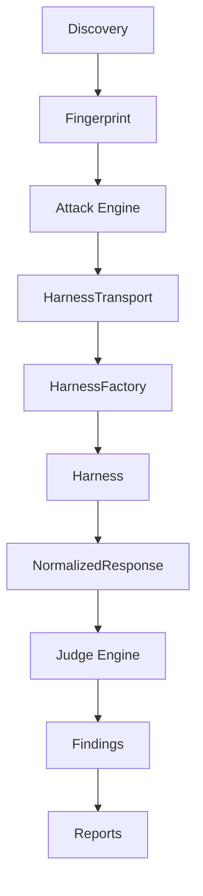

# PromptLab Platform Architecture — Execution Harness Layer

## Target pipeline



## Single execution path

All production attack delivery follows one chain:

```
AttackExecutor
  → TargetTransport (HarnessTransport)
    → HarnessAttackTransport
      → HarnessFactory::execute
        → HttpHarness | OpenAiHarness | PlaywrightHarness
          → NormalizedResponse
```

There is **no** direct `reqwest` transport in `promptlab-attack`. HTTP I/O lives inside `promptlab-harness` providers only.

| Layer | Crate / module |
|-------|----------------|
| Attack orchestration | `promptlab-attack` (`AttackExecutor`, `PayloadRunner`) |
| Transport trait impl | `promptlab-attack::HarnessTransport` |
| Harness resolution | `promptlab-harness::HarnessFactory` |
| Target delivery | `promptlab-harness` providers |
| Judge input | `promptlab-harness::NormalizedResponse` (end-to-end, no reconstruction) |

## New crates

| Crate | Role |
|-------|------|
| `promptlab-harness` | Unified attack delivery (`HttpHarness`, `OpenAiHarness`, `PlaywrightHarness`) |
| `promptlab-browser` | Persistent browser auth sessions (`AuthSessions/` vault) |
| `promptlab-runtime` | Embedded runtime supervisor + offline model registry |

## Harness trait

All targets are reached through:

```rust
pub trait Harness {
    async fn execute(&self, request: AttackRequest) -> Result<NormalizedResponse>;
}
```

The Judge Engine consumes **only** the original `NormalizedResponse` from the transport layer via `JudgeEngine::judge_normalized()`. The IPC attack path reads `attempt.response.normalized` — it must not rebuild normalization from raw HTTP bodies.

## Harness selection

`HarnessFactory::resolve()` reads `TargetDescriptor` (from target JSON) and selects:

| Surface | Harness |
|---------|---------|
| REST / MCP HTTP | `HttpHarness` |
| OpenAI-compatible API | `OpenAiHarness` |
| Browser session / chat UI | `PlaywrightHarness` |

## Auth sessions

Browser sessions are stored under platform data roots:

- Windows: `%LOCALAPPDATA%/PromptLab/AuthSessions`
- macOS: `~/Library/Application Support/PromptLab/AuthSessions`
- Linux: `~/.local/share/promptlab/AuthSessions`

APIs: `record_session`, `finish_record_session`, `validate_session`, `load_session`, `delete_session`.

## Local runtime

`promptlab-runtime` bundles:

- `RuntimeSupervisor` — starts/monitors embedded Ollama binary when present under `runtime/`
- `EmbeddedModelProvider` — wraps `LocalModelManager` from `promptlab-models`
- `BuiltinModelRegistry` — loads `resources/models.json` offline-first; optional remote merge

## Integration points

- **Attack path**: `src-tauri/src/harness_runtime.rs` builds `promptlab_attack::HarnessTransport` with session-aware `HarnessFactory`
- **Scanner**: `promptlab-attack::PromptInjectionScanner` builds `HarnessTransport::for_attack_target` per scan
- **Discovery**: unchanged HTTP/browser auth injection via `session_auth.rs`
- **Judge**: `attempt.response.normalized` → `judge_normalized()`
- **Scan wizard**: Playwright recording IPC unchanged; sessions reusable via descriptor `auth.session_id`

## Test doubles

`MockTransport` remains in `promptlab-attack` for unit tests only. It returns a synthetic `NormalizedResponse` alongside canned HTTP bodies.

## Extension without rewriting attacks

Add a provider under `crates/promptlab-harness/src/providers/`, register in `HarnessFactory` + `HarnessRegistry`, map surface in `TargetDescriptor::preferred_harness()`.
