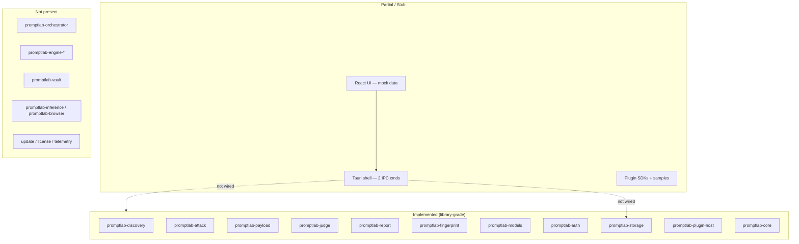

# PromptLab Codebase Audit Report

**Auditor role:** Principal Software Architect  
**Date:** 2026-06-10  
**Repository:** `yang-promptlab-private`  
**Reference architecture:** `docs/ARCHITECTURE.md` v1.0 (Draft)  
**Scope:** Full workspace — Rust crates, Tauri shell, React UI, plugin SDK, samples, tests, documentation

---

## Executive Summary

PromptLab is a **partially implemented** offline-first AI security testing platform. The **domain layer is substantially built** as independent Rust library crates (discovery, attack, payload, judge, report, fingerprint, models, auth, storage, plugin host). The **application integration layer is largely absent**: the Tauri desktop shell exposes only two bootstrap IPC commands and depends solely on `promptlab-core`. The React UI renders nine feature pages but is **entirely mock-driven** with no persistence or engine wiring.

| Dimension | Status |
|-----------|--------|
| `cargo build --workspace` | **Pass** (dev profile; ~28 compiler warnings) |
| `npm run build` | **Pass** |
| `npm run tauri build` | **Pass** (release bundle produced in prior validation) |
| `cargo test --workspace` | **Fail** — compile errors in 3 crates; runtime failures in 3 crates |
| End-to-end product readiness | **Not ready** — no run lifecycle, no IPC domain surface, no vault/licensing/update |

The codebase reads as a **strong library prototype** awaiting an integration spine (`promptlab-app` / orchestrator / IPC / event bus) to become a shippable product.

---

## 1. Current Implementation Status

### 1.1 Layer Overview



### 1.2 Rust Workspace Crates

| Crate | Status | Maturity | Notes |
|-------|--------|----------|-------|
| `promptlab-core` | **Complete (minimal)** | Stable foundation | Shared `PromptLabError`, `ErrorCode`, logging bootstrap. No domain types. Zero unit tests. |
| `promptlab-storage` | **Complete (library)** | High | SQLite via sqlx, migrations, 10+ repository traits/implementations, auth record models. Not opened by Tauri. Lib tests **do not compile** (trait import gaps in module tests). |
| `promptlab-discovery` | **Complete (library)** | High | Crawler, OpenAPI/GraphQL/AI detectors, URL policy, retry. Integration tests use wiremock (may run slowly). |
| `promptlab-attack` | **Complete (library)** | High | 10+ attack categories, registry, executor, transport (HTTP/mock), internal orchestrator. Integration tests pass. Lib test **does not compile**. |
| `promptlab-payload` | **Complete (library)** | High | Library, mutations, generation pipeline. Integration tests pass (5). |
| `promptlab-judge` | **Complete (library)** | Medium–High | Rule, regex, LLM evaluators; multi-model consensus. 1 integration test fails (consensus/regex mismatch). |
| `promptlab-report` | **Complete (library)** | High | HTML, PDF, JSON, SARIF formatters; charts, recommendations. Integration tests pass (5). |
| `promptlab-fingerprint` | **Complete (library)** | High | Provider rules (OpenAI, Anthropic, Gemini, vLLM, LiteLLM). 15 unit tests pass. |
| `promptlab-models` | **Complete (library)** | Medium | GGUF registry, download manager, llama.cpp runtime wrapper, hardware detect. 3 lib tests fail on macOS (sysctl parsing). |
| `promptlab-auth` | **Partial** | Medium | Playwright subprocess protocol, JWT structural parsing, session store interfaces. Lib tests **do not compile** (`tokio::process` feature missing). |
| `promptlab-plugin-host` | **Partial** | Medium | Manifest parsing, discovery, lifecycle, subprocess sandbox, permission guard. Sample plugin tests **fail** (manifest schema mismatch). Not WASM as architecture specifies. |
| `promptlab-desktop` (`src-tauri`) | **Stub** | Bootstrap | Depends only on `promptlab-core`. Commands: `health`, `app_info`. No `AppState` database, no engine wiring. |
| `promptlab-integration-tests` | **Minimal** | Smoke only | 2 tests: logging init + error code mapping. No cross-crate E2E. |

### 1.3 Frontend (React + TypeScript)

| Area | Status | Notes |
|------|--------|-------|
| App shell & routing | **Done** | HashRouter, lazy-loaded routes, `MainLayout`, sidebar, top bar |
| Feature pages (9) | **Done (UI only)** | Dashboard, Projects, Targets, Discovery, Attacks, Findings, Reports, Models, Settings |
| State management | **Done (non-architecture)** | React Context + `useReducer` in `src/app/store/` — not Zustand (`shared/state` per architecture) |
| Shared components | **Done** | Button, Card, Badge, DataTable, PageHeader, etc. |
| IPC client | **Stub** | `healthCheck`, `getAppInfo` only — no domain commands or event subscriptions |
| Data layer | **Mock only** | `src/shared/mock/data.ts`; no hydration from SQLite or run progress |
| Missing UI modules (per architecture) | **Absent** | Test Designer, Run Console (streaming), Plugin Manager, `shared/state` |

### 1.4 Plugin Ecosystem

| Component | Status |
|-----------|--------|
| `packages/plugin-sdk-python` | Present — discovery/attack/judge/report hooks, JSON-lines protocol |
| `packages/plugin-sdk-js` | Present — same hook surface for Node |
| `plugins/samples/` (4 plugins) | Present — Python/JS reference implementations |
| `plugins/_template/` | Present |
| Host integration with orchestrator | **Not wired** |
| Manifest compatibility | **Broken** — sample TOML uses `[permissions.rationale]` table; parser expects string fields |

### 1.5 Documentation

| Document | Status |
|----------|--------|
| `ARCHITECTURE.md` | Comprehensive target-state spec (draft) |
| `PROJECT_STRUCTURE.md` | **Stale** — lists fewer crates than exist; duplicates `promptlab-core` row; "Next Steps" contradicts current tree |
| Domain docs (`DISCOVERY.md`, `ATTACK.md`, etc.) | Present per crate |
| `PLUGINS.md` | Present |
| `IPC.md`, `PLUGIN_SDK.md`, `THREAT_MODEL.md` | **Missing** (referenced in architecture) |

### 1.6 Build & Release Artifacts

- Rust workspace: 12 members (11 crates + `src-tauri` + integration test crate).
- Frontend: Vite 6, React 19, TypeScript 5.8 — no monorepo tooling (no turbo/pnpm workspaces per architecture diagram).
- No `.github/` CI workflows detected.
- No `playbooks/`, `resources/llama`, `resources/playwright` runtime bundles.
- Release build previously produced `PromptLab.app` and DMG — shell only, no bundled inference/browser runtimes in repo.

---

## 2. Missing Modules

### 2.1 Backend Crates (specified in `ARCHITECTURE.md` §4.2)

| Planned crate | Purpose | Current substitute |
|---------------|---------|-------------------|
| `promptlab-app` | Tauri command definitions | Logic split across `src-tauri/src/commands/` (bootstrap only) |
| `promptlab-orchestrator` | Run scheduling, DAG, checkpoints | `promptlab-attack::AttackOrchestrator` (category-sequential only; no DAG/resume) |
| `promptlab-engine-llm` | API-level LLM testing | Partially embedded in `promptlab-attack` categories |
| `promptlab-engine-chatbot` | Playwright UI testing | Partially in `promptlab-auth` |
| `promptlab-engine-agent` | Tool abuse | `promptlab-attack` category modules |
| `promptlab-engine-workflow` | Multi-agent flows | **Absent** |
| `promptlab-engine-mcp` | MCP protocol security | `promptlab-attack::mcp_abuse` only |
| `promptlab-engine-rag` | RAG pipeline testing | `promptlab-attack::rag_leakage` only |
| `promptlab-inference` | llama.cpp FFI wrapper | Embedded in `promptlab-models` |
| `promptlab-browser` | Playwright subprocess manager | Embedded in `promptlab-auth` |
| `promptlab-vault` | Encrypted artifact storage | **Absent** — paths referenced as plain strings in storage |
| `promptlab-update` | Signed update pipeline | **Absent** |
| `promptlab-license` | Entitlement verification | **Absent** |
| `promptlab-telemetry` | Opt-in metrics | **Absent** |

### 2.2 Frontend Modules (specified in `ARCHITECTURE.md` §4.1)

- `features/designer` — playbook/YAML editor
- `features/runs` — live run console with streaming hooks
- `features/plugins` — plugin marketplace / permissions UI
- `shared/state` — Zustand stores
- Typed IPC bindings with generated types (specta / ts-rs)

### 2.3 Shared Contracts & Assets

| Asset | Status |
|-------|--------|
| `packages/playbook-schema` | Missing |
| `packages/finding-schema` | Missing |
| `packages/ui-tokens` | Missing |
| `playbooks/` (built-in YAML) | Missing |
| `resources/llama`, `resources/playwright` | Missing |
| `scripts/bundle-runtimes.sh`, `sign-update.sh` | Missing |

### 2.4 Integration & Infrastructure

- **IPC domain surface:** `run.start`, `run.abort`, `project.*`, `finding.*`, `report.export`, `model.*`, `plugin.*` — none implemented
- **Event bus / streaming channels:** not present (architecture §2.1, §3.1)
- **Cross-crate pipeline:** discovery → fingerprint → attack → judge → storage → report — no single entry point
- **CI/CD:** no GitHub Actions or equivalent
- **Threat model & IPC contract docs:** missing

---

## 3. Broken Modules

Modules that exist but **fail tests**, **fail at runtime in intended use**, or **do not fulfill their architectural contract**.

### 3.1 Test Failures (verified 2026-06-10)

| Module | Failure | Root cause |
|--------|---------|------------|
| `promptlab-storage` (lib tests) | **Compile error** | `finding.rs` and `attack_result.rs` test modules call `ScanRepository::create` without importing `ScanRepository` trait |
| `promptlab-attack` (lib tests) | **Compile error** | `PayloadRunner::new(transport)` — missing borrow (`&transport`) in `payload/runner.rs` test |
| `promptlab-auth` (lib tests) | **Compile error** | `tokio::process` unavailable — workspace `tokio` lacks `process` feature |
| `promptlab-judge` (integration) | **Runtime fail** | `regex_and_rules_agree_on_secret` — regex pattern `api[_-]?key` does not match `"API key:"` (space-separated); weighted consensus (threshold 0.55) yields `vulnerable: false` when only rules fire |
| `promptlab-models` (lib tests) | **Runtime fail (3)** | macOS `hw.memsize` sysctl returns `S64` variant; parser expects different type |
| `promptlab-plugin-host` (sample_plugins) | **Runtime fail (5/5)** | Sample manifest `[permissions.rationale]` invalid for parser (`expected string, got map`) |
| `promptlab-discovery` (integration) | **Indeterminate / slow** | Integration test did not complete within 3+ minutes in audit environment — possible hang or resource contention |

### 3.2 Functional / Contract Failures (no test coverage)

| Module | Issue |
|--------|-------|
| **Tauri shell** | Product UI cannot persist or execute scans — IPC gap |
| **Plugin sandbox** | Subprocess runner only; no cgroup/seccomp/WASM isolation; interpreter path not allowlisted; minimal env stripping |
| **Permission enforcement** | `PermissionGuard` validates host API calls but plugins run as full OS subprocess with inherited privileges |
| **Discovery SSRF policy** | `url_policy.rs` blocks literal private IPs and `localhost` hostname only — no DNS resolution, no redirect re-validation |
| **Auth secrets** | Credentials/tokens stored in SQLite JSON columns without encryption (`promptlab-vault` absent) |
| **JWT validation** | Structural decode in `promptlab-auth` — no signature/expiry enforcement documented |
| **Attack orchestrator** | `OrchestratorConfig.concurrency` declared but **never used** — attacks run strictly sequential |
| **Attack budget** | `AttackBudget.max_mutations_per_payload` defined in types but **not enforced** in payload/executor path |
| **Judge engine** | LLM evaluator errors silently skipped (`debug` log only); confidence floor can inflate severity on marginal consensus |
| **Frontend dashboard** | `runningScans` metric excludes attack runs (discovery-only filter in mock stats) |

### 3.3 Documentation Drift

- `PROJECT_STRUCTURE.md` describes bootstrap-only layout; omits 8+ implemented crates and entire `src/features/` tree.
- `ARCHITECTURE.md` describes WASM plugins; implementation is Python/Node subprocess.
- Architecture folder layout (`apps/desktop/ui`) differs from actual root-level `src/` + `src-tauri/`.

---

## 4. Compilation Issues

### 4.1 Release / Dev Build

```
cargo build --workspace   → SUCCESS (exit 0)
```

Known warning categories (~28 total):

- Unused imports (`promptlab-discovery`, `promptlab-plugin-host`, `promptlab-attack`, `promptlab-models`)
- Unused mut (`promptlab-attack` mock transport)
- Platform-specific cfg and deprecated API usage in `promptlab-models` (llama.cpp, sysctl)

No build-breaking errors in library or binary targets after recent compatibility fixes (Rust 1.96).

### 4.2 Test Build Failures

```
cargo test --workspace   → FAIL
```

| Crate | Phase | Error |
|-------|-------|-------|
| `promptlab-storage` | lib test compile | `E0599`: `create` not found on `SqliteScanRepository` (trait not in scope) ×2 |
| `promptlab-attack` | lib test compile | `E0308`: mismatched types — `PayloadRunner::new` expects `&T` |
| `promptlab-auth` | lib test compile | `E0432`/`E0433`: `tokio::process` module not enabled |

### 4.3 Frontend Build

```
npm run build   → SUCCESS (tsc --noEmit && vite build)
npm test        → SUCCESS (3 tests: logger, errors)
```

No TypeScript compilation errors. Test coverage is minimal (2 files, 3 assertions).

---

## 5. Architecture Violations

Violations are measured against `docs/ARCHITECTURE.md` as the authoritative target state.

### 5.1 Structural / Modular

| Violation | Spec | Actual |
|-----------|------|--------|
| Monorepo layout | `apps/desktop/ui` + `apps/desktop/src-tauri` | Root-level `src/` + `src-tauri/` |
| Command layer crate | `promptlab-app` owns IPC handlers | Handlers inline in `src-tauri`; only 2 commands |
| Engine separation | Six `promptlab-engine-*` crates implementing `SecurityEngine` trait | Monolithic `promptlab-attack` with category modules |
| Orchestrator crate | `promptlab-orchestrator` with DAG, checkpoints, cancellation | Local `AttackOrchestrator` — sequential categories only |
| Inference / browser | Dedicated `promptlab-inference`, `promptlab-browser` managers | Embedded inside `promptlab-models`, `promptlab-auth` |

### 5.2 Integration / Data Flow

| Violation | Impact |
|-----------|--------|
| No Tauri dependency on domain crates | `src-tauri/Cargo.toml` lists only `promptlab-core` — violates §3.1 sequence (UI → IPC → Orch → Engines → DB) |
| No IPC events or streams | Architecture requires Run Console streaming; frontend has no listeners |
| No generated IPC types | Architecture implies typed bridge; manual hand-written types for 2 commands only |
| UI mock data bypasses storage | Violates offline-first / local sovereignty presentation layer |
| No plugin → orchestrator hook path | Plugin host isolated; samples never invoked in a scan run |

### 5.3 Security Architecture

| Violation | Spec | Actual |
|-----------|------|--------|
| Plugin sandbox | WASM + capability enforcement (§3.3) | OS subprocess + JSON-lines protocol |
| File vault | Encrypted artifact storage (§1.1, §2.2) | Plain SQLite + filesystem path strings |
| Defense in depth | Signed updates, license in Rust core | Crates absent |
| SSRF controls | Implied for discovery against user targets | Hostname literal check only |
| Capability-based IPC | Tauri v2 capabilities + domain authz | Default capability file; no domain commands |

### 5.4 Frontend Architecture

| Violation | Spec | Actual |
|-----------|------|--------|
| Global state | Zustand (`shared/state`) | React Context reducer |
| Feature set | Designer, Runs, Plugins UI | Nine pages without designer/runs/plugins |
| Error boundaries | App shell requirement | Present (`ErrorBoundary`) ✓ |

### 5.5 Dependency / Layering

- **No circular dependencies detected** — crate graph is acyclic and healthy.
- **Layer inversion risk:** UI presents production workflows (attacks, discovery jobs) that have no backend counterpart — creates false completeness impression.

---

## 6. Technical Debt

### 6.1 Critical (blocks productization)

1. **Integration spine missing** — wire Tauri → storage → orchestrator → engines → judge → report.
2. **IPC contract undefined** — no `IPC.md`, no command/event catalog, no versioning.
3. **Test suite red** — workspace tests fail compile and runtime; no CI gate.
4. **Plugin manifest schema drift** — samples incompatible with host parser; breaks plugin story.
5. **Security controls on paper only** — vault, sandbox, SSRF, JWT validation, signed updates.

### 6.2 High (quality / maintainability)

1. **Architecture doc vs reality gap** — misleads new contributors; `PROJECT_STRUCTURE.md` outdated.
2. **Dead configuration fields** — `concurrency`, `max_mutations_per_payload` suggest features that do not exist.
3. **Platform-specific test fragility** — `promptlab-models` hardware tests fail on macOS CI targets.
4. **Judge consensus tuning** — threshold/regex alignment untested; false negatives on obvious leaks.
5. **Tokio feature fragmentation** — `promptlab-auth` needs `process` feature; workspace definition omits it.
6. **Trait import pattern in storage tests** — repeated omission causes compile failures.

### 6.3 Medium (polish / scale)

1. **~28 compiler warnings** — noise hides real regressions.
2. **Discovery integration test duration** — potential hang; needs timeout investigation.
3. **No playbook or finding JSON schemas** — blocks designer and cross-tool interchange.
4. **No bundled runtimes** — llama.cpp / Playwright not in `resources/`; manual setup required.
5. **Frontend test coverage ~0%** for features — only shared utilities tested.
6. **Duplicate orchestrator concept** — `promptlab-attack` internal vs planned `promptlab-orchestrator` will confuse ownership.
7. **Mock-driven UI metrics** — dashboard stats do not reflect attack run state.

### 6.4 Low (future cleanup)

1. Monorepo tooling (turbo/pnpm) not adopted despite architecture diagram.
2. First-party plugins in architecture (`owasp-llm-top10`, `garak-adapter`) not started.
3. Commercial tier boundaries (Community/Pro/Enterprise) — no license crate.
4. `promptlab-core` lacks domain shared types — each crate defines overlapping concepts.

---

## 7. Test Coverage Matrix

| Crate / Area | Tests | Result |
|--------------|-------|--------|
| `promptlab-core` | 0 | N/A |
| `promptlab-storage` | lib + per-repo | **Compile fail** |
| `promptlab-discovery` | integration | Slow / unverified in audit window |
| `promptlab-attack` | lib + integration (2) | Lib **compile fail**; integration **pass** |
| `promptlab-payload` | integration (5) | **Pass** |
| `promptlab-judge` | integration (3) | **2 pass, 1 fail** |
| `promptlab-report` | integration (5) | **Pass** |
| `promptlab-fingerprint` | unit (15) | **Pass** |
| `promptlab-models` | lib (12) | **9 pass, 3 fail** |
| `promptlab-auth` | lib | **Compile fail** |
| `promptlab-plugin-host` | sample_plugins (5) | **All fail** |
| `tests/integration` | 2 smoke | **Pass** |
| Frontend (vitest) | 3 | **Pass** |

**Estimated workspace test health:** ~40+ tests passing when excluding broken crates; full `cargo test --workspace` cannot succeed without fixes.

---

## 8. Recommended Remediation Priority

| Priority | Item | Rationale |
|----------|------|-----------|
| P0 | Fix compile-breaking tests (storage, attack, auth) | Restore CI viability |
| P0 | Define and implement core IPC commands + `AppState` with `Database` | Unblocks UI integration |
| P0 | Align plugin manifest schema (samples ↔ parser) | Unblocks extensibility story |
| P1 | Implement run orchestration wiring (discovery → attack → judge → storage) | Minimum viable scan |
| P1 | Replace UI mock store with IPC-backed hydration + run events | Product truthfulness |
| P1 | Fix judge regex/consensus false negative | Security correctness |
| P2 | Add `promptlab-vault` or encrypt sensitive columns | Architecture/security compliance |
| P2 | Harden discovery SSRF (DNS + redirect validation) | Pentest safety |
| P2 | Add GitHub Actions: build + test matrix | Regression prevention |
| P3 | Split engines per architecture or update ARCHITECTURE.md to match | Long-term modularity |
| P3 | WASM sandbox or documented subprocess threat model | Plugin security claims |

---

## 9. Conclusion

PromptLab has **mature, testable domain libraries** for the core security testing loop, but the **product architecture exists only on paper**. The desktop app builds and ships as a ** hollow shell**: React mock UI + Tauri health check. Closing the gap requires an integration phase—not more isolated crate features—with IPC contracts, orchestrated run lifecycle, storage hydration, and honest security controls (vault, sandbox, SSRF).

Until remediation P0–P1 items land, treat the repository as an **SDK / engine toolkit** rather than a functional PromptLab Desktop product.

---

*This audit is point-in-time. Re-run `cargo build --workspace`, `cargo test --workspace`, and `npm test` after fixes to refresh status.*
