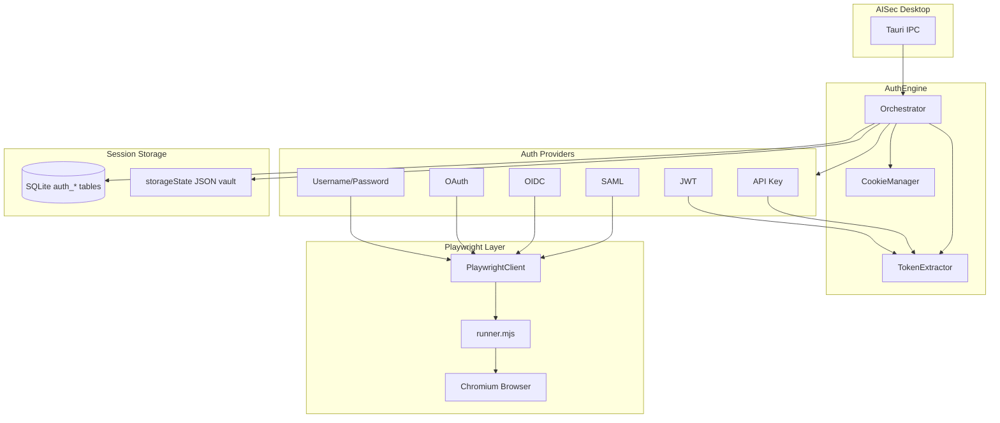

# AISec Authentication Engine

**Crate:** `aisec-auth`  
**Status:** MVP  
**Browser runtime:** Playwright (Node.js subprocess)

The Authentication Engine records, replays, and manages authenticated sessions for security testing of web applications, chatbots, and AI portals.

---

## Architecture



### Component Responsibilities

| Component | Role |
|-----------|------|
| **AuthEngine** | Public API: record, replay, authenticate, extract tokens, manage cookies |
| **PlaywrightClient** | Rust ↔ Node JSON-lines protocol to `runner.mjs` |
| **SessionStore** | SQLite metadata + encrypted vault files for Playwright `storageState` |
| **CookieManager** | Import/export/sync cookie jars |
| **TokenExtractor** | JWT validation, bearer header formatting, token merge |
| **MockPlaywrightDriver** | Test double without Node/Playwright |

---

## Supported Authentication Methods

| Method | Browser | Recording | Token sources |
|--------|---------|-----------|---------------|
| **Username/Password** | Yes | Automated form fill | Cookies, storage |
| **OAuth** | Yes | Interactive / URL wait | OAuth tokens in responses |
| **OIDC** | Yes | Interactive / URL wait | `access_token`, `id_token` |
| **SAML** | Yes | Interactive / URL wait | Cookies, SAML artifact URLs |
| **JWT** | No | N/A | Configured JWT string |
| **API Key** | No | N/A | Configured key + header |

---

## Playwright Integration

### Protocol

Rust communicates with `playwright/runner.mjs` via **JSON-lines** on stdin/stdout:

```json
{"id":1,"cmd":"record_login","url":"https://app/login","method":"username_password","config":{...},"options":{...}}
{"id":1,"ok":true,"result":{"steps":[],"storage_state":{},"cookies":[],"tokens":[],"final_url":"..."}}
```

### Commands

| Command | Description |
|---------|-------------|
| `launch` | Start Chromium with optional `storageState` |
| `record_login` | Navigate + login (automated or interactive) |
| `replay_session` | Restore cookies/storageState and open URL |
| `extract_tokens` | Scrape localStorage + captured network tokens |
| `get_cookies` / `set_cookies` | Cookie jar management |
| `close` | Tear down browser |

### Token Capture

During recording/replay, the runner intercepts:

- `Authorization` response headers
- JSON bodies with `access_token`, `refresh_token`, `id_token`
- `localStorage` / `sessionStorage` token keys

### Setup

**Development** (system Node.js):

```bash
npm run setup:playwright
```

**Release build** bundles Node.js + Playwright + Chromium automatically via `npm run bundle:playwright`
(wired into `beforeBuildCommand` for `tauri build`). End users do not install Node or Playwright separately.

Manual bundle (optional, also used by dev after bundling once):

```bash
npm run bundle:playwright
```

Bundled assets land in `src-tauri/resources/playwright/` (gitignored, ~300MB).

---

## Session Storage

### SQLite (`aisec-storage` migration 002)

| Table | Purpose |
|-------|---------|
| `auth_profiles` | Named auth configuration per project |
| `auth_sessions` | Active sessions with cookie/token JSON |
| `auth_recordings` | Recorded login step sequences |

### File Vault

Playwright `storageState` JSON saved to:

```
{vault_dir}/{session_id}.storage.json
```

Referenced by `auth_sessions.storage_state_path`.

---

## Usage

```rust
use aisec_auth::{
    AuthConfig, AuthEngine, AuthEngineConfig, AuthMethod, AuthProfile,
    RecordLoginOptions, SessionStore,
};
use aisec_storage::Database;

#[tokio::main]
async fn main() -> aisec_core::AisecResult<()> {
    let db = Database::connect("sqlite://aisec.db").await?;
    let store = SessionStore::new(db, "./data/auth-vault").await?;
    let engine = AuthEngine::new(AuthEngineConfig::default(), store, None).await?;

    let profile = AuthProfile {
        id: "profile-1".into(),
        project_id: Some("project-1".into()),
        name: "App Login".into(),
        method: AuthMethod::UsernamePassword,
        config: AuthConfig::UsernamePassword {
            login_url: "https://app.example.com/login".into(),
            username: Some("tester@example.com".into()),
            password: Some("***".into()),
            username_selector: "#email".into(),
            password_selector: "#password".into(),
            submit_selector: "button[type=submit]".into(),
        },
    };

    let (session, recording) = engine
        .record_login(&profile, RecordLoginOptions { headed: true, ..Default::default() })
        .await?;

    let tokens = engine.extract_tokens(&session.id, None).await?;
    let cookies = engine.export_cookies(&session.id).await?;

    let replay = engine
        .replay_session(&session.id, "https://app.example.com/chat", Default::default())
        .await?;

    engine.close().await?;
    Ok(())
}
```

---

## Security Considerations

| Control | Implementation |
|---------|----------------|
| Credential storage | Passwords in profile config should reference OS keychain in production builds |
| Session vault | Files under user-controlled `vault_dir`; restrict permissions |
| Browser isolation | Ephemeral Playwright contexts per recording |
| JWT validation | Structure-only validation at MVP; signature verification delegated to target policy |
| SSRF | Auth engine does not re-validate URLs — combine with discovery engine URL policy |

---

## Testing

```bash
cargo test -p aisec-auth          # unit tests with MockPlaywrightDriver
cargo test -p aisec-storage       # auth table CRUD
```

Integration tests with real Playwright require Node.js + `npm install` in `playwright/`.

---

## Related Documents

- `docs/ARCHITECTURE.md` — Playwright manager, keychain secrets
- `docs/DATABASE.md` — core schema (auth tables in migration 002)
