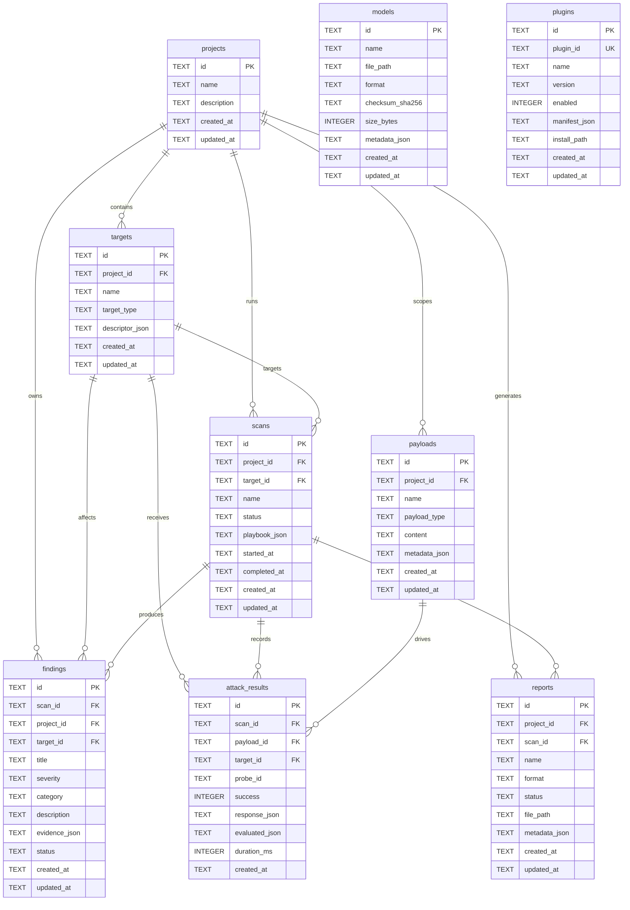

# PromptLab Database Schema

**Engine:** SQLite 3 (WAL mode)  
**Access layer:** `promptlab-storage` (`sqlx` + embedded migrations)  
**Version:** 001 — initial schema

---

## Entity Relationship Diagram



---

## Tables

### `projects`

Top-level workspace container for targets, scans, and reports.

| Column | Type | Notes |
|--------|------|-------|
| `id` | TEXT PK | UUID v7 |
| `name` | TEXT | Required |
| `description` | TEXT | Optional |
| `created_at` | TEXT | RFC 3339 UTC |
| `updated_at` | TEXT | RFC 3339 UTC |

### `targets`

Attack surface entries (LLM API, chatbot UI, MCP server, RAG pipeline, etc.).

| Column | Type | Notes |
|--------|------|-------|
| `id` | TEXT PK | UUID v7 |
| `project_id` | TEXT FK | → `projects.id` CASCADE |
| `name` | TEXT | Display name |
| `target_type` | TEXT | e.g. `llm`, `chatbot`, `agent`, `mcp`, `rag` |
| `descriptor_json` | TEXT | Target descriptor (URL, auth ref, manifest) |
| `created_at` | TEXT | |
| `updated_at` | TEXT | |

### `scans`

Test run instances (maps to architecture "runs").

| Column | Type | Notes |
|--------|------|-------|
| `id` | TEXT PK | UUID v7 |
| `project_id` | TEXT FK | → `projects.id` CASCADE |
| `target_id` | TEXT FK | → `targets.id` SET NULL |
| `name` | TEXT | Run label |
| `status` | TEXT | `pending`, `running`, `completed`, `failed`, `cancelled` |
| `playbook_json` | TEXT | Playbook configuration |
| `started_at` | TEXT | Optional |
| `completed_at` | TEXT | Optional |
| `created_at` | TEXT | |
| `updated_at` | TEXT | |

### `findings`

Structured vulnerability records with FTS5 full-text search.

| Column | Type | Notes |
|--------|------|-------|
| `id` | TEXT PK | UUID v7 |
| `scan_id` | TEXT FK | → `scans.id` CASCADE |
| `project_id` | TEXT FK | → `projects.id` CASCADE |
| `target_id` | TEXT FK | → `targets.id` SET NULL |
| `title` | TEXT | Short summary |
| `severity` | TEXT | `info`, `low`, `medium`, `high`, `critical` |
| `category` | TEXT | e.g. `injection`, `exfiltration` |
| `description` | TEXT | Long-form detail |
| `evidence_json` | TEXT | Captured proof |
| `status` | TEXT | `open`, `triaged`, `false_positive`, `fixed` |
| `created_at` | TEXT | |
| `updated_at` | TEXT | |

**FTS:** Virtual table `findings_fts` indexes `title` and `description` with sync triggers.

### `payloads`

Reusable attack payloads (prompts, tool invocations, corpus samples).

| Column | Type | Notes |
|--------|------|-------|
| `id` | TEXT PK | UUID v7 |
| `project_id` | TEXT FK | NULL = global library |
| `name` | TEXT | |
| `payload_type` | TEXT | e.g. `prompt`, `tool_call`, `document` |
| `content` | TEXT | Raw payload body |
| `metadata_json` | TEXT | Tags, encoding, source |
| `created_at` | TEXT | |
| `updated_at` | TEXT | |

### `attack_results`

Per-probe execution outcomes linked to scans.

| Column | Type | Notes |
|--------|------|-------|
| `id` | TEXT PK | UUID v7 |
| `scan_id` | TEXT FK | → `scans.id` CASCADE |
| `payload_id` | TEXT FK | → `payloads.id` SET NULL |
| `target_id` | TEXT FK | → `targets.id` SET NULL |
| `probe_id` | TEXT | Playbook probe identifier |
| `success` | INTEGER | Boolean (attack succeeded) |
| `response_json` | TEXT | Raw target response |
| `evaluated_json` | TEXT | Evaluator output |
| `duration_ms` | INTEGER | Probe latency |
| `created_at` | TEXT | Immutable timestamp |

### `reports`

Generated export artifacts.

| Column | Type | Notes |
|--------|------|-------|
| `id` | TEXT PK | UUID v7 |
| `project_id` | TEXT FK | → `projects.id` CASCADE |
| `scan_id` | TEXT FK | → `scans.id` SET NULL |
| `name` | TEXT | |
| `format` | TEXT | `pdf`, `html`, `json`, `sarif` |
| `status` | TEXT | `pending`, `completed`, `failed` |
| `file_path` | TEXT | Vault-relative path |
| `metadata_json` | TEXT | Template, redaction rules |
| `created_at` | TEXT | |
| `updated_at` | TEXT | |

### `models`

Local llama.cpp model registry.

| Column | Type | Notes |
|--------|------|-------|
| `id` | TEXT PK | UUID v7 |
| `name` | TEXT | Human-readable name |
| `file_path` | TEXT | Absolute or vault path |
| `format` | TEXT | Default `gguf` |
| `checksum_sha256` | TEXT | Integrity verification |
| `size_bytes` | INTEGER | File size |
| `metadata_json` | TEXT | Quantization, context length |
| `created_at` | TEXT | |
| `updated_at` | TEXT | |

### `plugins`

Installed plugin registry.

| Column | Type | Notes |
|--------|------|-------|
| `id` | TEXT PK | UUID v7 (internal) |
| `plugin_id` | TEXT UNIQUE | Manifest ID e.g. `com.promptlab.owasp` |
| `name` | TEXT | |
| `version` | TEXT | Semver |
| `enabled` | INTEGER | Boolean |
| `manifest_json` | TEXT | Full plugin manifest |
| `install_path` | TEXT | On-disk location |
| `created_at` | TEXT | |
| `updated_at` | TEXT | |

---

## Migrations

| Version | File | Description |
|---------|------|-------------|
| 001 | `crates/promptlab-storage/migrations/001_initial_schema.sql` | Core tables, indexes, FTS5 |
| 002 | `crates/promptlab-storage/migrations/002_auth_schema.sql` | Auth profiles, sessions, recordings |

Migrations run automatically on `Database::connect()`.

---

## Repository API

Each table has an async trait in `promptlab-storage::repositories` with SQLite implementation:

| Trait | CRUD | Extra queries |
|-------|------|---------------|
| `ProjectRepository` | ✓ | `list` |
| `TargetRepository` | ✓ | `list_by_project` |
| `ScanRepository` | ✓ | `list_by_project` |
| `FindingRepository` | ✓ | `list_by_scan`, `list_by_project`, `search` (FTS) |
| `PayloadRepository` | ✓ | `list`, `list_by_project` |
| `AttackResultRepository` | ✓ | `list_by_scan` |
| `ReportRepository` | ✓ | `list_by_project` |
| `ModelRepository` | ✓ | `list` |
| `PluginRepository` | ✓ | `list`, `get_by_plugin_id` |

Access via:

```rust
let db = Database::connect("sqlite://path/to/promptlab.db").await?;
let repos = db.repositories();
repos.projects().create(...).await?;
```

---

## Conventions

- **IDs:** UUID v7 strings (`TEXT`)
- **Timestamps:** `OffsetDateTime` stored as RFC 3339 UTC text
- **JSON columns:** Serialized via `serde_json`; validated at repository boundary
- **Foreign keys:** Enabled via `PRAGMA foreign_keys = ON`
- **Journal mode:** WAL for concurrent read/write
