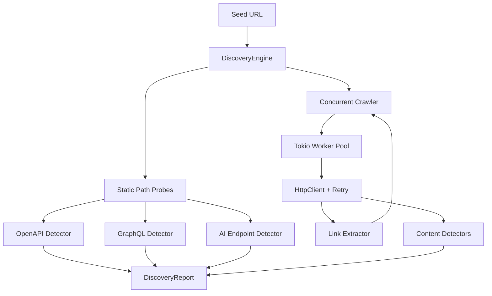

# PromptLab Discovery Engine

**Crate:** `promptlab-discovery`  
**Status:** MVP  
**Aligns with:** `docs/ARCHITECTURE.md` §2.3 (`SecurityEngine::discover()`)

The Discovery Engine enumerates attack surface for web-facing targets by crawling pages, extracting links, and detecting REST APIs, OpenAPI specifications, GraphQL endpoints, and AI/LLM routes.

---

## Capabilities

| Capability | Description |
|------------|-------------|
| **Website crawl** | Bounded BFS crawl from a seed URL with configurable depth and page limits |
| **Link extraction** | Parses `<a>`, `<form>`, `<script>`, `<link>`, `<iframe>` and inline URL hints |
| **REST API discovery** | Detects `/api/*`, `/rest/*`, versioned paths, JSON catalog responses |
| **OpenAPI discovery** | Probes common spec paths; validates `openapi` / `swagger` JSON and YAML markers |
| **GraphQL discovery** | Introspection POST probe + GraphiQL/playground HTML heuristics |
| **AI endpoint discovery** | Probes OpenAI-compatible paths (`/v1/chat/completions`, `/v1/models`, etc.) |

---

## Architecture



### Components

| Module | Responsibility |
|--------|----------------|
| `engine` | Orchestrates probes + crawl, produces `DiscoveryReport` |
| `crawler` | Concurrent BFS workers, visited-set deduplication |
| `client` | `reqwest` wrapper with timeouts, size limits, retries |
| `retry` | Exponential backoff for transient HTTP failures |
| `extract` | HTML link extraction + JS URL hints |
| `detectors/*` | OpenAPI, GraphQL, REST, AI classifiers |
| `url_policy` | URL normalization, same-origin checks, SSRF guard |

---

## Usage

```rust
use promptlab_discovery::{DiscoveryConfig, DiscoveryEngine, EndpointKind};

#[tokio::main]
async fn main() -> promptlab_core::PromptLabResult<()> {
    let config = DiscoveryConfig {
        max_depth: 3,
        max_pages: 200,
        worker_count: 8,
        allow_private_network: false, // SSRF-safe default
        ..Default::default()
    };

    let engine = DiscoveryEngine::new(config)?;
    let report = engine.discover("https://target.example.com").await?;

    for ep in report.endpoints_by_kind(EndpointKind::OpenApi) {
        println!("OpenAPI: {} ({})", ep.url, ep.confidence);
    }

    Ok(())
}
```

### Configuration

| Field | Default | Description |
|-------|---------|-------------|
| `max_depth` | `3` | Maximum link depth from seed |
| `max_pages` | `200` | Maximum fetched pages |
| `worker_count` | `8` | Concurrent crawler workers |
| `request_timeout` | `15s` | Per-request timeout |
| `retry.max_attempts` | `3` | HTTP retry attempts |
| `same_origin_only` | `true` | Restrict crawl to seed origin |
| `allow_private_network` | `false` | Block loopback/private IPs (SSRF guard) |
| `probe_static_paths` | `true` | Run OpenAPI/GraphQL/AI path probes |
| `max_body_bytes` | `2 MiB` | Response body size cap |

---

## Output Schema

### `DiscoveryReport`

```json
{
  "seed_url": "https://example.com",
  "origin": "https://example.com",
  "endpoints": [
    {
      "url": "https://example.com/openapi.json",
      "kind": "openapi",
      "method": "GET",
      "confidence": 0.95,
      "evidence": "response body contains OpenAPI/Swagger JSON",
      "source_url": "https://example.com",
      "discovered_at": "2026-06-10T12:00:00Z"
    }
  ],
  "stats": {
    "pages_fetched": 12,
    "pages_failed": 1,
    "links_extracted": 48,
    "probes_sent": 32,
    "duration_ms": 4200
  },
  "errors": []
}
```

### `EndpointKind` values

- `link` — extracted hyperlink (including external)
- `rest_api` — REST/JSON API route
- `openapi` — OpenAPI/Swagger specification
- `graphql` — GraphQL endpoint or playground
- `ai_endpoint` — LLM/inference-compatible route

---

## Security Controls

| Control | Behavior |
|---------|----------|
| **SSRF guard** | Blocks `localhost`, `.local`, loopback, RFC1918, link-local by default |
| **Scheme allowlist** | Only `http` / `https` |
| **Same-origin crawl** | Prevents cross-domain crawl by default (external links recorded only) |
| **Body size cap** | Prevents memory exhaustion from large responses |
| **Redirect limit** | Max 5 redirects via reqwest policy |

Enable `allow_private_network: true` only for local/lab targets (e.g. WireMock tests).

---

## Static Probe Paths

### OpenAPI

`/openapi.json`, `/swagger.json`, `/api-docs`, `/v3/api-docs`, `/docs/openapi.json`, …

### GraphQL

`/graphql`, `/api/graphql`, `/query` — POST introspection + GET UI probe

### AI / LLM

`/v1/chat/completions`, `/v1/models`, `/v1/embeddings`, `/api/chat`, `/anthropic/v1/messages`, …

---

## Testing

```bash
# Unit tests (detectors, extractors, retry, URL policy)
cargo test -p promptlab-discovery

# Integration tests (WireMock HTTP server)
cargo test -p promptlab-discovery --test integration
```

Tests cover:

- OpenAPI/GraphQL/AI detection heuristics
- Link extraction from HTML
- Retry backoff logic
- SSRF URL validation
- End-to-end discovery against mocked HTTP server

---

## Integration with PromptLab

The engine implements `SurfaceDiscovery` trait, mapping to the architecture's `SecurityEngine::discover()` phase. Future work:

- Persist discoveries into `promptlab-storage` `targets` table
- Feed discovered endpoints to LLM/Chatbot/API engines
- Respect `robots.txt` and scope definitions from project config
- Playwright-assisted SPA route discovery

---

## Observability

Structured logs via `tracing`:

- `info` — discovery start/complete with stats
- `debug` — per-page fetch, link extraction counts
- `warn` — retry attempts, task failures

Enable with `RUST_LOG=promptlab_discovery=debug`.
