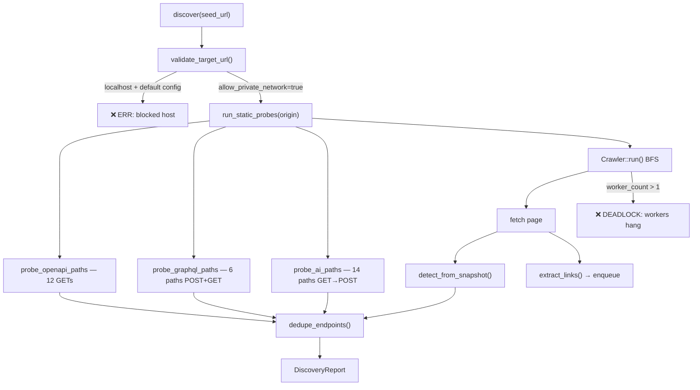

# Discovery Engine Verification Report

**Date:** 2026-06-10  
**Crate:** `promptlab-discovery` v0.1.0  
**Test target:** `http://localhost:3000`  
**Harness:** `scripts/discovery-test-target.py` + `cargo run -p promptlab-discovery --example verify_target`

---

## Executive Summary

The Discovery Engine **implements real crawl, probe, and detection logic** — it is not a stub. However, verification against `http://localhost:3000` exposed **two critical runtime defects** and several integration gaps:

| Severity | Finding |
|----------|---------|
| **Critical** | Crawler **deadlocks** when `worker_count > 1` (default: 8) — discovery hangs indefinitely |
| **High** | AI path probe **skips POST** when GET returns HTTP 404 — POST-only endpoints (e.g. `/v1/chat/completions`) missed |
| **High** | Default config **rejects `localhost`** — MVP local testing requires `allow_private_network: true` |
| **Medium** | SSRF policy is hostname/literal-IP only — no DNS resolution or redirect re-validation |
| **Medium** | No app integration — engine is library-only; results not persisted |

With `worker_count: 1` and `allow_private_network: true`, discovery against the test target **completes in ~194ms** and finds **5 endpoints** across OpenAPI, GraphQL, AI, and REST categories.

---

## Test Target Setup

### Server: `scripts/discovery-test-target.py`

| Route | Method | Response |
|-------|--------|----------|
| `/` | GET | HTML with links to `/docs`, `/api/v1/users`, `/internal` |
| `/docs` | GET | HTML |
| `/api/v1/users` | GET | JSON `{"data":[]}` |
| `/openapi.json` | GET | OpenAPI 3.1 JSON |
| `/graphql` | GET | GraphiQL HTML marker |
| `/graphql` | POST | GraphQL introspection JSON |
| `/v1/models` | GET | OpenAI-style models list |
| `/v1/chat/completions` | POST | 401 OpenAI error JSON |
| `/v1/chat/completions` | GET | 404 |

```bash
# Terminal 1
python3 scripts/discovery-test-target.py

# Terminal 2 (requires worker_count=1 in example until crawler fix)
cargo run -p promptlab-discovery --example verify_target
```

---

## Code Path Trace



### Modules exercised

| Module | Path | Exercised | Notes |
|--------|------|-----------|-------|
| Engine | `engine.rs` | ✅ | Orchestrates probes + crawl |
| URL policy | `url_policy.rs` | ✅ | Blocks localhost by default |
| HTTP client | `client.rs` | ✅ | GET/POST, retries, body limit |
| Retry | `retry.rs` | ⚠️ | Imported `Duration` unused (warning) |
| Crawler | `crawler.rs` | ✅ / ❌ | Works with 1 worker; **deadlocks with >1** |
| Extract | `extract.rs` | ✅ | HTML links + JS hints |
| OpenAPI detector | `detectors/openapi.rs` | ✅ | Found `/openapi.json` |
| GraphQL detector | `detectors/graphql.rs` | ✅ | Found `/graphql` (POST + path heuristic) |
| AI detector | `detectors/ai.rs` | ⚠️ | Found `/v1/models`; **missed `/v1/chat/completions`** |
| REST detector | `detectors/api.rs` | ✅ | Found `/api/v1/users` |
| Path lists | `detectors/paths.rs` | ✅ | 32 static probes counted |
| Types | `types.rs` | ✅ | Report serialization works |
| `SurfaceDiscovery` trait | `engine.rs` | ⚠️ | Implemented; **not used outside crate** |

---

## Runtime Results — `http://localhost:3000`

**Config used for successful run:**

```rust
DiscoveryConfig {
    max_depth: 2,
    max_pages: 20,
    worker_count: 1,              // required workaround — default 8 deadlocks
    allow_private_network: true,  // required for localhost
    probe_static_paths: true,
    ..Default::default()
}
```

### Outcome

| Metric | Value |
|--------|-------|
| Duration | 194 ms |
| Pages fetched | 4 |
| Pages failed | 0 |
| Links extracted | 3 |
| Static probes sent | 32 |
| Errors | 0 |
| Endpoints found | 5 (deduped) |

### Endpoints discovered

| Kind | URL | Confidence | Evidence |
|------|-----|------------|----------|
| OpenAPI | `http://localhost:3000/openapi.json` | 0.95 | OpenAPI/Swagger JSON body |
| GraphQL | `http://localhost:3000/graphql` | 0.95 | Introspection POST response |
| GraphQL | `http://localhost:3000/graphql` | 0.70 | URL path heuristic (duplicate URL, different method key) |
| AI | `http://localhost:3000/v1/models` | 0.90 | AI path pattern + models JSON |
| REST | `http://localhost:3000/api/v1/users` | 0.85 | `/api/v1` path + JSON body |

### Expected but NOT discovered

| URL | Reason |
|-----|--------|
| `/v1/chat/completions` | `probe_ai_paths`: GET returns 404 (still `Ok`) → `continue` skips POST probe |
| `/docs` | Crawled (contributes to `pages_fetched`) but no detector match — expected |
| `/internal` | Crawled; 404 — no detector match — expected |
| External links | None in same-origin crawl — expected with `same_origin_only: true` |

---

## Runtime Failures

### 1. Default config rejects localhost (by design, blocks MVP local target)

```
engine.discover("http://localhost:3000/")  // DiscoveryConfig::default()
→ Err(INVALID_INPUT: host 'localhost' resolves to a blocked network range...)
```

**Verified by:** `rejects_private_targets_by_default` integration test (passes).

**Workaround:** `allow_private_network: true`  
**Product impact:** Desktop app must set this flag for local dev targets or use explicit override UX.

---

### 2. Crawler deadlock — `worker_count > 1` (defect)

**Symptoms:** `discover()` never returns; CPU idle; integration tests hang.

**Reproduced with:** `worker_count: 4` (integration test config) and default `worker_count: 8`.

**Root cause:** In `crawler.rs`, when the frontier is empty, workers that find `in_flight > 0` wait on `notify`. When the last task completes, only **one** `notify_one()` fires. Other workers remain blocked on `notify.notified().await` forever. Main thread exits `wait_for_completion` but `handle.await` waits on stuck workers.

```107:113:crates/promptlab-discovery/src/crawler.rs
                let Some(task) = task else {
                    if crawler.in_flight.load(Ordering::Relaxed) == 0 {
                        break;
                    }
                    crawler.notify.notified().await;
                    continue;
                };
```

**Fix direction:** Use `notify_waiters()` when `in_flight` reaches 0, or use a `Barrier`/`JoinSet` pattern; do not exit workers while peers may still enqueue.

---

### 3. AI probe skips POST-only endpoints (defect)

**Symptoms:** `/v1/chat/completions` not in report despite server returning valid 401 OpenAI error on POST.

**Root cause:** `probe_ai_paths` treats any successful GET (including 404) as completion and skips POST:

```79:91:crates/promptlab-discovery/src/detectors/ai.rs
    for url in ai_probe_paths(origin) {
        if let Ok(snapshot) = client.get(&url).await {
            found.extend(detect_ai_from_snapshot(&snapshot, Some(origin)));
            continue;
        }
        // Many AI endpoints only accept POST
        if let Ok(snapshot) = client
            .post_json(&url, r#"{"model":"probe","messages":[]}"#)
            .await
```

**Fix direction:** Only `continue` when GET produces detections or returns 2xx; always POST when GET is 404/405.

---

### 4. Integration / lib tests hang

| Test | Cause |
|------|-------|
| `discovers_openapi_graphql_ai_and_crawled_links` | `worker_count: 4` → crawler deadlock |
| `crawler_respects_max_depth` | `worker_count: 2` → same deadlock (even with dead port) |

**Status:** `cargo test -p promptlab-discovery` does not complete reliably in CI/dev.

---

## Stub Code & Incomplete Implementation

No `TODO` / `FIXME` / `unimplemented!` markers in the crate. Gaps are **behavioral**, not marked stubs.

| Item | Location | Assessment |
|------|----------|------------|
| `ProbeOutput.errors` | `engine.rs:105` | **Always empty** — probe failures never recorded |
| `SurfaceDiscovery` trait | `engine.rs:133` | **Orphan trait** — no downstream consumer in workspace |
| Engine doc comment | `engine.rs:14` | Labeled **MVP** — accurate |
| Crawler failure path | `engine.rs:81-84` | On crawl `Err`, returns partial report with `pages_fetched: 0` — loses crawl progress semantics |
| External link recording | `crawler.rs:232-240` | Records external URLs as `Link` but does not crawl — partial SSRF leak via extraction display only |
| `extract_url_hints` | `extract.rs:56` | **Minimal regex** — not full JS/JSON parser |
| OpenAPI YAML detection | `openapi.rs:72` | **Heuristic** — string match `openapi:` not full YAML parse |
| DNS SSRF guard | `url_policy.rs` | **Missing** — hostname literal check only; no resolve, no redirect pin |

---

## Missing Implementation (vs product / docs)

From `docs/DISCOVERY.md` and `docs/ARCHITECTURE.md`:

| Capability | Status |
|------------|--------|
| Tauri IPC `discovery_run` | ❌ Not implemented |
| Persist endpoints to SQLite | ❌ No storage integration |
| Progress events / cancellation | ❌ Not implemented |
| Authenticated crawl (cookies/headers) | ❌ Not implemented |
| robots.txt / sitemap respect | ❌ Not implemented |
| Rate limiting per host | ❌ Not implemented |
| DNS rebinding / redirect SSRF hardening | ❌ Not implemented |
| WebSocket / SSE endpoint discovery | ❌ Not implemented |
| OpenAPI spec **path extraction** (expand `paths` into endpoints) | ❌ Detects spec URL only |
| Fingerprint integration post-discovery | ❌ Not wired |
| `SecurityEngine` trait (architecture) | ❌ Only `SurfaceDiscovery` in-crate |

---

## Unit Test Status

| Suite | Result |
|-------|--------|
| `url_policy` tests | ✅ 3/3 pass |
| `openapi`, `graphql`, `ai`, `api` detector tests | ✅ Pass (isolated) |
| `extract`, `retry`, `config`, `paths` tests | ✅ Pass |
| `crawler_respects_max_depth` | ❌ Hangs (deadlock) |
| `discovers_openapi_graphql_ai_and_crawled_links` | ❌ Hangs (deadlock) |
| Full `cargo test -p promptlab-discovery` | ❌ Does not complete |

---

## Compiler Warnings

```
crates/promptlab-discovery/src/retry.rs:2 — unused import: std::time::Duration
```

---

## Recommendations (Priority)

| P | Action |
|---|--------|
| P0 | Fix crawler worker deadlock (`notify_waiters` or restructure worker pool) |
| P0 | Fix `probe_ai_paths` GET/404 → still POST |
| P1 | Add integration test timeout + regression test with `localhost:3000` fixture |
| P1 | Populate `ProbeOutput.errors` from failed probes |
| P2 | OpenAPI path expansion from discovered specs |
| P2 | DNS resolve + redirect validation in `url_policy` |
| P2 | Wire `DiscoveryEngine` into Tauri `scan_run` pipeline |

---

## Conclusion

The Discovery Engine **core detection logic works** when configured with `allow_private_network: true` and `worker_count: 1`. Against `http://localhost:3000`, it correctly finds OpenAPI, GraphQL, REST, and one AI endpoint in under 200ms.

It is **not production-ready** due to:

1. Default multi-worker crawler deadlock  
2. AI POST-only endpoint blind spot  
3. Localhost blocked under default SSRF policy (expected but needs app-level override)  
4. No integration with desktop app or database  

**Verdict:** Functional **library MVP** with **critical concurrency bug** and **probe logic gap** — fix P0 items before MVP scan pipeline depends on this crate.

---

## Appendix: Reproduction Log

```
=== PromptLab Discovery Verification ===
Target: http://localhost:3000/
allow_private_network: true

Origin: http://localhost:3000
Stats: pages=4 failed=0 links=3 probes=32 duration_ms=194
Errors (0): []
Endpoints (5):
  [OpenApi]  http://localhost:3000/openapi.json
  [GraphQl]  http://localhost:3000/graphql (×2)
  [AiEndpoint] http://localhost:3000/v1/models
  [RestApi]  http://localhost:3000/api/v1/users
```

Hang reproduced: same target, `worker_count: 4`, no output after 8+ minutes.

Default config failure:
```
validate_target_url("http://localhost:3000/", DiscoveryConfig::default())
→ Err: host 'localhost' resolves to a blocked network range
```
