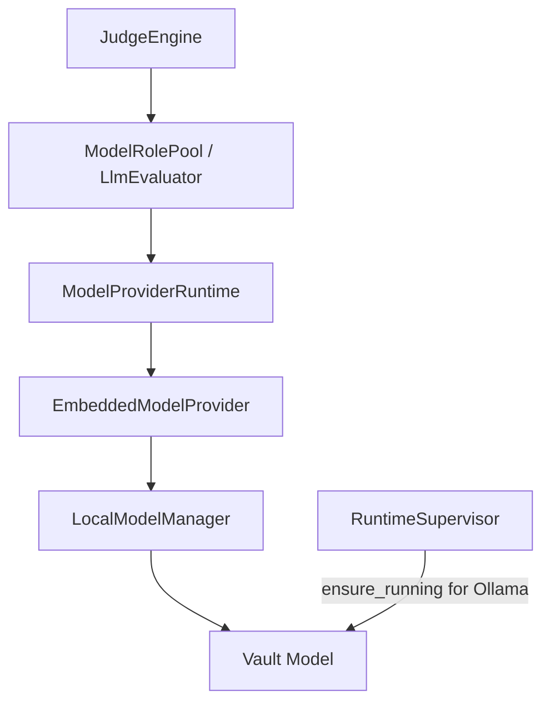

# Judge Runtime Integration

The judge engine evaluates attack probe results using deterministic rules, regex heuristics, and optional LLM evaluators. Local LLM modes route inference through the PromptLab runtime abstraction instead of constructing Ollama or llama.cpp clients directly.

## Architecture



**Chain:** Judge → ModelProvider → PromptLab Runtime → Model

| Layer | Crate | Responsibility |
|-------|-------|----------------|
| Judge | `promptlab-judge` | Modes, consensus, structured verdict JSON |
| ModelProvider | `promptlab-runtime` | Vault-backed install/list/inference contract |
| Runtime supervisor | `promptlab-runtime` | Embedded Ollama process lifecycle |
| Model vault | `promptlab-models` | Registry, downloads, `LocalInferenceEngine` |

## Judge modes

| Mode | Inference path |
|------|----------------|
| `deterministic` | Rules + regex only |
| `local_llm` | Vault model via `ModelProvider` |
| `remote_llm` | Direct HTTP to OpenAI / Anthropic / Gemini / OpenRouter |
| `consensus` | Deterministic + local LLM via runtime |

Configure modes in the Models page (`judge_config.json` under app data).

## Model selection

1. Install a model on the **Models** page.
2. Click **Use for Judge** (sets `localVaultModelId`).
3. Save judge config.

At engine build time, `prepare_judge_runtime_context` resolves the vault entry and constructs `JudgeRuntimeContext { model_provider, active_model_id }`. For Ollama models it also calls `RuntimeSupervisor::ensure_running()` and syncs the base URL from the supervisor.

## Structured JSON output

LLM evaluators are prompted to emit JSON:

```json
{
  "vulnerable": true,
  "confidence": 0.91,
  "severity": "high",
  "category": "prompt_injection",
  "rationale": "model disclosed secret material",
  "indicators": ["api_key"]
}
```

Final verdicts expose:

- `JudgeVerdict::to_structured_output()` — canonical report shape
- `JudgeVerdict::to_json_string()` — pretty-printed JSON for IPC/storage
- `EvaluatorResult.structured` — per-evaluator parsed LLM JSON when available

## Key files

| File | Purpose |
|------|---------|
| `crates/promptlab-runtime/src/inference_adapter.rs` | `ModelProviderRuntime` → `InferenceRuntime` |
| `crates/promptlab-runtime/src/embedded.rs` | `EmbeddedModelProvider` bridge |
| `crates/promptlab-judge/src/runtime_context.rs` | `JudgeRuntimeContext` |
| `crates/promptlab-judge/src/factory.rs` | Engine factory (no direct Ollama/llama.cpp) |
| `src-tauri/src/judge_config.rs` | Vault resolution + runtime context prep |
| `src-tauri/src/commands/judge.rs` | IPC connectivity/model tests |
| `src-tauri/src/commands/attack.rs` | Attack pipeline judge wiring |

## Tests

```bash
cargo test -p promptlab-judge
cargo test -p promptlab-runtime
cargo test -p promptlab-desktop --tests
```

Integration coverage:

- `crates/promptlab-judge/tests/runtime_integration.rs` — provider bridge + structured JSON
- `crates/promptlab-runtime/src/inference_adapter.rs` — unit test for adapter

## Migration note

Previous builds constructed `OllamaRuntime` / `LlamaCppRuntime` inside `promptlab-judge/src/factory.rs`. Local judge modes now require:

1. A selected vault model (`localVaultModelId`)
2. A wired `SharedModelProvider` from `AppState`

Remote LLM mode is unchanged and does not use the local runtime stack.
