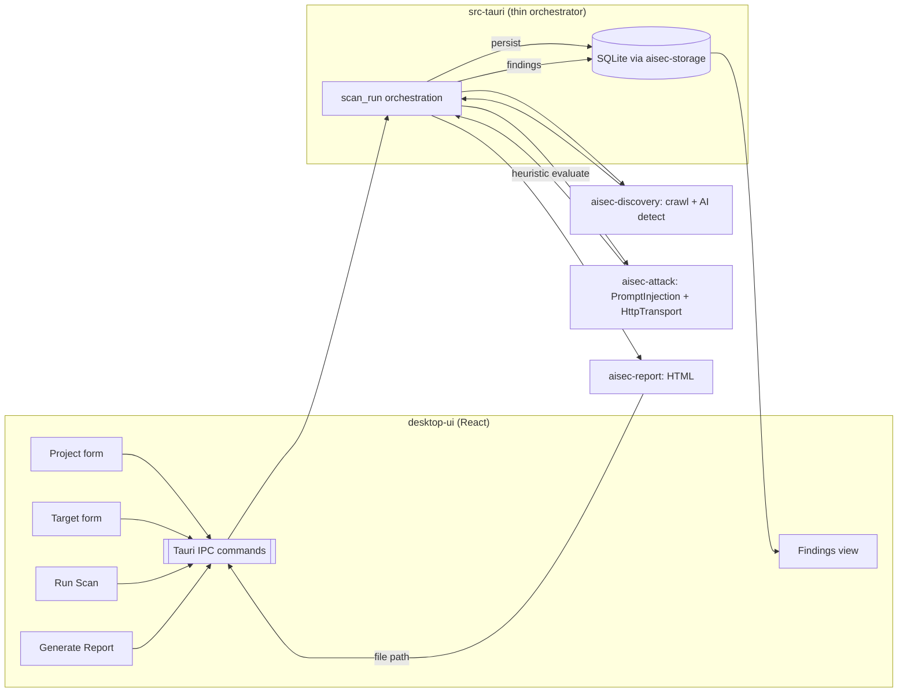

# AISec — MVP Execution Plan (First Real Scan)

**Author role:** Principal Software Architect
**Date:** 2026-06-11
**Source of truth:** `docs/REAL_IMPLEMENTATION_AUDIT.md` (per-module status, verified by live build/test)
**Goal:** Define the **smallest** AISec MVP that performs a **real** end-to-end scan against a live
target — not mock data — through the desktop app.

> Planning document only. No code is written or modified here. "Gaps" describe work to be done in a
> later implementation phase.

---

## 1. MVP definition

A user can, **inside the desktop app**, run one real assessment end-to-end:

1. **Launch desktop app**
2. **Create project**
3. **Add target URL**
4. **Crawl target**
5. **Discover AI endpoints**
6. **Execute a Prompt Injection attack**
7. **Evaluate the result**
8. **Generate an HTML report**

"Real" means: live HTTP against the target, results persisted to SQLite, and an HTML report written
to disk from those persisted findings. No mock store, no fabricated findings.

### Deliberately out of scope for the MVP
Authenticated targets, provider fingerprinting, LLM-based judging, local model download/inference,
plugins, PDF/SARIF/JSON reports, streaming/cancellable runs, multi-attack orchestration, DAG
scheduling, encryption-at-rest, and CI. These map to **optional modules** (§4) and a later phase.

---

## 2. The 8-step flow → module map

Legend for "Module readiness" uses the audit's labels (COMPLETE / PARTIAL / BROKEN / SKELETON / MOCK).

| # | Step | Primary module(s) | Module readiness | What already works | Gap to close for MVP |
|---|------|-------------------|------------------|--------------------|----------------------|
| 1 | Launch desktop app | `desktop-ui` (Tauri shell + React) | PARTIAL / backend SKELETON | App boots, routes, renders, `health`/`app_info` IPC | None functional; backend must gain a DB + domain commands (steps 2-8) |
| 2 | Create project | `aisec-storage` (project repo) + `desktop-ui` | storage BROKEN-on-test / lib OK | `ProjectRepository::create` is real SQL | No IPC command; no form/handler (button is dead); store is mock; Tauri doesn't open a DB |
| 3 | Add target URL | `aisec-storage` (target repo) + `desktop-ui` | lib OK | `TargetRepository::create` is real SQL | Same as step 2: no IPC, no form, no persistence wiring |
| 4 | Crawl target | `aisec-discovery` (crawler, client, url_policy) | BROKEN | Single-worker BFS crawl, link extraction, SSRF guard all real | **Multi-worker deadlock** (default 8) → must run `worker_count: 1`; `localhost` blocked → needs `allow_private_network`; no IPC; endpoints not persisted |
| 5 | Discover AI endpoints | `aisec-discovery` (AI detector + static probes) | BROKEN (crate) / detector real | AI path/JSON detection real; finds `/v1/models` etc. | **POST-only blind spot**: `/v1/chat/completions` missed when GET→404; no persistence of discovered endpoints |
| 6 | Execute Prompt Injection | `aisec-attack` (prompt_injection, executor, HTTP transport) + `aisec-payload` (transitive) | attack BROKEN-on-test / lib OK | Production path real: `default_executor()` → `HttpTransport`; 3 built-in injection payloads + heuristic eval | No IPC; no mapping discovered endpoint → `AttackTarget`; no result persistence |
| 7 | Evaluate result | `aisec-attack` built-in evaluator (MVP) **or** `aisec-judge` (optional) | attack eval real / judge BROKEN | `PromptInjection::evaluate()` returns severity + indicators with no extra deps | If judge is added: its **consensus bug only affects secret/`API key:` detection, not injection** — rule evaluator works; still optional for MVP |
| 8 | Generate HTML report | `aisec-report` (HTML formatter, data builder) | PARTIAL | HTML formatter + `ReportDataBuilder::from_storage_findings` are real and tested | No IPC; must map persisted findings → `ReportInput`; write file + reveal/open it |

---

## 3. Required modules (must ship in the MVP)

| Module | Audit status | MVP role | MVP readiness notes |
|--------|--------------|----------|---------------------|
| `aisec-core` | COMPLETE | Errors + logging used everywhere | Ready as-is |
| `aisec-storage` | BROKEN (test compile only) | Persist project, target, scan, finding | **Library compiles and runs**; only the test harness fails (missing `ScanRepository` import). Production path is usable; recommend fixing tests for CI |
| `aisec-discovery` | BROKEN | Crawl (step 4) + AI endpoint detection (step 5) | Usable **only** with `worker_count: 1` + `allow_private_network` for local targets; POST-only detection gap limits coverage |
| `aisec-payload` | COMPLETE | Transitive dependency of `aisec-attack`; supplies injection payloads/mutators | Ready; mutations can be left at defaults or disabled |
| `aisec-attack` | BROKEN (test compile only) | Execute prompt injection (step 6) + built-in evaluation (step 7) | **Library compiles and runs**; only a unit test fails (`PayloadRunner::new` borrow). Production executor path is correct |
| `aisec-report` | PARTIAL | HTML report (step 8) | HTML formatter is real and tested; PDF/SARIF/JSON not needed for MVP |
| `desktop-ui` | PARTIAL (backend SKELETON) | The app itself: project/target forms, scan trigger, results view, report button | Frontend shell exists; needs real IPC calls + a thin domain command surface in the Tauri backend |

**Minimum dependency change:** the Tauri crate (`src-tauri`) must depend on `aisec-storage`,
`aisec-discovery`, `aisec-attack`, `aisec-report` (and transitively `aisec-payload`, `aisec-core`)
— today it links **only `aisec-core`**.

---

## 4. Optional modules (defer past the MVP)

| Module | Audit status | Why optional for this flow |
|--------|--------------|----------------------------|
| `aisec-fingerprint` | COMPLETE | Step 5 only needs to *discover* AI endpoints; provider identification is value-add, not required. Cheap to add later (already complete). |
| `aisec-judge` | BROKEN | Step 7 is satisfied by `aisec-attack`'s built-in heuristic evaluator. Judge adds rule+regex+LLM consensus; its known bug affects secret detection, not injection, but it is unnecessary for MVP. |
| `aisec-models` | PARTIAL | Only needed if judging uses a local LLM. MVP uses heuristic/rule evaluation, so no `llama-server`, no model download. |
| `aisec-auth` | BROKEN | Needed only for authenticated targets. MVP targets an unauthenticated URL. **Caveat:** keep it building in the unified workspace build; do not pull it into the MVP runtime path. |
| `aisec-plugin-host` | PARTIAL | Extensibility; not part of the core scan loop. |

---

## 5. Blocking gaps (ranked)

These are the gaps that **must** be closed (or worked around as noted) before the 8-step flow runs
for real. Most are **integration** gaps, not domain-logic gaps.

### B1 — No integration spine (CRITICAL)
The Tauri shell links only `aisec-core`; there is no path from the UI to storage or any engine.
- Add domain crate dependencies to `src-tauri`.
- Add a `Database` handle to `AppState` and open SQLite on startup (storage migrations already run on `connect()`).
- Without this, **no step beyond launch is possible**.

### B2 — No domain IPC command surface (CRITICAL)
Only `health` and `app_info` exist. The MVP needs a minimal command set (see §6).
- Without commands, the frontend cannot create projects/targets or trigger a scan.

### B3 — Frontend is mock-fed with dead actions (CRITICAL)
The store is seeded from `src/shared/mock/data.ts`; "New Project", "Add Target", "Start Scan",
"Generate Report" buttons have no handlers; nothing persists.
- Replace mock-backed reads with IPC calls; wire the four actions; render persisted findings.

### B4 — Discovery crawler deadlock with `worker_count > 1` (HIGH, avoidable)
Default config ships `worker_count: 8`, which deadlocks; the verification example uses `1`.
- **MVP workaround (no code fix required):** the scan command must pass `worker_count: 1`.
- **Recommended:** fix the worker-pool notify race so defaults are safe.

### B5 — Local targets blocked by SSRF policy (HIGH, config)
`DiscoveryConfig::default()` rejects `localhost`/private IPs.
- The scan command must set `allow_private_network: true` for local/test targets (and expose this as an explicit, opt-in setting in the UI for safety).

### B6 — AI endpoint POST-only blind spot (MEDIUM)
`probe_ai_paths` skips the POST probe when a GET returns 404, so `/v1/chat/completions` can be
missed even though it's the canonical injection target.
- **MVP mitigation:** allow the user-entered target URL (or a discovered host) to be used directly as the attack endpoint, so step 6 does not depend solely on auto-discovering the chat path.
- **Recommended:** fix the detector to POST when GET is 404/405.

### B7 — Discovery → attack → report data mapping (MEDIUM)
No code converts a `DiscoveredEndpoint` into an `AttackTarget`, nor attack outcomes into stored
`Finding`s, nor stored findings into a `ReportInput`.
- `aisec-report::ReportDataBuilder::from_storage_findings` exists; the storage→attack and discovery→attack adapters do not. This is glue code in the orchestration layer.

### B8 — No scan orchestration entry point (MEDIUM)
There is no single function that runs crawl → discover → attack → evaluate → persist. `aisec-attack`
has an internal sequential orchestrator for *attacks only*; the cross-engine pipeline is absent.
- The MVP needs a thin orchestrator (can live in `src-tauri` or a small new module) invoked by the scan command.

---

## 6. Minimal IPC contract for the MVP

Smallest command set to drive the flow (synchronous is acceptable for MVP; streaming/cancellation
deferred). Described as a contract, not implementation.

| Command | Input | Output | Backs step |
|---------|-------|--------|------------|
| `project_create` | `{ name, description? }` | `Project` | 2 |
| `project_list` | `{}` | `Project[]` | 2 |
| `target_create` | `{ project_id, url }` | `Target` | 3 |
| `scan_run` | `{ target_id, allow_private_network, worker_count=1 }` | `{ scan_id, endpoints[], findings[] }` | 4-7 |
| `findings_list` | `{ scan_id }` | `Finding[]` | 7 |
| `report_generate` | `{ scan_id, format: "html" }` | `{ path }` | 8 |

`scan_run` is the MVP's composite operation: validate URL → crawl (`worker_count: 1`) → run static
AI probes → for each AI/likely endpoint build an `AttackTarget` → execute `PromptInjection` via
`HttpTransport` → evaluate with the built-in heuristic → persist scan + findings.

---

## 7. End-to-end data flow (target state for the MVP)

Optional later: `aisec-fingerprint` after discovery; `aisec-judge` (+`aisec-models`) in place of the
built-in evaluator; `aisec-auth` before crawl for authenticated targets.

---

## 8. Known issues that are NOT MVP blockers

These appear in the audit as red items but do **not** block the MVP runtime (they should still be
fixed for CI/quality):

- `aisec-storage` / `aisec-attack` **test** compile errors — the production libraries build and run; only `cargo test` for those crates fails.
- `aisec-judge` failing test and `aisec-plugin-host` failing test — both modules are optional/excluded from the MVP.
- `aisec-auth` not compiling in isolation — excluded from the MVP path; keep it out of `src-tauri`'s dependency set so it doesn't enter the app build.
- PDF/SARIF/JSON report limitations — MVP ships HTML only.
- No encryption at rest — acceptable for an MVP demo; required before handling real credentials (which the MVP avoids).

---

## 9. Definition of done (MVP acceptance)

The MVP is complete when, against a live unauthenticated test target, a user can in the desktop app:

1. Create a project and see it persist across an app restart (SQLite-backed).
2. Add a target URL under that project.
3. Trigger a scan that performs **real HTTP** crawling and AI endpoint discovery.
4. Have at least one discovered/target endpoint receive a **real Prompt Injection** request.
5. See the attack's evaluation produce a persisted finding with severity and evidence.
6. Generate an **HTML report** on disk built from the persisted finding(s) and open it.

No mock data may appear in any of the above; the "Connected" state must reflect a real DB-backed
backend, not the current mock fallback.

---

## 10. Summary

| Category | Modules |
|----------|---------|
| **Required** | `aisec-core`, `aisec-storage`, `aisec-discovery`, `aisec-payload`, `aisec-attack`, `aisec-report`, `desktop-ui` |
| **Optional** | `aisec-fingerprint`, `aisec-judge`, `aisec-models`, `aisec-auth`, `aisec-plugin-host` |
| **Blocking gaps** | B1 integration spine · B2 IPC surface · B3 un-mock the UI · B4 crawler `worker_count:1` · B5 `allow_private_network` · B6 AI POST probe · B7 cross-engine data mapping · B8 scan orchestrator |

**Bottom line:** every domain capability the MVP needs already exists as real library code. The MVP
is overwhelmingly an **integration effort** — open a database in the Tauri shell, add ~6 IPC
commands and a thin `scan_run` orchestrator, replace the mock store with IPC calls, and apply two
discovery configuration constraints (`worker_count: 1`, `allow_private_network`). The only domain
bug that materially limits the happy path is the AI POST-only detection gap (B6), which the MVP
sidesteps by allowing the user-supplied URL to be attacked directly.
