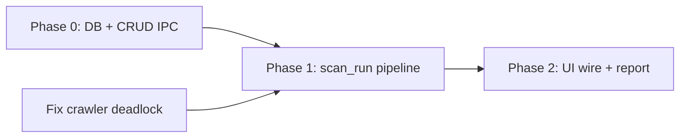

# MVP Gap Analysis

**Date:** 2026-06-10  
**Goal:** Shortest path to a working end-to-end MVP  
**Flow:** Create Project → Add Target URL → Run Discovery → Prompt Injection Scan → Evaluate Results → HTML Report

---

## Executive Summary

PromptLab has **complete domain libraries** for every MVP step, but **zero integration** between them and the desktop app. The UI renders the workflow with mock data; Tauri exposes only `health` and `app_info`.

**The blocker is not missing engines — it is the missing integration spine.**

```
┌─────────────┐     ┌──────────────┐     ┌─────────────────────────────────────┐
│  React UI   │ ─X─ │  src-tauri   │ ─X─ │  promptlab-storage                      │
│  (mock)     │     │  (2 IPC)     │     │  promptlab-discovery                    │
└─────────────┘     └──────────────┘     │  promptlab-attack                       │
                                           │  promptlab-judge                        │
                                           │  promptlab-report                       │
                                           └─────────────────────────────────────┘
                                                    ↑ all implemented, not wired
```

**Shortest path:** Add one Tauri orchestration layer (`scan_run`) that chains existing crates, plus minimal IPC for project/target CRUD and UI forms. **No new Rust crates required.** Estimated **~1–1.5k LOC** focused in `src-tauri/` + frontend IPC.

**Critical pre-requisite:** Fix discovery crawler deadlock (`worker_count > 1`) before relying on default discovery config in production scans.

---

## MVP Flow — Step-by-Step Gap Matrix

| Step | User action | Implemented (library) | Implemented (app) | Blocking gap |
|------|-------------|---------------------|-------------------|--------------|
| **1** | Create project | ✅ | ❌ | No IPC, no form, no DB in Tauri |
| **2** | Add target URL | ✅ | ❌ | No IPC, no form, no persistence in UI |
| **3** | Run discovery | ✅ | ❌ | No trigger, no scan record, crawler bug |
| **4** | Prompt injection scan | ✅ | ❌ | No pipeline glue, needs API endpoint URL |
| **5** | Evaluate results | ✅ | ❌ | Judge not invoked, findings not saved |
| **6** | HTML report | ✅ | ❌ | No export IPC, UI uses mock reports |

---

## Step 1 — Create Project

### Already implemented

| Module | Location | Capability |
|--------|----------|------------|
| **Database** | `crates/promptlab-storage` | SQLite pool, migrations, WAL |
| **Project model** | `crates/promptlab-storage/src/models.rs` | `CreateProject`, `Project`, `UpdateProject` |
| **Project repository** | `crates/promptlab-storage/src/repositories/sqlite/project.rs` | `create`, `list`, `get`, `update`, `delete` |
| **UI (read-only)** | `src/features/projects/ProjectsPage.tsx` | Table renders project list from mock store |

### Blocking this step

| Blocker | Type | Notes |
|---------|------|-------|
| Tauri does not depend on `promptlab-storage` | **Integration** | `src-tauri/Cargo.toml` → only `promptlab-core` |
| `AppState` has no `Database` | **Integration** | `state.rs` holds log guard only |
| No `project_create` / `project_list` IPC | **Integration** | `lib.rs` registers 2 commands |
| No create-project UI | **Frontend** | Projects page has no modal/form |
| Frontend uses mock projects | **Frontend** | `AppStore.tsx` seeds from `mock/data.ts` |
| No IPC client functions | **Frontend** | `client.ts` → `healthCheck`, `getAppInfo` only |

### Shortest fix

1. Open DB at Tauri startup (`Database::connect` → `~/.promptlab/promptlab.db`)
2. Add `project_create`, `project_list` commands
3. Add "New Project" modal + `LOAD_PROJECTS` store action

**No new crate. No schema change.**

---

## Step 2 — Add Target URL

### Already implemented

| Module | Location | Capability |
|--------|----------|------------|
| **Target model** | `promptlab-storage/src/models.rs` | `CreateTarget` with `descriptor_json` |
| **Target repository** | `repositories/sqlite/target.rs` | CRUD, list by project |
| **URL validation** | `promptlab-discovery/src/url_policy.rs` | `validate_target_url()` — reuse in IPC |
| **UI (read-only)** | `src/features/targets/TargetsPage.tsx` | Table from mock data |

### Blocking this step

| Blocker | Type | Notes |
|---------|------|-------|
| No `target_create` / `target_list` IPC | **Integration** | Same spine gap as Step 1 |
| No add-target form | **Frontend** | Button not wired |
| `target_type` not chosen for MVP | **Design** | Must set `llm_api` or `web` for downstream attack routing |
| Default SSRF policy blocks localhost | **Config** | Discovery needs `allow_private_network: true` for local dev |

### Shortest fix

1. `target_create(project_id, name, url, target_type)` command
2. Store URL in `descriptor_json: {"url": "..."}`
3. Add target modal on Targets page

**Depends on:** Step 1 (project must exist).

---

## Step 3 — Run Discovery

### Already implemented

| Module | Location | Capability |
|--------|----------|------------|
| **Discovery engine** | `crates/promptlab-discovery` | `DiscoveryEngine::discover(seed_url)` |
| **Crawler** | `crawler.rs` | BFS, depth/page limits, link extraction |
| **Static probes** | `detectors/paths.rs` | OpenAPI, GraphQL, AI path lists |
| **Detectors** | `detectors/{openapi,graphql,ai,api}.rs` | Classify endpoints |
| **Report type** | `types.rs` | `DiscoveryReport`, `DiscoveredEndpoint`, `EndpointKind` |
| **Scan model** | `promptlab-storage` | `CreateScan`, status field (`pending/running/completed`) |
| **UI shell** | `DiscoveryPage.tsx` | Cards + "Start Scan" button (inert) |

### Blocking this step

| Blocker | Type | Notes |
|---------|------|-------|
| Nothing invokes `DiscoveryEngine` from app | **Integration** | Library-only today |
| No scan lifecycle (create → running → complete) | **Integration** | Repos exist, not called |
| Discovery results not persisted | **Storage** | No `discovered_endpoints` table; use JSON column on `scans` for MVP |
| **Crawler deadlock** (`worker_count > 1`) | **Bug** | Hangs indefinitely — must fix or force `worker_count: 1` |
| AI probe skips POST-only paths on GET 404 | **Bug** | Misses `/v1/chat/completions`-style endpoints |
| No progress events to UI | **Integration** | Optional for MVP; sync command acceptable |
| Discovery UI reads mock jobs | **Frontend** | `mockDiscoveryJobs` |

### Shortest fix

1. Single command `scan_run(target_id)` — phase 1 runs discovery only, OR full pipeline (Steps 3–6 together)
2. Persist `DiscoveryReport` JSON on scan row
3. Fix crawler deadlock **or** hardcode `worker_count: 1` until fixed
4. Return endpoint list to frontend

**Depends on:** Steps 1–2 (target URL is discovery seed).

---

## Step 4 — Run Prompt Injection Scan

### Already implemented

| Module | Location | Capability |
|--------|----------|------------|
| **Prompt injection attack** | `promptlab-attack/src/attacks/prompt_injection.rs` | 3 default payloads, plan, evaluate |
| **Attack executor** | `promptlab-attack/src/executor.rs` | `execute_category(PromptInjection, ctx)` |
| **HTTP transport** | `promptlab-attack/src/transport/http.rs` | POST with JSON body template |
| **Attack target** | `promptlab-attack/src/types.rs` | `AttackTarget::llm_api(url)` with `{{payload}}` placeholder |
| **Attack context** | `types.rs` | `scan_id`, `probe_id`, budget |
| **Attack results storage** | `promptlab-storage` | `CreateAttackResult`, repository |
| **Payload pipeline** | `promptlab-payload` | Mutations (optional; attack has built-in payloads) |
| **UI shell** | `AttacksPage.tsx` | Mock attack runs |

### Blocking this step

| Blocker | Type | Notes |
|---------|------|-------|
| No orchestrator connects discovery → attack | **Integration** | Biggest functional gap |
| No endpoint → `AttackTarget` resolver | **Logic** | Must pick AI/REST POST URL from discovery results |
| Raw website URL ≠ LLM API | **Design** | Prompt injection needs JSON API endpoint, not homepage |
| `AttackBudget.max_mutations_per_payload` ignored | **Bug** | Low priority for MVP |
| `OrchestratorConfig.concurrency` unused | **Bug** | Sequential only — OK for MVP |
| Attack results not persisted from app | **Integration** | Repository exists, not called |
| lib test compile error (`PayloadRunner`) | **Test** | Does not block runtime if executor path used |

### Shortest fix

Inside `scan_run` after discovery:

```text
1. Select endpoint: first EndpointKind::AiEndpoint, else RestApi POST path
2. Build AttackContext { scan_id, target: AttackTarget::llm_api(url) }
3. AttackExecutor::execute_category(PromptInjection, &ctx)
4. Persist attack_results rows with response evidence
```

**MVP constraint:** Target must expose a discoverable AI API path (e.g. `/v1/chat/completions`) **or** user provides explicit API URL in target descriptor.

**Depends on:** Step 3 (endpoints list).

---

## Step 5 — Evaluate Results

### Already implemented

| Module | Location | Capability |
|--------|----------|------------|
| **Judge engine** | `crates/promptlab-judge` | `JudgeEngine::judge_deterministic()` — no LLM required |
| **Rule evaluator** | `evaluators/rule.rs` | Substring signals per attack category |
| **Regex evaluator** | `evaluators/regex.rs` | Credential/pattern matching |
| **Consensus scoring** | `scoring.rs` | Weighted vote, confidence |
| **Finding model** | `promptlab-storage` | `CreateFinding`, severity, evidence_json |
| **Finding repository** | `repositories/sqlite/finding.rs` | CRUD, FTS5 search |
| **Inline attack evaluate** | `prompt_injection.rs` | Basic indicators (alternative to judge) |
| **UI shell** | `FindingsPage.tsx` | Mock findings, local status toggle only |

### Blocking this step

| Blocker | Type | Notes |
|---------|------|-------|
| Judge not called after attack | **Integration** | Pipeline gap |
| Findings not written to SQLite | **Integration** | Repository unused by app |
| Judge → `CreateFinding` mapper missing | **Integration** | ~30 LOC glue |
| Regex/consensus false negative | **Bug** | `"API key:"` not matched; 1 integration test fails |
| `finding_list` IPC missing | **Integration** | UI cannot load real findings |
| Attack inline evaluate ≠ judge path | **Design** | MVP should use judge for distinct "Evaluate" step |

### Shortest fix

For each attack attempt in `scan_run`:

```text
1. JudgeRequest { probe_id, attack_category, payload, response_text }
2. deterministic_engine().judge_deterministic(request)
3. If verdict.vulnerable → CreateFinding → repos.findings().create()
4. Return findings_count in scan summary
```

Fix judge regex before MVP sign-off (or lower consensus threshold for deterministic-only).

**Depends on:** Step 4 (attack responses).

---

## Step 6 — Generate HTML Report

### Already implemented

| Module | Location | Capability |
|--------|----------|------------|
| **Reporting engine** | `crates/promptlab-report/src/engine.rs` | `generate(Html, input)` → writes file |
| **HTML formatter** | `formatters/html.rs` | Full report template |
| **Report data builder** | `data.rs` | `ReportDataBuilder::build()`, `from_storage_findings()` |
| **Report repository** | `promptlab-storage` | `CreateReport`, list by project |
| **UI shell** | `ReportsPage.tsx` | Mock report list |

### Blocking this step

| Blocker | Type | Notes |
|---------|------|-------|
| No `report_generate` IPC | **Integration** | |
| Findings not loaded from DB into `ReportInput` | **Integration** | Builder exists, not wired |
| Report file path not returned to UI | **Integration** | |
| Tauri filesystem permissions for write/open | **Config** | `capabilities/default.json` may need scope |
| UI export button inert | **Frontend** | |

### Shortest fix

1. `report_generate(scan_id)` command:
   - Load scan, project, target, findings from storage
   - `ReportDataBuilder::from_storage_findings()` → `build()`
   - `ReportingEngine::new(app_data/reports).generate(Technical, Html, &input)`
   - Insert `CreateReport` row
   - Return `{ path, filename }`
2. Frontend: "Generate Report" → invoke → show path / open file

**Depends on:** Step 5 (findings in DB).

---

## The Single Blocker: Integration Spine

Every step fails at the same architectural gap:

| Layer | Status | MVP requirement |
|-------|--------|-----------------|
| **React UI** | Mock-driven | IPC calls + forms for steps 1–2, 6; display scan results 3–5 |
| **Tauri IPC** | 2 bootstrap commands | ~8 domain commands (see below) |
| **AppState** | Log guard only | `Database` + app paths |
| **Orchestrator** | Does not exist in app | One `scan_run` function chaining crates |
| **Domain crates** | Complete as libraries | Already done |

### Minimum IPC surface (shortest path)

| Command | Steps served |
|---------|--------------|
| `project_create` | 1 |
| `project_list` | 1 |
| `target_create` | 2 |
| `target_list` | 2 |
| `scan_run` | 3, 4, 5 (discovery + attack + judge + persist) |
| `finding_list` | 5 (UI refresh) |
| `report_generate` | 6 |

**Seven commands.** Steps 3–5 can be one async command for MVP (no separate discovery/attack buttons required).

---

## Module Inventory — Implemented vs Blocking

### ✅ Implemented (ready to wire)

| Module | Crate | MVP role |
|--------|-------|----------|
| Core errors/logging | `promptlab-core` | IPC error mapping |
| SQLite + repos | `promptlab-storage` | Projects, targets, scans, findings, reports, attack results |
| Discovery engine | `promptlab-discovery` | Step 3 |
| Attack framework | `promptlab-attack` | Step 4 |
| Payload library | `promptlab-payload` | Optional; built-in payloads sufficient |
| Judge engine | `promptlab-judge` | Step 5 |
| Report engine | `promptlab-report` | Step 6 |
| Desktop shell | `src-tauri` | Host — needs deps + commands |
| UI pages | `src/features/*` | Shell — needs forms + IPC |

### ❌ Blocking (must build or fix)

| Blocker | Affects steps | Effort |
|---------|---------------|--------|
| Tauri ↔ storage wiring | 1, 2, 5, 6 | Small |
| `scan_run` orchestrator in Tauri | 3, 4, 5 | Medium |
| 7 IPC commands | All | Medium |
| Frontend forms + IPC client | 1, 2, 6 | Medium |
| Discovery crawler deadlock | 3 | Small (bug fix) |
| Endpoint → attack URL resolver | 4 | Small |
| Judge regex/consensus fix | 5 | Small |
| Discovery result persistence (JSON column) | 3 | Small (migration) |
| AI probe GET/404 skip POST | 3, 4 | Small (bug fix) |

### ⏭ Not needed for MVP (skip)

| Module | Reason |
|--------|--------|
| `promptlab-plugin-host` | Plugins out of scope |
| `promptlab-models` / llama.cpp | Deterministic judge only |
| `promptlab-auth` / Playwright | Unauthenticated targets only |
| `promptlab-fingerprint` | Nice-to-have post-discovery |
| All 8 other attack categories | Prompt injection only |
| PDF/SARIF export | HTML only |
| Run Console / streaming events | Sync `scan_run` sufficient |
| `promptlab-orchestrator` crate | Inline in Tauri for MVP |
| Zustand / generated IPC types | Context store + hand-written DTOs OK |

---

## Shortest Path — Implementation Order



### Phase 0 — Unblock Steps 1 & 2 (~2–3 days)

- [ ] Add crate deps to `src-tauri/Cargo.toml`
- [ ] `AppState { db: Database, reports_dir, ... }`
- [ ] `project_create`, `project_list`, `target_create`, `target_list`
- [ ] Frontend: New Project + Add Target modals
- [ ] Hydrate store from IPC on app boot

**Exit:** Create project + target; survives app restart.

### Phase 1 — Core pipeline (~3–4 days)

- [ ] Fix crawler deadlock (or ship with `worker_count: 1`)
- [ ] Migration: `scans.discovery_json` or equivalent
- [ ] Implement `scan_run(target_id)`:
  - create scan → discover → resolve endpoint → prompt injection → judge → findings → complete scan
- [ ] `finding_list(scan_id)`

**Exit:** CLI/Tauri invoke completes full scan; findings in SQLite.

### Phase 2 — Report + polish (~1–2 days)

- [ ] `report_generate(scan_id)` → HTML on disk
- [ ] Findings + Reports UI from backend
- [ ] Fix judge regex false negative
- [ ] Fix AI probe POST skip (optional but recommended)

**Exit:** User completes all 6 MVP steps from desktop app.

---

## Pre-existing Bugs That Block a Reliable MVP

| Bug | Step | Workaround |
|-----|------|------------|
| Crawler deadlock (`worker_count > 1`) | 3 | Force `worker_count: 1` |
| AI probe skips POST on GET 404 | 3, 4 | Fix probe logic; or seed target with GET-able AI path |
| Judge regex misses `"API key:"` | 5 | Fix pattern or use rule-only consensus |
| localhost blocked by default | 3 | `allow_private_network: true` in scan config |
| Storage lib tests don't compile | — | Does not block runtime |
| Plugin manifest drift | — | Not MVP |

---

## Architecture Decision: One Command vs Many

**Recommended for shortest path:** Single `scan_run(target_id)` that runs Steps 3–5 sequentially. UI can show progress as "Running scan…" without event streaming.

| Approach | Pros | Cons |
|----------|------|------|
| **One `scan_run`** | Minimal IPC, fastest to ship | No pause/resume, no step-by-step UI |
| Separate discovery/attack commands | Better UX control | 2× IPC surface, more frontend state |

For MVP, **one command wins**.

---

## Definition of Done

- [ ] User creates project and target URL in UI → persisted in `~/.promptlab/promptlab.db`
- [ ] User clicks "Run Scan" → discovery crawls target
- [ ] Prompt injection executes against resolved API endpoint
- [ ] Findings appear in Findings page (from DB, not mock)
- [ ] User generates HTML report → file opens in browser
- [ ] Restart app → project, target, findings, report metadata still present
- [ ] Scan completes without hang (crawler fix verified)

---

## Summary Table

| Step | Library ready? | App ready? | Blocker |
|------|----------------|------------|---------|
| 1. Create project | ✅ | ❌ | IPC + UI + DB in Tauri |
| 2. Add target URL | ✅ | ❌ | IPC + UI |
| 3. Run discovery | ✅ (with bugs) | ❌ | `scan_run` + persistence + crawler fix |
| 4. Prompt injection | ✅ | ❌ | Orchestrator glue + endpoint resolver |
| 5. Evaluate results | ✅ (1 test fail) | ❌ | Judge in pipeline + finding persist + IPC |
| 6. HTML report | ✅ | ❌ | `report_generate` + UI |

**Bottom line:** All six steps have **working library implementations**. The MVP is blocked entirely by **Tauri integration** (~7 IPC commands + one orchestrator) and **two discovery/judge bugs**. No new domain crates are required.

---

*See also: `MVP_CHECKLIST.md`, `STATUS.md`, `DISCOVERY_VERIFICATION_REPORT.md`*
