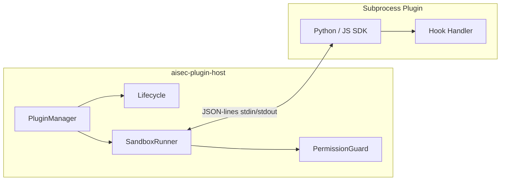

# AISec Plugin SDK

Extend AISec with custom **discovery**, **attack**, **judge**, and **report** plugins in **Python** or **JavaScript**. Plugins run in a sandboxed subprocess with explicit capability permissions and a JSON-lines host protocol.

## Architecture



| Component | Path | Role |
|-----------|------|------|
| Plugin Host | `crates/aisec-plugin-host` | Discovery, lifecycle, sandbox, permissions |
| Python SDK | `packages/plugin-sdk-python` | Handler registration, protocol, typed bases |
| JavaScript SDK | `packages/plugin-sdk-js` | Same API surface for Node |
| Samples | `plugins/samples/` | Reference plugins (all four types) |

## Plugin types

| Type | Default hook | Purpose |
|------|--------------|---------|
| `discovery` | `discover` | Enumerate endpoints, paths, AI surfaces |
| `attack` | `execute_attack` | Generate or mutate attack payloads |
| `judge` | `evaluate` | Score model responses for vulnerability |
| `report` | `render_report` | Custom report formats |

## Manifest (`aisec-plugin.toml`)

```toml
[plugin]
id = "com.vendor.my-plugin"
name = "My Plugin"
version = "1.0.0"
api_version = "1"
plugin_type = "attack"
language = "javascript"

[runtime]
type = "subprocess"
entry = "plugin.js"
interpreter = "node"
min_aisec = "0.1.0"

[capabilities]
log = true
probe_mutate = true

[hooks]
execute_attack = "execute_attack"
```

### Versioning

- **`plugin.version`** — SemVer for the plugin release.
- **`plugin.api_version`** — Host protocol version (currently `"1"`).
- **`runtime.min_aisec`** — Minimum AISec host version (SemVer requirement).

The host rejects manifests with mismatched `api_version` or incompatible `min_aisec`.

## Lifecycle

```
Discovered → Installed → Enabled → Loaded → Active → Loaded
                ↓                      ↓
            Disabled ←────────────── Error
```

| State | Meaning |
|-------|---------|
| `discovered` | Manifest found on disk |
| `installed` | Registered in PluginManager |
| `enabled` | Allowed to execute |
| `loaded` | Subprocess spawned for invoke |
| `active` | Hook handler running |
| `disabled` | User or policy blocked |
| `error` | Invoke or validation failure |

## Sandboxing

Subprocess plugins receive a stripped environment:

| Variable | Description |
|----------|-------------|
| `AISEC_PLUGIN_ID` | Plugin identifier |
| `AISEC_PLUGIN_DIR` | Install directory |
| `AISEC_HOST_API` | Host API version |
| `AISEC_SANDBOX` | `"1"` when sandboxed |
| `AISEC_NO_NETWORK` | Set when network is blocked |

Defaults:

- **30s** execution timeout
- Sensitive env vars removed (`OPENAI_API_KEY`, `AWS_SECRET_ACCESS_KEY`, …)
- No network unless `SandboxConfig.allow_network_env = true`

## Permissions (capabilities)

Plugins declare capabilities in the manifest. Host API calls from the plugin are recorded and validated:

| Host method | Capability |
|-------------|------------|
| `log` | `log` |
| `emit_finding` | `finding_emit` |
| `probe_mutate` / `mutate_probe` | `probe_mutate` |
| `http_request` | `http_request` |
| `read_resource` / `filesystem_read` | `filesystem_read` (path allowlist) |
| `filesystem_write` | `filesystem_write` |

Denied calls appear in `PluginInvokeResult.host_calls` with `allowed: false`.

## Host protocol

JSON-lines over stdin/stdout.

**Host → plugin (invoke):**

```json
{"id":"uuid","method":"discover","params":{"target_url":"https://example.com"}}
{"type":"shutdown"}
```

**Plugin → host (result):**

```json
{"id":"uuid","result":{"endpoints":[],"count":0}}
```

**Plugin → host (host API call):**

```json
{"type":"host","method":"log","params":{"level":"info","message":"done"}}
```

**Plugin → host (error):**

```json
{"id":"uuid","error":{"message":"handler failed"}}
```

## Python SDK

Install (development):

```bash
pip install -e packages/plugin-sdk-python
```

Discovery plugin:

```python
from aisec_plugin.discovery import DiscoveryPlugin

@DiscoveryPlugin.register("discover")
def discover(ctx):
    ctx.log("scanning")
    ctx.emit_finding({
        "title": "OpenAPI spec",
        "severity": "info",
        "category": "discovery",
    })
    return {"endpoints": ["/v1/models"]}

if __name__ == "__main__":
    DiscoveryPlugin.run()
```

Typed base classes: `DiscoveryPlugin`, `AttackPlugin`, `JudgePlugin`, `ReportPlugin`.

## JavaScript SDK

```javascript
import { AttackPlugin } from '../../packages/plugin-sdk-js/src/index.js';

AttackPlugin.register('execute_attack', (ctx) => {
  ctx.log('mutating payload');
  return { payload: ctx.params.payload + '\n---INJECT---' };
});

AttackPlugin.run();
```

## Plugin Manager (Rust)

```rust
use aisec_plugin_host::{PluginManager, PluginType};

let mut mgr = PluginManager::new("./plugins")?;
let ids = mgr.discover()?;
mgr.enable("com.aisec.sample.discovery-openapi")?;

let result = mgr.invoke(
    "com.aisec.sample.discovery-openapi",
    serde_json::json!({"target_url": "https://api.example.com"}),
).await?;

println!("{:?}", result.result);
```

Filter helpers: `by_type(PluginType::Judge)`, `by_language(PluginLanguage::Python)`.

Environment override: `AISEC_PLUGINS_DIR`.

## Sample plugins

| Directory | Type | Language |
|-----------|------|----------|
| `plugins/samples/discovery-openapi-paths` | Discovery | Python |
| `plugins/samples/attack-delimiter-injection` | Attack | JavaScript |
| `plugins/samples/judge-keyword` | Judge | Python |
| `plugins/samples/report-markdown-summary` | Report | JavaScript |

## Testing

```bash
cargo test -p aisec-plugin-host
```

Integration tests invoke real sample plugins when `python3` and `node` are on `PATH`.

## Future work

- WASM runtime (enterprise)
- IPC `plugin.list` / `plugin.enable` from Tauri shell
- Marketplace signing and `aisec-plugin` CLI
- Persistence via `aisec-storage` `plugins` table
