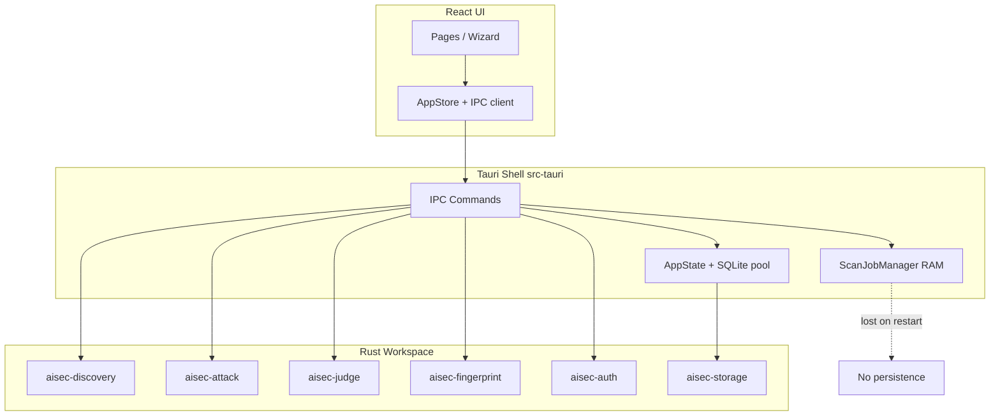

# AISec Production Readiness Report

**Version:** 1.0  
**Date:** 2026-06-13  
**Scope:** Beta release hardening review  
**Product:** AISec Desktop (Tauri 2 + React + Rust workspace)  
**Reviewer:** Automated architecture / security / ops review (codebase evidence)

---

## Executive Summary

AISec has a **solid modular foundation**: discovery, attack, judge, fingerprint, auth, and storage are implemented as separate crates with a Tauri IPC shell. Core user flows (discovery → scan → attack → findings → report) work end-to-end when the backend is connected.

**Beta readiness verdict: Conditional.** Ship Beta only after closing **4 Critical** and the **8 High-priority** items in the [Beta Release Gate](#beta-release-gate). The largest gaps are **non-durable background jobs**, **plaintext secret storage**, **blocking discovery IPC**, and **missing crash reconciliation**.

| Severity | Count | Beta impact |
|----------|------:|-------------|
| Critical | 4 | Blockers — data loss, secret exposure, broken UX after restart |
| High | 11 | Must fix before external Beta |
| Medium | 19 | Fix during Beta or document as known limitations |
| Low | 6 | Post-Beta polish |
| **Total** | **40** | |

### System overview

---

## Review Methodology

Each finding includes:

- **Severity** — Critical / High / Medium / Low  
- **Impact** — User, data, or operational consequence  
- **Recommendation** — Target state for Beta  
- **Implementation Plan** — Concrete steps, files, and acceptance criteria  

Evidence paths refer to the repository at review time (`main` branch, 2026-06-13).

---

## 1. Architecture

### ARCH-01 — Plugin host not wired to desktop

| Field | Detail |
|-------|--------|
| **Severity** | Medium |
| **Impact** | Plugin SDK (`aisec-plugin-host`) and settings UI references exist but plugins cannot load or execute; Beta marketing may over-promise extensibility. |
| **Recommendation** | Either wire plugin host into `AppState` with IPC commands, or hide plugin UI until Beta+1. |
| **Implementation Plan** | 1) Add `aisec-plugin-host` to `src-tauri/Cargo.toml`. 2) Create `commands/plugins.rs` (list, enable, run). 3) Mount plugin directory under `{data_dir}/plugins`. 4) Gate UI in Settings behind feature flag. **Acceptance:** plugin manifest loads; sandbox permissions enforced per `crates/aisec-plugin-host/src/permissions.rs`. |

### ARCH-02 — Orchestration concentrated in Tauri commands

| Field | Detail |
|-------|--------|
| **Severity** | Medium |
| **Impact** | Business logic in `commands/*.rs` is harder to unit test, reuse from CLI, or run in headless CI without Tauri. |
| **Recommendation** | Introduce a thin service layer between IPC handlers and crates. |
| **Implementation Plan** | 1) Add `src-tauri/src/services/{discovery,scan,report}.rs`. 2) Move `discovery_run_op`, `run_scan_job`, `report_generate_op` bodies into services. 3) Commands become DTO mapping only. **Acceptance:** existing integration tests pass without Tauri harness. |

### ARCH-03 — Workspace `rust-version` stale

| Field | Detail |
|-------|--------|
| **Severity** | Low |
| **Impact** | `Cargo.toml` declares `rust-version = "1.77"` but transitive deps require newer stable (≥ 1.85 per `AGENTS.md`). CI or contributors may hit confusing build failures. |
| **Recommendation** | Align manifest with tested toolchain. |
| **Implementation Plan** | Update root `Cargo.toml` `rust-version` to `1.85`; pin in CI workflow. **Acceptance:** `cargo build --workspace` on clean 1.85 stable. |

### ARCH-04 — Mock mode allows destructive UI paths

| Field | Detail |
|-------|--------|
| **Severity** | Medium |
| **Impact** | Browser-only dev (`npm run dev`) shows **Mock mode** but some pages still render flows that look successful without persisting data. |
| **Recommendation** | Hard-disable write operations when `backendConnected === false`. |
| **Implementation Plan** | 1) Add `useBackendRequired()` hook. 2) Disable Scan Wizard submit, Discovery run, Attack run, Model install when mock. 3) Banner on every page. **Acceptance:** no IPC invoke for mutating commands without backend. |

### ARCH-05 — Duplicated target descriptor parsing

| Field | Detail |
|-------|--------|
| **Severity** | Low |
| **Impact** | `seed_url_from_descriptor` duplicated in `discovery.rs` and `session_auth.rs`; drift risk when auth URL keys change. |
| **Recommendation** | Single shared parser module. |
| **Implementation Plan** | Extract `src-tauri/src/target_descriptor.rs`; use from discovery + session auth. **Acceptance:** one test suite covers all descriptor shapes. |

---

## 2. Database

### DB-01 — No SQL transactions for multi-step writes

| Field | Detail |
|-------|--------|
| **Severity** | High |
| **Impact** | Partial failures leave inconsistent state (scan row exists, endpoints half-inserted, findings orphaned). |
| **Recommendation** | Wrap related writes in explicit transactions. |
| **Implementation Plan** | 1) Add `Repositories::with_transaction()` using `sqlx::Transaction`. 2) Wrap discovery persist (scan update + `create_many`). 3) Wrap scan completion (findings batch + scan status). **Acceptance:** simulated mid-batch failure rolls back all endpoint rows. **Evidence:** no `.begin()` / `.transaction()` in workspace. |

### DB-02 — `create_many` is sequential N inserts

| Field | Detail |
|-------|--------|
| **Severity** | Medium |
| **Impact** | Discovery with 50+ endpoints is slow; failure mid-loop yields partial endpoint set. |
| **Recommendation** | Batch insert inside a transaction. |
| **Implementation Plan** | Refactor `crates/aisec-storage/src/repositories/sqlite/endpoint.rs` `create_many` to use multi-row `INSERT` or transaction loop. **Acceptance:** atomic endpoint set per discovery run. |

### DB-03 — No persistent job schema

| Field | Detail |
|-------|--------|
| **Severity** | Medium |
| **Impact** | No audit trail for job lifecycle; cannot resume or diagnose stuck scans from DB alone. |
| **Recommendation** | Add optional `job_runs` table or extend `scans.playbook_json` with durable checkpoint schema. |
| **Implementation Plan** | Migration `006_job_checkpoints.sql`: `scan_id`, `worker_state`, `progress_json`, `heartbeat_at`. **Acceptance:** progress survives process restart when paired with JOB-01 fix. |

### DB-04 — Free-form `scan.status` strings

| Field | Detail |
|-------|--------|
| **Severity** | Medium |
| **Impact** | Typos in status strings break UI filters and scan monitor logic. |
| **Recommendation** | Validate status on write; document enum in `aisec-storage`. |
| **Implementation Plan** | 1) Rust enum `ScanStatus` with `as_str()`. 2) Repository rejects unknown values. 3) Optional SQLite CHECK constraint in migration. **Acceptance:** invalid status returns `CommandError::invalid_input`. |

### DB-05 — Connection pool capped at 5

| Field | Detail |
|-------|--------|
| **Severity** | Medium |
| **Impact** | Concurrent IPC (scan job + status polling + report read + auth) may block waiting for pool connections. |
| **Recommendation** | Tune pool for desktop workload; document concurrency budget. |
| **Implementation Plan** | Increase to 10 for Beta; add metric log when acquire waits > 100ms. **Evidence:** `crates/aisec-storage/src/pool.rs`. |

### DB-06 — No explicit WAL checkpoint on shutdown

| Field | Detail |
|-------|--------|
| **Severity** | Low |
| **Impact** | Rare data loss window on hard kill despite WAL mode. |
| **Recommendation** | Optional `PRAGMA wal_checkpoint(TRUNCATE)` on graceful exit. |
| **Implementation Plan** | Add to `AppState` shutdown hook after `database().close()`. **Acceptance:** clean exit flushes WAL. |

---

## 3. Background Jobs

### JOB-01 — Scan jobs exist only in RAM

| Field | Detail |
|-------|--------|
| **Severity** | Critical |
| **Impact** | App restart loses all in-flight scan control (pause/stop/progress). Users cannot trust scan monitor after crash or update. |
| **Recommendation** | Persist job state to SQLite or reconcile on startup. |
| **Implementation Plan** | 1) On `scan_start`, write `playbook_json.progress` + `status=running` immediately. 2) On app `setup`, call `reconcile_orphan_scans()`. 3) Optionally rehydrate `ScanJobManager` from DB for `paused` scans. **Evidence:** `src-tauri/src/jobs/manager.rs` — `HashMap` only. **Acceptance:** restart mid-scan shows correct terminal status within 5s of launch. |

### JOB-02 — Orphan `running` scans after crash

| Field | Detail |
|-------|--------|
| **Severity** | High |
| **Impact** | DB shows scans as `running` forever; dashboard counts wrong; user cannot restart scan on same target without confusion. |
| **Recommendation** | Startup reconciliation marks stale scans `failed` or `interrupted`. |
| **Implementation Plan** | In `lib.rs` `setup`: `UPDATE scans SET status='interrupted', completed_at=now WHERE status IN ('running','paused')`. Emit user-visible toast. **Acceptance:** zero scans stuck in `running` after relaunch. |

### JOB-03 — `discovery_run` blocks IPC handler

| Field | Detail |
|-------|--------|
| **Severity** | High |
| **Impact** | Full crawl + sequential fingerprint probes run inline; UI cannot poll health, load findings, or start scan for minutes. |
| **Recommendation** | Background discovery like `scan_start`. |
| **Implementation Plan** | 1) Create `DiscoveryJobManager` mirroring scan jobs. 2) `discovery_run` returns `{ scan_id, status: "running" }` immediately. 3) Add `discovery_status` IPC. **Evidence:** `discovery.rs` awaits `engine.discover()` synchronously. **Acceptance:** IPC health responds during discovery. |

### JOB-04 — `disabled_tests` stored but not enforced

| Field | Detail |
|-------|--------|
| **Severity** | Medium |
| **Impact** | Scan wizard lets users disable tests; backend ignores selection — trust-breaking for security assessors. |
| **Recommendation** | Filter attack categories/tests in `run_scan_job`. |
| **Implementation Plan** | Parse `disabled_tests` from scan playbook; skip matching categories in endpoint×category loop. **Acceptance:** disabled category produces zero `attack_result` rows. |

### JOB-05 — No duplicate-scan guard

| Field | Detail |
|-------|--------|
| **Severity** | Medium |
| **Impact** | Double-click or retry can spawn parallel jobs against overlapping endpoints. |
| **Recommendation** | Reject `scan_start` if target already has active job. |
| **Implementation Plan** | Query `jobs.contains` or DB for `status IN ('running','paused')` on same `target_id`. **Acceptance:** second start returns clear error. |

### JOB-06 — `scan_stop` updates DB before worker exits

| Field | Detail |
|-------|--------|
| **Severity** | Low |
| **Impact** | Brief inconsistency: DB `cancelled` while worker still writes findings. |
| **Recommendation** | Single writer for terminal scan status in `run_scan_job` completion. |
| **Implementation Plan** | `scan_stop` only sets cancel atomic; DB updated when worker finishes. **Acceptance:** no findings after cancelled status in steady state. |

---

## 4. IPC

### IPC-01 — `report_generate` missing scan↔project ownership check

| Field | Detail |
|-------|--------|
| **Severity** | Medium |
| **Impact** | Report can be generated for a scan outside the stated project if IDs are cross-wired (UI bug or manual IPC). |
| **Recommendation** | Validate `scan.project_id == project_id`. |
| **Implementation Plan** | Add guard in `domain.rs` `report_generate_op` after loading both records. **Acceptance:** mismatch returns `invalid_input`. |

### IPC-02 — `scan_create` lacks referential validation

| Field | Detail |
|-------|--------|
| **Severity** | Medium |
| **Impact** | Scans may reference targets not belonging to the project. |
| **Recommendation** | Verify target ownership before insert. |
| **Implementation Plan** | Load target; compare `target.project_id` to `project_id`. **Acceptance:** test in `domain_commands.rs`. |

### IPC-03 — Judge API key returned over IPC

| Field | Detail |
|-------|--------|
| **Severity** | High |
| **Impact** | Remote LLM API keys flow to WebView process; any XSS or compromised renderer exposes secrets. |
| **Recommendation** | Never return secrets to frontend; mask as `{ hasApiKey: true }`. |
| **Implementation Plan** | 1) `judge_config_get` strips `remote_api_key`. 2) Save accepts key only on write, never on read. 3) Use OS keychain for storage (see SEC-02). **Evidence:** `commands/judge.rs` `JudgeConfigDto.remote_api_key`. **Acceptance:** DevTools IPC trace shows no key material. |

### IPC-04 — `CommandError` lacks correlation ID

| Field | Detail |
|-------|--------|
| **Severity** | Medium |
| **Impact** | Frontend sees generic messages; support cannot match user report to server logs. |
| **Recommendation** | Add opaque `error_id` (UUID) logged at error site. |
| **Implementation Plan** | Extend `CommandError` DTO; log `error_id` with `tracing::error!`. **Acceptance:** user can paste error ID for support lookup. |

### IPC-05 — No command-level authorization

| Field | Detail |
|-------|--------|
| **Severity** | Low |
| **Impact** | Any WebView code can invoke all commands — acceptable for single-user desktop; document threat model. |
| **Recommendation** | Document in `docs/SECURITY.md`; tighten Tauri capabilities for production builds. |
| **Implementation Plan** | Split capabilities: read-only vs destructive commands. **Acceptance:** security review sign-off. |

---

## 5. Security

### SEC-01 — Target credentials stored plaintext in SQLite

| Field | Detail |
|-------|--------|
| **Severity** | Critical |
| **Impact** | Passwords, API keys, JWTs in `targets.descriptor_json` readable from DB file, backups, and sync folders. |
| **Recommendation** | Encrypt sensitive fields or store in OS keychain with references in descriptor. |
| **Implementation Plan** | 1) Add `keyring` crate. 2) On target save, extract secrets → keychain; store `secret_ref` IDs in JSON. 3) Migration path for existing targets. **Evidence:** `aisec-attack/src/target_auth.rs`, schema `001_initial_schema.sql`. **Acceptance:** raw DB dump contains no passwords. |

### SEC-02 — Judge config API keys on disk plaintext

| Field | Detail |
|-------|--------|
| **Severity** | Critical |
| **Impact** | `{data_dir}/judge_config.json` contains `api_key` in cleartext. |
| **Recommendation** | Env-var-only or keychain for Beta; never persist inline key. |
| **Implementation Plan** | 1) Remove `api_key` from persisted JSON; keep `api_key_env` only. 2) Optional keychain slot for desktop convenience. **Evidence:** `judge_config.rs`, `aisec-judge/src/config.rs`. **Acceptance:** file on disk has no key material. |

### SEC-03 — Auth session cookies/tokens plaintext in SQLite

| Field | Detail |
|-------|--------|
| **Severity** | High |
| **Impact** | Session hijack if DB or backup leaked; violates user expectation for authenticated scanning. |
| **Recommendation** | Encrypt `cookies_json` / `tokens_json` at rest. |
| **Implementation Plan** | 1) Derive key from OS keychain master secret. 2) Encrypt before `auth` repository write. **Evidence:** `aisec-auth/src/session/store.rs`, `002_auth_schema.sql`. **Acceptance:** DB blob is not valid JSON without decryption. |

### SEC-04 — `report_read` path not confined to reports directory

| Field | Detail |
|-------|--------|
| **Severity** | High |
| **Impact** | Tampered `reports.file_path` could read arbitrary local files via IPC. |
| **Recommendation** | Canonicalize and verify path prefix `state.reports_dir()`. |
| **Implementation Plan** | In `report_read_op` / `report_export_op`: `path.starts_with(reports_dir)` after `canonicalize`. **Evidence:** `domain.rs:252-257`. **Acceptance:** `../../../etc/passwd` rejected. |

### SEC-05 — Attack HTTP transport lacks SSRF guard

| Field | Detail |
|-------|--------|
| **Severity** | Medium |
| **Impact** | Attack engine requests user-supplied endpoint URLs without discovery's URL policy; redirects may reach internal hosts. |
| **Recommendation** | Shared SSRF module for discovery + attack. |
| **Implementation Plan** | Extract `url_policy` to `aisec-core` or shared crate; call from `aisec-attack/src/transport/http.rs`. **Acceptance:** blocked host list matches discovery. |

### SEC-06 — DNS rebinding gap in URL policy

| Field | Detail |
|-------|--------|
| **Severity** | Medium |
| **Impact** | Hostname resolving to `127.0.0.1` / RFC1918 may pass if not literal IP check. |
| **Recommendation** | Resolve DNS at request time; block private IPs. |
| **Implementation Plan** | In `url_policy.rs`, after `lookup_host`, apply `is_blocked_ip`. **Acceptance:** test with `localtest.me` → blocked when policy denies private nets. |

### SEC-07 — Discovery always allows private network

| Field | Detail |
|-------|--------|
| **Severity** | Medium |
| **Impact** | Intentional for localhost pentesting, but seed URL from untrusted source increases SSRF risk. |
| **Recommendation** | Per-target opt-in `allow_private_network` in descriptor; default deny for Beta builds. |
| **Implementation Plan** | Read flag from target JSON; pass to `DiscoveryConfig`. **Evidence:** `discovery.rs` `allow_private_network: true`. **Acceptance:** default target cannot scan `127.0.0.1` without explicit toggle. |

### SEC-08 — Playwright storage state plaintext on disk

| Field | Detail |
|-------|--------|
| **Severity** | Medium |
| **Impact** | Full browser session under `{data_dir}/auth-vault/` readable by other local users. |
| **Recommendation** | Encrypt files; set directory permissions `0700`. |
| **Implementation Plan** | `chmod` on vault create; encrypt JSON payload. **Acceptance:** file not world-readable. |

### SEC-09 — No OS keychain integration

| Field | Detail |
|-------|--------|
| **Severity** | Low |
| **Impact** | All secrets file/DB backed today. |
| **Recommendation** | Adopt `keyring` for Beta+1 if SEC-01/02 deferred partially. |
| **Implementation Plan** | Unified `SecretStore` trait with keyring + file fallback for CI. **Acceptance:** macOS Keychain holds judge + target secrets. |

---

## 6. Performance

### PERF-01 — Sequential fingerprint re-fetch per endpoint

| Field | Detail |
|-------|--------|
| **Severity** | High |
| **Impact** | Discovery completion time O(n) HTTP round-trips; 30 endpoints ≈ 30× probe latency. |
| **Recommendation** | Fingerprint from crawl snapshot; parallelize with bounded concurrency. |
| **Implementation Plan** | 1) Pass headers/body from discovery `HttpSnapshot` into endpoint metadata. 2) Use `futures::stream` with `buffer_unordered(4)`. **Evidence:** `discovery.rs` loop calling `fingerprint_endpoint_url`. **Acceptance:** discovery p95 time reduced ≥ 50% on 20-endpoint target. |

### PERF-02 — Discovery crawler single-worker

| Field | Detail |
|-------|--------|
| **Severity** | Medium |
| **Impact** | Crawl throughput capped; documented deadlock workaround. |
| **Recommendation** | Fix crawler concurrency bug; restore `worker_count: 8`. |
| **Implementation Plan** | Reproduce hang in `aisec-discovery` tests; fix lock order in `crawler.rs`. **Evidence:** `discovery.rs:158-165`. **Acceptance:** `max_depth=2, max_pages=25` completes with `worker_count=4` without hang. |

### PERF-03 — N+1 queries on bootstrap

| Field | Detail |
|-------|--------|
| **Severity** | Medium |
| **Impact** | `finding_list_all` / `report_list_all` latency grows with project count. |
| **Recommendation** | Repository methods with JOIN or batch fetch. |
| **Implementation Plan** | Add `findings.list_all()` single query; same for reports. **Evidence:** `domain.rs`. **Acceptance:** one SQL query per list-all call. |

### PERF-04 — Playbook progress write every attack unit

| Field | Detail |
|-------|--------|
| **Severity** | Low |
| **Impact** | High SQLite write volume on large scans. |
| **Recommendation** | Debounce progress persistence (2s or 5% delta). |
| **Implementation Plan** | Track last write time in `run_scan_job`; skip redundant updates. **Acceptance:** ≤ 1 write/sec under load. |

---

## 7. Memory

### MEM-01 — Attack transport unbounded response bodies

| Field | Detail |
|-------|--------|
| **Severity** | High |
| **Impact** | Malicious or buggy target returns multi-GB body → OOM during scan. |
| **Recommendation** | Cap body size (match discovery 2MB default). |
| **Implementation Plan** | In `aisec-attack/src/transport/http.rs`, read with `take(max_bytes)` before `text()`. **Evidence:** discovery caps at `max_body_bytes`. **Acceptance:** 10MB response truncated with error logged. |

### MEM-02 — Frontend loads all findings on bootstrap

| Field | Detail |
|-------|--------|
| **Severity** | Medium |
| **Impact** | Memory and IPC payload grow unbounded with scan history. |
| **Recommendation** | Paginate findings; load per-project on demand. |
| **Implementation Plan** | 1) Backend `finding_list` with limit/offset. 2) Findings page uses pagination hook. **Acceptance:** AppStore does not call `listFindingsAll` on init. |

### MEM-03 — Model downloads without size cap

| Field | Detail |
|-------|--------|
| **Severity** | Medium |
| **Impact** | Accidental multi-GB HuggingFace download fills disk. |
| **Recommendation** | Enforce catalog max size + confirmation above threshold. |
| **Implementation Plan** | Check `Content-Length` in `aisec-models` download manager; abort if > catalog limit + 10%. **Acceptance:** oversize download fails with clear error. |

### MEM-04 — Unbounded `evidence_json` in findings

| Field | Detail |
|-------|--------|
| **Severity** | Medium |
| **Impact** | Full HTTP responses stored in SQLite; DB bloat and slow queries. |
| **Recommendation** | Truncate evidence at persistence; store snippet + hash. |
| **Implementation Plan** | Cap `evidence_json` to 32KB in `attack.rs` before `CreateFinding`. **Acceptance:** no finding row > 32KB evidence. |

### MEM-05 — Inconsistent body limits across subsystems

| Field | Detail |
|-------|--------|
| **Severity** | Low |
| **Impact** | Discovery 2MB, fingerprint 256KB, attack unlimited — operator confusion. |
| **Recommendation** | Central constant in `aisec-core`. |
| **Implementation Plan** | `pub const MAX_HTTP_BODY_BYTES: usize = 2 * 1024 * 1024`; use everywhere. **Acceptance:** single source of truth documented in `docs/SECURITY.md`. |

---

## 8. Error Handling

### ERR-01 — Scan job ignores persistence errors

| Field | Detail |
|-------|--------|
| **Severity** | High |
| **Impact** | UI progress and DB status diverge silently; user believes scan completed when DB update failed. |
| **Recommendation** | Log and surface persistence failures; retry with backoff. |
| **Implementation Plan** | Replace `let _ = repos.scans().update(...)` with proper error handling in `run_scan_job`. **Evidence:** `scan.rs:232-247`. **Acceptance:** failed persist sets scan `failed` and logs error. |

### ERR-02 — Partial failures mark scan `completed`

| Field | Detail |
|-------|--------|
| **Severity** | Medium |
| **Impact** | Scan with unit errors but some findings shows green completed — misleading for assessors. |
| **Recommendation** | Status `completed_with_errors` when `had_error && findings > 0`. |
| **Implementation Plan** | Extend status enum; update UI badge styling. **Evidence:** `scan.rs:217-223`. **Acceptance:** wizard shows warning state. |

### ERR-03 — Auth runtime failure falls back silently

| Field | Detail |
|-------|--------|
| **Severity** | Medium |
| **Impact** | Authenticated scan runs without session if Playwright transport build fails. |
| **Recommendation** | Fail scan start or require explicit override. |
| **Implementation Plan** | Return error from `build_attack_runtime` instead of `unwrap_or(default)`. **Evidence:** `scan.rs:117-125`. **Acceptance:** user sees "session unavailable" before scan starts. |

### ERR-04 — Generic frontend IPC errors

| Field | Detail |
|-------|--------|
| **Severity** | Low |
| **Impact** | Users see `"IPC invocation failed"` without actionable detail. |
| **Recommendation** | Parse Tauri error payload; map `CommandError.code`. |
| **Implementation Plan** | Enhance `src/shared/ipc/invoke.ts` and `errors.ts`. **Acceptance:** judge/discovery errors show specific client_message. |

---

## 9. Logging

### LOG-01 — Verbose default filter in production builds

| Field | Detail |
|-------|--------|
| **Severity** | Medium |
| **Impact** | Large log files; `aisec_desktop=debug` in default filter. |
| **Recommendation** | Release profile: `info` only; debug via `RUST_LOG`. |
| **Implementation Plan** | `#[cfg(debug_assertions)]` vs release filter in `aisec-core/src/logging.rs`. **Acceptance:** release binary logs ≤ 10MB/day typical use. |

### LOG-02 — JSON structured logging unused

| Field | Detail |
|-------|--------|
| **Severity** | Low |
| **Impact** | Harder log aggregation for enterprise Beta customers. |
| **Recommendation** | Enable `json_file` option in release. |
| **Implementation Plan** | Wire `LogOptions.json_file` in release `init_app_logging`. **Acceptance:** `{data_dir}/logs/aisec.json` valid JSON lines. |

### LOG-03 — URLs logged at info may contain secrets

| Field | Detail |
|-------|--------|
| **Severity** | Medium |
| **Impact** | Query tokens in URLs written to daily log files on disk. |
| **Recommendation** | Redact query strings in structured logs. |
| **Implementation Plan** | Helper `redact_url(url)` stripping `?` and `#`; use in discovery/attack info logs. **Acceptance:** logs show origin + path only. |

### LOG-04 — Daily rotation without size cap

| Field | Detail |
|-------|--------|
| **Severity** | Low |
| **Impact** | Heavy scan day produces very large single file. |
| **Recommendation** | Size-based rotation or max file count. |
| **Implementation Plan** | Configure `tracing-appender` rolling policy with max files. **Acceptance:** disk usage bounded under `{data_dir}/logs`. |

---

## 10. Telemetry

### TEL-01 — Telemetry toggle is UI-only

| Field | Detail |
|-------|--------|
| **Severity** | Critical (product integrity) / Medium (security tool) |
| **Impact** | Settings exposes "Anonymous usage telemetry" but nothing is sent or stored; false consent UX. |
| **Recommendation** | Implement opt-in pipeline or remove toggle until ready. |
| **Implementation Plan** | **Option A (Beta):** Remove toggle; document "telemetry planned". **Option B:** Add `telemetry_event` batch to opt-in HTTPS endpoint with privacy policy. **Evidence:** `SettingsPage.tsx`, `AppStore.tsx` — no backend. **Acceptance:** toggle state matches actual behavior. |

### TEL-02 — No crash reporting

| Field | Detail |
|-------|--------|
| **Severity** | Low |
| **Impact** | Beta field crashes invisible; slow bug fix cycle. |
| **Recommendation** | Optional Sentry/minidump with explicit opt-in. |
| **Implementation Plan** | Evaluate `sentry` + Tauri plugin; gate behind same telemetry consent. **Acceptance:** crash report includes version + OS, no target URLs. |

---

## 11. Crash Recovery

### CR-01 — No startup reconciliation

| Field | Detail |
|-------|--------|
| **Severity** | Critical |
| **Impact** | Combined with JOB-01/JOB-02: broken UX after any restart mid-scan or mid-discovery. |
| **Recommendation** | Reconcile in-flight work on `setup`. |
| **Implementation Plan** | `reconcile_orphan_scans()` + optional discovery scan cleanup in `lib.rs` setup after DB open. **Evidence:** `lib.rs:46-69` only opens DB. **Acceptance:** app launch never shows phantom running scans. |

### CR-02 — Pause/resume/stop fail after restart

| Field | Detail |
|-------|--------|
| **Severity** | High |
| **Impact** | User cannot control scans DB still lists as running. |
| **Recommendation** | Job recovery or forced status reset (paired with JOB-01). |
| **Implementation Plan** | Same as JOB-02; disable pause/resume buttons when no in-memory handle. **Evidence:** `scan_pause_op` requires `jobs().progress()`. **Acceptance:** UI shows "interrupted — restart scan" after relaunch. |

### CR-03 — WAL fallback to DELETE on unsupported FS

| Field | Detail |
|-------|--------|
| **Severity** | Medium |
| **Impact** | Good for reliability on network FS; reduced concurrent read perf. |
| **Recommendation** | Detect journaling mode; warn in Settings if not WAL. |
| **Implementation Plan** | `db_health` returns `journal_mode`; show banner if `delete`. **Evidence:** `pool.rs:67-80`. **Acceptance:** user warned when DB on network drive. |

---

## 12. Concurrency

### CONC-01 — `ScanJobManager` uses infallible `Mutex::lock().unwrap()`

| Field | Detail |
|-------|--------|
| **Severity** | Medium |
| **Impact** | Poisoned mutex after panic crashes command handler. |
| **Recommendation** | Use `tokio::sync::Mutex` or recover from poison. |
| **Implementation Plan** | Replace std mutex in hot paths or use `lock().unwrap_or_else(|e| e.into_inner())`. **Evidence:** `manager.rs:63-74`. **Acceptance:** no panic on poison in stress test. |

### CONC-02 — Nested mutexes in job handles

| Field | Detail |
|-------|--------|
| **Severity** | Medium |
| **Impact** | Deadlock risk if lock order inverted when extending job manager. |
| **Recommendation** | Flatten to single lock or use atomics for progress snapshot. |
| **Implementation Plan** | Store `ScanProgress` in `Arc<RwLock>` or atomic fields for counters. **Acceptance:** documented lock hierarchy in `jobs/manager.rs`. |

### CONC-03 — `block_on` in Tauri setup/shutdown

| Field | Detail |
|-------|--------|
| **Severity** | Medium |
| **Impact** | Blocks async runtime during DB open/close; can stall under load. |
| **Recommendation** | Prefer async setup where Tauri 2 allows. |
| **Implementation Plan** | Review Tauri 2 async setup API; minimize blocking. **Evidence:** `lib.rs:35`, `:58`. **Acceptance:** startup < 2s on warm DB. |

### CONC-04 — Global `LocalModelManager` mutex

| Field | Detail |
|-------|--------|
| **Severity** | Medium |
| **Impact** | Long Ollama pull blocks judge test + list models. |
| **Recommendation** | Separate registry lock from download/inference lock. |
| **Implementation Plan** | Split `AppState` into `model_registry` + `model_runtime` mutexes. **Evidence:** `state.rs`. **Acceptance:** list models works during background install. |

### CONC-05 — Single global auth recording session

| Field | Detail |
|-------|--------|
| **Severity** | Low |
| **Impact** | Cannot record two target logins concurrently. |
| **Recommendation** | Per-target recording map. |
| **Implementation Plan** | Key `AuthRecordingState` by `target_id`. **Acceptance:** two wizard tabs can record independently. |

### CONC-06 — SQLite pool contention under concurrent jobs

| Field | Detail |
|-------|--------|
| **Severity** | Medium |
| **Impact** | Inline discovery + active scan + polling exhaust 5 connections. |
| **Recommendation** | Background job connection budget; serialize heavy jobs (see JOB-03). |
| **Implementation Plan** | Pair DB-05 pool increase with discovery backgrounding. **Acceptance:** no pool timeout in integration test with scan + poll. |

---

## Beta Release Gate

Minimum work before external Beta. Estimated **2–3 engineering weeks** focused on the items below.

| Priority | ID | Title | Owner suggestion |
|:--------:|:---|:------|:-----------------|
| P0 | JOB-01, CR-01, CR-02 | Durable scan state + startup reconciliation | Backend |
| P0 | SEC-01, SEC-02, IPC-03 | Plaintext secrets (targets, judge, IPC) | Security + Backend |
| P0 | TEL-01 | Telemetry toggle honesty | Product + Frontend |
| P1 | JOB-03 | Background discovery | Backend |
| P1 | MEM-01 | Cap attack response bodies | Attack crate |
| P1 | DB-01, DB-02 | Transactional discovery persist | Storage |
| P1 | ERR-01 | Stop swallowing scan DB errors | Backend |
| P1 | SEC-04 | Report path confinement | Backend |
| P1 | PERF-01 | Parallel / snapshot fingerprinting | Backend |
| P2 | JOB-04 | Enforce `disabled_tests` | Backend + Frontend |
| P2 | ERR-02, ERR-03 | Scan status accuracy; auth fail-closed | Backend |
| P2 | ARCH-04 | Mock mode write guards | Frontend |
| P2 | LOG-01, LOG-03 | Release logging + URL redaction | Platform |

### Beta known limitations (document in release notes)

- Plugin system not available in Beta build.  
- Full workspace `cargo test --workspace` has pre-existing failures (`AGENTS.md`).  
- Model install requires local Ollama / llama-server; no cloud model hosting.  
- Single-user desktop threat model — no multi-tenant isolation.  
- Discovery crawler limited to 1 worker until PERF-02 fix lands.

---

## Positive Foundations

These areas are **production-grade or near-ready** and should be preserved during hardening:

| Area | Evidence |
|------|----------|
| Modular crate boundaries | `aisec-discovery`, `aisec-attack`, `aisec-judge`, `aisec-fingerprint`, `aisec-auth`, `aisec-storage` |
| Discovery body size limit | `aisec-discovery/src/client.rs` — `max_body_bytes` |
| URL policy for discovery | `aisec-discovery/src/url_policy.rs` |
| SQLite WAL with FS fallback | `aisec-storage/src/pool.rs` |
| Graceful DB shutdown | `src-tauri/src/lib.rs` — pool close on exit |
| Scan jobs spawned in background | `scan.rs` — `tauri::async_runtime::spawn` |
| IPC error envelope | `CommandError` + frontend `toAppError` |
| Hybrid judge + fingerprint engines | Functional crates with unit tests |
| Plugin permission model (latent) | `aisec-plugin-host/src/permissions.rs` |
| Migrations through `005` | Endpoints fingerprint JSON column added |

---

## Post-Beta Roadmap (summary)

1. **Week 4–6:** PERF-02 crawler concurrency; MEM-02 pagination; plugin host wiring (ARCH-01).  
2. **Week 6–8:** SEC-03/08 encryption at rest; keychain (SEC-09); telemetry/crash reporting (TEL-02).  
3. **Week 8+:** Service layer refactor (ARCH-02); shared SSRF (SEC-05/06); enterprise logging (LOG-02).

---

## Appendix: Test & Build Status

| Check | Status at review |
|-------|------------------|
| `npm run build` | Pass |
| `npm test` | 29 tests pass |
| `cargo build -p aisec-desktop` | Pass |
| `cargo test -p aisec-judge` | Pass |
| `cargo test --workspace` | Partial — pre-existing failures in storage, auth, discovery, integration (`AGENTS.md`) |

**Recommendation:** Add CI gate for `cargo test -p aisec-desktop`, `npm test`, `npm run build`, and critical crate tests before Beta tag.

---

## Document History

| Version | Date | Notes |
|---------|------|-------|
| 1.0 | 2026-06-13 | Initial Beta production readiness review |
