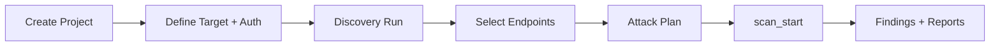

# AISec — Project Current State

> Architecture audit snapshot. Generated: 2026-06-13.  
> Repository: `yang-aisec-private` · Version: **0.1.0**

---

## EXECUTIVE SUMMARY

### Product purpose

**AISec** is a desktop application for **AI security testing** — penetration testing and red-team style assessment of LLM-backed applications, chatbots, agents, and API surfaces. Operators define projects and targets, discover attack surfaces (REST, GraphQL, OpenAPI, AI routes), run categorized attack payloads (prompt injection, jailbreak, RAG leakage, tool abuse, etc.), evaluate responses, and export findings as structured reports.

The product is built as a **Tauri 2** native shell: React + TypeScript UI (`src/`) backed by a Rust workspace (`crates/`) with SQLite persistence and real HTTP/Playwright execution — not a mock-only demo.

### Current maturity level

| Layer | Maturity | Notes |
|-------|----------|-------|
| **UI / UX** | Beta | Full navigation, 6-step scan wizard, auth UI, consistent design system |
| **IPC / persistence** | Beta | 32 registered Tauri commands; SQLite migrations applied on startup |
| **Discovery engine** | Alpha–Beta | Real crawler + static probes; single-worker constraint; localhost enabled |
| **Attack engine** | Beta | 9 categories implemented; HTTP transport + built-in payloads |
| **Judge engine** | Alpha | Deterministic rules/regex wired in attack path; LLM judge not exposed in UI |
| **Report engine** | Beta | HTML/PDF/JSON/SARIF generation via IPC |
| **Auth (Playwright)** | Alpha–Beta | Interactive recording IPC + release bundling; session not fully linked to attack transport |
| **Models / plugins** | Prototype | Library crates exist; no desktop IPC or UI wiring |

**Overall product maturity: late alpha / early beta** (~60% toward a shippable MVP).

### Current implementation status

**Working end-to-end (with Tauri backend):**

- Project CRUD
- Target create with rich auth descriptor (None, Basic, API Key, JWT, Username/Password, SSO)
- Playwright interactive login recording (`auth_record_session_start` / `finish`)
- Discovery run → endpoints persisted per scan
- Manual endpoint creation
- Multi-category background scan (`scan_start`) with pause/resume/stop
- Findings list and detail evidence from real attack + judge evaluation
- Report generate / read / export
- Scan wizard with `sessionStorage` persistence across steps

**Partially implemented:**

- Dashboard activity feed, job progress, stat-card hints (UI placeholders)
- Models page (empty store; no IPC)
- Plugin host (crate + samples; not integrated in desktop app)
- LLM judge roles (requires local GGUF via `aisec-models`; not configured in app)
- Playwright session tokens in attack HTTP layer (descriptor auth for API key/JWT/Basic works; browser session replay incomplete)
- `disabled_tests` accepted by `scan_start` but not enforced in attack executor

**Not implemented / not exposed:**

- `db_health` command (implemented in Rust, not registered in `invoke_handler`)
- Frontend mock data fixtures (`src/shared/mock/` removed); browser-only mode shows empty state
- Real-time event streaming (UI polls `scan_status`)
- Plugin marketplace / enable-disable UI
- HuggingFace model download from UI

### Main workflows implemented



1. **Workspace bootstrap** — App loads projects, targets, scans, findings, reports, endpoints via parallel IPC on startup.
2. **Scan wizard (primary flow)** — 6 steps: project → target/auth → discovery → attack plan → submit → results.
3. **Ad-hoc discovery** — Discovery page runs `discovery_run` against a saved target.
4. **Ad-hoc prompt injection** — Attacks page runs `attack_run_prompt_injection` on a single endpoint.
5. **Report export** — Results step and Reports page call `report_generate` + `report_export`.
6. **Auth recording** — Target step launches Playwright browser for User/Pass or SSO; storage state saved to auth vault.

---

## TECH STACK

### Frontend

| Area | Technology |
|------|------------|
| **Framework** | React 19 + TypeScript 5.8 |
| **State management** | React Context + `useReducer` (`AppStore.tsx`); wizard uses local state + `sessionStorage` |
| **Routing** | React Router DOM 7 (`HashRouter`) |
| **UI library** | Custom components (`src/shared/components/`) + global CSS design tokens — no MUI/Tailwind |
| **Build tools** | Vite 6, `@vitejs/plugin-react`, Vitest 3 |
| **Desktop bridge** | `@tauri-apps/api` 2.5 |

### Backend

| Area | Technology |
|------|------------|
| **Application shell** | Tauri 2 (`aisec-desktop` / `src-tauri`) |
| **Async runtime** | Tokio |
| **Database** | SQLite via `sqlx` 0.8 + `aisec-storage` migrations |
| **Logging** | `tracing` + `tracing-subscriber` |
| **HTTP client** | `reqwest` (discovery, attack transport) |

#### Rust workspace crates

| Crate | Role |
|-------|------|
| `aisec-core` | Shared errors, logging |
| `aisec-storage` | SQLite pool, migrations, repositories |
| `aisec-discovery` | Crawler, static probes, AI/GraphQL/OpenAPI detectors |
| `aisec-attack` | Attack registry, executor, HTTP transport, 9 category plugins |
| `aisec-payload` | Embedded payload library + mutation pipeline |
| `aisec-judge` | Rule, regex, LLM evaluators + consensus |
| `aisec-report` | HTML, PDF, JSON, SARIF formatters |
| `aisec-auth` | Playwright session recording, auth profiles |
| `aisec-models` | GGUF manager, llama.cpp runtime |
| `aisec-fingerprint` | AI provider fingerprinting |
| `aisec-plugin-host` | Plugin lifecycle, sandbox, permissions |
| `aisec-desktop` | Tauri IPC command layer |
| `aisec-integration-tests` | Cross-crate smoke / MVP flow tests |

### AI Components

| Engine | Crate | Desktop integration |
|--------|-------|---------------------|
| **Discovery Engine** | `aisec-discovery` | `discovery_run`, `endpoint_list`, `endpoint_create` |
| **Attack Engine** | `aisec-attack` + `aisec-payload` | `attack_run_prompt_injection`, `scan_start` background jobs |
| **Judge Engine** | `aisec-judge` | Used inside `run_category_on_endpoint` (deterministic mode only in production path) |
| **Report Engine** | `aisec-report` | `report_generate`, `report_read`, `report_export` |

---

## PROJECT STRUCTURE

### Complete folder tree

```
aisec/
├── AGENTS.md
├── Cargo.toml                      # Rust workspace root
├── package.json                    # npm scripts (dev, tauri, test, playwright bundle)
├── vite.config.ts
├── vitest.config.ts
├── tsconfig.json
├── index.html
│
├── docs/                           # Architecture, auth, UX, this document
│   ├── ARCHITECTURE.md
│   ├── AUTH.md
│   ├── DATABASE.md
│   ├── PROJECT_STRUCTURE.md
│   └── PROJECT_CURRENT_STATE.md
│
├── scripts/
│   └── bundle-playwright-auth.sh   # Release: Node + Playwright + Chromium bundle
│
├── src/                            # React frontend
│   ├── main.tsx
│   ├── App.tsx                     # Backend health bootstrap
│   ├── app/
│   │   ├── layout/                 # MainLayout, Sidebar, TopBar
│   │   ├── providers/              # AppProviders (store, toast, errors)
│   │   ├── router/                 # AppRouter, nav.ts
│   │   └── store/                  # AppStore, mappers, types
│   ├── features/
│   │   ├── dashboard/
│   │   ├── projects/
│   │   ├── scans/                  # Wizard, steps, auth forms, attack profiles
│   │   ├── targets/
│   │   ├── discovery/
│   │   ├── attacks/
│   │   ├── findings/
│   │   ├── reports/
│   │   ├── models/
│   │   └── settings/
│   ├── shared/
│   │   ├── components/             # Button, Card, DataTable, badges, etc.
│   │   ├── errors/
│   │   ├── hooks/
│   │   ├── ipc/                    # Typed invoke wrappers
│   │   ├── logging/
│   │   ├── notifications/
│   │   ├── stats/
│   │   ├── types/
│   │   └── utils/
│   └── styles/
│       └── global.css
│
├── src-tauri/                      # Tauri shell (aisec-desktop)
│   ├── Cargo.toml
│   ├── tauri.conf.json
│   ├── build.rs
│   ├── capabilities/
│   ├── icons/
│   ├── resources/playwright/       # Bundled Playwright runtime (gitignored subdirs)
│   └── src/
│       ├── main.rs
│       ├── lib.rs                  # invoke_handler registration
│       ├── dto.rs                  # IPC response DTOs
│       ├── db.rs
│       ├── state.rs
│       ├── playwright_runtime.rs
│       ├── error.rs
│       ├── logging.rs
│       ├── jobs/                   # ScanJobManager
│       └── commands/
│           ├── mod.rs              # health, app_info, db_health (unregistered)
│           ├── projects.rs
│           ├── domain.rs           # targets, scans, findings, reports
│           ├── discovery.rs
│           ├── attack.rs
│           ├── scan.rs
│           └── auth.rs
│
├── crates/                         # Rust business logic
│   ├── aisec-core/
│   ├── aisec-storage/
│   │   └── migrations/             # 001–003 SQL migrations
│   ├── aisec-discovery/
│   │   └── playwright/             # Discovery-specific Playwright (separate from auth)
│   ├── aisec-attack/
│   │   └── src/attacks/            # One module per attack category
│   ├── aisec-payload/
│   │   └── data/payloads.json      # Built-in prompt library
│   ├── aisec-judge/
│   ├── aisec-report/
│   ├── aisec-auth/
│   │   └── playwright/             # Auth recording runner.mjs
│   ├── aisec-models/
│   ├── aisec-fingerprint/
│   └── aisec-plugin-host/
│
├── packages/
│   ├── plugin-sdk-python/
│   └── plugin-sdk-js/
│
├── plugins/
│   ├── _template/
│   └── samples/                    # discovery, attack, judge, report sample plugins
│
├── prompts/                        # Prompt templates (non-runtime)
│
└── tests/
    ├── frontend/                   # Vitest (errors, logger, targetDescriptor, …)
    └── integration/                # Rust integration tests (mvp_flow, storage, auth)
```

### Major folder responsibilities

| Folder | Purpose | Responsibilities |
|--------|---------|------------------|
| **`src/`** | Frontend application | Routing, pages, scan wizard, IPC client, global state, UI components |
| **`src-tauri/`** | Desktop backend shell | Tauri lifecycle, SQLite init, IPC commands, scan job manager, Playwright bundle resolution |
| **`crates/aisec-storage`** | Persistence | Migrations, repository traits, SQLite implementations, row models |
| **`crates/aisec-discovery`** | Attack surface enumeration | HTTP crawl, link extraction, static path probes, AI/GraphQL/OpenAPI detection |
| **`crates/aisec-attack`** | Offensive testing | Category registry, payload execution, HTTP transport, target auth headers |
| **`crates/aisec-payload`** | Payload library | JSON payload catalog, mutations, pipeline |
| **`crates/aisec-judge`** | Response evaluation | Rule/regex/LLM evaluators, consensus, severity scoring |
| **`crates/aisec-report`** | Deliverables | Report data builder, HTML/PDF/JSON/SARIF formatters, recommendations |
| **`crates/aisec-auth`** | Session auth | Playwright interactive recording, profile/session storage |
| **`crates/aisec-models`** | Local LLM | GGUF download, llama.cpp runtime (for judge/attacker roles) |
| **`crates/aisec-plugin-host`** | Extensibility | Plugin manifest, sandbox runner, permissions (not wired to UI) |
| **`plugins/`** | Reference plugins | Sample attack/discovery/judge/report plugins for SDK demonstration |
| **`docs/`** | Documentation | Architecture, auth setup, database schema reference |
| **`tests/`** | Quality gates | Frontend unit tests; Rust integration / MVP flow tests |

---

## DATABASE

**Engine:** SQLite 3  
**Location:** `{app_data_dir}/aisec.db` (Tauri `app_data_dir`)  
**Migrations:** `crates/aisec-storage/migrations/` — applied automatically on startup via `sqlx::migrate!`

### Tables overview

| Table | Migration |
|-------|-----------|
| `projects` | 001 |
| `targets` | 001 |
| `scans` | 001 |
| `findings` | 001 |
| `findings_fts` | 001 (FTS5 virtual) |
| `payloads` | 001 |
| `attack_results` | 001 |
| `reports` | 001 |
| `models` | 001 |
| `plugins` | 001 |
| `auth_profiles` | 002 |
| `auth_sessions` | 002 |
| `auth_recordings` | 002 |
| `endpoints` | 003 |

---

### `projects`

| Column | Type | Notes |
|--------|------|-------|
| `id` | TEXT PK | UUID |
| `name` | TEXT NOT NULL | Display name |
| `description` | TEXT | Optional |
| `created_at` | TEXT NOT NULL | RFC 3339 |
| `updated_at` | TEXT NOT NULL | RFC 3339 |

**Relationships:** Parent of `targets`, `scans`, `findings`, `reports`, `auth_profiles` (optional).

**Usage:** Project list/create/update/delete IPC; wizard step 1; dashboard project cards.

---

### `targets`

| Column | Type | Notes |
|--------|------|-------|
| `id` | TEXT PK | |
| `project_id` | TEXT FK → `projects` | ON DELETE CASCADE |
| `name` | TEXT NOT NULL | |
| `target_type` | TEXT NOT NULL | e.g. `llm_api` |
| `descriptor_json` | TEXT NOT NULL | Auth + URL JSON blob |
| `created_at`, `updated_at` | TEXT | |

**Relationships:** Belongs to project; referenced by scans, findings, endpoints, attack_results.

**Usage:** Target step persists descriptor (URL, auth kind, credentials, Playwright flags); discovery seed URL extraction; attack auth header injection.

---

### `scans`

| Column | Type | Notes |
|--------|------|-------|
| `id` | TEXT PK | |
| `project_id` | TEXT FK | |
| `target_id` | TEXT FK → `targets` | Nullable |
| `name` | TEXT NOT NULL | |
| `status` | TEXT | `pending`, `running`, `completed`, `failed`, `cancelled`, `paused` |
| `playbook_json` | TEXT | Attack profile, categories, progress snapshot |
| `started_at`, `completed_at` | TEXT | Nullable |
| `created_at`, `updated_at` | TEXT | |

**Relationships:** Parent of findings, attack_results, endpoints, reports.

**Usage:** Discovery creates scan rows; `scan_start` creates attack scan; progress stored in `playbook_json.progress`.

---

### `findings`

| Column | Type | Notes |
|--------|------|-------|
| `id` | TEXT PK | |
| `scan_id` | TEXT FK | |
| `project_id` | TEXT FK | |
| `target_id` | TEXT FK | Nullable |
| `title` | TEXT NOT NULL | |
| `severity` | TEXT | `critical` … `info` |
| `category` | TEXT | Attack category id |
| `description` | TEXT | Judge summary |
| `evidence_json` | TEXT | Payload, response excerpt, judge verdict |
| `status` | TEXT | Default `open` |
| `created_at`, `updated_at` | TEXT | |

**Relationships:** Belongs to scan, project, optional target.

**Usage:** Created when judge verdict is `vulnerable`; surfaced in Findings page, dashboard charts, reports.

**FTS:** `findings_fts` virtual table indexes `title` + `description` with sync triggers.

---

### `endpoints`

| Column | Type | Notes |
|--------|------|-------|
| `id` | TEXT PK | |
| `scan_id` | TEXT FK → `scans` | |
| `target_id` | TEXT FK | Nullable |
| `url` | TEXT NOT NULL | Absolute URL |
| `kind` | TEXT | e.g. `rest_api`, `graphql`, `ai_chat`, `manual` |
| `method` | TEXT | HTTP method |
| `confidence` | REAL | 0.0–1.0 |
| `evidence` | TEXT | Detector explanation |
| `source_url` | TEXT | Page or probe origin |
| `discovered_at` | TEXT | |
| `created_at` | TEXT | |

**Relationships:** Scoped to discovery scan; selected endpoints feed `scan_start`.

**Usage:** Discovery wizard step 3; Attacks page endpoint picker.

---

### `attack_results`

| Column | Type | Notes |
|--------|------|-------|
| `id` | TEXT PK | |
| `scan_id` | TEXT FK | |
| `payload_id` | TEXT FK → `payloads` | Nullable |
| `target_id` | TEXT FK | Nullable |
| `probe_id` | TEXT | Payload/run identifier |
| `success` | INTEGER | 1 if judge says vulnerable |
| `response_json` | TEXT | HTTP status, body, duration |
| `evaluated_json` | TEXT | Attack eval + judge verdict JSON |
| `duration_ms` | INTEGER | |
| `created_at` | TEXT | |

**Relationships:** One row per payload attempt per scan.

**Usage:** Audit trail for attack runs; not yet exposed in UI tab.

---

### `reports`

| Column | Type | Notes |
|--------|------|-------|
| `id` | TEXT PK | |
| `project_id` | TEXT FK | |
| `scan_id` | TEXT FK | Nullable |
| `name` | TEXT NOT NULL | |
| `format` | TEXT | `html`, `pdf`, `json`, `sarif` |
| `status` | TEXT | `pending`, `ready`, etc. |
| `file_path` | TEXT | On-disk report path |
| `metadata_json` | TEXT | Finding count, generation meta |
| `created_at`, `updated_at` | TEXT | |

**Usage:** `report_generate` writes file under app data; `report_read` / `report_export` serve content.

---

### `payloads`

| Column | Type | Notes |
|--------|------|-------|
| `id` | TEXT PK | |
| `project_id` | TEXT FK | Nullable (global if null) |
| `name` | TEXT | |
| `payload_type` | TEXT | Category |
| `content` | TEXT | Prompt body |
| `metadata_json` | TEXT | Tags, description |
| `created_at`, `updated_at` | TEXT | |

**Usage:** Schema supports custom payloads; runtime attacks primarily use embedded `aisec-payload/data/payloads.json`.

---

### `models`

| Column | Type | Notes |
|--------|------|-------|
| `id` | TEXT PK | |
| `name` | TEXT | |
| `file_path` | TEXT | GGUF path |
| `format` | TEXT | Default `gguf` |
| `checksum_sha256` | TEXT | |
| `size_bytes` | INTEGER | |
| `metadata_json` | TEXT | |
| `created_at`, `updated_at` | TEXT | |

**Usage:** Intended for local judge models; **no IPC commands populate this table from the UI today**.

---

### `plugins`

| Column | Type | Notes |
|--------|------|-------|
| `id` | TEXT PK | |
| `plugin_id` | TEXT UNIQUE | Manifest id |
| `name`, `version` | TEXT | |
| `enabled` | INTEGER | 0/1 |
| `manifest_json` | TEXT | |
| `install_path` | TEXT | |
| `created_at`, `updated_at` | TEXT | |

**Usage:** Plugin host schema; not integrated in desktop MVP.

---

### `auth_profiles`

| Column | Type | Notes |
|--------|------|-------|
| `id` | TEXT PK | |
| `project_id` | TEXT FK | Nullable |
| `name` | TEXT | |
| `method` | TEXT | `username_password`, `oauth`, etc. |
| `config_json` | TEXT | Login URL, selectors, credentials |
| `created_at`, `updated_at` | TEXT | |

**Usage:** Created during Playwright recording; stored via `aisec-auth` SessionStore.

---

### `auth_sessions`

| Column | Type | Notes |
|--------|------|-------|
| `id` | TEXT PK | Returned to UI on recording finish |
| `profile_id` | TEXT FK | |
| `status` | TEXT | Default `active` |
| `cookies_json`, `tokens_json` | TEXT | |
| `storage_state_path` | TEXT | Playwright storageState file in vault |
| `expires_at` | TEXT | |
| `created_at`, `updated_at` | TEXT | |

**Usage:** Browser session replay for authenticated attacks (**session_id not yet written into target descriptor**).

---

### `auth_recordings`

| Column | Type | Notes |
|--------|------|-------|
| `id` | TEXT PK | |
| `profile_id` | TEXT FK | |
| `steps_json` | TEXT | Recorded interaction steps |
| `storage_state_path` | TEXT | |
| `metadata_json` | TEXT | |
| `created_at` | TEXT | |

**Usage:** Audit of interactive login recordings.

---

## TAURI IPC

**Total registered commands:** 32 (in `src-tauri/src/lib.rs` `invoke_handler`)  
**Additional implemented but unregistered:** `db_health`

All commands return `CommandResult<T>` — success wraps DTO; failure returns structured `CommandError` to the frontend (`toAppError()`).

Tauri 2 maps Rust `snake_case` parameters to JavaScript `camelCase` automatically.

---

### Bootstrap

#### `health`

| | |
|---|---|
| **Request** | _(none)_ |
| **Response** | `{ status: "ok", version: string }` |
| **Status** | ✅ Implemented, registered |

#### `app_info`

| | |
|---|---|
| **Request** | _(none)_ |
| **Response** | `{ name, version, identifier: "com.aisec.desktop" }` |
| **Status** | ✅ Implemented, registered |

#### `db_health`

| | |
|---|---|
| **Request** | _(none)_ |
| **Response** | `{ connected: bool, project_count: number }` |
| **Status** | ⚠️ Implemented in `commands/mod.rs` but **not registered** in `invoke_handler` |

---

### Projects

#### `project_create`

| | |
|---|---|
| **Request** | `{ name: string, description?: string }` |
| **Response** | `ProjectDto` |
| **Status** | ✅ |

#### `project_list`

| | |
|---|---|
| **Request** | _(none)_ |
| **Response** | `ProjectDto[]` |
| **Status** | ✅ |

#### `project_get`

| | |
|---|---|
| **Request** | `{ id: string }` |
| **Response** | `ProjectDto` |
| **Status** | ✅ |

#### `project_update`

| | |
|---|---|
| **Request** | `{ id: string, name?: string, description?: string }` |
| **Response** | `ProjectDto` |
| **Status** | ✅ |

#### `project_delete`

| | |
|---|---|
| **Request** | `{ id: string }` |
| **Response** | `null` (unit) |
| **Status** | ✅ |

---

### Targets

#### `target_create`

| | |
|---|---|
| **Request** | `{ projectId, name, targetType, descriptor?: JSON }` |
| **Response** | `TargetDto` `{ id, project_id, name, target_type, descriptor, created_at, updated_at }` |
| **Status** | ✅ |

#### `target_list`

| | |
|---|---|
| **Request** | `{ projectId: string }` |
| **Response** | `TargetDto[]` |
| **Status** | ✅ |

#### `target_get`

| | |
|---|---|
| **Request** | `{ id: string }` |
| **Response** | `TargetDto` |
| **Status** | ✅ |

---

### Scans (CRUD)

#### `scan_create`

| | |
|---|---|
| **Request** | `{ projectId, targetId?, name, status? }` |
| **Response** | `ScanDto` |
| **Status** | ✅ |

#### `scan_list`

| | |
|---|---|
| **Request** | `{ projectId: string }` |
| **Response** | `ScanDto[]` |
| **Status** | ✅ |

#### `scan_get`

| | |
|---|---|
| **Request** | `{ id: string }` |
| **Response** | `ScanDetailDto` (includes `playbook`) |
| **Status** | ✅ |

---

### Findings

#### `finding_list`

| | |
|---|---|
| **Request** | `{ scanId: string }` |
| **Response** | `FindingDto[]` |
| **Status** | ✅ |

#### `finding_list_all`

| | |
|---|---|
| **Request** | _(none)_ |
| **Response** | `FindingDto[]` (all projects, sorted by date) |
| **Status** | ✅ |

---

### Reports

#### `report_generate`

| | |
|---|---|
| **Request** | `{ projectId, scanId, format?: "html"\|"pdf"\|"json"\|"sarif", kind?: "executive"\|"technical"\|"compliance" }` |
| **Response** | `ReportDto` |
| **Status** | ✅ |

#### `report_list`

| | |
|---|---|
| **Request** | `{ projectId: string }` |
| **Response** | `ReportDto[]` |
| **Status** | ✅ |

#### `report_list_all`

| | |
|---|---|
| **Request** | _(none)_ |
| **Response** | `ReportDto[]` |
| **Status** | ✅ |

#### `report_read`

| | |
|---|---|
| **Request** | `{ id: string }` |
| **Response** | `ReportContentDto` `{ id, name, format, content }` |
| **Status** | ✅ |

#### `report_export`

| | |
|---|---|
| **Request** | `{ id: string }` |
| **Response** | `string` (filesystem path) |
| **Status** | ✅ |

---

### Discovery

#### `discovery_run`

| | |
|---|---|
| **Request** | `{ targetId: string }` |
| **Response** | `DiscoveryRunDto` `{ scan, endpoints[], stats }` |
| **Status** | ✅ Real engine (`max_depth: 2`, `max_pages: 25`, `worker_count: 1`) |

#### `endpoint_list`

| | |
|---|---|
| **Request** | `{ scanId: string }` |
| **Response** | `EndpointDto[]` |
| **Status** | ✅ |

#### `endpoint_create`

| | |
|---|---|
| **Request** | `{ scanId, targetId, method?, path }` |
| **Response** | `EndpointDto` |
| **Status** | ✅ Manual endpoint entry |

---

### Attack

#### `attack_run_prompt_injection`

| | |
|---|---|
| **Request** | `{ endpointId: string }` |
| **Response** | `AttackRunDto` `{ scan, category, attempts, successes, findings[] }` |
| **Status** | ✅ Single-category ad-hoc run |

---

### Scan lifecycle (background jobs)

#### `scan_start`

| | |
|---|---|
| **Request** | `{ projectId, targetId, endpointIds[], profile, categories[], disabledTests?[] }` |
| **Response** | `ScanStartDto` `{ scan_id }` |
| **Status** | ✅ Spawns async job; runs all categories × endpoints |

#### `scan_status`

| | |
|---|---|
| **Request** | `{ scanId: string }` |
| **Response** | `ScanStatusDto` `{ scan_id, status, progress_percent, completed, total, findings_count, current_endpoint, current_test, started_at }` |
| **Status** | ✅ |

#### `scan_pause`

| | |
|---|---|
| **Request** | `{ scanId: string }` |
| **Response** | `ScanStatusDto` |
| **Status** | ✅ |

#### `scan_resume`

| | |
|---|---|
| **Request** | `{ scanId: string }` |
| **Response** | `ScanStatusDto` |
| **Status** | ✅ |

#### `scan_stop`

| | |
|---|---|
| **Request** | `{ scanId: string }` |
| **Response** | `ScanStatusDto` |
| **Status** | ✅ Cancels background task |

---

### Auth (Playwright)

#### `auth_record_session_start`

| | |
|---|---|
| **Request** | `{ loginUrl, method: "username_password"\|"oauth", config?: JSON }` |
| **Response** | `{ recording: true }` |
| **Status** | ✅ Launches headed Playwright browser |

#### `auth_record_session_finish`

| | |
|---|---|
| **Request** | _(none)_ |
| **Response** | `{ sessionId, verified: true }` |
| **Status** | ✅ Persists storage state to auth vault |

---

## FRONTEND PAGES

| Page | Route | Purpose | Status | Backend connected? | Uses mock data? |
|------|-------|---------|--------|---------------------|-----------------|
| **Dashboard** | `/` | Workspace overview, severity chart, activity | UI complete | Reads store (IPC-backed when connected) | **Hardcoded stat hints** (`"2 active"`, `"1 scanning"`); empty `activity`, `discoveryJobs`, `attackRuns` |
| **Projects** | `/projects` | List/create/delete projects | Complete | ✅ `project_*` | No — empty list offline |
| **Project details** | `/projects/:projectId` | Project summary, targets, scans | Complete | ✅ | No |
| **Scans** | `/scans` | Scan history | Complete | ✅ `scan_list` | No |
| **Scan wizard** | `/scans/new` | 6-step new scan flow | Complete | ✅ Full pipeline | Wizard state in `sessionStorage` only |
| **Scan details** | `/scans/:scanId` | Scan monitor, findings link | Complete | ✅ `scan_get`, polling | No |
| **Targets** | `/targets` | Target list | Complete | ✅ `target_list` | No |
| **Target details** | `/targets/:targetId` | Descriptor view | Complete | ✅ `target_get` | No |
| **Discovery** | `/discovery` | Run discovery on target | Complete | ✅ `discovery_run` | No |
| **Discovery details** | `/discovery/:scanId` | Endpoint list for scan | Complete | ✅ `endpoint_list` | No |
| **Attacks** | `/attacks` | Ad-hoc prompt injection | Complete | ✅ `attack_run_prompt_injection` | No |
| **Findings** | `/findings` | Global findings table + filters | Complete | ✅ `finding_list_all` | No |
| **Reports** | `/reports` | Report list + generate modal | Complete | ✅ `report_*` | No |
| **Models** | `/models` | Local GGUF management | **Shell only** | ❌ No IPC | Empty `models[]`; buttons non-functional |
| **Settings** | `/settings` | Theme, paths, backend status | Partial | Shows connection state | Default settings object only (not persisted to disk) |

**Browser-only mode (`npm run dev`):** TopBar shows **"Mock mode"** — IPC unavailable; `AppStore.refresh()` fails; pages render empty states (not fabricated demo data).

---

## SCAN WIZARD

Persistence: `sessionStorage` key `aisec:scan-wizard`, schema version **2** (`wizardState.ts`). Survives page refresh within the same tab; cleared on explicit reset or successful completion flow.

| Step | Label | Component |
|------|-------|-----------|
| 1 | Project | `ProjectStep.tsx` |
| 2 | Target & authentication | `TargetStep.tsx` + `TargetFormFields.tsx` + `PlaywrightRecordPanel.tsx` |
| 3 | Discovery | `DiscoveryStep.tsx` |
| 4 | Attack planning | `AttackPlanStep.tsx` |
| 5 | Scan submission | `SubmitStep.tsx` |
| 6 | Results | `ResultsStep.tsx` |

---

### Step 1 — Project

| Dimension | Status |
|-----------|--------|
| **UI** | ✅ Select existing project or use `?projectId=` lock from project details |
| **Backend** | ✅ Validates project via store / `project_get` when locked |
| **Persistence** | ✅ `selectedProjectId` in wizard session |

---

### Step 2 — Target & authentication

| Dimension | Status |
|-----------|--------|
| **UI** | ✅ Target URL, 6 auth methods (None, Username/Password, SSO, Basic, API Key, JWT), Playwright record panel |
| **Backend** | ✅ `target_create` on proceed; `auth_record_session_start/finish` for interactive methods |
| **Persistence** | ✅ `targetForm`, `savedTargetId`, fingerprint; Playwright `browserSessionReady` flag in form state |

**Gap:** `sessionId` from auth finish is not persisted into target `descriptor_json` for attack replay.

---

### Step 3 — Discovery

| Dimension | Status |
|-----------|--------|
| **UI** | ✅ Run discovery, phase animation, endpoint table, multi-select, manual endpoint form |
| **Backend** | ✅ `discovery_run`, `endpoint_list`, `endpoint_create` |
| **Persistence** | ✅ `discovery.scanId`, `selectedEndpointIds`, `completed`, `stats` |

---

### Step 4 — Attack planning

| Dimension | Status |
|-----------|--------|
| **UI** | ✅ Profiles (`quick`, `standard`, `thorough`, `custom`), 9 categories, per-test disable toggles |
| **Backend** | ⚠️ Plan compiled client-side only; `disabledTests` passed to `scan_start` but **not enforced** server-side |
| **Persistence** | ✅ `attackPlanUi`, `attackPlan` (categories + profile id) |

---

### Step 5 — Scan submission

| Dimension | Status |
|-----------|--------|
| **UI** | ✅ Configuration summary, `startScan` button, live progress via `useScanStatuses` polling |
| **Backend** | ✅ `scan_start` → background job; `scan_status` / pause / resume / stop available on Scan details |
| **Persistence** | ✅ `submittedScanId` written on successful start |

---

### Step 6 — Results

| Dimension | Status |
|-----------|--------|
| **UI** | ✅ Finding counts by severity, top findings list, report export buttons, link to scan details |
| **Backend** | ✅ Reads findings from store (refreshed from SQLite); `report_generate` + export |
| **Persistence** | ✅ Requires `submittedScanId`; wizard allows navigation between steps 5–6 after submit |

---

## DISCOVERY ENGINE

### Current implementation

Located in `crates/aisec-discovery`. Entry point: `DiscoveryEngine::discover(seed_url)`.

**Pipeline:**

1. Validate seed URL (`url_policy`) — optional private network allowed in desktop IPC config.
2. **Static path probes** — AI routes, GraphQL, OpenAPI paths (`detectors/`).
3. **HTTP crawler** — BFS link extraction from HTML (`crawler`, `extract`, `scraper`).
4. Deduplicate endpoints → `DiscoveryReport` with `CrawlStats`.

**Desktop defaults** (`discovery_run` command):

- `max_depth: 2`
- `max_pages: 25`
- `worker_count: 1` (deadlock workaround)
- `request_timeout: 10s`
- `allow_private_network: true`
- `probe_static_paths: true`

Results persisted to `endpoints` table under a new `scans` row named `Discovery: {target}`.

### Technologies used

- `reqwest` HTTP client with retry policy
- `scraper` for HTML parsing
- Optional Playwright browser capture (`browser.rs`) — available in crate, not used by default IPC path
- URL policy + origin normalization

### Supported discovery techniques

| Technique | Module | Output `kind` examples |
|-----------|--------|------------------------|
| HTML crawl + link extraction | `crawler`, `extract` | Page-linked URLs |
| Static AI path probes | `detectors/ai.rs` | `ai_chat`, `ai_completion` |
| GraphQL endpoint probes | `detectors/graphql.rs` | `graphql` |
| OpenAPI/Swagger probes | `detectors/openapi.rs` | `openapi`, `rest_api` |
| REST API heuristics | `detectors/api.rs` | `rest_api` |
| Manual entry (IPC) | `endpoint_create` | `manual` |

### Limitations

- **Single worker only** — concurrent crawl deadlocks (documented in `verify_target.rs`).
- **Depth/page caps** — hardcoded conservative limits in IPC layer.
- **No authenticated crawl in discovery IPC** — auth descriptor not applied to discovery HTTP client today.
- **Playwright browser crawl** not wired to `discovery_run` (HTTP-only path).
- **Network-dependent tests** — `crawler_respects_max_depth` integration test can hang.
- Discovery Playwright runtime is **separate** from auth Playwright bundle (`crates/aisec-discovery/playwright/`).

---

## ATTACK ENGINE

### Current implementation

Located in `crates/aisec-attack`. Desktop uses:

- `AttackExecutor` + `default_registry()` (9 built-in category attacks)
- `HttpTransport` for real HTTP requests
- `apply_descriptor_auth()` — injects Basic, Bearer/API key, JWT headers from target descriptor
- `aisec-payload` embedded library for prompt content
- Per-attempt persistence to `attack_results` + conditional `findings`

**Orchestration paths:**

1. **`attack_run_prompt_injection`** — single category, single endpoint, creates new scan row.
2. **`scan_start`** — nested loop: `endpoints × categories`, calls shared `run_category_on_endpoint()`.

Each attempt runs **attack evaluation** (category-specific heuristics) then **`JudgeEngine::judge_deterministic()`** (rules + regex only).

### Attack categories

| Category ID | Display name | Attack module |
|-------------|--------------|---------------|
| `prompt_injection` | Prompt Injection | `attacks/prompt_injection.rs` |
| `system_prompt_extraction` | System Prompt Extraction | `attacks/system_prompt_extraction.rs` |
| `jailbreak` | Jailbreak | `attacks/jailbreak.rs` |
| `rag_leakage` | RAG Leakage | `attacks/rag_leakage.rs` |
| `memory_poisoning` | Memory Poisoning | `attacks/memory_poisoning.rs` |
| `cross_user_leakage` | Cross User Leakage | `attacks/cross_user_leakage.rs` |
| `agent_goal_hijacking` | Agent Goal Hijacking | `attacks/agent_goal_hijacking.rs` |
| `tool_abuse` | Tool Abuse | `attacks/tool_abuse.rs` |
| `mcp_abuse` | MCP Abuse | `attacks/mcp_abuse.rs` |

### Prompt libraries

**Primary source:** `crates/aisec-payload/data/payloads.json` (~20+ payloads across categories).

Categories include multiple prompt templates with tags (direct override, DAN, RAG dump, MCP JSON-RPC, etc.). `PayloadMutator` applies encodings/variations at runtime.

Custom payloads can be stored in DB `payloads` table but UI management is not built.

### Execution flow

```
scan_start / attack_run
    → load endpoint + target descriptor
    → AttackExecutor.execute_category(category, context)
        → PayloadRunner selects payloads for category
        → HttpTransport sends request to endpoint.url
        → Category attack evaluates raw response (indicators, confidence)
    → JudgeEngine.judge_deterministic(request)
        → RuleBasedEvaluator + RegexEvaluator
        → consensus_vulnerable(threshold)
    → if vulnerable: CreateFinding + CreateAttackResult
```

**Not in flow:** LLM judge roles, plugin attacks, Playwright cookie replay, `disabled_tests` filtering.

---

## JUDGE ENGINE

### Models supported

| Mode | Source | Desktop usage |
|------|--------|---------------|
| **Rule-based** | `evaluators/rule.rs` | ✅ Always on in `judge_deterministic` |
| **Regex** | `evaluators/regex.rs` | ✅ Default patterns (secrets, injection markers) |
| **LLM (local GGUF)** | `evaluators/llm.rs` + `aisec-models` | ❌ Not configured in app; requires `ModelRolePool` with llama.cpp runtime |

**Model roles** (when LLM enabled): `Judge`, `Classifier`, `Attacker` — see `ModelRolePool`.

Example local model usage exists in `crates/aisec-judge/examples/judge_with_local_model.rs` only.

### Evaluation logic

1. Run enabled evaluators synchronously (rules, regex) or async (LLM).
2. Collect `EvaluatorResult` list with `vulnerable`, `confidence`, `indicators`, `severity`.
3. **`consensus_vulnerable`** — fraction of evaluators voting vulnerable ≥ `consensus_threshold` (default config).
4. **`aggregate_confidence`** — combined score; clamped when not vulnerable.
5. **`max_severity`** / **`dominant_category`** — surfaced on verdict.

Production attack path calls **`judge_deterministic()`** which disables LLM evaluators entirely.

### Scoring methodology

- Rule hits map to confidence increments per indicator type.
- Regex matches boost confidence for known leak patterns.
- LLM evaluators parse structured JSON verdict from model output (when enabled).
- Final finding severity: judge severity → fallback to attack eval severity → default `medium`.
- Finding created only when `verdict.vulnerable == true`.

---

## REPORT ENGINE

### Supported formats

| Format | Formatter | MIME / use |
|--------|-----------|------------|
| **HTML** | `formatters/html.rs` | Default; interactive viewing |
| **PDF** | `formatters/pdf.rs` | Executive delivery |
| **JSON** | `formatters/json.rs` | Machine-readable export |
| **SARIF** | `formatters/sarif.rs` | CI / GitHub code scanning integration |

### Report kinds

| Kind | Audience |
|------|----------|
| `executive` | Summary, risk overview |
| `technical` | Finding details, evidence |
| `compliance` | Control mapping + recommendations |

### Generation flow

```
report_generate (IPC)
    → load project, scan, findings from SQLite
    → ReportDataBuilder → ReportInput
    → ReportingEngine.generate(kind, format, input)
        → formatter.render()
        → write bytes to app data reports directory
    → CreateReport row (file_path, metadata with finding count)
report_read → read file contents into ReportContentDto
report_export → return filesystem path for OS open/save dialog
```

Charts and recommendations modules enrich HTML/PDF output (`charts.rs`, `recommendations.rs`).

---

## MOCK DATA AUDIT

The legacy `src/shared/mock/data.ts` fixture layer has been **removed**. Remaining non-live data:

| Location | Type | Description |
|----------|------|-------------|
| `DashboardPage.tsx` StatCard `hint` props | Hardcoded strings | `"2 active"`, `"1 scanning"`, `"1 downloading"` — not computed from store |
| `AppStore` initial state | Empty arrays | `models: []`, `activity: []`, `discoveryJobs: []`, `attackRuns: []` — never populated from IPC |
| `AppStore.settings` | Default object | Theme/paths/toggles — **not persisted** to SQLite or disk |
| `ModelsPage.tsx` | UI shell | Renders empty grid; action buttons have no handlers |
| `TopBar.tsx` label | Misleading copy | Says "mock data" when offline — actually **empty state**, not fake records |
| `aisec-attack/transport/mock.rs` | Test transport | Rust unit tests only |
| `aisec-judge/mock_runtime.rs` | Test double | Rust tests / examples |
| `aisec-auth/mock.rs` | Test double | Auth engine tests |
| `aisec-models/runtime/mock.rs` | Test double | Model runtime tests |

**No frontend page injects fabricated projects, findings, or scans when IPC fails.**

---

## KNOWN LIMITATIONS

### Product / integration

- Browser-only dev mode cannot execute scans (no Tauri IPC).
- Playwright auth `sessionId` not linked to target descriptor → authenticated browser sessions not replayed in attacks.
- `disabled_tests` from wizard ignored in `run_category_on_endpoint`.
- Dashboard activity, job progress, and several stat hints are placeholders.
- Models page and plugin system have no IPC wiring.
- Settings not persisted across restarts.
- Finding status updates (`UPDATE_FINDING_STATUS`) are local-only — no backend command.
- No target update/delete IPC commands (create + list + get only).

### Discovery

- Crawler multi-worker deadlock — forced `worker_count: 1`.
- Conservative crawl limits in production IPC.
- No auth-aware discovery.
- Separate Playwright bundle for discovery vs auth.

### Attack / judge

- LLM judge not enabled in desktop path (deterministic only).
- False negative/positive risk from regex-only judging on nuanced LLM responses.
- Attack transport is HTTP JSON/chat completion shaped — may not fit all endpoint kinds.
- Playwright-based attacks not implemented.

### Auth

- Username/password form fields stored in descriptor; interactive flow relies on manual browser login.
- SSO uses same interactive recording as user/pass (method `oauth`).
- AuthEngine selectors empty for interactive mode (by design).
- Release bundle requires `npm run bundle:playwright` before Tauri build.

### Testing / CI

Per `AGENTS.md`, `cargo test --workspace` does not fully pass:

- `aisec-storage` lib test: missing `create` method
- `aisec-auth`: tokio `process` feature gap
- `aisec-integration-tests`: missing `tracing` dependency
- `aisec-discovery`: hanging network test
- Individual failures in `aisec-judge`, `aisec-plugin-host`

Frontend: `npm test` passes (28 tests).

### Documentation drift

- `docs/PROJECT_STRUCTURE.md` describes bootstrap-only state — outdated vs current IPC surface.
- `Cargo.toml` `rust-version = "1.77"` inaccurate; stable ≥ 1.85 required in practice.

---

## MVP COMPLETION ESTIMATE

### Overall: **~62% complete**

| Workstream | Weight | Done | Notes |
|------------|--------|------|-------|
| Core shell + IPC + DB | 15% | 90% | Missing `db_health` exposure, target update/delete |
| Project/target CRUD UI | 10% | 85% | Auth UI polished; session link gap |
| Scan wizard E2E | 20% | 80% | Full 6 steps; disabled test enforcement missing |
| Discovery | 10% | 70% | Works HTTP-only; auth + browser crawl gaps |
| Attack + findings | 20% | 75% | All categories run; judge LLM off |
| Reports | 10% | 85% | Generate/export works |
| Dashboard polish | 5% | 40% | Placeholder widgets |
| Models + plugins | 10% | 15% | Crates exist; no product integration |
| Release hardening | 10% | 55% | Playwright auth bundle done; tests CI red |

### What remains for MVP

1. **Wire Playwright session into attack transport** — cookies/storageState from `auth_sessions`.
2. **Enforce attack plan `disabled_tests`** in scan job executor.
3. **Dashboard live data** — derive activity from scans/findings; poll running jobs into `discoveryJobs` / `attackRuns`.
4. **Target update IPC** + edit UI.
5. **Finding status persistence** command.
6. **Models IPC** — list/download/register GGUF; optional LLM judge enable via settings.
7. **Fix workspace test failures** — required for CI confidence.
8. **Discovery hardening** — fix worker deadlock, optional auth headers, configurable limits in UI.
9. **Enable LLM judge** when local model configured (`autoJudge` setting exists but unused).
10. **Plugin host integration** — load samples, enable/disable in settings.
11. **Register or remove `db_health`**; align docs with current command set.
12. **Persist settings** to app data directory.

### Post-MVP (not blocking first release)

- Real-time scan events via Tauri events (replace polling)
- Authenticated discovery crawl
- SARIF upload helpers
- HuggingFace browse/download UX
- Cross-platform release CI matrix
- Plugin marketplace

---

## Quick reference commands

```bash
# Frontend only (empty backend)
npm run dev

# Full desktop app
npm run setup:playwright   # dev auth recording
npm run tauri dev

# Release build (bundles Playwright)
npm run bundle:playwright
npm run tauri build

# Tests
npm test
cargo test -p aisec-core
cargo test -p aisec-attack
```

---

*End of document.*
