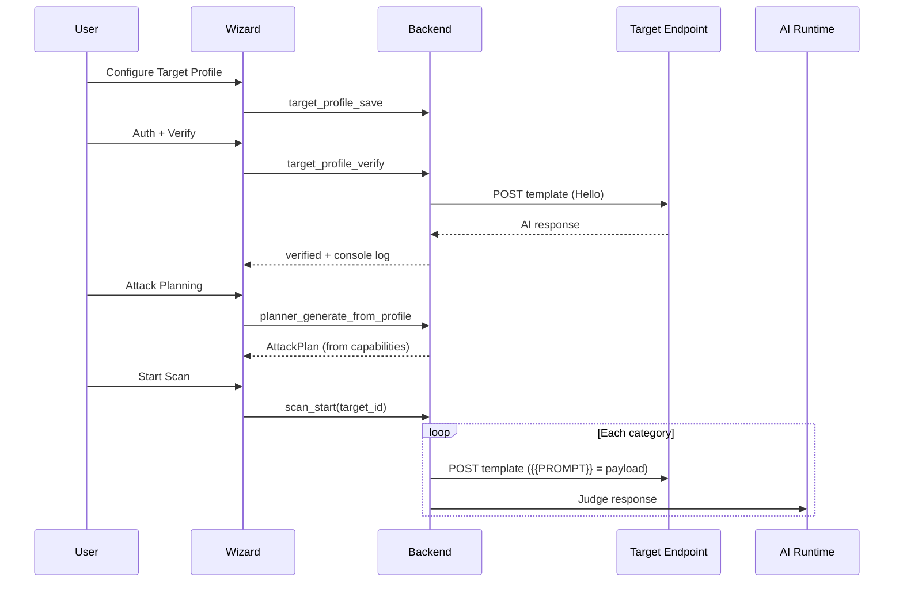

# Scan Wizard Architecture — AI Target Profile

AISec Scan Wizard configures a **single AI endpoint** via **Target Profile**. Discovery, fingerprinting, and schema inference are **not** part of the wizard.

## Flow

```
Project → AI Target Profile → Authentication & Verification → Attack Planning → Scan → Results
```

## Single Source of Truth

**`TargetProfile`** (`crates/aisec-target-profile/`) defines:

- Provider / framework
- HTTP method, base URL, path, headers
- Request template with `{{PROMPT}}` placeholder
- Default capabilities
- Verification status

Stored in SQLite: `targets.profile_json`.

Authentication credentials remain in `targets.descriptor_json` (sanitized via keychain).

## Responsibility Split

| Component | Responsibility |
|-----------|----------------|
| **Target Profile** | How requests are built (template, URL, headers) |
| **Harness** | How requests are sent (OpenAI, HTTP, Playwright) |
| **Verification** | Real AI probe (`Hello`) — **no AI Runtime** |
| **Attack Planner** | What attacks to run — consumes profile capabilities only |
| **Payload Generator** | Replaces only `{{PROMPT}}` in template |
| **Judge** | Whether attacks succeeded — uses AI Runtime |
| **AI Runtime** | Planner LLM mode, Generator LLM mode, Judge only |

## Sequence



## Database

```sql
-- targets (001_initial_schema.sql)
profile_json TEXT NOT NULL DEFAULT '{}';  -- TargetProfile JSON
descriptor_json TEXT NOT NULL DEFAULT '{}';  -- auth + url
```

Scan playbook stores `target_profile: true` instead of `endpoint_ids`.

## Harness Mapping

| Provider | Harness |
|----------|---------|
| OpenAI Compatible, Claude, Gemini, Azure, Bedrock, Copilot, Open WebUI, Dify, Langflow | `openai` |
| MCP, Generic HTTP | `http` |
| Generic WebSocket | `http` (WS debt) |

## Standalone Discovery

`/discovery` pages and `discovery_run` IPC remain for optional recon — **not** wired into Scan Wizard.

## Remaining Debt

- Agent mode scan uses batch profile scan until agent adapter migrates
- Generic WebSocket harness not implemented
- Local LLM planner from target profile not implemented
- `target_update` IPC — auth persist still uses createTarget pattern
- Per-provider dedicated harness types (ClaudeHarness, etc.) map to OpenAI/HTTP for now
