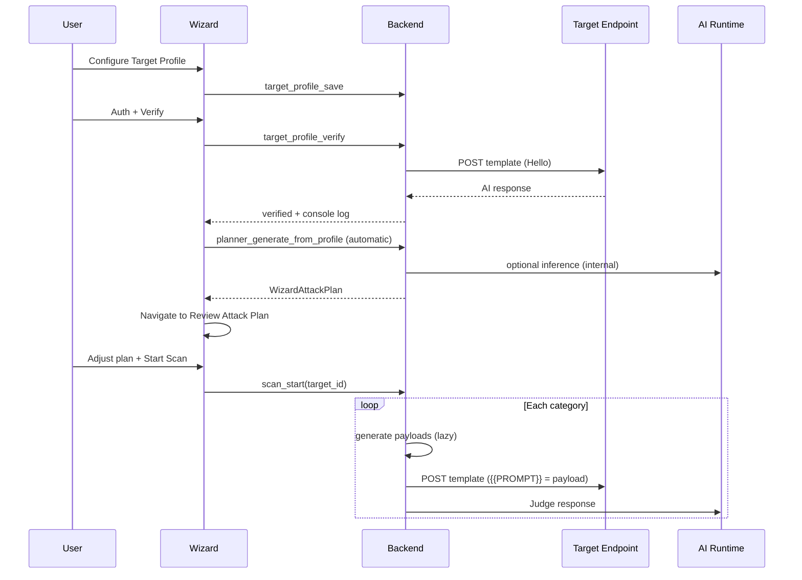

# Scan Wizard Architecture — AI Target Profile

PromptLab Scan Wizard configures a **single AI endpoint** via **Target Profile**. Discovery, fingerprinting, and schema inference are **not** part of the wizard.

## Flow

```
Project → AI Target Profile → Authentication & Verification
  → Attack Planner (automatic) → Review Attack Plan → Execute Scan → Results
```

During scan execution:

```
Approved Attack Plan → Payload Generator → Harness → Target → Judge → Findings
```

## Single Source of Truth

**`TargetProfile`** (`crates/aisec-target-profile/`) defines:

- Provider / framework
- HTTP method, base URL, path, headers
- Request template with `{{PROMPT}}` placeholder
- Default capabilities
- Verification status

Stored in SQLite: `targets.profile_json`.

Authentication credentials remain in `targets.descriptor_json` (sanitized via keychain).

## Responsibility Split

| Component | Responsibility |
|-----------|----------------|
| **Target Profile** | How requests are built (template, URL, headers) |
| **Harness** | How requests are sent (OpenAI, HTTP, Playwright) |
| **Verification** | Real AI probe (`Hello`) — **no AI Runtime** |
| **Attack Planner** | Auto-generates plan after verify — uses AI Runtime internally |
| **Review Attack Plan (Step 4)** | User reviews/adjusts planner output only |
| **Payload Generator** | Lazy during Step 5 execution — replaces `{{PROMPT}}` |
| **Judge** | Whether attacks succeeded — uses AI Runtime |
| **AI Runtime** | Planner inference, Generator LLM, Judge — provider hidden from UI |

## Sequence



## Wizard Session State

| Key | Contents |
|-----|----------|
| `session.attackPlan` | Planner output + user execution strategy |
| `session.attackPlanUi` | Profile selection, expanded categories, disabled tests |

No planner mode, generator mode, or provider selection is stored in the UI.

## IPC

| Command | When |
|---------|------|
| `planner_generate_from_profile` | Auto after verify success |
| `attack_planner_adjust` | User changes profile/categories/tests/strategy on Step 4 |
| `scan_start` | Step 5 — payloads generated lazily |

## Database

```sql
-- targets (001_initial_schema.sql)
profile_json TEXT NOT NULL DEFAULT '{}';  -- TargetProfile JSON
descriptor_json TEXT NOT NULL DEFAULT '{}';  -- auth + url
```

Scan playbook stores `target_profile: true` instead of `endpoint_ids`.

## Remaining Debt

- Agent mode scan uses batch profile scan until agent adapter migrates
- Generic WebSocket harness not implemented
- Full LLM-driven plan refinement from profile (runtime path is stub confidence bump)
- `planner_generate` (fingerprint-based) remains for standalone discovery, not wizard
- Per-provider dedicated harness types map to OpenAI/HTTP for now
