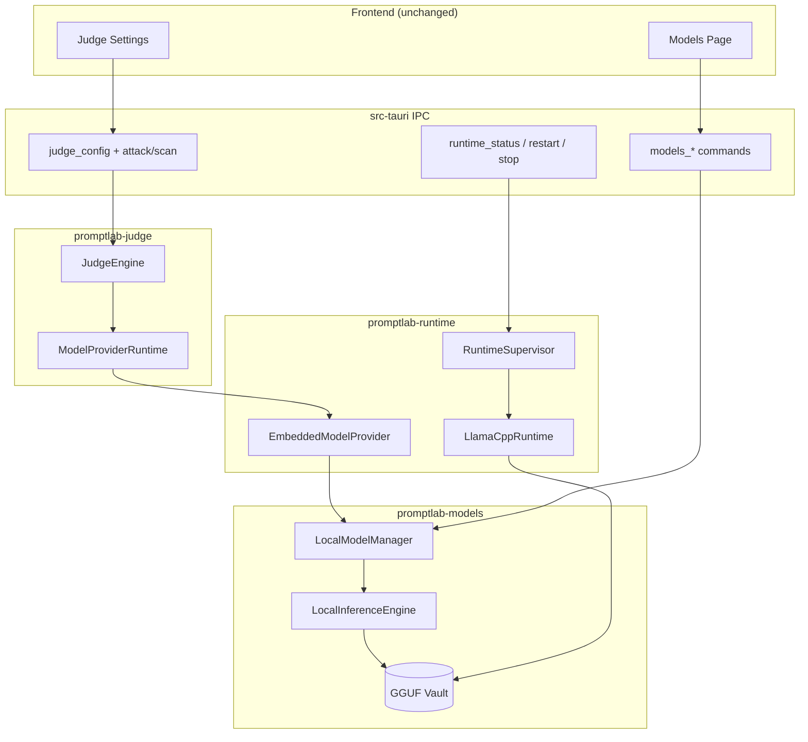
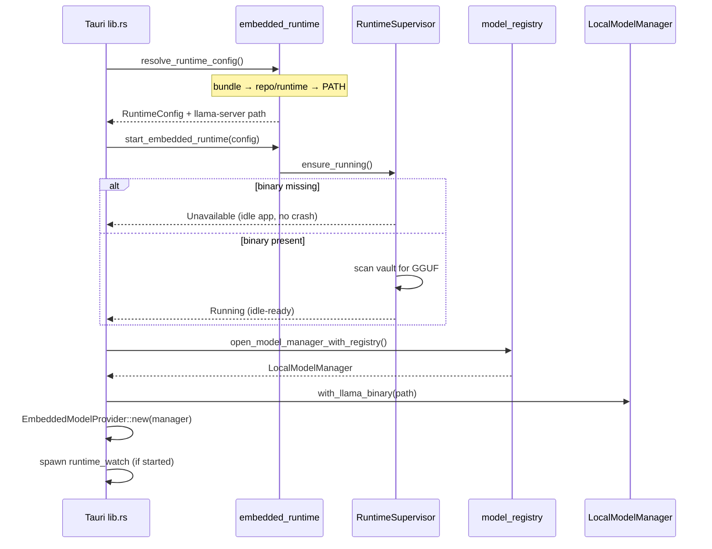
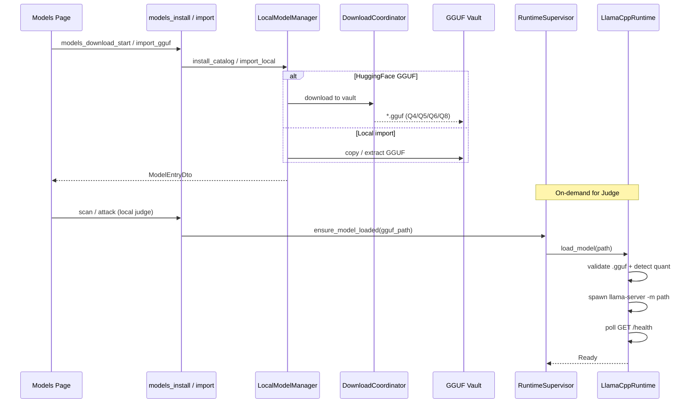
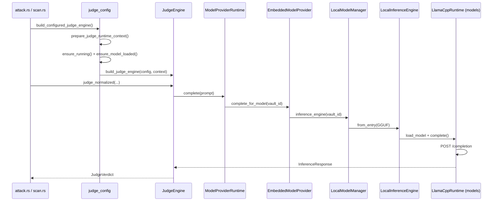
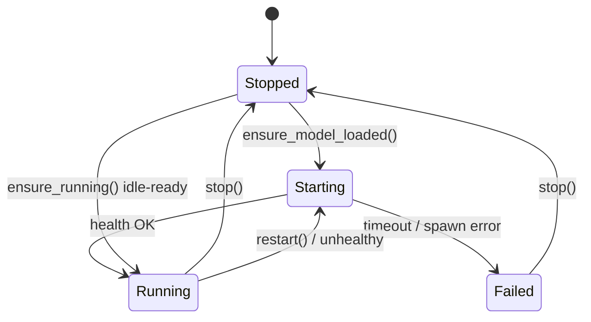

# PromptLab Runtime Architecture v2 — Embedded llama.cpp

**Version:** 2.0  
**Date:** 2026-06-13  
**Replaces:** Ollama-embedded runtime (v1)

---

## Overview

PromptLab Desktop runs local LLM inference through an embedded **llama.cpp** server (`llama-server`) supervised by `promptlab-runtime::RuntimeSupervisor`. Models are **GGUF files** in the app vault (`{app_data}/models/`). The Judge Engine consumes inference exclusively through the **ModelProvider** abstraction — no direct runtime coupling in `promptlab-judge`.

---

## Layer Diagram

---

## Startup Flow

### Startup steps

1. Resolve `llama-server` binary (`embedded_runtime.rs`).
2. Create `RuntimeSupervisor` with `RuntimeConfig` (host/port/base URL).
3. `ensure_running()` — create models dir; enter **idle-ready** if binary exists.
4. Load `resources/models.json` into `LocalModelManager`.
5. Wire `EmbeddedModelProvider` → shared `Arc<Mutex<LocalModelManager>>`.
6. Optional background `runtime_watch` restarts unhealthy loaded servers.

---

## Model Loading Flow

### GGUF quantization support

| Quantization | Filename patterns (examples) |
|--------------|------------------------------|
| Q4 | `q4_k_m`, `.q4`, `Q4_K` |
| Q5 | `q5_k_s`, `.q5`, `Q5_K` |
| Q6 | `q6_k`, `.q6` |
| Q8 | `q8_0`, `.q8`, `Q8_K` |

Detection: `promptlab-runtime::runtime::gguf::detect_quantization()`.

---

## Inference Flow (Judge)

**Judge API unchanged:** `judge_normalized`, `JudgeProviderConfig`, `JudgeRuntimeContext` signatures are identical to v1.

---

## RuntimeSupervisor State Machine

| State | Meaning |
|-------|---------|
| **Stopped** | No `llama-server` process |
| **Starting** | Spawning server for GGUF |
| **Running** | Idle-ready (binary OK) or server healthy |
| **Failed** | Startup timeout or spawn error |

---

## IPC Surface (unchanged)

| Command | Purpose |
|---------|---------|
| `runtime_status` | Binary path, health, GGUF list |
| `runtime_restart` | Stop + reload active model |
| `runtime_stop` | Shutdown server |
| `models_*` | Vault browse/install/import/download |
| `judge_*` | Config + connectivity tests |

DTO field names (`ollamaTag`, `ollamaBaseUrl`, `installedModels`) preserved for frontend compatibility.

---

## Binary & Config

| Item | Value |
|------|-------|
| Binary | `runtime/llama-server` |
| Default URL | `http://127.0.0.1:8081` |
| Vault | `{app_data}/models/` |
| Env | `PROMPTLAB_LLAMA_BASE_URL`, `PROMPTLAB_LLAMA_HOST`, `PROMPTLAB_LLAMA_PORT` |

---

## Crate Responsibilities

| Crate | Responsibility |
|-------|----------------|
| `promptlab-runtime` | Supervisor, embedded `LlamaCppRuntime`, `EmbeddedModelProvider`, GGUF discovery |
| `promptlab-models` | Vault registry, downloads, per-model `LocalInferenceEngine` |
| `promptlab-judge` | Verdict logic; `ModelProviderRuntime` bridge only |
| `src-tauri` | IPC, startup wiring, judge_config orchestration |

---

## Related Documents

- [runtime_migration_report.md](./runtime_migration_report.md) — Ollama audit and touchpoint map
- [JUDGE_RUNTIME.md](./JUDGE_RUNTIME.md) — Judge ↔ ModelProvider integration
- [MODEL_REGISTRY.md](./MODEL_REGISTRY.md) — Catalog and download IPC
